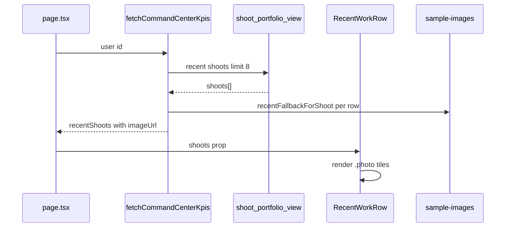

# IPI-293 · CC-RECENT-001 — Recent work moodboard photos

**Linear:** https://linear.app/amo100/issue/IPI-293  
**Parent:** [IPI-290](https://linear.app/amo100/issue/IPI-290)  
**Blocked by:** [IPI-291](https://linear.app/amo100/issue/IPI-291)  
**Plan:** `tasks/design-docs/implementation/command-center.md` § Image loading · Performance  
**Visual target:** `tasks/design-docs/implementation/command.png` (recent work row)  
**Estimate:** 3 points

---

## Skills to run

| Order | Skill | Purpose |
|-------|-------|---------|
| 1 | `design-md` | Read `design.md` — image-first · tile rhythm |
| 2 | `claude-design-handoff` | AssetCard.dc.html tile variant |
| 3 | `frontend-design` | 138px · 4:5 · match pill · meta line |
| 4 | `vercel-react-best-practices` | Lazy `next/image` · `remotePatterns` · fixed dimensions · no CLS |
| 5 | `react-patterns` | **If** Client Image + `onError` fallback — Server/Client split |
| 6 | `accessibility` | Per-tile alt text |
| 7 | `gen-test` | Fixture + row behaviour tests |
| 8 | `graphify` | Optional — recent-work-row + CSS blast radius |
| 9 | `lean` | Inline tiles — no new component file |

**MCP:** browser `/app?skip=1` — 5 tiles, no overflow.

---

## The problem this solves

Recent work row has correct 138px 4:5 tiles and horizontal scroll but **grey placeholders only**. DC L234–254 shows five photo tiles with match % and channel meta (`IG · 4:5`).

**Fix:** Wire `imageUrl` per tile; pad dev preview to 5 tiles; improve meta format; lazy-load tiles.

---

## Scope guard

**In scope:** `RecentWorkRow` · tile CSS · dev fixture · meta format  
**Out of scope:** New `RecentWorkTile` file (inline in row) · scroll width changes · schema

---

## Image loading

- `next/image` · lazy · fixed 138×172 (4:5) · `object-cover`
- Alt: `"{shootName} preview"` per tile
- Broken image → fallback via IPI-291

---

## Performance

- Lazy load all recent tiles (below fold)
- Fixed dimensions — no CLS

---

## User story

> As an **operator**, when I scroll recent work, I see shoot thumbnails with DNA match badges and channel hints — like the moodboard row in [`command.png`](../../../tasks/design-docs/implementation/command.png).

---

## Design reference

| Screen | `Command Center.v2.image-first.dc.html` L234–254 |
| Component | `Universal design prompt/components/AssetCard.dc.html` (tile variant) |
| Density | `Campaigns.v2.image-first.dc.html` card row rhythm |
| Library | `Component Library.dc.html` → AssetCard · high match |

**DC:** 138px wide · 4:5 · match pill · label on image · meta line below

---

## Wireframe — recent row

```text
Recent work                              View all →
┌──────┐ ┌──────┐ ┌──────┐ ┌──────┐ ┌──────┐
│ 94%  │ │ 88%  │ │ 76%  │ │ 91%  │ │ 82%  │
│ photo│ │ photo│ │ photo│ │ photo│ │ photo│
│Spring│ │Carousel│Story │Lookbook│Try-on │
└──────┘ └──────┘ └──────┘ └──────┘ └──────┘
 IG·4:5   IG·4:5  Reel·9:16  Asset·4:5  Video·4:5
```

---

## Sequence



---

## Files

- `app/src/components/command-center/recent-work-row.tsx`
- `app/src/lib/command-center/types.ts` — `RecentShoot.imageUrl`
- `app/src/lib/command-center/types.ts` — `DEV_PREVIEW` 5 shoots
- `command-center.module.css` — `.recentThumb` + `.photo`
- `app/next.config.ts` — `images.remotePatterns` if using `next/image`

**Note:** `DEV_PREVIEW_COMMAND_CENTER_DATA` currently has **2** shoots — expand to **5** named shoots matching command.png labels (Spring hero, Carousel, Story, Lookbook, Try-on).

---

## Out of scope

- Separate `RecentWorkTile.tsx` file
- Scroll container width changes · schema

---

## Completion steps

#### A. Implement
- [ ] **A1** `imageUrl` on each tile + lazy load
- [ ] **A2** Pad `DEV_PREVIEW` to 5 shoots with distinct imageUrls
- [ ] **A3** Meta format `IG · 4:5` with fallback `Asset · 4:5`

#### B. Verify
- [ ] **B1** `/app?skip=1` shows 5 photo tiles — proof: screenshot
- [ ] **B2** No horizontal overflow at 390/1440
- [ ] **B3** `cd app && npm test`
- [ ] **B4** Linear → Done

---

## Acceptance criteria

- [ ] **A** Each tile renders background-image when `imageUrl` or fallback set
- [ ] **B** Dev preview (`?skip=1`) shows **5** photo tiles (DC count)
- [ ] **C** Meta line prefers channel format; fallback `Asset · 4:5` when unknown
- [ ] **D** Tile width 138px and 4:5 aspect unchanged
- [ ] **E** DNA match badge on image when score > 0

---

## Test

```bash
cd app && npm test
# Browser: /app?skip=1 horizontal scroll, no overflow
```
