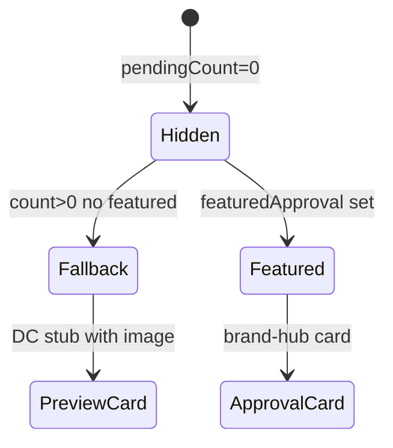

# IPI-294 · CC-HITL-001 — Approval preview + empty state polish

**Linear:** https://linear.app/amo100/issue/IPI-294  
**Parent:** [IPI-290](https://linear.app/amo100/issue/IPI-290)  
**Blocked by:** [IPI-291](https://linear.app/amo100/issue/IPI-291)  
**Plan:** `tasks/design-docs/implementation/command-center.md`  
**Visual target:** `tasks/design-docs/implementation/command.png` (approval + empty states)  
**Estimate:** 2 points

---

## Skills to run

| Order | Skill | Purpose |
|-------|-------|---------|
| 1 | `design-md` | Read `design.md` — EmptyState + HITL preview patterns |
| 2 | `claude-design-handoff` | ApprovalCard.dc.html · EmptyState.dc.html |
| 3 | `frontend-design` | 236×4:5 preview · 200×150 empty fade |
| 4 | `shadcn` | Card chrome alignment |
| 5 | `gen-test` | `derive-view-state` approval branch |
| 6 | `graphify` | Optional — approvals + empty + CSS module |
| 7 | `lean` | Stub only — no IPI-244 workflow |

**MCP:** browser `?skip=approval` for approval stub screenshot.

---

## The problem this solves

Approval state shows thinking dots + text fallback or brand-hub DNA `ApprovalCard` — not DC L256–301 large preview (236×4:5 AI result + ref thumb). Empty state uses grey block instead of DC L196 faded 200×150 editorial preview.

**Fix:** Dashboard approval stub with preview image; empty state uses EmptyState DC pattern. Full Approve/Edit/Discard → IPI-244.

---

## Scope guard

**In scope:** `CommandCenterApprovals` · `CommandCenterEmpty` · approval/empty CSS  
**Out of scope:** Full HITL workflow (IPI-244) · OperatorShell · IntelligencePanel rewrite · schema

---

## Image loading

- Approval preview: 236×4:5 lazy image from sample pool
- Empty preview: 200×150 decorative · `alt=""` if purely decorative

> As an **operator** with pending drafts, I see a visual approval card with a fashion preview image — not just a text count — so I know what needs my review.

---

## Design reference

| Screen | `Command Center.v2.image-first.dc.html` L256–301 (approval) · L194–207 (empty) |
| Component | `components/ApprovalCard.dc.html` · `EmptyState.dc.html` |
| Library | `Component Library.dc.html` → AI & HITL · Feedback & States |

---

## Wireframe — approval stub

```text
● ● ● Waiting for your approval
┌─────────────────────────────────────────────────┐
│ ⚠ Brand profile draft · AI DRAFT                  │
│ ┌─────────┐  Generated from moodboard + DNA      │
│ │ 236×4:5 │  91% brand-match confidence          │
│ │ preview │  [Review in Brand Hub →]             │
│ └─────────┘                                       │
└─────────────────────────────────────────────────┘
```

---

## Wireframe — empty state

```text
┌─────────────────────────────────────────────────┐
│ Welcome to Lumina                                │
│ ┌──────────────┐  Connect a brand to see your   │
│ │ 200×150 fade │  portfolio dashboard…           │
│ │  editorial   │  [Add your first brand →]       │
│ └──────────────┘                                   │
└─────────────────────────────────────────────────┘
```

**States:**

| State | What to show |
|-------|--------------|
| No pending approvals | Approval block hidden |
| Count > 0, no featured | DC stub card + preview image |
| Featured approval set | Existing brand-hub `ApprovalCard` |
| Empty workspace | Faded 200×150 preview per EmptyState.dc.html |

---

## State diagram



---

## Files

- `app/src/components/command-center/command-center-approvals.tsx`
- `app/src/components/command-center/command-center-empty.tsx`
- `command-center.module.css` — approval preview + empty hero image

**Dev fixture:** extend `?skip=1` or add `?skip=approval` so QA can screenshot approval stub without live pending drafts.

---

## Out of scope

- Approve / Edit / Discard actions (IPI-244)
- IntelligencePanel approvals queue (right rail)

---

## Completion steps

#### A. Implement
- [ ] **A1** Dashboard approval stub with 236×4:5 preview when count > 0, no featured
- [ ] **A2** Empty state 200×150 editorial image
- [ ] **A3** Document `?skip=approval` (or equivalent) in code comment + evidence

#### B. Verify
- [ ] **B1** `cd app && npm test -- derive-view-state`
- [ ] **B2** Screenshot approval + empty states
- [ ] **B3** Linear → Done

---

## Acceptance criteria

- [ ] **A** When `pendingApprovalCount > 0` and no `featured`, show DC-style card with 236×4:5 preview image
- [ ] **B** When `featured` present, existing `ApprovalCard` unchanged
- [ ] **C** Empty state shows faded editorial preview image (200×150) per DC EmptyState
- [ ] **D** No full Approve/Edit/Discard workflow (defer IPI-244)
- [ ] **E** Optional: `?skip=approval` dev fixture for screenshot (document in evidence)

---

## Test

```bash
cd app && npm test -- derive-view-state
# Unit: view === approval → showApprovalBlock
```
