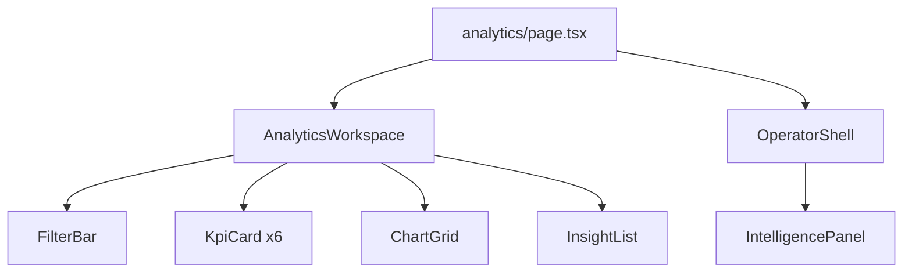
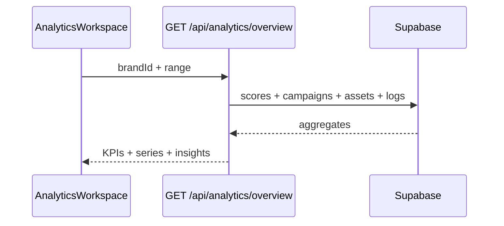

# IPI-296 · DESIGN-090 — Analytics Overview React Parity

**Linear:** https://linear.app/amo100/issue/IPI-296  
**Parent:** IPI-254 · **Route:** `/app/analytics` *(net-new)*  
**Design:** `Universal design prompt/Analytics.v2.image-first.dc.html` · `ANALYTICS-PLAN.md`  
**Status:** Backlog · Full 13-section spec · 2026-07-02

---

## 1. Purpose

Read-first KPI dashboard for brand operators: DNA trend, campaign/asset performance, AI activity, and approval turnaround — every metric explainable via EvidenceBlock, drill-down to Campaign Performance (IPI-297).

## 2. User story

> As an **operator**, I open Analytics, filter by brand and date range, see six KPI cards with sparklines, click Explain on any metric, and drill into campaign comparison when I need detail.

## 3. Business value

- Single pane for “is our brand getting sharper?” (DNA + asset match)
- Connects production output (assets published) to campaign outcomes
- AI insight cards drive Copilot actions (budget reallocation, DNA fixes)

## 4. Scope

**In scope:** OperatorShell route · FilterBar (range + brand) · 6 KPI cards · inline SVG charts · EvidenceBlock · AI insight list · Intelligence Panel · mobile snap-scroll · empty/loading/error states

**Out of scope:** Campaign Performance drill page (IPI-297) · chart library (Recharts/Victory) · real ad network OAuth · export PDF (button can stub)

## 5. Features

- [ ] `/app/analytics` on OperatorShell + nav entry
- [ ] 6 KPIs: Avg Brand DNA · Campaigns live · Assets published · Avg asset match · AI actions approved · Approval turnaround
- [ ] Charts: DNA over time · approval rate ring · campaign bar comparison · top assets bars
- [ ] AI insights list with Explain → EvidenceBlock
- [ ] Filter: 7d / 30d / 90d / YTD + brand picker
- [ ] Drill link → `/app/analytics/campaigns`
- [ ] Export report button (stub or CSV phase 2)
- [ ] 5 states: populated · loading · empty · error · approval-pending
- [ ] Mobile: KPI 2-col grid · panel sheet · bottom nav

## 6. Frontend

| Item | Detail |
|------|--------|
| **Components** | `AnalyticsWorkspace` · `KpiCard` (PATTERNS.md#kpi) · `InlineSparkline` · `InlineAreaChart` · `FilterBar` · `EvidenceBlock` · `SkeletonLoader` · `EmptyState` |
| **Routes** | `app/(operator)/app/analytics/page.tsx` |
| **State** | URL: `?range=30d&brand=<id>` |
| **Loading** | Skeleton KPI row + chart placeholders |
| **Errors** | Retry · Report · Go back |
| **A11y** | KPI buttons for Explain · chart `aria-hidden` + text summary |
| **Responsive** | @1180 3-col KPI · @1024 2-col + panel sheet |

## 7. Backend

### API

| Route | Method | Returns |
|-------|--------|---------|
| `/api/analytics/overview` | GET | KPIs + chart series + insights |

Query params: `brandId`, `range` (7d|30d|90d|ytd)

### Supabase (reads)

- `brand_scores` — DNA trend
- `campaigns` + `campaign_metrics` *(IPI-268)* — live count · engagement bars
- `assets` + `cloudinary_assets` — published count · match avg
- `agent_logs` / approvals — AI actions · turnaround

### Edge (optional phase 2)

`aggregate-analytics` nightly snapshot → `brand_analytics_snapshots`

### RLS

All queries brand-scoped; reuse `withOperatorAuth`.

## 8. CopilotKit

- **Agent:** `analytics-intelligence` *(add to `route-agent-map`)*
- **Panel context:** active range · brand · selected KPI key
- **Actions:** Explain metric · open EvidenceBlock payload · “Drill into Spring 2026”
- **Suggestions:** chips from DC (`Top movers`, `Why is DNA up?`, `Budget ideas`)

## 9. Wireframe

```
┌ Nav ─┬─ Analytics ────────────────────────┬─ Intelligence Panel ─┐
│      │ Analytics          [Export]         │ DNA Score 87 ▲3      │
│      │ [7d][30d][90d][YTD]  [Brand ▼]      │ Insight cards…       │
│      │ ┌──┬──┬──┬──┬──┬──┐ KPI row         │ [Explain budget]     │
│      │ └──┴──┴──┴──┴──┴──┘                 │                      │
│      │ ┌ DNA trend ────┐ ┌ Approval ring ┐ │                      │
│      │ └───────────────┘ └───────────────┘ │                      │
│      │ ┌ Campaign bars ──┐ ┌ Top assets ─┐ │                      │
│      │ └─────────────────┘ └─────────────┘ │                      │
│      │ AI Insights (Explain…)               │                      │
└──────┴──────────────────────────────────────┴──────────────────────┘
```

## 10. Mermaid

### User flow

```mermaid
flowchart TD
  A[/app/analytics] --> B{has data?}
  B -->|no| E[EmptyState → Campaigns CTA]
  B -->|yes| C[KPI + charts]
  C --> D[Explain → EvidenceBlock]
  C --> F[Drill → IPI-297]
  C --> G[Panel analytics-intelligence]
```

### Component hierarchy



### Data flow



## 11. Testing

```bash
cd app && npm run lint && npm test && npx tsc --noEmit && CI=true npm run build
npm run test:e2e e2e/design-v2/analytics.spec.ts  # after IPI-258
```

- Unit: KPI formatter · sparkline path generator
- Integration: API returns 401 unauth
- Playwright: 6 KPIs visible · Explain opens dialog · mobile 390
- A11y: axe ≥85

## 12. Acceptance criteria

- [ ] Route loads on OperatorShell with nav highlight
- [ ] 6 KPI cards match DC labels + sparklines (inline SVG)
- [ ] Charts data-bound (fallback fixtures OK until IPI-268 metrics)
- [ ] EvidenceBlock opens on Explain with score/confidence/evidence
- [ ] Drill link to `/app/analytics/campaigns`
- [ ] Mobile @390/768/1280 screenshots in evidence
- [ ] lint · test · typecheck · build green

## 13. Production readiness

| Security | withOperatorAuth on API · no PII in client logs |
| Performance | API p95 &lt;500ms with indexes (IPI-268) |
| Accessibility | KPI Explain keyboard reachable |
| Error handling | Empty + error states with next step |
| Monitoring | log slow aggregates |
| Documentation | route in AGENTS.md |
| Tests | vitest + playwright |
| Deployment | Vercel env unchanged |
| Rollback | revert route — no migration in this PR |

## Dependencies

IPI-255 ✅ · IPI-246 ✅ · IPI-268 (metrics) soft · IPI-249 soft · IPI-297 sibling

## Effort · Risk · Ready

| Estimate | 5–8 pts |
| Risk | Medium — aggregate API design |
| Ready | **Partial** — UI yes · live metrics need IPI-268 |
