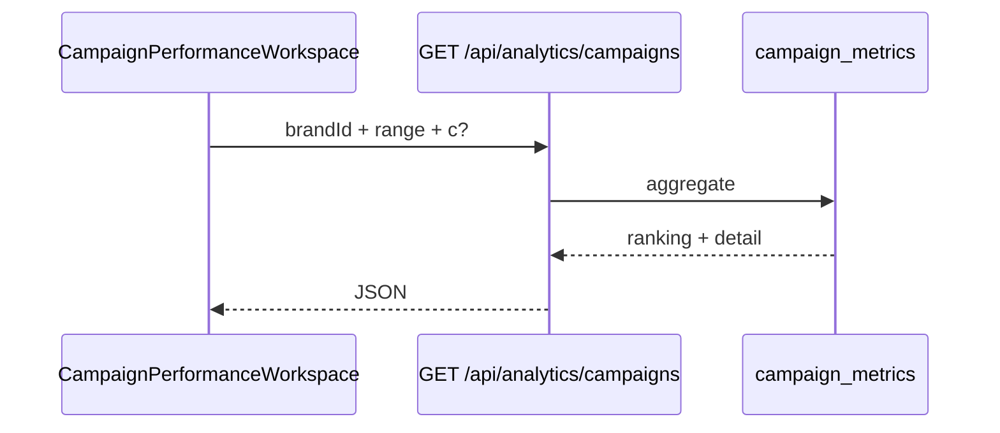

# IPI-297 · DESIGN-091 — Campaign Performance React Parity

**Linear:** https://linear.app/amo100/issue/IPI-297  
**Parent:** IPI-254 · **Route:** `/app/analytics/campaigns` *(net-new)*  
**Design:** `Universal design prompt/Campaign Performance.v2.image-first.dc.html`  
**Status:** Backlog · Full 13-section spec · 2026-07-02

---

## 1. Purpose

Compare campaign performance side-by-side (reach, engagement, spend, ROI, conversions) with per-campaign drill-down, trend charts, and AI insights — linked from Analytics Overview (IPI-296).

## 2. User story

> As a **marketing lead**, I compare all campaigns, click one to see trend KPIs and ROI, Explain why engagement moved, and adjust spend with Copilot guidance.

## 3. Business value

- Answers “which campaign deserves more budget?”
- Closes analytics loop from overview → campaign detail
- Evidence-backed recommendations (HITL before auto-suggestions)

## 4. Scope

**In scope:** Ranking list · comparison charts · `?c=` drill preselect · breadcrumb · per-campaign KPI row · trend chart · spend/ROI/conversions · AI insights · EvidenceBlock · Intelligence Panel · mobile regression (flex-shrink ranking)

**Out of scope:** Live ad platform sync (v1 uses DB metrics) · Mercur attribution · email export

## 5. Features

- [ ] Route + breadcrumb Analytics › Campaign performance
- [ ] Ranking list with engagement % bars
- [ ] `?c=spring` preselects campaign detail panel
- [ ] Per-campaign KPIs: Reach · Engagement · Spend · Conversions · ROI · CPE
- [ ] Trend line chart (7 periods)
- [ ] AI insight cards with Explain
- [ ] **Regression guard:** ranking row `@390` uses `flex: 0 1 150px; min-width: 0` + ellipsis
- [ ] 5 states aligned with IPI-296

## 6. Frontend

| Item | Detail |
|------|--------|
| **Components** | `CampaignPerformanceWorkspace` · `CampaignRankingRow` · `CampaignDetailPanel` · `TrendChart` · `EvidenceBlock` |
| **Routes** | `app/(operator)/app/analytics/campaigns/page.tsx` |
| **State** | URL `?c=<slug>` + range + brand |
| **Loading** | Skeleton ranking rows |
| **Errors** | Retry path back to overview |
| **A11y** | Ranking as list · selected campaign announced |
| **Responsive** | Ranking horizontal scroll @390 with shrink columns |

## 7. Backend

### API

| Route | Method | Returns |
|-------|--------|---------|
| `/api/analytics/campaigns` | GET | ranking[] + optional detail for `?c=` |

### Supabase

- `campaigns` — name · status · slug
- `campaign_metrics` — reach · impressions · engagement_rate · spend · conversions · roi *(IPI-268)*

### Sample query pattern

```sql
select c.id, c.name, c.slug,
  sum(m.reach) as reach,
  avg(m.engagement_rate) as engagement_rate,
  sum(m.spend) as spend,
  sum(m.conversions) as conversions
from campaigns c
join campaign_metrics m on m.campaign_id = c.id
where c.brand_id = $1 and m.period_start >= $2
group by c.id;
```

## 8. CopilotKit

- **Agent:** `analytics-intelligence`
- **Context:** selected campaign · ranking position · trend direction
- **Actions:** Explain trend · suggest budget shift · link to Campaigns workspace
- **Panel:** show ROI delta + confidence when campaign selected

## 9. Wireframe

```
Analytics › Campaign performance
┌ Ranking ──────────────────────────────────────────────┐
│ Spring 2026    ████████ 7.8%  ← selected (?c=spring)  │
│ Air Max Drop   ██████   6.2%                          │
│ Resort Capsule █████    5.1%                          │
└───────────────────────────────────────────────────────┘
┌ Detail: Spring 2026 ──────────────────────────────────┐
│ Reach 2.4M · Eng 7.8% · Spend $42k · ROI 3.2x         │
│ [Trend chart 7 periods]                                │
│ AI: Reallocate 15% from Heritage… [Explain]            │
└───────────────────────────────────────────────────────┘
```

## 10. Mermaid

### User flow

```mermaid
flowchart TD
  AN[IPI-296 Overview] -->|Drill in| CPF[/app/analytics/campaigns]
  CPF --> R[Ranking list]
  R -->|click / ?c=| D[Detail KPIs + trend]
  D --> EB[EvidenceBlock Explain]
  D --> P[Panel analytics-intelligence]
```

### Sequence



## 11. Testing

```bash
cd app && npm run lint && npm test && npx tsc --noEmit && CI=true npm run build
npm run test:e2e e2e/design-v2/campaign-performance.spec.ts
```

- Playwright: `@390` ranking row no overflow (screenshot diff)
- Unit: ROI = (revenue - spend) / spend formatter
- Integration: `?c=invalid` → graceful empty detail

## 12. Acceptance criteria

- [ ] Route + breadcrumb from Analytics
- [ ] `?c=` preselect works
- [ ] Ranking flex-shrink regression @390
- [ ] Per-campaign KPIs + trend from API
- [ ] EvidenceBlock on trend Explain
- [ ] lint · test · typecheck · build green

## 13. Production readiness

Same checklist as IPI-296 · plus mobile regression test mandatory.

## Dependencies

IPI-296 · IPI-268 · IPI-255 ✅ · IPI-246 ✅ · IPI-249 soft

## Effort · Risk · Ready

| Estimate | 5 pts |
| Risk | Low–medium — depends on metrics schema |
| Ready | **No** — blocked on IPI-268 + IPI-296 scaffold |
