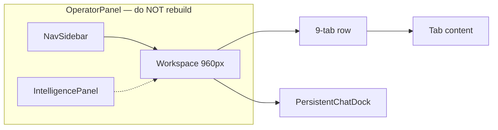
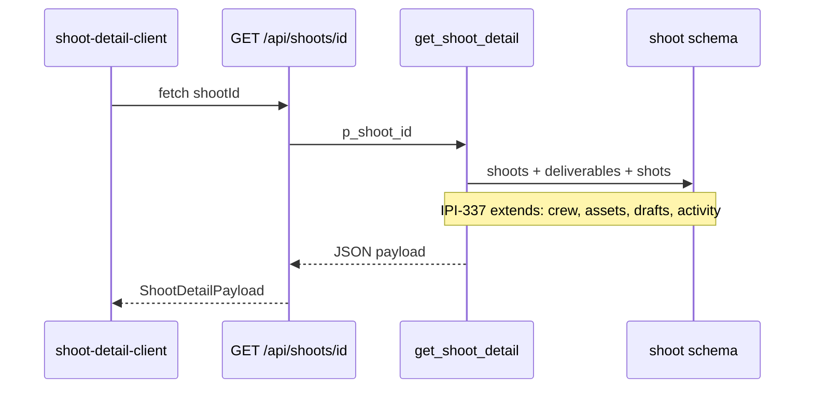
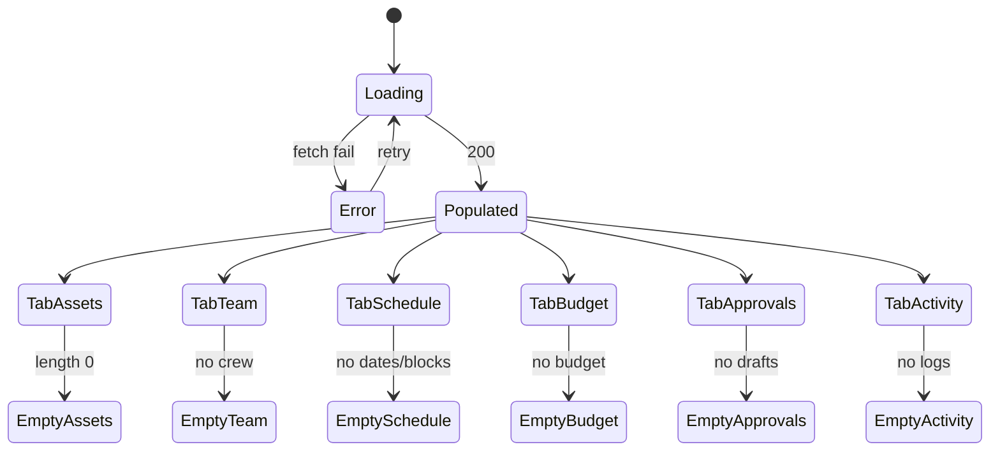
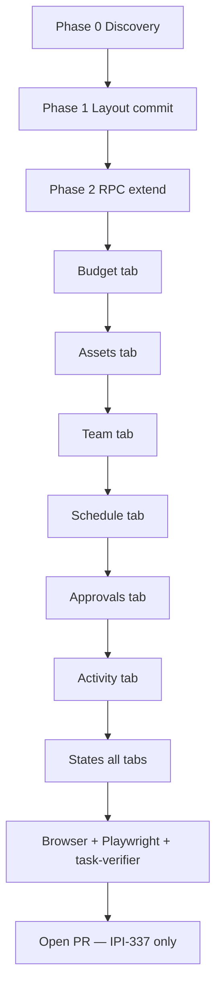

# IPI-337 · DESIGN-054b — Shoot Detail Remaining Tab Parity

**Linear:** https://linear.app/amo100/issue/IPI-337  
**Parent:** IPI-209 (shell Done = 3/9 tabs only)  
**Wireframe:** `tasks/wireframes-ipix/IPI-337-DESIGN-054b-shoot-detail-tabs.wire`  
**Status:** Todo · Synced 2026-07-02  
**Guardrails:** [`tasks/design-docs/shoot/lessons-from-brand-parity.md`](../../tasks/design-docs/shoot/lessons-from-brand-parity.md)

## Core rule

**Don't code from Linear text alone.** Prove disk + Supabase + browser first. HTML design wins for layout.

---

## Design sources (exact match required)

| Screen | DC HTML | React route | Issue |
|--------|---------|-------------|-------|
| **This task** | `Universal design prompt/Shoot Detail.v2.image-first.dc.html` | `/app/shoots/[id]` | IPI-337 |
| Breadcrumb mate | `Shoots List.v2.image-first.dc.html` | `/app/shoots` | IPI-273 |
| Edit / HITL mate | `Shoot Wizard.v2.image-first.dc.html` | `/app/shoots/new` | IPI-274 |
| Assets deep link | `Assets.v2.image-first.dc.html?shoot=` | `/app/assets?shoot=` | IPI-248 |

Open all three shoot HTML files side-by-side when verifying nav, typography, and card patterns stay consistent across the shoot family.

---

## Skills — load before first edit (mandatory order)

| # | Skill | When |
|---|-------|------|
| 1 | `ipix-task-lifecycle` | Phase 1 plan + TASK-CONTRACT |
| 2 | `design-to-production` | HTML → React parity rules |
| 3 | `design-md` | tokens · typography · spacing |
| 4 | `frontend-design` | Zeely workspace aesthetic |
| 5 | `ipix-wireframe` | Mate wire ↔ HTML (`IPI-337-*.wire`) |
| 6 | `mermaid-diagrams` | Flow/state diagrams in this issue |
| 7 | `fashion-production` | Shoot domain vocabulary |
| 8 | `task-verifier` | **Readiness before code** · full gate before PR |
| 9 | `worktrees` | Branch `ipi/337-shoot-detail-tabs` |
| 10 | `copilotkit` | `production-planner` dock context |
| 11 | `ipix-supabase` | RPC extension · RLS |
| 12 | `cloudinary` | Asset tab URLs + transforms |
| 13 | `feature-dev` | Multi-tab implementation |
| 14 | `gen-test` | State + no-fake-data tests before PR |

**Before PR:** `task-verifier` · browser MCP · Playwright (when spec exists)

---

## Tabs in scope

Assets · Team · Schedule · Budget · Approvals · Activity

**Already live (IPI-209):** Overview · Shot List · Deliverables

---

## Wireframe (mates HTML)

`tasks/wireframes-ipix/IPI-337-DESIGN-054b-shoot-detail-tabs.wire`

```text
OperatorPanel (no rebuild)
└── Workspace max-width 960px
    ├── breadcrumb → /app/shoots (Shoots List HTML)
    ├── hero 24:9 + status + DNA + progress
    ├── 9-tab row (HTML tabDef order)
    ├── tab body (6 tabs this PR)
    └── PersistentChatDock
```

---

## Architecture







---

## Production state (probed 2026-07-02)

| Area | Exists today? | This PR changes? |
|------|---------------|------------------|
| Route | ✅ `/app/shoots/[shootId]` | No |
| Shell | ✅ `OperatorPanel` in `(operator)/layout.tsx` | No |
| API | ✅ `GET /api/shoots/[shootId]` | Extend if tabs need new queries |
| RPC | ✅ `public.get_shoot_detail(uuid)` | Extend payload for crew/assets/drafts |
| Client | ✅ `shoot-detail-client.tsx` — 3 tabs live | Yes — 6 placeholders + layout |
| Layout smell | 🟡 `min-h-screen` + `#FBF8F5` | Yes — commit 1 (DC/HTML pattern) |

**Do not rebuild:** Operator shell · intelligence panel · chat dock.

---

## Data-source table (probed — Supabase MCP)

| Tab | Data source | In RPC today? | Empty state | Error state |
|-----|-------------|---------------|-------------|-------------|
| **Assets** | `shoot.shoot_assets` | ❌ | No assets linked yet | Retry |
| **Team** | `shoot.shoot_crew` | ❌ | No crew assigned | Retry |
| **Schedule** | `shoot.shoots` dates + location; blocks TBD | 🟡 | No schedule yet | Retry |
| **Budget** | `estimated_budget` + `budget_breakdown` | ✅ | No budget yet | Retry |
| **Approvals** | `shoot.shoot_intake_drafts` | ❌ | No pending approvals | Retry |
| **Activity** | `public.ai_agent_logs` + shoot context | ❌ | No activity yet | Retry |

---

## Steps to exact HTML match

Compare each step to `Shoot Detail.v2.image-first.dc.html` in browser @1440 + @375.

### Phase 0 — Discovery (no code)

- [ ] **A0.1** Read this issue + wireframe + HTML file
- [ ] **A0.2** `@task-verifier` readiness — block if data-source has TBD
- [ ] **A0.3** Supabase MCP — confirm tables above
- [ ] **A0.4** Side-by-side: HTML populated state vs `/app/shoots/[id]`

### Phase 1 — Layout shell (commit 1)

- [ ] **B1.1** Remove `min-h-screen` / `#FBF8F5` / hardcoded hex
- [ ] **B1.2** Add `shoot-detail.module.css` — workspace `max-width: 960px`, padding `18px 40px` / `22px 40px` (HTML `.hpad`)
- [ ] **B1.3** Breadcrumb `Shoots > {name}` → `/app/shoots` (HTML L140)
- [ ] **B1.4** Hero band `aspect-ratio: 24/9`, `border-radius: var(--card-radius)`, image-scrim (HTML L142-161)
- [ ] **B1.5** Progress row + Edit/Share/More actions (HTML L164-176)
- [ ] **B1.6** Tab row — 9 tabs, `border-bottom`, active `2px` underline, optional count pills (HTML L178-183)

### Phase 2 — RPC / API (commit 2 if needed)

- [ ] **C2.1** Extend `get_shoot_detail` OR add tab-scoped fetches with RLS verify
- [ ] **C2.2** Extend `ShootDetailPayload` types + tests
- [ ] **C2.3** No fake rows when API returns null

### Phase 3 — One tab per commit (HTML section refs)

| Step | Tab | HTML lines | Match criteria |
|------|-----|------------|----------------|
| **D3.1** | Budget | L315-326 | Spent/total card · 8px pct bar · line-item rows |
| **D3.2** | Assets | L272-280 | Masonry 4-col · AssetCard · View in Assets CTA |
| **D3.3** | Team | L284-296 | 2-col grid · avatar · StatusChip · Invite btn |
| **D3.4** | Schedule | L300-311 | Timeline rail · accent left border · call/wrap |
| **D3.5** | Approvals | L330-338 | ApprovalCard compact 2-col |
| **D3.6** | Activity | L357-368 | Dot timeline · relative timestamps |

After each tab: vitest render test · browser snapshot · console clean.

### Phase 4 — States (per tab)

- [ ] **E4.1** Loading — workspace shimmer (HTML L102-111)
- [ ] **E4.2** Error — "Couldn't load" + Try again (HTML L115-121)
- [ ] **E4.3** Empty — honest copy per data-source table (no fabricated rows)
- [ ] **E4.4** Deep link Assets tab → `/app/assets?shoot={id}` (HTML `assetsHref`)

### Phase 5 — Verify & ship

- [ ] **F5.1** `cd app && npm run lint && npm test && npm run build`
- [ ] **F5.2** Browser MCP @1440 + @375 — compare to HTML
- [ ] **F5.3** Playwright smoke — tab nav + one interaction per tab
- [ ] **F5.4** `@task-verifier` full gate + evidence folder
- [ ] **F5.5** Bugbot · 0 High/Critical



---

## Negative acceptance criteria

- [ ] Must NOT show fake crew, budget lines, schedule blocks, or activity events
- [ ] Must NOT show placeholder dates when `start_date` / `end_date` are null
- [ ] Must NOT show DNA scores on assets when `dna_score` is null
- [ ] Must NOT treat RPC failure as empty tab
- [ ] Must NOT rebuild OperatorPanel / intelligence panel

---

## Acceptance criteria

- [ ] All 6 placeholder tabs match DC HTML layout + live data (or honest empty)
- [ ] handoff/11 Shoot Detail checklist complete
- [ ] View-in-Assets deep link from Assets tab
- [ ] Empty/loading/error per tab
- [ ] Layout: tokens.css + module CSS only
- [ ] Browser evidence + task-verifier

---

## TASK-CONTRACT

```yaml
id: DESIGN-054b
linear: IPI-337
type: ui-screen
skills:
  - ipix-task-lifecycle
  - design-to-production
  - design-md
  - frontend-design
  - ipix-wireframe
  - mermaid-diagrams
  - fashion-production
  - task-verifier
  - worktrees
  - copilotkit
  - ipix-supabase
  - cloudinary
  - feature-dev
  - gen-test
design:
  source: Universal design prompt/Shoot Detail.v2.image-first.dc.html
  handoff: tasks/design-docs/docs/handoff/11-screen-checklists.md
  tokens: required
  three_panel: required
wireframe: tasks/wireframes-ipix/IPI-337-DESIGN-054b-shoot-detail-tabs.wire
verify:
  build: cd app && npm run lint && npm test && npm run build
  browser: manual + MCP @1440 @375
  playwright: e2e/shoot-detail.spec.ts | smoke
  done_gate: task-verifier
```

---

## Related shoot HTML parity (same family)

| Issue | HTML | Do not mix PRs |
|-------|------|----------------|
| IPI-273 | Shoots List.v2.image-first.dc.html | List workspace only |
| IPI-274 | Shoot Wizard.v2.image-first.dc.html | Wizard chrome only |
| IPI-337 | Shoot Detail.v2.image-first.dc.html | **This issue — 6 tabs** |
