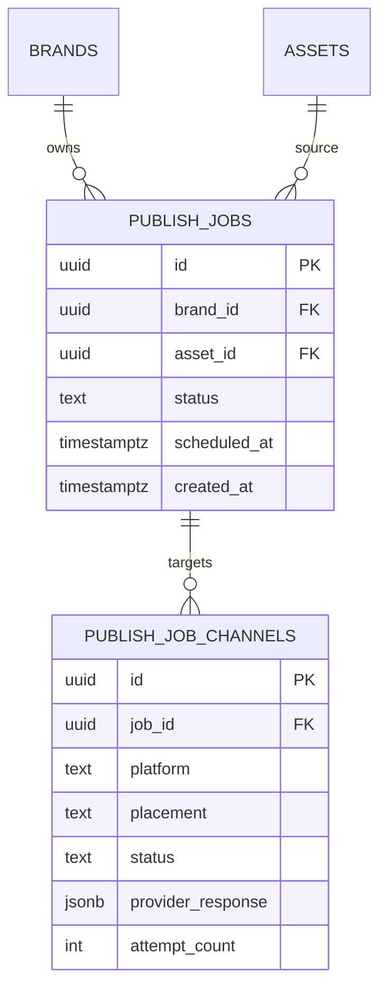
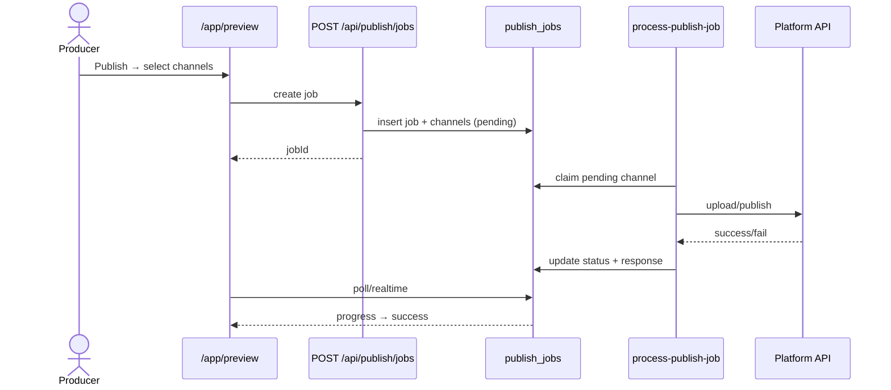

# IPI-338 · DESIGN-060b — Channel Preview Phase B — Publish & Scheduling

**Linear:** *(create IPI-338)*  
**Parent:** IPI-269 · IPI-254  
**Route:** `/app/preview` (publish modal flow)  
**Design:** `Universal design prompt/Channel Preview.v2.image-first.dc.html` (Publish confirm → progress → success)

---

## 1. Purpose

Wire the **Publish** flow from Channel Preview DC: multi-channel selection (Instagram · Facebook · TikTok), scheduling, durable publish queue, retry, publishing history, and analytics hooks — after Phase A preview parity (IPI-269) ships.

## 2. User story

> As a **producer**, I approve an asset in Channel Preview, select IG/FB/TikTok placements, schedule or publish now, see per-channel progress, and review history if a channel fails — without leaving the operator app.

## 3. Business value

- Closes the content loop: Assets → Preview → Publish
- HITL gate before any external post (aligns with UX principle #7)
- Feeds campaign analytics (IPI-296/297) with publish events

## 4. Scope

**In scope:** Publish modal (confirm/progress/success) · channel multi-select · `publish_jobs` queue · edge worker · retry · history UI · CopilotKit publish suggestions · IG/FB/TikTok v1

**Out of scope:** Pinterest/YouTube (Phase C) · full Postiz dashboard (see IPI-195) · Phase A phone frames (IPI-269) · net-new preview UI

## 5. Features

- [ ] Publish button → channel select modal (DC parity)
- [ ] Per-channel progress rows (Publishing… → Published / Failed)
- [ ] Schedule picker (optional v1: publish-now only; schedule = follow-up)
- [ ] `publish_jobs` + `publish_job_channels` tables + RLS
- [ ] Edge fn `process-publish-job` (idempotent · retry 3x)
- [ ] Publishing history panel / tab
- [ ] Analytics event hooks (`publish_completed`, `publish_failed`)
- [ ] CopilotKit: "Publish to TikTok-safe crop" chip → preselect channels
- [ ] AI recommendations in Intelligence Panel (readiness + channel fit)

## 6. Frontend

| Item | Detail |
|------|--------|
| **Components** | `PublishConfirmModal` · `PublishProgress` · `PublishSuccess` · extend `/app/preview/page.tsx` |
| **Routes** | `/app/preview` · optional `/app/preview/history` |
| **State** | idle → confirm → publishing → success/error |
| **Loading** | Per-channel progress — never blank modal |
| **Errors** | Retry button · partial success (2/3 published) |
| **A11y** | Focus trap in modal · live region for progress |
| **Mobile** | Full-screen sheet @≤1024 |

## 7. Backend

### Schema (migration-only PR first)



### API

| Endpoint | Auth | Purpose |
|----------|------|---------|
| `POST /api/publish/jobs` | withOperatorAuth | enqueue job + channels |
| `GET /api/publish/jobs` | withOperatorAuth | history list |
| `POST /api/publish/jobs/[id]/retry` | withOperatorAuth | retry failed channels |

### Edge

`process-publish-job` — provider adapter interface (stub → Meta/TikTok APIs later; v1 can simulate + persist)

### RLS

Brand-scoped via `is_org_member` / brand owner pattern.

## 8. CopilotKit

- **Agent:** `visual-identity` (IPI-262)
- **Context:** selected asset · channel readiness scores · safe-zone warnings
- **Actions:** suggest channels · draft caption (optional) · retry failed publish
- **HITL:** Publish requires explicit confirm — no auto-post

## 9. Wireframe

```
┌─ Channel Preview ─────────────────────────────────────┐
│ [Asset picker]  [FB][IG feed][IG story][TikTok]       │
│                                        [Publish ▼]     │
├───────────────────────────────────────────────────────┤
│ Modal: Publish to 3 channels                           │
│ ☑ Instagram Feed  ☑ Instagram Story  ☑ TikTok         │
│ ☐ Facebook Feed                                        │
│              [Cancel]  [Publish 3 channels]            │
├───────────────────────────────────────────────────────┤
│ Progress: IG Feed ████████░░  TikTok ██████░░░░        │
└───────────────────────────────────────────────────────┘
```

## 10. Mermaid

### Sequence



## 11. Testing

- Unit: job state machine · retry policy
- Integration: API + RLS cross-brand blocked
- Playwright: open publish modal · select channels · mock provider 200
- Console: clean during flow

## 12. Acceptance criteria

- [ ] Publish modal matches DC HTML flow (confirm → progress → success)
- [ ] IG + FB + TikTok channel rows in job
- [ ] Failed channel shows Retry without losing successful channels
- [ ] History lists last 20 jobs for brand
- [ ] RLS + migration-reviewer sign-off
- [ ] IPI-269 Phase A merged first

## 13. Production readiness

| Area | Requirement |
|------|-------------|
| Security | No platform tokens client-side |
| Performance | Async edge — UI polls &lt;2s |
| Accessibility | Modal focus trap |
| Error handling | Partial success UX |
| Monitoring | `agent_log` per publish attempt |
| Rollback | disable edge cron · jobs stay queued |

## Dependencies

| Type | Issue |
|------|-------|
| **Blocked by** | IPI-269 (Phase A UI) · IPI-257 074e (channel transforms) |
| **Related** | IPI-195 (Postiz long-term) · IPI-193 · IPI-262 |
| **Blocks** | Real external publish · analytics publish KPIs |

## Effort · Risk · Ready

| Estimate | 8 pts (schema + edge + UI) |
| Risk | High — external API credentials · HITL compliance |
| Ready for implementation | **No** — after IPI-269 Phase A |
