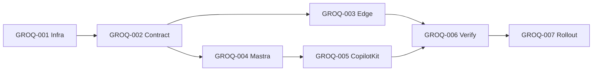
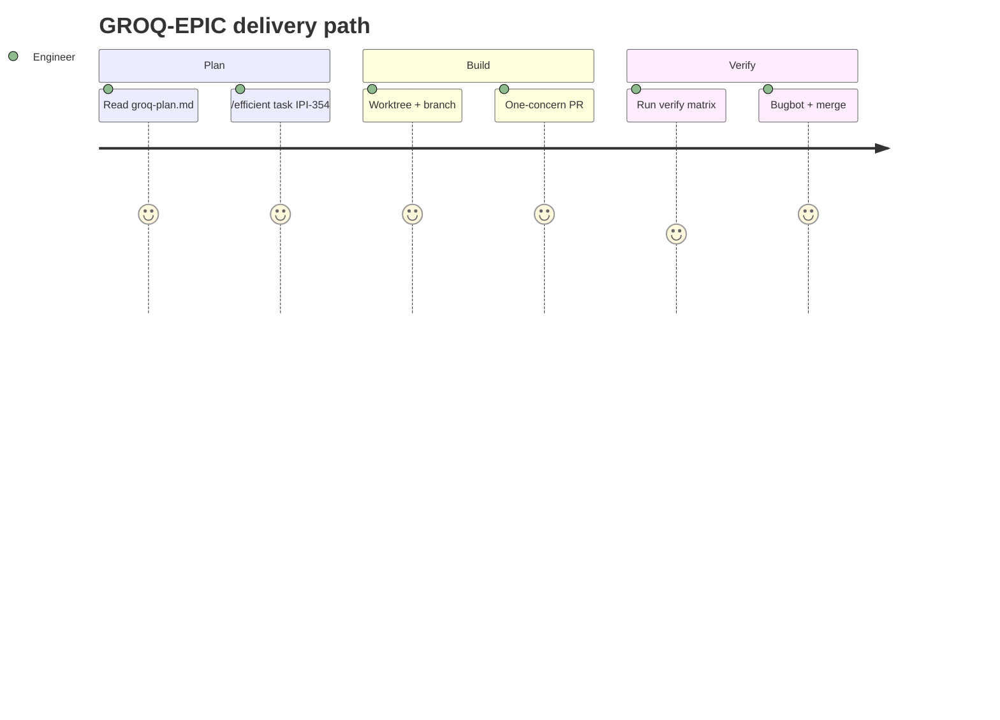

## GROQ-EPIC — Gemini → Groq Migration Epic

**In plain terms:** **Platform** migrates primary LLM inference from Gemini to Groq in seven gated PRs — ship Phase 1 (infra) first; no prod cutover until golden eval passes.

**Linear:** [IPI-354](https://linear.app/amo100/issue/IPI-354)

**Blocked by:** None — **ship first** (Phase 1 gate).

**Unblocks:** GROQ-001…007 · faster operator chat · lower text inference cost

**Branch:** `epic — no branch`

**PR:** `epic — tracks child PRs`

**Verify:** Phase 1 only until golden eval (IPI-360) + env-stage rollout (IPI-361) gates closed

**Estimate:** 13 points

**Source:** [tasks/llm/groq-plan.md](../../../tasks/llm/groq-plan.md) · audit: [tasks/llm/02-groq.md](../../../tasks/llm/02-groq.md)

### Skills (load in order)

| # | Skill | Path |
|---|--------|------|
| 1 | ipix-task-lifecycle | `.claude/skills/ipix-task-lifecycle/SKILL.md` |
| 2 | mastra | `.claude/skills/mastra/SKILL.md` → [`references/groq.md`](../../../.claude/skills/mastra/references/groq.md) |
| 3 | groq-inference | `.claude/skills/groq-inference/SKILL.md` |
| 4 | gemini | `.claude/skills/gemini/SKILL.md` |
| 5 | writing-plans | `.claude/skills/writing-plans/SKILL.md` |

---

### Sequence / architecture — GROQ-EPIC

---

### User journey

---

### User stories

### Story 1
**Operator** gets faster Copilot responses without re-stating brand context.

**Acceptance:** Measurable in PR verification for GROQ-EPIC.

### Story 2
**Engineer** rolls back to Gemini via env flag only — no emergency deploy.

**Acceptance:** Measurable in PR verification for GROQ-EPIC.

### Story 3
**Creative Director** keeps DNA compliance accuracy during provider migration.

**Acceptance:** Measurable in PR verification for GROQ-EPIC.

---

### Dependencies

| Dependency | Status |
|------------|--------|
| tasks/llm/groq-plan.md | ✅ SSOT |
| GROQ-001 infra merged | this issue |
| Gemini baseline (IPI-355) | before any Groq inference code |
| Golden eval (IPI-360) | before prod env flip |
| One concern per PR | ✅ enforced — **never merge IPI-359 into IPI-358** |

---

### Audit corrections (2026-07-05)

Per [tasks/llm/02-groq.md](../../../tasks/llm/02-groq.md):

- **M1 baseline** lives in IPI-355 (not IPI-360)
- Ban **`compound-beta`** — use `groq/compound` / `groq/compound-mini` only
- **No % traffic rollout** — env stages: dev → staging → prod flip (IPI-361)
- **DNA stays Gemini** through prod cutover (`DNA_USE_GEMINI=1`)

---

### Completion steps

#### A. Implement
- [ ] **A1** Epic tracks 7 child issues — one concern per PR each
- [ ] **A2** SSOT: groq-plan.md + audit corrections in 02-groq.md synced to child specs
- [ ] **A3** Ship IPI-355 (infra + baseline + smoke) before any Groq inference code
- [ ] **A4** IPI-360 green before prod flip; DNA vision Groq only behind explicit flag
- [ ] **A5** IPI-361 env-stage rollout + 7-day monitor (not 10%/50% traffic fiction)
- [ ] **A6** Zero open `compound-beta` refs in plan + Linear specs

#### B. Verify + ship
- [ ] **B1** Verification commands green (see **Verify** above)
- [ ] **B2** Cursor PR Review — no unresolved High/Critical
- [ ] **B3** Linear **Done** · update groq-plan.md if IDs changed

**Spec score:** 88/100 — lifecycle-ready

---

_Source: `docs/linear/issues/IPI-354-groq-epic.md` · push via `node scripts/linear-update-issue.mjs IPI-354`_
