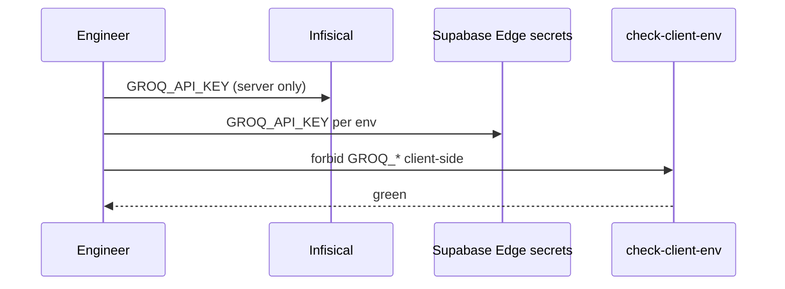
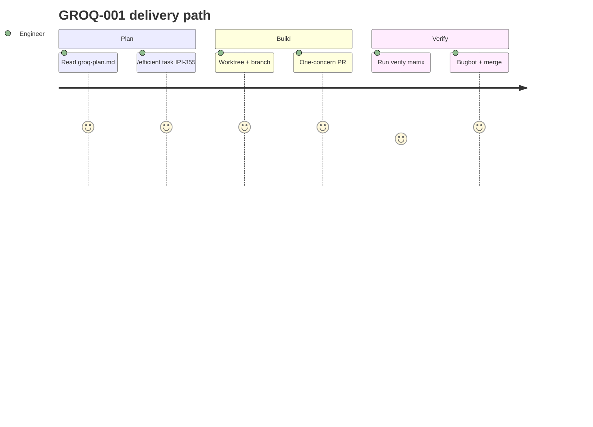

## GROQ-001 — GROQ-001 · Groq Migration Infrastructure

**In plain terms:** **Engineer** lays pipes: Groq keys, env guards, model allowlist — no inference switch yet.

**Linear:** [IPI-355](https://linear.app/amo100/issue/IPI-355)

**Blocked by:** None — **ship first** (Phase 1 gate).

**Unblocks:** GROQ-002…007

**Branch:** `ipi/groq-001-infra`

**PR:** `ipi/groq-001-infra`

**Verify:** `node scripts/check-client-env.mjs` · `infisical run -- node scripts/groq-smoke.mjs`

**Estimate:** 3 points

**Source:** [tasks/llm/groq-plan.md](../../../tasks/llm/groq-plan.md) · audit: [tasks/llm/02-groq.md](../../../tasks/llm/02-groq.md)

### Skills (load in order)

| # | Skill | Path |
|---|--------|------|
| 1 | groq-inference | `.claude/skills/groq-inference/SKILL.md` |
| 2 | mastra | `.claude/skills/mastra/SKILL.md` → [`references/groq.md`](../../../.claude/skills/mastra/references/groq.md) (tier map, secrets) |
| 3 | ipix-supabase | `.claude/skills/ipix-supabase/SKILL.md` |
| 4 | ipix-task-lifecycle | `.claude/skills/ipix-task-lifecycle/SKILL.md` |
| 5 | infisical | `.claude/skills/infisical/SKILL.md` |

---

### Sequence / architecture — GROQ-001

---

### User journey

---

### User stories

### Story 1
**Engineer** runs dev with Groq keys injected server-side only.

**Acceptance:** Measurable in PR verification for GROQ-001.

### Story 2
**Security** CI fails if GROQ_API_KEY appears in client bundle.

**Acceptance:** Measurable in PR verification for GROQ-001.

### Story 3
**Operator** sees no product change — default stays Gemini.

**Acceptance:** Measurable in PR verification for GROQ-001.

---

### Dependencies

| Dependency | Status |
|------------|--------|
| tasks/llm/groq-plan.md | ✅ SSOT |
| tasks/llm/02-groq.md | ✅ audit corrections |
| Groq Cloud account + keys | manual prerequisite |
| Golden eval (IPI-360) | before prod flip / DNA vision Groq |
| One concern per PR | ✅ enforced |

---

### Completion steps

#### A. Implement
- [x] **A1** Add `GROQ_API_KEY` to Infisical + Supabase Edge secrets + `app/.env.example` (server-only)
- [ ] **A2** Groq Cloud: paid tier, spend limits, **separate dev/staging/prod project keys**
- [x] **A3** `AI_PROVIDER=groq|gemini` (default `gemini`); tier env vars from groq-plan
- [x] **A4** Commit `config/groq-models.json` with schema flags: `strictStructured`, `parallelTools`, `promptCaching`, `evaluationOnly`, `productionDefault` — **no `compound-beta`**
- [x] **A5** Sync allowlist against `GET /openai/v1/models` (Groq API)
- [x] **A6** Extend `scripts/check-client-env.mjs` — forbid client `GROQ_*` / bundle grep
- [x] **A7** Add `scripts/groq-smoke.mjs` — hello-world per Groq libraries doc
- [x] **A8** Capture **Gemini baseline JSON** → `docs/ecommerce/evidence/YYYY-MM-DD/groq-baseline.json` (latency, schema fail %, DNA FP rate) **before** IPI-356
- [x] **A9** Update `app/scripts/copilotkit-dev-env.mjs` for groq branch

#### B. Verify + ship
- [x] **B1** Verification commands green (see **Verify** above)
- [x] **B2** Cursor PR Review — no unresolved High/Critical
- [ ] **B3** Linear **Done** · update groq-plan.md if IDs changed

**Spec score:** 88/100 — lifecycle-ready

---

_Source: `docs/linear/issues/IPI-355-groq-001.md` · push via `node scripts/linear-update-issue.mjs IPI-355`_
