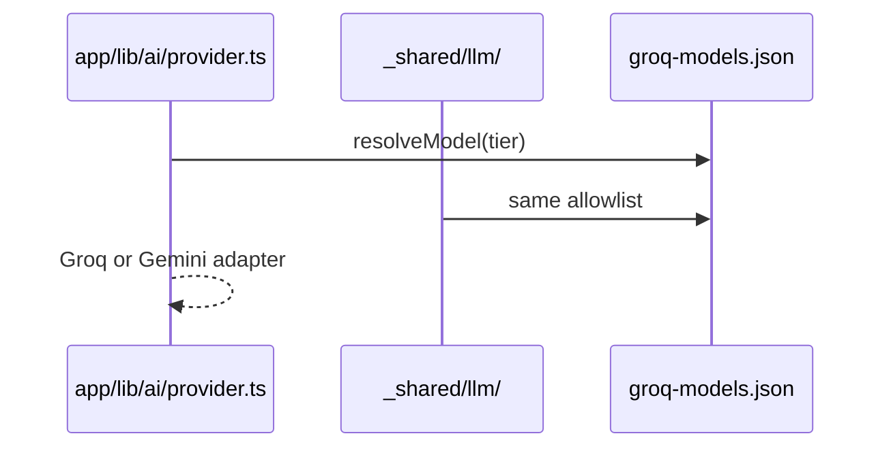
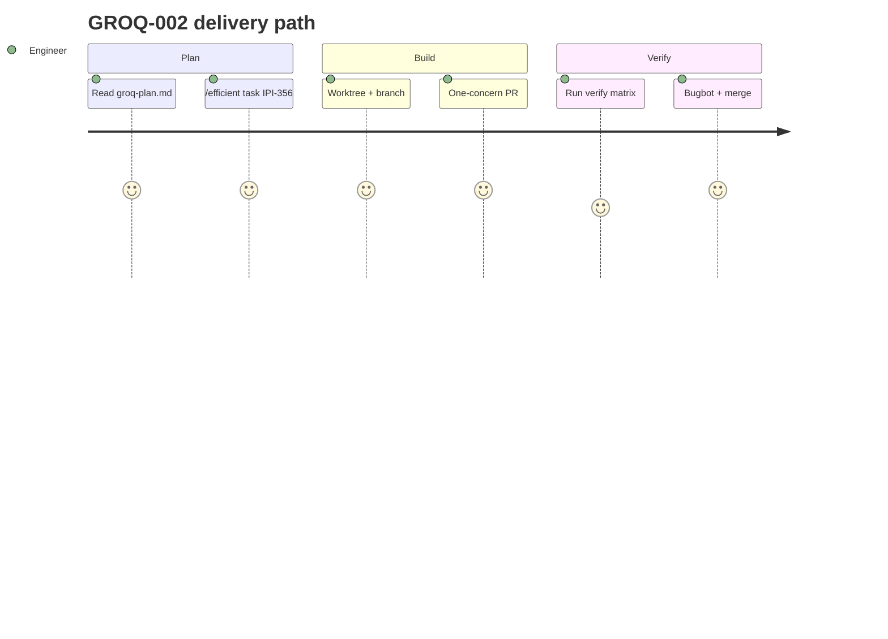

## GROQ-002 — GROQ-002 · Shared LLM Provider Abstraction

**In plain terms:** **Engineer** adds provider + model resolver and JSON Schema contract — production default still Gemini.

**Linear:** [IPI-356](https://linear.app/amo100/issue/IPI-356)

**Blocked by:** [GROQ-001](https://linear.app/amo100/search?q=GROQ-001)

**Unblocks:** GROQ-003, GROQ-004

**Branch:** `ipi/groq-002-shared-client`

**PR:** [#228](https://github.com/amo-tech-ai/lumina-studio/pull/228) · `ipi/groq-002-shared-client` · merged 2026-07-06

**Verify:** `cd app && npm test && npm run typecheck`

**Estimate:** 5 points

**Source:** [tasks/llm/groq-plan.md](../../../tasks/llm/groq-plan.md) · audit: [tasks/llm/02-groq.md](../../../tasks/llm/02-groq.md)

### Skills (load in order)

| # | Skill | Path |
|---|--------|------|
| 1 | mastra | `.claude/skills/mastra/SKILL.md` → [`references/groq.md`](../../../.claude/skills/mastra/references/groq.md) |
| 2 | groq-inference | `.claude/skills/groq-inference/SKILL.md` |
| 3 | gemini | `.claude/skills/gemini/SKILL.md` |
| 4 | ipix-supabase | `.claude/skills/ipix-supabase/SKILL.md` |

---

### Sequence / architecture — GROQ-002

---

### User journey

---

### User stories

### Story 1
**Engineer** switches AI_PROVIDER in one env var without code edits.

**Acceptance:** Measurable in PR verification for GROQ-002.

### Story 2
**Brand intake** keeps same JSON shape — Zod catches drift.

**Acceptance:** Measurable in PR verification for GROQ-002.

### Story 3
**On-call** gets schema_repair_count in agent logs.

**Acceptance:** Measurable in PR verification for GROQ-002.

---

### Dependencies

| Dependency | Status |
|------------|--------|
| tasks/llm/groq-plan.md | ✅ SSOT |
| GROQ-001 infra merged | required before start |
| Golden eval (Phase 6) | before vision cutover |
| One concern per PR | ✅ enforced |

---

### Completion steps

#### A. Implement
- [x] **A1** Create `app/src/lib/ai/provider.ts` + env — `resolveModel(tier)` returns Gemini when `AI_PROVIDER=gemini`
- [x] **A2** Refactor `app/src/mastra/models.ts` to delegate (no behavior switch in this PR)
- [x] **A3** Create `supabase/functions/_shared/llm/*` — import same `config/groq-models.json` (no duplicate allowlists)
- [x] **A4** Convert `brand-profile.ts` → strict JSON Schema (`additionalProperties: false`, all fields required)
- [x] **A5** **Groq API constraint matrix:** no `{strict json_schema}` + `stream:true`; no `{strict json_schema}` + `tools`; ban deprecated `functions`/`function_call`
- [x] **A6** Use `max_completion_tokens` (not deprecated `max_tokens`); retry 429/502/503 with `Retry-After` + parse `x-ratelimit-*`
- [x] **A7** Tier flags: `parallelToolUse`, `supportsStrictJson` — strict JSON only on `openai/gpt-oss-20b`; agent multi-tool tier uses `parallelTools:true` model (llama/qwen, **not** gpt-oss)
- [x] **A8** Prompt-cache layout: static system/tool defs first, user/crawl content last
- [x] **A9** Log `usage`, `x_groq` request id, `schema_repair_count`; Zod validate + one repair pass
- [x] **A10** Unit tests: provider, schema round-trip, retry, mutual-exclusion guards

#### B. Verify + ship
- [x] **B1** Verification commands green (see **Verify** above) — provider 9/9, deno llm 9/9, groq-smoke OK 2026-07-05
- [x] **B2** Cursor PR Review — Codacy findings fixed or waived; merged #228
- [x] **B3** Linear **Done** · update groq-plan.md if IDs changed

**Spec score:** 88/100 — lifecycle-ready

---

_Source: `docs/linear/issues/IPI-356-groq-002.md` · push via `node scripts/linear-update-issue.mjs IPI-356`_
