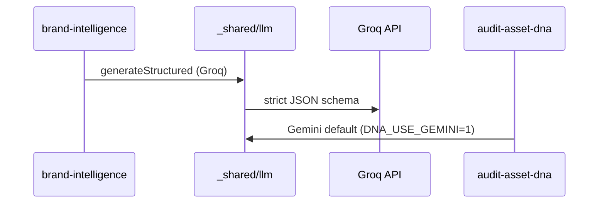
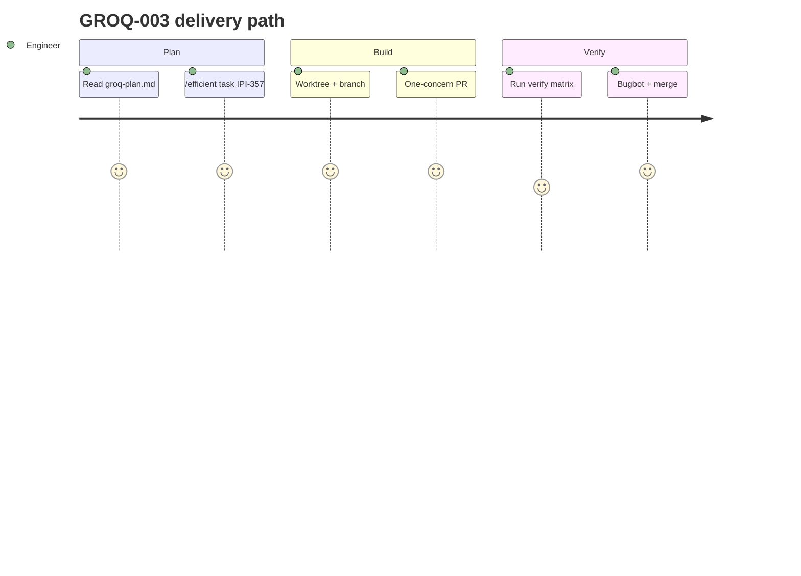

## GROQ-003 — GROQ-003 · Edge Functions on Groq (text first)

**In plain terms:** **Brand intelligence** edge fn uses Groq structured output; **DNA vision stays on Gemini** until golden eval.

**Linear:** [IPI-357](https://linear.app/amo100/issue/IPI-357)

**Blocked by:** [GROQ-002](https://linear.app/amo100/search?q=GROQ-002)

**Unblocks:** GROQ-006

**Branch:** `ipi/groq-003-edge-functions`

**PR:** `ipi/groq-003-edge-functions`

**Verify:** `infisical run -- npm run supabase:verify-edge && npm run supabase:verify-brand-intelligence`

**Estimate:** 4 points

**Source:** [tasks/llm/groq-plan.md](../../../tasks/llm/groq-plan.md) · audit: [tasks/llm/02-groq.md](../../../tasks/llm/02-groq.md)

### Skills (load in order)

| # | Skill | Path |
|---|--------|------|
| 1 | groq-inference | `.claude/skills/groq-inference/SKILL.md` (structured output, model tiers) |
| 2 | ipix-supabase | `.claude/skills/ipix-supabase/SKILL.md` |
| 3 | gemini | `.claude/skills/gemini/SKILL.md` |
| 4 | firecrawl | `.claude/skills/firecrawl/SKILL.md` |

---

### Sequence / architecture — GROQ-003

---

### User journey

---

### User stories

### Story 1
**Operator** runs brand crawl — profile JSON returns faster on Groq.

**Acceptance:** Measurable in PR verification for GROQ-003.

### Story 2
**QA** flips BI_USE_GEMINI=1 to compare Groq vs Gemini output.

**Acceptance:** Measurable in PR verification for GROQ-003.

### Story 3
**DNA reviewer** still sees Gemini-scored assets until Phase 6 sign-off.

**Acceptance:** Measurable in PR verification for GROQ-003.

---

### Dependencies

| Dependency | Status |
|------------|--------|
| tasks/llm/groq-plan.md | ✅ SSOT |
| GROQ-001 infra merged | required before start |
| Golden eval (Phase 6) | before vision cutover |
| One concern per PR | ✅ enforced |

---

### Completion steps

#### A. Implement
- [x] **A1** Migrate `brand-intelligence` to shared LLM module — **non-streaming** strict JSON pass on `openai/gpt-oss-20b`
- [ ] **A2** **Two-call pattern:** (1) Firecrawl markdown primary + optional `groq/compound-mini` enrichment (log `executed_tools`); (2) separate strict JSON call — **never** combine structured + tools in one request *(deferred — follow-up PR)*
- [ ] **A3** Replace Gemini `googleSearch`/`urlContext` with Compound enrichment or gpt-oss built-in tools — still separate from strict JSON call; use `search_settings` (not deprecated `include_domains`/`exclude_domains`) *(deferred — follow-up PR)*
- [x] **A4** Per-function fallback: `AI_PROVIDER=groq` + `BI_USE_GEMINI=1` → Gemini BI; `DNA_USE_GEMINI=1` default for `audit-asset-dna`
- [x] **A5** Wire `audit-asset-dna` to shared module — **Gemini default** until IPI-360 golden eval
- [x] **A6** Agent logs: `provider`, `model`, `x_groq.id`, `schema_repair_count`
- [x] **A7** Remote edge on `nvdlhrodvevgwdsneplk` uses Groq BI secrets (`AI_PROVIDER=groq`); **prod customer flip** gated on IPI-360 + IPI-361 (separate promotion / project keys per IPI-355 A2)

#### B. Verify + ship
- [x] **B1** Verification commands green (see **Verify** above) — evidence: `docs/ecommerce/evidence/2026-07-06/ipi-357-groq-003-staging-verify.md`
- [x] **B2** Cursor PR Review — no unresolved High/Critical (PR #229 merged)
- [ ] **B3** Linear **Done** · update groq-plan.md if IDs changed

**Spec score:** 88/100 — lifecycle-ready

---

_Source: `docs/linear/issues/IPI-357-groq-003.md` · push via `node scripts/linear-update-issue.mjs IPI-357`_
