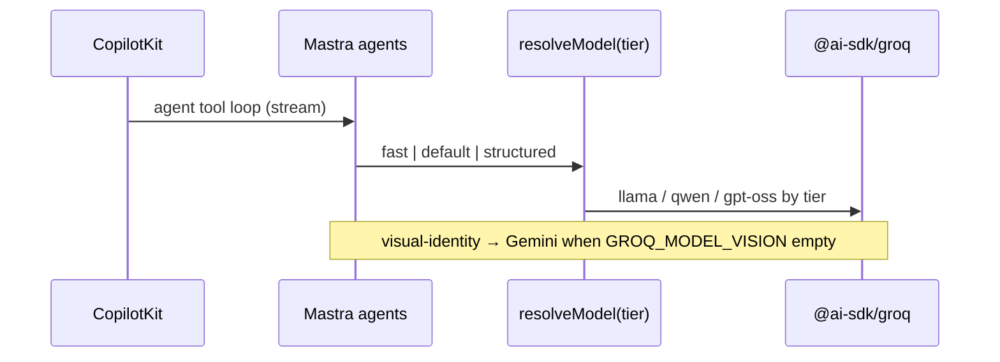

## GROQ-004 — GROQ-004 · Mastra Agents on Groq

**In plain terms:** Wire **Copilot/Mastra agents** to Groq tier map via existing `resolveModel()`; **visual-identity stays Gemini** until DNA golden eval passes.

**Linear:** [IPI-358](https://linear.app/amo100/issue/IPI-358)

**Blocked by:** [GROQ-002](https://linear.app/amo100/issue/IPI-356) — ✅ merged (PR #228)

**Unblocks:** GROQ-005, GROQ-006

**Branch:** `ipi/groq-004-mastra`

**PR:** `ipi/groq-004-mastra`

**Verify:** `cd app && npm run lint && npm run build && npm test`

**Estimate:** 3 points

**Source:** [tasks/llm/groq-plan.md](../../../tasks/llm/groq-plan.md) · audit: [tasks/llm/02-groq.md](../../../tasks/llm/02-groq.md)

### Skills (load in order)

| # | Skill | Path |
|---|--------|------|
| 1 | mastra | `.claude/skills/mastra/SKILL.md` → **read first:** [`references/groq.md`](../../../.claude/skills/mastra/references/groq.md) |
| 2 | groq-inference | `.claude/skills/groq-inference/SKILL.md` |
| 3 | copilotkit | `.claude/skills/copilotkit/SKILL.md` |
| 4 | gemini | `.claude/skills/gemini/SKILL.md` (visual-identity stays Gemini) |

---

### Scope note (post GROQ-002)

**GROQ-002 already shipped:** `@ai-sdk/groq`, `app/src/lib/ai/provider.ts` (`resolveModel`, `resolveGroqModelId`, `assertGroqTierCapabilities`), `config/groq-models.json` SSOT.

**This task is not greenfield package install.** It wires agents/tools to the tier map, adds the vision Gemini guard, Groq-aware provider options, and mocked Groq tests.

**Out of scope:** Edge functions (GROQ-003), CopilotKit smoke checklist (GROQ-005), prod env flip (GROQ-007).

---

### Sequence / architecture — GROQ-004



---

### Agent tier map (SSOT for this PR)

| Tier | `resolveModel()` arg | Model (allowlist default) | Agents / tools |
|------|----------------------|---------------------------|----------------|
| `fast` | `"fast"` | `llama-3.1-8b-instant` | `public-marketing` |
| `default` | `"default"` | `llama-3.3-70b-versatile` | `production-planner`, `creative-director`, `crm-assistant`, `model-match`, `social-discovery` agent, `brand-intelligence` agent |
| `structured` | `"structured"` | `openai/gpt-oss-20b` | Tools using `generateObject` (e.g. `social-discovery` tool); call `assertGroqTierCapabilities("structured", { strictJson: true })` |
| `default` + `generateText` | `"default"` | `llama-3.3-70b-versatile` | `suggestShootBrief` (non-structured prose — not `generateObject`) |
| **Gemini forced** | N/A | Gemini via `createGeminiLanguageModel()` | `visual-identity` agent + tool when `GROQ_MODEL_VISION` empty **or** `DNA_USE_GEMINI=1` semantics for vision |

**Groq rules (from groq-inference):**

- Multi-tool agents → `llama-3.3-70b-versatile` or `qwen/qwen3-32b` — **not** `gpt-oss-120b` (`parallelTools: false`).
- Strict JSON / `generateObject` → `openai/gpt-oss-20b` — **never** combine with CopilotKit streaming in the same call.
- Agent `id` strings unchanged (CopilotKit + `route-agent-map.ts`).

---

### User stories

### Story 1
**Operator** chats with production-planner — measurably lower time-to-first-token vs Gemini baseline on staging.

**Acceptance:** Staging smoke (GROQ-005) + `npm test` passes with `AI_PROVIDER=groq` mocked.

### Story 2
**Creative Director** gets shoot brief drafts from Groq text models via `suggestShootBrief`.

**Acceptance:** Tool uses `resolveModel("default")`; no `thinkingBudget` leak on Groq path.

### Story 3
**Engineer** runs CI without live `GROQ_API_KEY`.

**Acceptance:** Vitest mocks `@ai-sdk/groq`; visual-identity test proves Gemini fallback under `AI_PROVIDER=groq`.

---

### Dependencies

| Dependency | Status |
|------------|--------|
| [IPI-356](https://linear.app/amo100/issue/IPI-356) GROQ-002 | ✅ merged |
| [IPI-357](https://linear.app/amo100/issue/IPI-357) GROQ-003 | In progress (parallel OK) |
| Golden eval (Phase 6) | before vision cutover |
| One concern per PR | ✅ enforced — **do not merge GROQ-005 into this PR** |

---

### Completion steps

#### A. Implement

- [ ] **A1** Confirm GROQ-002 baseline — `@ai-sdk/groq` in `app/package.json`; **do not add `groq-sdk` to app/** (Edge-only)
- [ ] **A2** Tier map in `app/src/lib/ai/provider.ts`:
  - Export `resolveVisionModel()` or equivalent: returns Gemini when `AI_PROVIDER=gemini`, or when `GROQ_MODEL_VISION` empty, else Groq vision tier from allowlist
  - `resolveProviderOptions(provider)` — Groq path omits Google `thinkingBudget`; Gemini keeps `thinkingBudget: 0`
- [ ] **A3** Update agents/tools per tier table above; **agent IDs unchanged**
- [ ] **A4** CopilotKit agent turns stay non-structured (streaming OK); structured tool calls use separate `generateObject` invocations
- [ ] **A5** Prompt caching — keep static `instructions` in agent definitions (system prefix); no dynamic system prompt assembly
- [ ] **A6** `visual-identity` — force Gemini when `GROQ_MODEL_VISION` empty (even if `AI_PROVIDER=groq`)
- [ ] **A7** Remove bare `resolveProviderOptions()` on Groq calls — provider-aware options only
- [ ] **A8** Tests: mock `@ai-sdk/groq`; add cases for `AI_PROVIDER=groq`, vision Gemini defer, tier selection

#### B. Verify + ship

- [ ] **B1** `cd app && npm run lint && npm run build && npm test` green
- [ ] **B2** Cursor PR Review — no unresolved High/Critical
- [ ] **B3** Linear **Done** · `@task-verifier` gate passed

---

### Definition of Done (provable)

- [ ] `resolveModel("fast")` returns Groq 8b when `AI_PROVIDER=groq` (mocked test)
- [ ] `resolveModel("default")` + `assertGroqTierCapabilities(..., { parallelTools: true })` passes for production-planner tier
- [ ] `visual-identity` uses Gemini model when `AI_PROVIDER=groq` and `GROQ_MODEL_VISION` unset
- [ ] `social-discovery` structured tool uses `resolveModel("structured")` with strict tier assert
- [ ] No agent `id` changed in `app/src/mastra/agents/` or `route-agent-map.ts`
- [ ] `npm test` green without live `GROQ_API_KEY`

### Tests (acceptance)

| Test | Command / file | Expected |
|------|----------------|----------|
| Provider tiers | `app/src/lib/ai/provider.test.ts` | Groq tier + vision defer cases |
| Visual identity defer | `app/src/mastra/agents/visual-identity.test.ts` | Gemini under groq env when vision empty |
| Agent registry | `app/src/mastra/agents/index.test.ts` | IDs unchanged; models use tier args |
| Full matrix | `cd app && npm run lint && npm run build && npm test` | exit 0 |

### Rollback

```text
AI_PROVIDER=gemini   # Infisical + Vercel env — no redeploy required for Mastra path
```

Per-function override not required on Mastra path (unlike Edge `BI_USE_GEMINI`).

---

### Doc follow-up (separate PR — one concern)

- [ ] Fix `mastra/references/groq.md` reasoning tier: multi-tool loops → `llama-3.3-70b-versatile`, not `gpt-oss-120b`

**Spec score:** 86/100 — lifecycle-ready (revised post GROQ-002 merge)

---

_Source: `docs/linear/issues/IPI-358-groq-004.md` · push via `node scripts/linear-update-issue.mjs IPI-358`_
