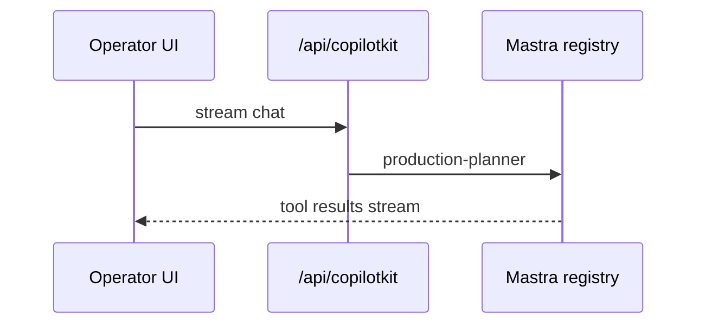
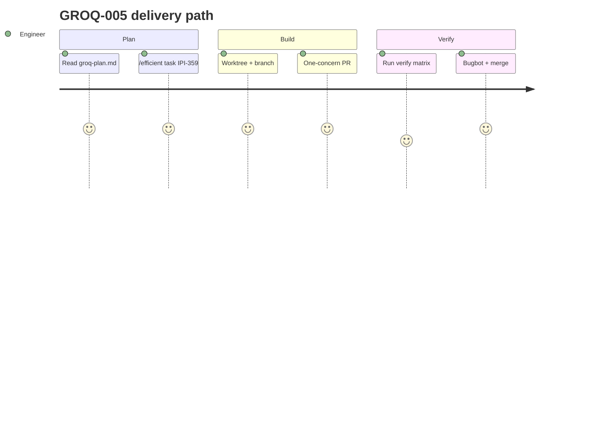

## GROQ-005 — GROQ-005 · CopilotKit Smoke Verification

**In plain terms:** **QA** confirms operator + marketing chat unchanged at API layer after Mastra Groq switch.

**Linear:** [IPI-359](https://linear.app/amo100/issue/IPI-359)

**Blocked by:** [GROQ-004](https://linear.app/amo100/search?q=GROQ-004)

**Unblocks:** GROQ-006

**Branch:** `ipi/groq-005-copilotkit-verify`

**PR:** `ipi/groq-005-copilotkit-verify` — **separate PR from IPI-358** (one concern per PR)

**Verify:** Manual smoke `:3002` QA credentials + written checklist in PR body

**Estimate:** 1 point

**Source:** [tasks/llm/groq-plan.md](../../../tasks/llm/groq-plan.md) · audit: [tasks/llm/02-groq.md](../../../tasks/llm/02-groq.md)

### Skills (load in order)

| # | Skill | Path |
|---|--------|------|
| 1 | copilotkit | `.claude/skills/copilotkit/SKILL.md` |
| 2 | mastra | `.claude/skills/mastra/SKILL.md` → [`references/groq.md`](../../../.claude/skills/mastra/references/groq.md) |
| 3 | groq-inference | `.claude/skills/groq-inference/SKILL.md` |

---

### Sequence / architecture — GROQ-005

---

### User journey

---

### User stories

### Story 1
**Operator** opens sidebar — same agents, faster tokens.

**Acceptance:** Measurable in PR verification for GROQ-005.

### Story 2
**Marketing** uses marketing chat — no regression.

**Acceptance:** Measurable in PR verification for GROQ-005.

### Story 3
**Engineer** documents smoke checklist in PR verification.

**Acceptance:** Measurable in PR verification for GROQ-005.

---

### Dependencies

| Dependency | Status |
|------------|--------|
| tasks/llm/groq-plan.md | ✅ SSOT |
| GROQ-001 infra merged | required before start |
| Golden eval (Phase 6) | before vision cutover |
| One concern per PR | ✅ enforced |

---

### Completion steps

#### A. Implement
- [ ] **A1** Execute written smoke checklist on `:3002` (QA creds): all agents, tool calls, streaming sidebar, marketing chat route
- [ ] **A2** Confirm agent IDs unchanged (`production-planner`, `creative-director`, `default`)
- [ ] **A3** Verify durable workflows + streaming — no regression vs Gemini baseline latency feel
- [ ] **A4** Provider-neutral progress UI strings; dev infra messages note Groq configured
- [ ] **A5** Paste checklist + screenshot evidence path in PR verification — **no repo docs PR** (checklist in PR body only)

#### B. Verify + ship
- [ ] **B1** Verification commands green (see **Verify** above)
- [ ] **B2** Cursor PR Review — no unresolved High/Critical
- [ ] **B3** Linear **Done** · update groq-plan.md if IDs changed

**Spec score:** 88/100 — lifecycle-ready

---

_Source: `docs/linear/issues/IPI-359-groq-005.md` · push via `node scripts/linear-update-issue.mjs IPI-359`_
