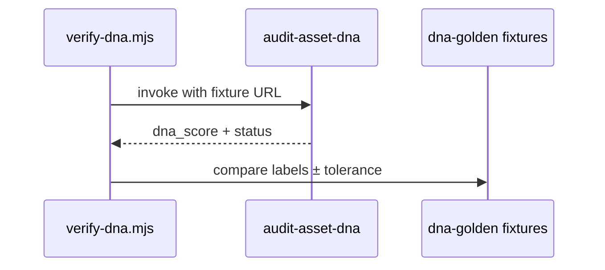
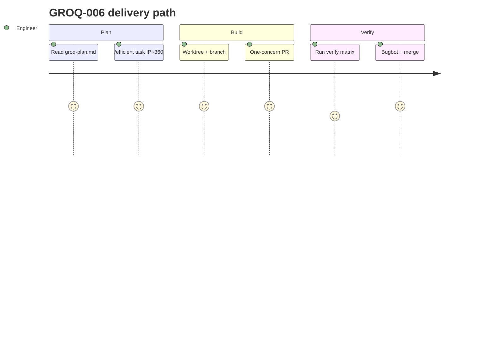

## GROQ-006 — GROQ-006 · Golden Eval + Verify Scripts

**In plain terms:** **QA gate** — golden DNA images + brand fixtures; verify-dna.mjs blocks rollout until metrics ≥ Gemini baseline.

**Linear:** [IPI-360](https://linear.app/amo100/issue/IPI-360)

**Blocked by:** [GROQ-003](https://linear.app/amo100/search?q=GROQ-003) · [GROQ-005](https://linear.app/amo100/search?q=GROQ-005)

**Unblocks:** GROQ-007

**Branch:** `ipi/groq-006-verify-scripts`

**PR:** `ipi/groq-006-verify-scripts`

**Verify:** `infisical run -- npm run supabase:verify-brand-intelligence && npm run supabase:verify-dna`

**Estimate:** 5 points

**Source:** [tasks/llm/groq-plan.md](../../../tasks/llm/groq-plan.md) · audit: [tasks/llm/02-groq.md](../../../tasks/llm/02-groq.md)

### Skills (load in order)

| # | Skill | Path |
|---|--------|------|
| 1 | gen-test | `.claude/skills/gen-test/SKILL.md` |
| 2 | groq-inference | `.claude/skills/groq-inference/SKILL.md` (golden fixtures, model comparison) |
| 3 | mastra | `.claude/skills/mastra/SKILL.md` → [`references/groq.md`](../../../.claude/skills/mastra/references/groq.md) |
| 4 | ipix-supabase | `.claude/skills/ipix-supabase/SKILL.md` |
| 5 | gemini | `.claude/skills/gemini/SKILL.md` |

---

### Sequence / architecture — GROQ-006

---

### User journey

---

### User stories

### Story 1
**QA** runs verify-dna — fails if Groq DNA FP rate exceeds Gemini.

**Acceptance:** Measurable in PR verification for GROQ-006.

### Story 2
**Engineer** adds fixture image — CI catches vision regression.

**Acceptance:** Measurable in PR verification for GROQ-006.

### Story 3
**Product** signs off Phase 6 before any prod Groq cutover.

**Acceptance:** Measurable in PR verification for GROQ-006.

---

### Dependencies

| Dependency | Status |
|------------|--------|
| tasks/llm/groq-plan.md | ✅ SSOT |
| GROQ-001 infra merged | required before start |
| Golden eval (Phase 6) | this issue |
| One concern per PR | ✅ enforced |

---

### Completion steps

#### A. Implement
- [ ] **A1** Golden DNA dataset — **10 images MVP** in `app/src/test/fixtures/dna-golden/` (expand later; label owner assigned)
- [ ] **A2** Golden brand profiles — 10+ Firecrawl markdown fixtures
- [ ] **A3** Compare Groq vs **Gemini baseline from IPI-355** (`groq-baseline.json`) — do not re-capture baseline here
- [ ] **A4** Extend `verify-brand-intelligence.mjs` for Groq path; Groq BI ≥99% schema valid vs baseline
- [ ] **A5** Add `scripts/verify-dna.mjs` + `npm run supabase:verify-dna` — **`--provider gemini|groq`**; default verify path **Gemini** until explicit Groq vision flag
- [ ] **A6** CI skips live calls without keys; optional staging rate-limit load test (manual)

#### B. Verify + ship
- [ ] **B1** Verification commands green (see **Verify** above)
- [ ] **B2** Cursor PR Review — no unresolved High/Critical
- [ ] **B3** Linear **Done** · update groq-plan.md if IDs changed

**Spec score:** 88/100 — lifecycle-ready

---

_Source: `docs/linear/issues/IPI-360-groq-006.md` · push via `node scripts/linear-update-issue.mjs IPI-360`_
