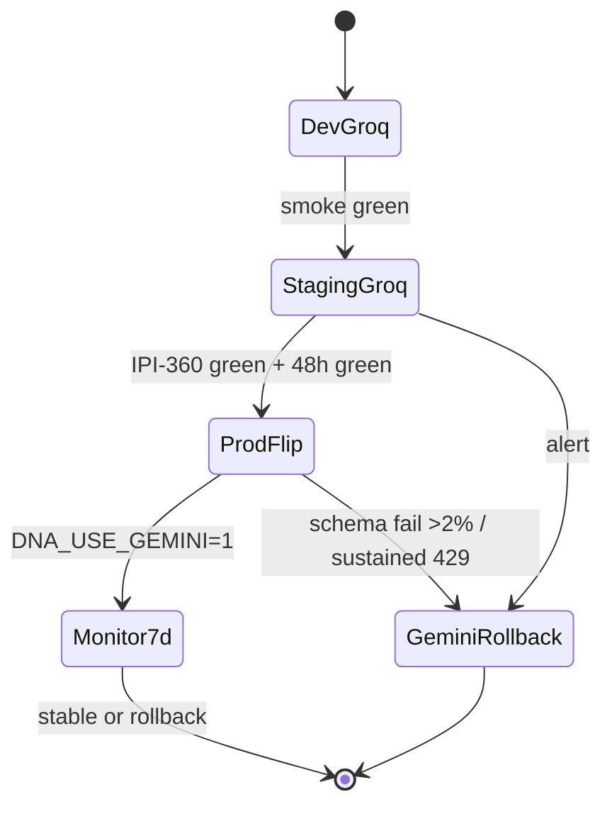
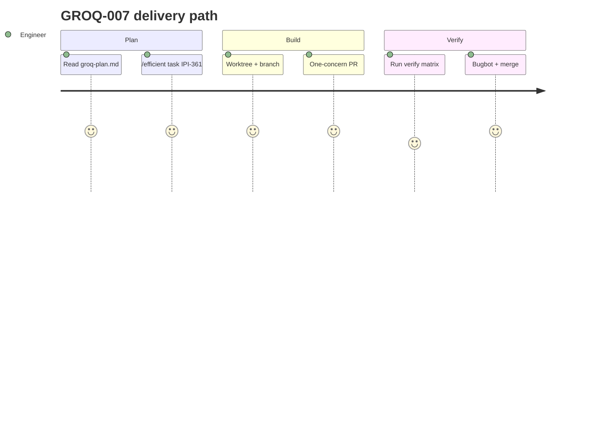

## GROQ-007 — GROQ-007 · Staged Production Rollout

**In plain terms:** **Platform** runs env-stage cutover (dev → staging 48h → prod flip) + 7-day monitor; rollback = `AI_PROVIDER=gemini` in Infisical only.

**Linear:** [IPI-361](https://linear.app/amo100/issue/IPI-361)

**Blocked by:** [GROQ-006](https://linear.app/amo100/search?q=GROQ-006)

**Unblocks:** Groq primary in prod · observability dashboard review

**Branch:** `ipi/groq-007-rollout-config`

**PR:** `ipi/groq-007-rollout-config`

**Verify:** `7-day monitor: agent logs, 429s, schema failures, cost`

**Estimate:** 2 points

**Source:** [tasks/llm/groq-plan.md](../../../tasks/llm/groq-plan.md) · audit: [tasks/llm/02-groq.md](../../../tasks/llm/02-groq.md)

### Skills (load in order)

| # | Skill | Path |
|---|--------|------|
| 1 | groq-inference | `.claude/skills/groq-inference/SKILL.md` |
| 2 | mastra | `.claude/skills/mastra/SKILL.md` → [`references/groq.md`](../../../.claude/skills/mastra/references/groq.md) |
| 3 | infisical | `.claude/skills/infisical/SKILL.md` |
| 4 | ipix-task-lifecycle | `.claude/skills/ipix-task-lifecycle/SKILL.md` |
| 5 | gemini | `.claude/skills/gemini/SKILL.md` (rollback path) |

---

### Sequence / architecture — GROQ-007

---

### User journey

---

### User stories

### Story 1
**Operator** on staging feels faster chat — DNA still Gemini-safe.

**Acceptance:** Measurable in PR verification for GROQ-007.

### Story 2
**On-call** reverts AI_PROVIDER=gemini in Infisical without redeploy.

**Acceptance:** Measurable in PR verification for GROQ-007.

### Story 3
**Lead** reviews 7-day `ai_agent_logs` dashboard (schema_valid, 429s, p95, tokens, cost) before calling rollout complete.

**Acceptance:** Measurable in PR verification for GROQ-007.

---

### Dependencies

| Dependency | Status |
|------------|--------|
| tasks/llm/groq-plan.md | ✅ SSOT |
| GROQ-001 infra merged | required before start |
| Golden eval (Phase 6) | this issue |
| One concern per PR | ✅ enforced |

---

### Completion steps

#### A. Implement
- [ ] **A1** Staging: `AI_PROVIDER=groq`, `DNA_USE_GEMINI=1` — full Groq text, DNA Gemini — monitor 48h
- [ ] **A2** Prod flip: single Infisical env promotion after IPI-360 green (no 10%/50% traffic split — org-wide `AI_PROVIDER` only)
- [ ] **A3** Supabase saved queries on `ai_agent_logs`: provider, 429 count, `schema_valid`, p95 latency, tokens, `x_groq.id`
- [ ] **A4** Alert thresholds: schema fail >2%, DNA FP +5pp vs baseline, sustained 429, p95 2× budget → rollback drill
- [ ] **A5** Document rollback runbook: `AI_PROVIDER=gemini` + `BI_USE_GEMINI=1` + `DNA_USE_GEMINI=1` — no redeploy
- [ ] **A6** 7-day monitor post-flip; update Linear + tracker on completion

#### B. Verify + ship
- [ ] **B1** Verification commands green (see **Verify** above)
- [ ] **B2** Cursor PR Review — no unresolved High/Critical
- [ ] **B3** Linear **Done** · update groq-plan.md if IDs changed

**Spec score:** 88/100 — lifecycle-ready

---

_Source: `docs/linear/issues/IPI-361-groq-007.md` · push via `node scripts/linear-update-issue.mjs IPI-361`_
