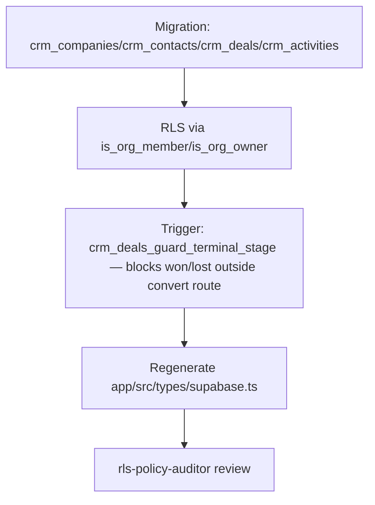
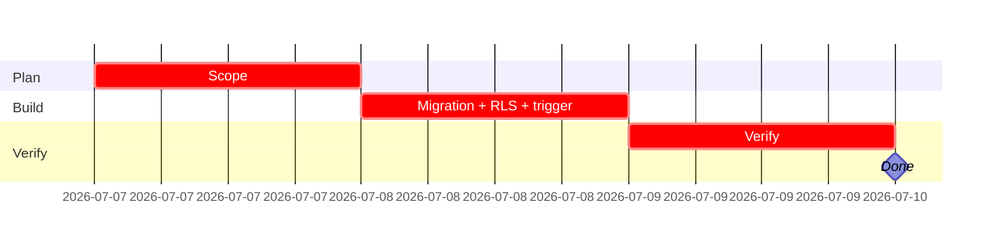

## CRM-DATA-001 — Schema + RLS: companies, contacts, deals, activities

**In plain terms:** Create the four CRM tables and their RLS policies so every later CRM screen and the agent have something real to read/write.

**Blocked by:** none · **Unblocks:** IPI-363, IPI-364, IPI-365, IPI-366

**Skills:** `ipix-supabase` · `create-migration` · `linear`

**Milestone:** CRM-M1 · Schema & Core Screens
**Spec:** `tasks/crm/02-crm-architecture-brief.md` §Database · `tasks/crm/plans/supabase-plan.md` · `tasks/crm/diagrams/01-data-model-er.md`

---

### Flow

---

### Completion steps

#### A. Scope and setup
- [ ] **A1** Confirm column shapes against `tasks/crm/02-crm-architecture-brief.md` §Database — proof: migration diff matches doc

#### B. Implement
- [ ] **B1** `crm_companies`, `crm_contacts` (jsonb `email`/`phone`, not text columns), `crm_deals`, `crm_activities` (CHECK ≥1 of company/contact/deal) — proof: `list_tables`
- [ ] **B2** `crm_deals_guard_terminal_stage()` trigger (`tasks/crm/plans/supabase-plan.md` §won/lost enforcement) — **required, not optional** (corrected 2026-07-04 per `tasks/crm/audit/02-linear-audit.md` G4 — Linear AC previously allowed "RLS or route level" which is insufficient) — proof: direct `UPDATE ... SET stage='won'` without the session flag raises an exception
- [ ] **B3** Extend `public.notifications` with `deal_stage_changed`/`follow_up_due` event types — proof: no new table created

#### C. Integrate
- [ ] **C1** RLS policies on all 4 tables via `is_org_member(org_id)` — proof: `rls-policy-auditor` sign-off
- [ ] **C2** Regenerate `app/src/types/supabase.ts` — proof: `npm run supabase:types` diff includes `crm_*`

#### D. Verify
- [ ] **D1** `infisical run -- npm run supabase:verify` and `supabase:verify-rls` — proof: green
- [ ] **D2** Cross-org negative test: second org cannot read/write another org's `crm_*` rows — proof: test script output

#### E. Ship
- [ ] **E1** Update `tasks/crm/todo.md` row #1 to 🟢 and Linear state to Done — proof: diff

---

### Gantt — IPI-362

