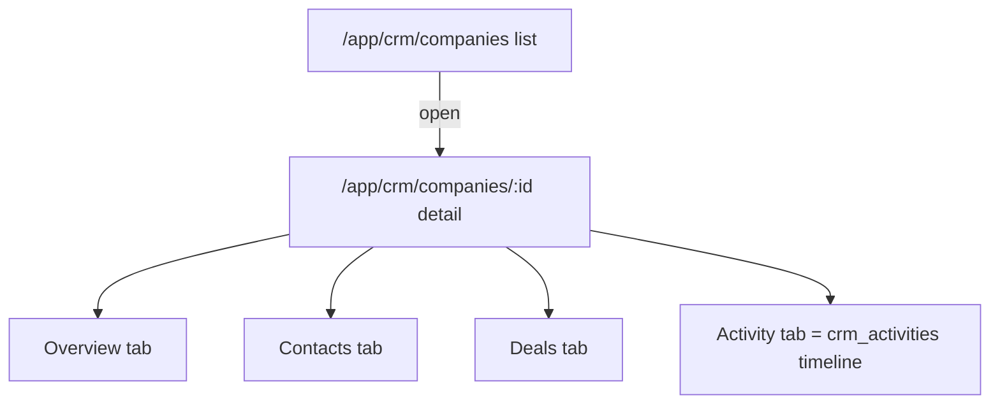
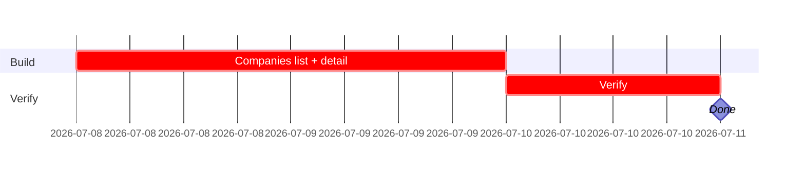

## CRM-UX-001 — Companies list + detail screens

**In plain terms:** Operator can list, filter, search, create, and open companies (prospects and already-converted brands together) — no AI yet.

**Blocked by:** IPI-362 · **Unblocks:** IPI-368

**Skills:** `design-to-production` (load first — DC HTML → React parity) · `frontend-design` · `shadcn` · `linear`

**Milestone:** CRM-M1 · Schema & Core Screens
**Spec:** `Universal design prompt/crm/SCR-26-CRM-Companies-List.dc.html` (list) · `SCR-27-CRM-Company-Detail.dc.html` (detail) — supersedes the old `tasks/crm/design/02a`/`02b` prompt docs, now that real DC HTML exists. Conversion plan: `tasks/crm/tasks/02-crm-design-to-react-conversion-plan.md`.

---

### Phase 0 — production state (verified 2026-07-05 against `origin/main`)

| Area | Exists today? | This issue changes? |
|---|---|---|
| Route `/app/crm/companies` | ✅ merged, renders `<CrmScreenGate screen="Companies" />` | Replace gate with real workspace |
| Route `/app/crm/companies/[id]` | ✅ merged, same gate | Replace gate with real workspace |
| Shell (`CrmLayout` → `CrmRecordContext`) | ✅ merged | No change |
| `listCompanies` | ✅ merged (`app/src/lib/crm/queries.ts`) | Reuse as-is |
| `getCompany(id)` | 🔴 does not exist | **Build this issue** — join contacts/deals/activities by `company_id` |
| CopilotKit context | ✅ `CrmRecordContext` already injects `companyId` on detail routes | No change needed (see AI Integration Matrix below) |

### Data-source table

| Block | Data source | Empty state | Real or fallback image? |
|---|---|---|---|
| Companies list rows | `listCompanies` | "No companies yet" | No image slot in DC file |
| Company Detail → Overview | `getCompany` (new) | n/a (always has a company) | No image slot |
| Company Detail → Contacts tab | `listContacts({ companyId })` (existing, filter param) | "No contacts yet" | — |
| Company Detail → Deals tab | part of `getCompany` join, or a scoped `listDeals({ companyId })` once IPI-365 lands `listDeals` — do not duplicate the query | "No deals yet" | — |
| Company Detail → Activity tab | shared `ActivityTimeline` (built in IPI-366, imported here — do not rebuild) | "No activity yet" | — |

### AI Integration Matrix (per `copilotkit-mastra.md` §12)

```text
CopilotKit
- [x] Headless UI hooks used: CrmRecordContext (shared, already wired) — no new hook needed
- [ ] Frontend tools: none page-specific
- [ ] Display components: none page-specific

Mastra
- [x] Agent: crm-assistant (existing, wave 1) — searchCompanies already covers "find a company" from chat
- [ ] Workflow / Tools / Memory: none new for this issue
```

No new AI wiring in this issue — companies/contacts search already works via chat today; this issue is screen visuals only.

---

### Flow



---

### Completion steps

#### A. Scope and setup
- [x] **A1** Confirm IPI-362 merged, `crm_companies`/`crm_contacts`/`crm_deals`/`crm_activities` queryable — proof: `list_tables` (verified — merged via PR #212)
- [ ] **A2** Confirm the gated route on `main` — proof: `git show origin/main:"app/src/app/(operator)/app/crm/companies/page.tsx"` shows `<CrmScreenGate>`

#### B. Implement
- [ ] **B1** `getCompany(id)` in `app/src/lib/crm/queries.ts` — joins contacts/deals/activities by `company_id` — proof: vitest with a mocked Supabase client
- [ ] **B2** Companies list: filter (status/owner/industry), search (name/domain — reuses existing `listCompanies`), `CompanyCard` — no reusable card component exists in this codebase (`brand-hub/brand-list-card.tsx` does not exist; Brand's list renders its rows inline) — build a small local `CompanyCard`, don't assume a template that isn't there — proof: screenshot matches `SCR-26-CRM-Companies-List.dc.html`
- [ ] **B3** Company Detail tabs (Overview/Contacts/Deals/Activity), replacing `<CrmScreenGate>` — proof: screenshot matches `SCR-27-CRM-Company-Detail.dc.html`
- [ ] **B4** One new `NavSidebar` entry for CRM — proof: diff to `nav-sidebar.tsx`

#### C. Integrate
- [ ] **C1** No `PageHeader`/`FilterBar`/`SearchBar`/`StatusChip` import attempt — shadcn `Badge`/`Select`/`Input` only, per IPI-373 AC A3 — proof: `grep -rl "PageHeader\|FilterBar\|StatusChip" app/src/components` returns nothing new
- [ ] **C2** `brand_id` link renders only when populated, no "convert" button on this screen — proof: manual check
- [ ] **C3** Activity tab imports the shared `ActivityTimeline` from IPI-366 — does not render its own timeline — proof: import statement in `company-detail-tabs.tsx`

#### D. Verify
- [ ] **D1** `cd app && npm run typecheck && npm test` — proof: green
- [ ] **D2** Empty/loading/error states match `02a`/`02b` — proof: manual toggle

#### E. Ship
- [ ] **E1** Update `tasks/crm/todo.md` row #2 — proof: diff

---

### Gantt — IPI-363


