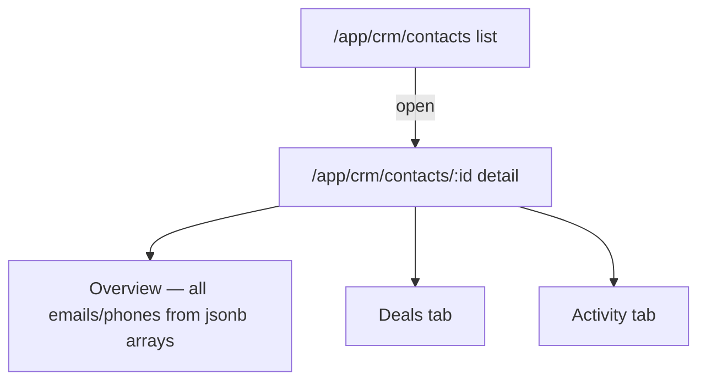
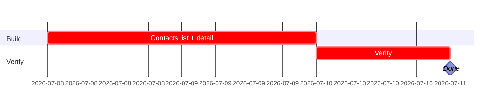

## CRM-UX-002 — Contacts list + detail screens

**In plain terms:** Operator can list, filter, search, create, and open contacts across all companies — no AI yet.

**Blocked by:** IPI-362 · **Unblocks:** IPI-368

**Skills:** `design-to-production` (load first — DC HTML → React parity) · `frontend-design` · `shadcn` · `linear`

**Milestone:** CRM-M1 · Schema & Core Screens
**Spec:** `Universal design prompt/crm/SCR-28-CRM-Contacts-List.dc.html` (list) · `SCR-29-CRM-Contact-Detail.dc.html` (detail) — supersedes the old `tasks/crm/design/02c`/`02d` prompt docs. Conversion plan: `tasks/crm/tasks/02-crm-design-to-react-conversion-plan.md`.

---

### Phase 0 — production state (verified 2026-07-05 against `origin/main`)

| Area | Exists today? | This issue changes? |
|---|---|---|
| Route `/app/crm/contacts` | ✅ merged, renders `<CrmScreenGate screen="Contacts" />` | Replace gate with real workspace |
| Route `/app/crm/contacts/[id]` | ✅ merged, same gate | Replace gate with real workspace |
| `listContacts` | ✅ merged — **name-only search today** (jsonb email/phone `ilike` search was simplified out; a note in the merged code says a dedicated RPC is needed for jsonb partial match, tracked as IPI-373+) | Reuse as-is; do not re-add jsonb `::text.ilike` search in this issue — that's a separate follow-up if product wants it |
| `getContact(id)` | 🔴 does not exist | **Build this issue** |
| `getPrimaryEntry` | ✅ merged (`app/src/lib/crm/jsonb-contact-fields.ts`) | Reuse for the list row's primary email/phone |

### Data-source table

| Block | Data source | Empty state | Real or fallback image? |
|---|---|---|---|
| Contacts list rows | `listContacts` + `getPrimaryEntry` for the row's primary email/phone | "No contacts yet" | No image slot — use a plain initials circle (matches `BrandsPage`'s DNA-score circle pattern; no `Avatar` install needed) |
| Contact Detail → all emails/phones | every jsonb array entry individually, via `getContact` | n/a | — |

### AI Integration Matrix (per `copilotkit-mastra.md` §12)

```text
CopilotKit
- [x] Headless UI hooks used: CrmRecordContext (shared, already wired)
- [ ] Frontend tools / Display components: none page-specific

Mastra
- [x] Agent: crm-assistant (existing, wave 1) — searchContacts already covers chat-based lookup
- [ ] Workflow / Tools / Memory: none new for this issue
```

---

### Flow



---

### Completion steps

#### A. Scope and setup
- [x] **A1** Confirm IPI-362 merged — proof: `list_tables` (verified — merged via PR #212)

#### B. Implement
- [ ] **B1** `getContact(id)` in `app/src/lib/crm/queries.ts` — proof: vitest with a mocked Supabase client
- [ ] **B2** Contacts list: filter (company/role), search by name (jsonb array search deferred — see Phase 0 note), primary email/phone shown in row via `getPrimaryEntry` — proof: screenshot matches `SCR-28-CRM-Contacts-List.dc.html`
- [ ] **B3** Contact Detail: all emails/phones individually labeled with type + primary indicator, replacing `<CrmScreenGate>` — proof: screenshot matches `SCR-29-CRM-Contact-Detail.dc.html`

#### C. Integrate
- [ ] **C1** No `Avatar`/`AvatarFallback` install — use a plain initials circle, matching the existing `BrandsPage` DNA-score-circle pattern, not a new shadcn dependency for one screen — proof: code review
- [ ] **C2** `profile_id` link renders only when populated — proof: manual check

#### D. Verify
- [ ] **D1** `cd app && npm run typecheck && npm test` — proof: green

#### E. Ship
- [ ] **E1** Update `tasks/crm/todo.md` row #3 — proof: diff

---

### Gantt — IPI-364


