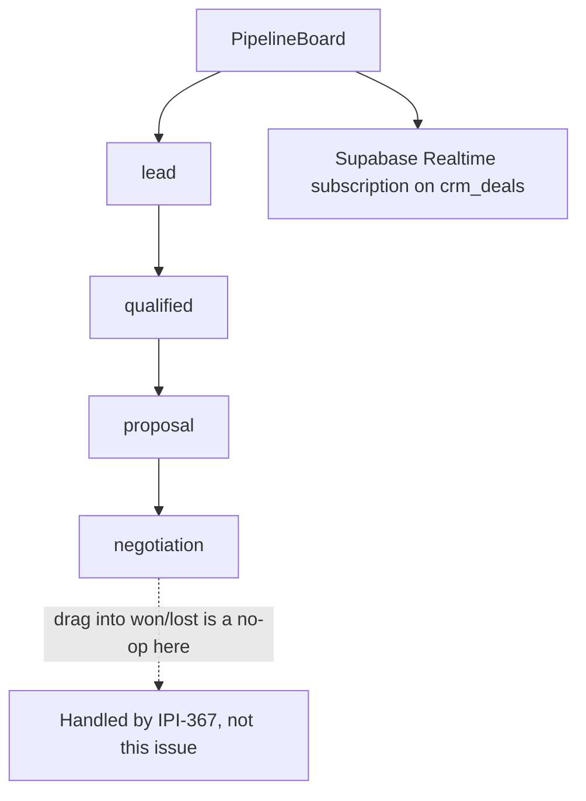
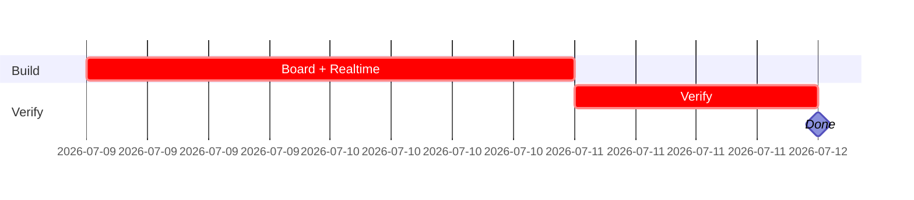

## CRM-UX-003 — Pipeline board (kanban, ungated stage moves, Realtime)

**In plain terms:** Operator sees every deal's stage on a kanban board and can move deals through the ungated stages; the board updates live.

**Blocked by:** IPI-362 · **Unblocks:** IPI-366 (soft — see note), IPI-368 (soft — see note)

**Note on dependencies (audit `tasks/crm/audit/01-audit.md` "Suggested improvements"):** IPI-366 and IPI-368 no longer hard-block on this issue in Linear — Deal Detail needs its own local `DealStageChip` rendering and the agent's `moveDealStage` tool only needs `crm_deals` to exist, not the board UI. Build in parallel with IPI-362 downstream work if useful; consolidate `DealStageChip` afterward.

**Skills:** `design-to-production` (load first — DC HTML → React parity) · `frontend-design` · `shadcn` · `ipix-supabase` (Realtime) · `linear`

**Milestone:** CRM-M1 · Schema & Core Screens
**Spec:** `Universal design prompt/crm/SCR-30-CRM-Pipeline.dc.html` — supersedes the old `tasks/crm/design/02e` prompt doc. Conversion plan: `tasks/crm/tasks/02-crm-design-to-react-conversion-plan.md`. Also see `tasks/crm/diagrams/02-conversion-and-agent-flow.md`.

---

### Phase 0 — production state (verified 2026-07-05 against `origin/main`)

| Area | Exists today? | This issue changes? |
|---|---|---|
| Route `/app/crm/pipeline` | ✅ merged, renders `<CrmScreenGate screen="Pipeline" />` | Replace gate with real workspace |
| Route `/app/crm/pipeline/[id]` | ✅ merged, same gate — **owned by IPI-366**, not this issue | No change here |
| `listDeals` | 🔴 does not exist | **Build this issue** |
| `PATCH /api/crm/deals/[id]` | 🔴 does not exist | **Build this issue** (Task 2 below) |
| Realtime on `crm_deals` | 🔴 not wired | **Build this issue** (Task 3 below) |
| `moveDealStage` (crm-assistant tool) | ✅ merged (`app/src/mastra/tools/`, wave 1) — agent can already move a deal through the 4 ungated stages via chat, ahead of this screen | No change — this issue's PATCH route is the same allow-list the agent tool should already respect; verify they agree, don't duplicate the allow-list logic |

### AI Integration Matrix (per `copilotkit-mastra.md` §12)

```text
CopilotKit
- [x] Headless UI hooks used: CrmRecordContext (shared, already wired)
- [ ] Frontend tools / Display components: none page-specific

Mastra
- [x] Agent: crm-assistant (existing) — moveDealStage tool already exists server-side; this issue's
      UI just gives a human the same ungated-stage-move capability the agent already has
- [ ] Workflow / new Tools: none — do not duplicate moveDealStage's allow-list logic in a second place
```

---

### Flow



---

### Completion steps

#### A. Scope and setup
- [x] **A1** Confirm IPI-362 merged — proof: `list_tables` (verified — merged via PR #212)
- [ ] **A2** Confirm the gated route on `main` — proof: `git show origin/main:"app/src/app/(operator)/app/crm/pipeline/page.tsx"` shows `<CrmScreenGate>`

#### B. Implement
- [ ] **B0** `listDeals({ orgId, stage? })` in `app/src/lib/crm/queries.ts` — proof: vitest with a mocked Supabase client
- [ ] **B1** `PipelineBoard` — 6 columns, count + total value per column, replacing `<CrmScreenGate>` — proof: screenshot matches `SCR-30-CRM-Pipeline.dc.html`
- [ ] **B2** `DealCard`, `DealStageChip` (shadcn `Badge` variant) — proof: component review
- [ ] **B3** Drag/drop (desktop) + `[Move to →]` menu (mobile, keyboard-accessible) for the 4 ungated stages only — proof: manual test
- [ ] **B4** Supabase Realtime subscription on `crm_deals` — proof: two-session manual test

#### C. Integrate
- [ ] **C1** Dragging/moving into `won`/`lost` is a no-op in this issue — proof: code review confirms no write call

#### D. Verify
- [ ] **D1** `cd app && npm run typecheck && npm test` — proof: green
- [ ] **D2** Mobile: single-column stage-switcher, no kanban grid <768px — proof: manual at 390/768

#### E. Ship
- [ ] **E1** Update `tasks/crm/todo.md` row #4 — proof: diff

---

### Gantt — IPI-365


