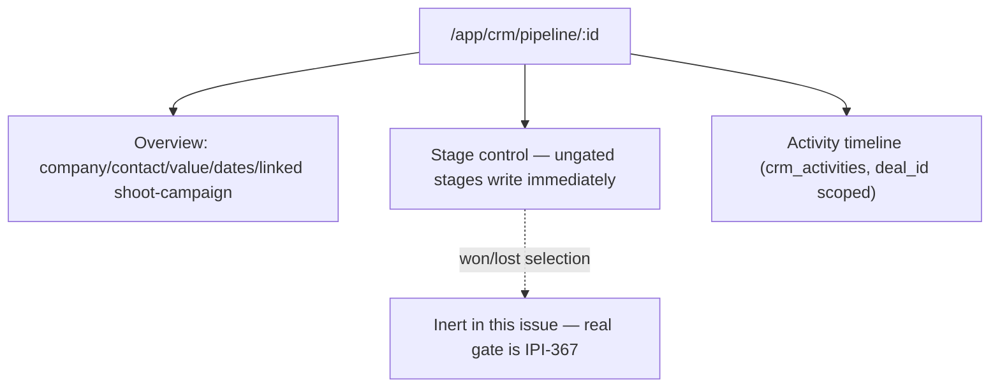
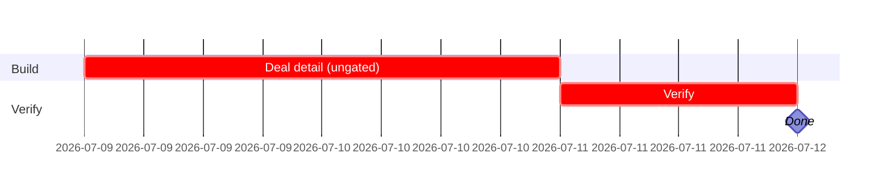

## CRM-UX-004 — Deal detail screen (read + ungated stage moves)

**In plain terms:** The single deal record — overview, ungated stage control, and activity timeline. The `won`/`lost` gate itself is IPI-367, a separate, safety-critical follow-up.

**Blocked by:** IPI-362 (hard) — IPI-365 is a soft dependency only, see audit note below · **Unblocks:** IPI-367, IPI-368 (soft)

**Note (audit `tasks/crm/audit/01-audit.md`):** originally hard-blocked on IPI-365 (Pipeline). Loosened — this screen can render its own local stage chip and be built in parallel with the board, consolidating the shared `DealStageChip` component afterward.

**Skills:** `design-to-production` (load first — DC HTML → React parity) · `frontend-design` · `shadcn` · `linear`

**Milestone:** CRM-M1 · Schema & Core Screens
**Spec:** `Universal design prompt/crm/SCR-31-CRM-Deal-Detail.dc.html` — supersedes the old `tasks/crm/design/02f` prompt doc. Conversion plan: `tasks/crm/tasks/02-crm-design-to-react-conversion-plan.md`.

---

### Phase 0 — production state (verified 2026-07-05 against `origin/main`)

| Area | Exists today? | This issue changes? |
|---|---|---|
| Route `/app/crm/pipeline/[id]` | ✅ merged, renders `<CrmScreenGate screen="Pipeline" />` (shared gate text with the board — fine, gate is generic) | Replace gate with real workspace |
| `getDeal(id)` | 🔴 does not exist | **Build this issue** |
| `deriveTaskState` | ✅ merged as `app/src/lib/crm/activity-state.ts` (**not** `derive-task-state.ts` as an earlier version of this issue named it — same function, real file path differs) | Reuse as-is |
| `ActivityTimeline` component | 🔴 does not exist yet — was briefly built into IPI-363's PR by mistake and pulled back out; **this issue is its correct, original owner** | **Build this issue** — Company Detail (IPI-363) and Contact Detail (IPI-364) import it once it lands here, they do not rebuild it |
| `PATCH /api/crm/deals/[id]` | Built by IPI-365 (shared route) | Reuse — do not duplicate |

### AI Integration Matrix (per `copilotkit-mastra.md` §12)

```text
CopilotKit
- [x] Headless UI hooks used: CrmRecordContext (shared, already wired — injects dealId here)
- [ ] Frontend tools / Display components: none page-specific

Mastra
- [x] Agent: crm-assistant (existing) — moveDealStage/logActivity tools already exist server-side
- [ ] Workflow / new Tools: none — won/lost write path is explicitly out of scope (IPI-367)
```

---

### Flow



---

### Completion steps

#### A. Scope and setup
- [x] **A1** Confirm IPI-362 merged — proof: `list_tables` (verified — merged via PR #212)
- [x] **A2** `deriveTaskState` already merged — proof: `app/src/lib/crm/activity-state.ts` on `main` (PR #216)

#### B. Implement
- [ ] **B0** `getDeal(id)` in `app/src/lib/crm/queries.ts` — joins company → contact → shoot; `shoot_id`/`campaign_id` render `null` when unset, never fabricated — proof: vitest with a mocked Supabase client
- [ ] **B1** Overview block (company/contact/value/dates, linked shoot/campaign only when populated), replacing `<CrmScreenGate>` — proof: screenshot matches `SCR-31-CRM-Deal-Detail.dc.html`
- [ ] **B2** Stage control writes immediately for `lead`/`qualified`/`proposal`/`negotiation` via IPI-365's `PATCH /api/crm/deals/[id]` — do not build a second write path — proof: manual test
- [ ] **B3** `won`/`lost` selection present but **visibly inert** (no write path) in this issue — proof: code review
- [ ] **B4** `ActivityTimeline` component (`app/src/components/crm/activity-timeline.tsx`) — props `{ anchor: { companyId?, contactId?, dealId? } }`, one query on `crm_activities` filtered by whichever anchor is set — build once, here — proof: manual test + component test
- [ ] **B5** `[Log activity]` inline form — proof: manual test

#### C. Integrate
- [ ] **C1** No send integration on activity logging (draft/log only) — proof: code review

#### D. Verify
- [ ] **D1** `cd app && npm run typecheck && npm test` — proof: green
- [ ] **D2** Confirm selecting `won`/`lost` does NOT write to `crm_deals.stage` in this issue's code — proof: manual + code search

#### E. Ship
- [ ] **E1** Update `tasks/crm/todo.md` row #5 — proof: diff

---

### Gantt — IPI-366


