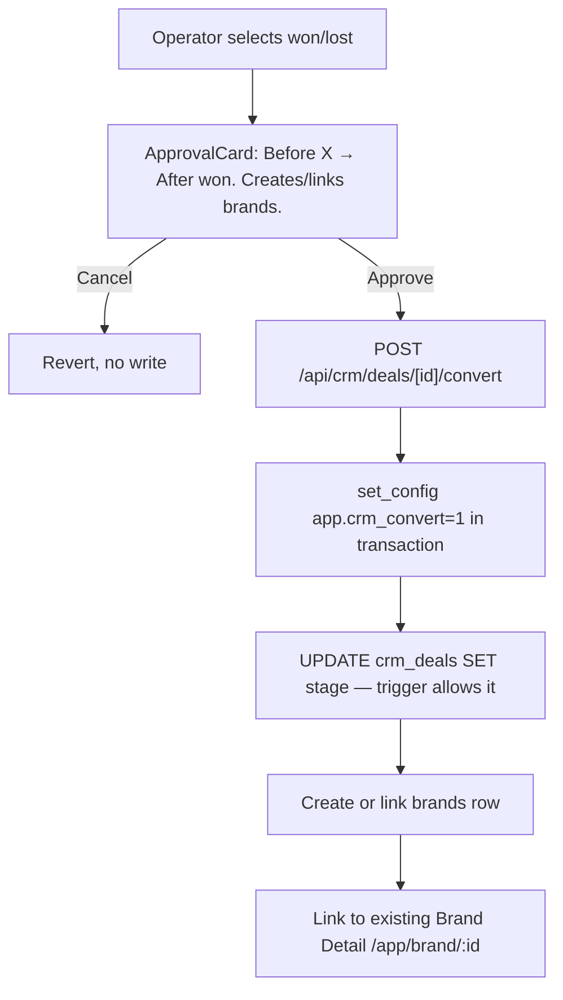
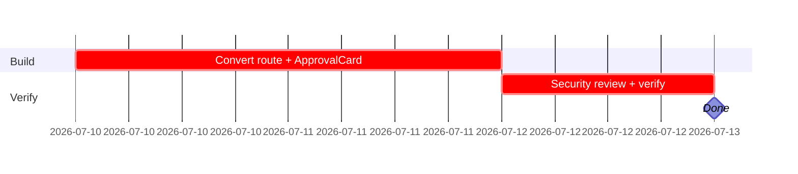

## CRM-AI-001 — Won/Lost HITL gate + brand conversion route

**In plain terms:** The single most safety-critical piece of the CRM module — the only path that may ever mark a deal `won`/`lost`, and the only path that may create/link a `brands` row from a CRM company.

**Blocked by:** IPI-366 · **Unblocks:** IPI-370 (correction 2026-07-04 per `tasks/crm/audit/02-linear-audit.md`: this issue never actually blocks IPI-368 — wave-1 agent work is intentionally independent, see IPI-368's ordering note)

**Skills:** `ipix-supabase` · `linear` · `pr-workflow`

**Milestone:** CRM-M2 · HITL Gate & Brand Conversion
**Spec:** `tasks/crm/02-crm-architecture-brief.md` (Executive Summary) · `tasks/crm/design/02f-crm-deal-detail.md` · `tasks/crm/plans/supabase-plan.md` §won/lost enforcement

---

### Flow

---

### Completion steps

#### A. Scope and setup
- [ ] **A1** Confirm IPI-362's `crm_deals_guard_terminal_stage` trigger is live — proof: attempt a raw `UPDATE` without the session flag, confirm it raises

#### B. Implement
- [ ] **B1** `api/crm/deals/[id]/convert` route (force-dynamic + existing auth pattern) — proof: route file
- [ ] **B2** Inline `ApprovalCard` on Deal Detail for `won`/`lost` selection — proof: screenshot matches `02f`
- [ ] **B3** `won` creates a `brands` row if none exists, or links the existing one via `crm_companies.brand_id` — proof: manual test both paths
- [ ] **B4** Route sets `app.crm_convert` session flag inside the same transaction as the stage `UPDATE` — proof: code review

#### C. Integrate
- [ ] **C1** No other button/menu/shortcut/Pipeline-board-drag may reach this write — proof: code search for all `crm_deals` stage writes
- [ ] **C2** Route failure reverts UI, surfaces error, no optimistic success — proof: manual failure-injection test
- [ ] **C3** Approving links to existing `/app/brand/:id`, not a new CRM-owned page — proof: manual check

#### D. Verify
- [ ] **D1** `cd app && npm run typecheck && npm test` — proof: green
- [ ] **D2** `rls-policy-auditor` + `migration-reviewer` sign-off given irreversibility — proof: review notes
- [ ] **D3** `infisical run -- npm run supabase:verify-rls` — proof: green

#### E. Ship
- [ ] **E1** Update `tasks/crm/todo.md` row #6 — proof: diff

---

### Gantt — IPI-367

