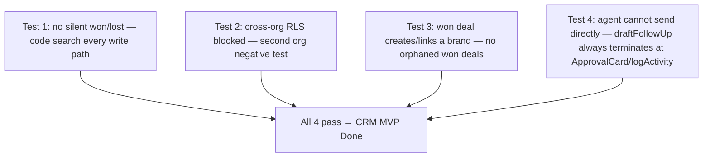
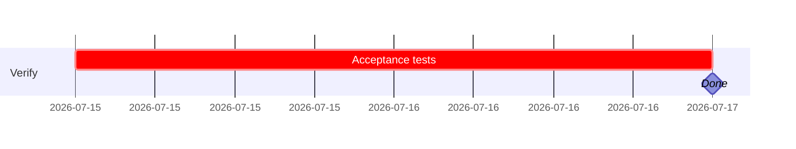

## CRM-QA-001 — MVP acceptance verification

**In plain terms:** Prove the CRM module's hard safety guarantees hold end-to-end before this project moves to Done — not just per-issue testing, but the cross-cutting invariants that only show up when every piece is wired together.

**Blocked by:** IPI-367, IPI-369 · **Unblocks:** none (terminal issue)

**Skills:** `task-verifier` · `ipix-supabase` · `linear`

**Milestone:** CRM-M4 · Verification
**Spec:** `tasks/crm/05-crm-prd.md` §15/§17 · `tasks/crm/audit/01-audit.md`

---

### Flow

---

### Completion steps

#### A. Scope and setup
- [ ] **A1** Confirm IPI-367 and IPI-369 merged — proof: Linear state

#### B. Implement
- [ ] **B1** Automated test: no path other than `api/crm/deals/[id]/convert` sets `stage = won/lost` — proof: test file
- [ ] **B2** Automated RLS pen test: second test org blocked on all 4 `crm_*` tables — proof: test file
- [ ] **B3** Automated test: `convert` route always produces a linked/created `brands` row — proof: test file
- [ ] **B4** Code-trace test: `draftFollowUp` output cannot reach an external send call — proof: test file or manual trace documented

#### C. Integrate
- [ ] **C1** Full verify matrix run — proof: command output

#### D. Verify
- [ ] **D1** `cd app && npm run lint && npm run build && npm run test` — proof: green
- [ ] **D2** `infisical run -- npm run supabase:verify` and `supabase:verify-rls` — proof: green
- [ ] **D3** Manual browser smoke through all 6 CRM screens — proof: notes/screenshots

#### E. Ship
- [ ] **E1** Update `tasks/crm/todo.md` row #9 and `tasks/plan/todo.md` CRM row to 🟢 — proof: diff
- [ ] **E2** Move all 9 Linear issues to Done state — proof: Linear state

---

### Gantt — IPI-370

