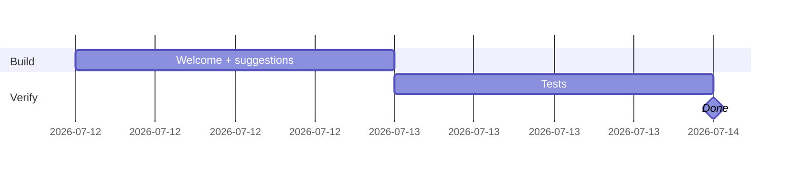

## CRM-AI-004 · Route welcome + suggestion chips for `/app/crm/*`

**In plain terms:** When operators open CRM screens, the chat dock greets them with CRM-specific context and one-click suggestion chips — same IPI-197 pattern as Brand/Shoots, not a blank "How can I help?"

**Blocked by:** IPI-363 (soft — need at least companies list route) · **Related:** IPI-368, IPI-371 · **Can parallel:** IPI-368 wave-1 CopilotKit

**Skills:** `copilotkit` · `frontend-design` · `linear`

**Labels:** CRM · COPILOTKIT · FRONTEND · AI

**Milestone:** CRM-M3 · crm-assistant Agent
**Spec:** `tasks/crm/02-crm-architecture-brief.md` §Operator chat UX · `tasks/crm/plans/copilotkit-plan.md` · `app/src/lib/intelligence/use-route-welcome.ts`

---

### Routes to implement

| Route | Welcome inputs | Suggestion examples |
|-------|----------------|---------------------|
| `/app/crm/companies` | `companyCount`, `openDealsCount` | Add company · At-risk deals · Open pipeline |
| `/app/crm/companies/[id]` | `companyName`, `dealStage`, `lastActivityDays` | Log note · Summarize · Open deal |
| `/app/crm/contacts` | `contactCount` | Add contact · Find decision-maker |
| `/app/crm/contacts/[id]` | `contactName`, `companyName` | Draft follow-up · Log call |
| `/app/crm/pipeline` | `pipelineValue`, `atRiskCount` | Filter at-risk · Review stale |
| `/app/crm/deals/[id]` | `dealName`, `stage`, `value` | Log activity · Next stage |

---

### Completion steps

#### A. Scope
- [ ] **A1** Add CRM branches to `use-route-welcome.ts` and `use-route-suggestions.ts` — proof: diff
- [ ] **A2** Extend `WelcomeContext` / `SuggestionsContext` with CRM fields — proof: types compile

#### B. Implement
- [ ] **B1** `operator-panel.tsx` passes CRM context when pathname starts with `/app/crm` — proof: code review
- [ ] **B2** Vitest cases for each CRM route (mirror existing IPI-197 tests) — proof: `use-route-welcome.test.ts` + `use-route-suggestions.test.ts` green

#### C. Integrate
- [ ] **C1** Welcome copy aligns with proactive teammate rule (names record, suggests next action) — proof: manual `/app/crm/companies`
- [ ] **C2** Works before IPI-369 IntelligencePanel sections (chat-only is enough) — proof: manual

#### D. Verify
- [ ] **D1** `cd app && npm run lint && npm test src/lib/intelligence/use-route-welcome.test.ts src/lib/intelligence/use-route-suggestions.test.ts` — proof: green

#### E. Ship
- [ ] **E1** Update `tasks/crm/todo.md` — proof: diff

---

### Gantt — IPI-372

