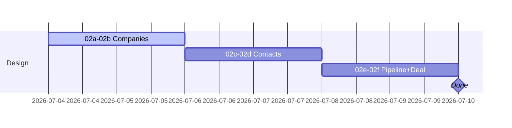

## CRM-DESIGN-001 · Claude Design screen prompts — completion (WIP)

**In plain terms:** Finish Claude Design output for all six MVP CRM screens so IPI-363–366 UI work has signed-off wireframes/specs before merge.

**Status:** 🟡 **In Progress** — Claude Design completing `tasks/crm/design/02a`–`02f` · master: `02-crm-design-master.md`

**Blocked by:** none · **Related:** IPI-363, IPI-364, IPI-365, IPI-366 · **Unblocks:** CRM screen UI PRs (not data-layer PRs)

**Skills:** `claude-design-handoff` · `frontend-design` · `ipix-wireframe` · `linear`

**Labels:** CRM · DESIGN

**Milestone:** CRM-M1 · Schema & Core Screens
**Spec:** `tasks/crm/design/README.md` · `tasks/crm/design/00-design-audit.md` · `tasks/crm/02-crm-architecture-brief.md` §Relationship Hub

**Linear view:** [CRM — Relationship Layer](https://linear.app/amo100/view/crm-dae13e68a9e1)

---

### Scope — screens in this pass

| Prompt | Screen | Route | UX issue |
|--------|--------|-------|----------|
| `02a` | Companies list | `/app/crm/companies` | IPI-363 |
| `02b` | Company detail | `/app/crm/companies/:id` | IPI-363 |
| `02c` | Contacts list | `/app/crm/contacts` | IPI-364 |
| `02d` | Contact detail | `/app/crm/contacts/:id` | IPI-364 |
| `02e` | Pipeline board | `/app/crm/pipeline` | IPI-365 |
| `02f` | Deal detail | `/app/crm/deals/:id` | IPI-366 |

**Out of scope:** Tasks hub, Communications, Calendar, Documents, Analytics, Relationship Graph — see `00-design-audit.md`.

---

### Completion steps

#### A. Design deliverables
- [ ] **A1** Each `02a`–`02f` prompt has Claude Design output (screenshot or HTML evidence path) — proof: `tasks/crm/design/evidence/` or linked in issue
- [ ] **A2** Master doc `02-crm-design-master.md` reflects final nav + 360° tab pattern — proof: diff
- [ ] **A3** No invented components (`PageHeader`, `FilterBar`, `StatusChip`) — shadcn `Badge`/`Select`/`Input` only — proof: audit grep

#### B. Handoff to engineering
- [ ] **B1** Each IPI-363–366 issue comment links matching design artifact — proof: Linear links
- [ ] **B2** Relationship Hub positioning consistent (Sales CRM module, not replacement product) — proof: brief §Relationship Hub

#### C. Ship
- [ ] **C1** Update `tasks/crm/todo.md` design row — proof: diff
- [ ] **C2** Mark IPI-373 Done when all six screens signed off — proof: Linear state

---

### Gantt — IPI-373

