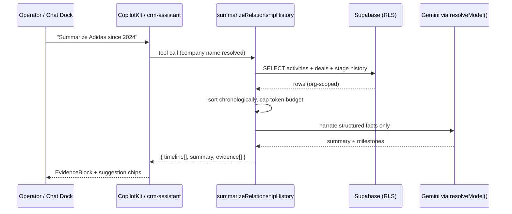
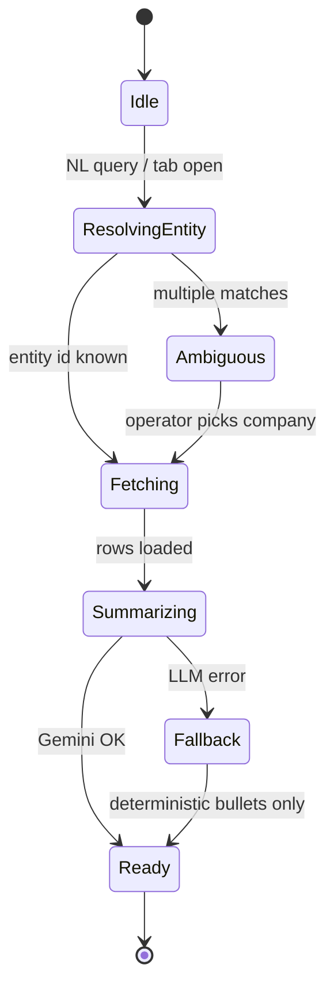
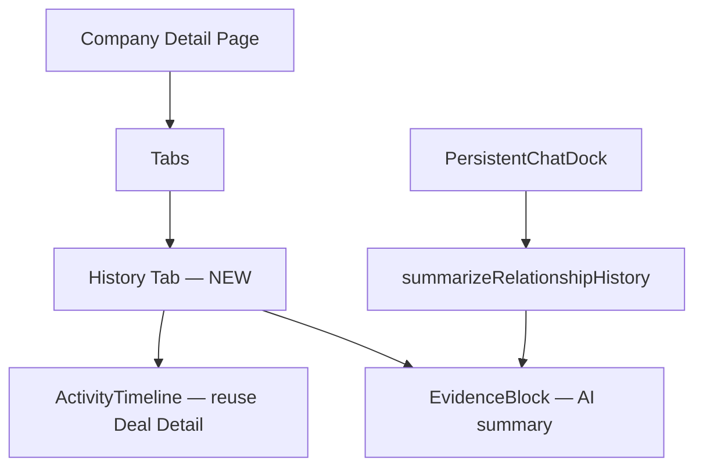
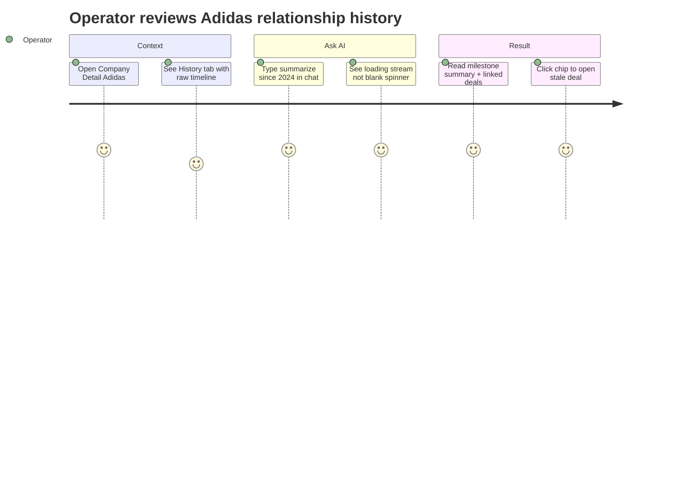

## CRM-POST-010 · AI Timeline & Memory (cross-entity history)

**In plain terms:** Creates a chronological history of every interaction — instantly understand customer history. Operator asks: *"Summarize everything we've done with Adidas since 2024."*

**Blocked by:** IPI-370 · IPI-366 (deal activity timeline MVP) · **Related:** IPI-369 · IPI-375 · CRM-MCP-001

**Skills:** `mastra` · `gemini` · `copilotkit` · `ipix-supabase` · `mermaid-diagrams`

**Labels:** CRM · AI · SUPA · FRONTEND

**Milestone:** CRM-M5 · Post-MVP Hub
**Spec:** `tasks/crm/07-relationship-hub-ai-roadmap.md` · `tasks/crm/05-crm-prd.md` §5.3

---

## Design Reference

**Primary:** `app/design/CRM/02f-crm-deal-detail.md` · Activities tab (chronological feed)
**Related:** `Universal design prompt/Command Center.v2.image-first.dc.html` · activity strip
**Component:** `EvidenceBlock` + existing IntelligencePanel activity section (`panel-contract.ts`)

---

## Dependencies

**Required:**
- IPI-366 ✅ pattern — `crm_activities` unified timeline on Deal Detail
- IPI-369 — `summarizeRelationship` (Gemini narrates fetched rows)
- IPI-370 — CRM MVP verification gate

**Optional (enhances):**
- CRM-MCP-001 — Chatwoot/email threads merged into timeline
- IPI-376 — graph navigation from timeline entities

**Setup:** No new tables in V1 — extend queries across `crm_activities` + linked `crm_deals`/`crm_contacts`/`crm_companies`; optional `since` filter param

---

## Scope

**MVP slice (already planned):** Single-entity timeline on Deal/Company/Contact detail + `summarizeRelationship` for current record.

**This issue (Post-MVP):**
- Mastra tool `summarizeRelationshipHistory({ companyId?, contactId?, brandId?, since?: ISO date, until?: ISO date })` — fetches **all** org-visible activities + deal stage changes + won/lost events across linked entities; deterministic sort; Gemini produces narrative + bullet timeline
- UI: "History" tab on Company Detail + global search chip in chat dock — temporal queries via natural language routed to tool
- Export: read-only markdown block in `EvidenceBlock` — no writes

**Not in V1:** Cross-platform memory (Linear, email bodies full-text), vector recall of old notes, auto-ingest from MCP without CRM-MCP-001

---

## Sequence Diagram



---

## State Diagram



---

## Component Tree



---

## User Journey



---

## Wireframes

```
Desktop (1440px) — Company Detail · History tab
┌──────────────────────────────────────────────────────────────────┐
│ Breadcrumb · Adidas AG · Company Detail                          │
├──────────┬───────────────────────────────────────┬───────────────┤
│ Nav      │ [Overview][Contacts][Deals][History*] │ Intelligence  │
│ 240px    │ ┌─ AI Summary (EvidenceBlock) ──────┐ │ Panel 320px   │
│          │ │ Since 2024: 12 activities, 2 deals│ │ Next action   │
│          │ └───────────────────────────────────┘ │               │
│          │ 2026-03 · Call logged · Spring deal   │               │
│          │ 2025-11 · Stage → proposal            │               │
│          │ 2024-06 · Company created             │               │
└──────────┴───────────────────────────────────────┴───────────────┘

Mobile (375px)
┌─────────────────┐
│ Adidas · History│
├─────────────────┤
│ AI Summary card │
│ (collapsible)   │
├─────────────────┤
│ Timeline list   │
│ (full width)    │
└─────────────────┘
```

---

## API Wiring

| Route / Tool | Status | Auth | Returns | RLS |
|---|---|---|---|---|
| `summarizeRelationshipHistory` Mastra tool | 🔴 create | server-only via agent | `{ summary, events[], evidence[] }` | ✅ org via user JWT in tool context |
| GET `/api/crm/companies/[id]/activities` | 🟡 extend | `withOperatorAuth` | paginated activities + deal events | ✅ existing policies |
| CopilotKit `/api/copilotkit` | 🟢 exists | session | tool invocation | ✅ |

**Auth pattern (if new route):**

```typescript
export async function GET(request: Request, { params }: { params: { id: string } }) {
  try {
    await withOperatorAuth(request);
  } catch (e) {
    if (e instanceof OperatorAuthError) {
      return NextResponse.json({ error: "Unauthorized" }, { status: 401 });
    }
    throw e;
  }
  const svc = await createSupabaseServerClient();
  // since/until query params; RLS on crm_activities
}
```

---

## User Stories

### Story 1: Operator reviews full relationship history
**As an** Operator  
**I want** a chronological feed of every CRM touchpoint for a company  
**So that** I never ask a colleague "what happened with this client?"

**Acceptance:** History tab shows ≥ all `crm_activities` + stage changes for linked deals, newest first.

### Story 2: Operator asks temporal summary in chat
**As an** Operator  
**I want** to ask "summarize everything since 2024" in natural language  
**So that** I get a narrative without scrolling 50 timeline rows.

**Acceptance:** Tool returns summary grounded in fetched rows; no invented meetings; `since` filter honored in test fixture.

### Story 3: Operator handles ambiguous company name
**As an** Operator  
**I want** the agent to clarify when two companies match "Adidas"  
**So that** summaries never mix orgs or duplicate records.

**Acceptance:** Ambiguous query returns disambiguation chips before summary; RLS test proves cross-org isolation.

---

## Acceptance

- [ ] **A1** `summarizeRelationshipHistory` unit test — fixture with 10 events, `since` filter — proof: vitest, no LLM in fetch/sort path
- [ ] **A2** History tab on Company Detail reuses timeline component from IPI-366 — proof: screenshot/storybook
- [ ] **A3** Chat query "since 2024" invokes tool; EvidenceBlock cites activity ids — proof: manual + test mock
- [ ] **A4** Cross-org RLS — proof: second org sees empty for same company name
- [ ] **A5** `cd app && npm run lint && npm run typecheck && npm test` green

### Verify

```bash
cd app && npm run lint && npm run typecheck && npm test
infisical run -- npm run supabase:verify-rls
```
