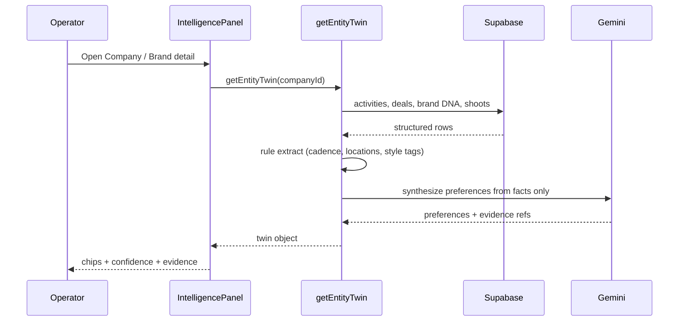
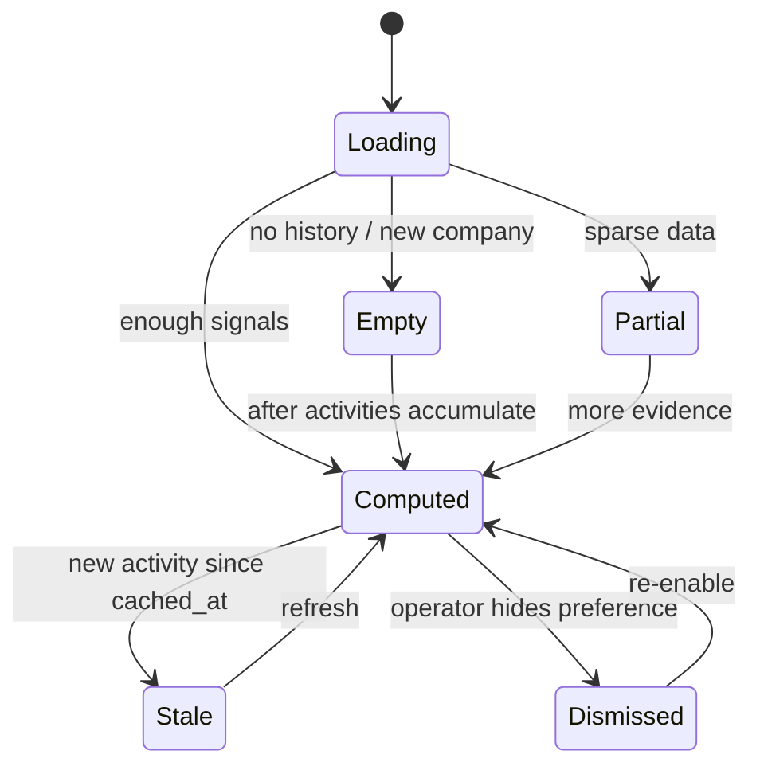
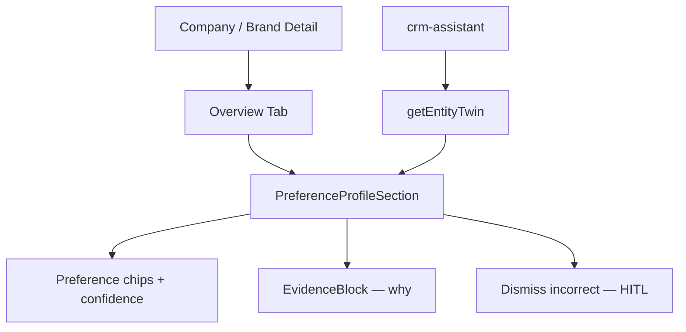
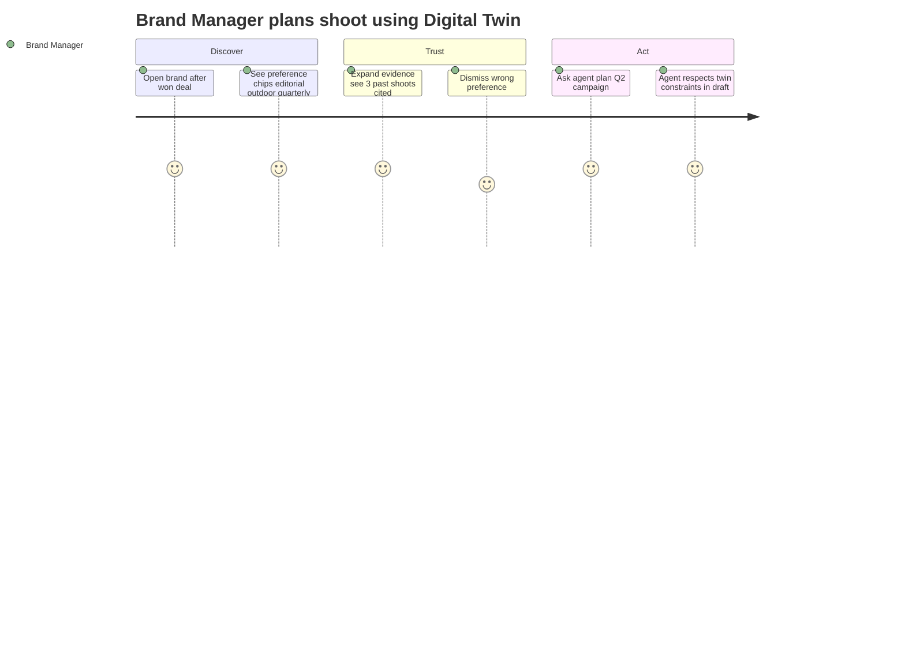

## CRM-ADV-007 · AI Digital Twin (entity preference profiles)

**In plain terms:** Maintains a continuously updated profile for every brand, person, and organization — personalized recommendations and planning. Example: *"This brand prefers editorial shoots, outdoor locations, and quarterly campaigns."*

**Blocked by:** IPI-370 · IPI-367 (won → brand conversion) · **Related:** IPI-19 (Brand DNA) · IPI-376 · CRM-ADV-003

**Skills:** `mastra` · `gemini` · `ipix-supabase` · `frontend-design` · `mermaid-diagrams`

**Labels:** CRM · AI · BRAND · DESIGN

**Milestone:** CRM-M6 · Advanced Hub
**Spec:** `tasks/crm/07-relationship-hub-ai-roadmap.md` · `tasks/crm/05-crm-prd.md` §5.5

---

## Design Reference

**Primary:** `Universal design prompt/Brand Detail.v2.image-first.dc.html` · brand profile + DNA sections
**CRM:** `app/design/CRM/02b-crm-company-detail.md` · Overview tab preference chips
**Component:** `EvidenceBlock` with confidence badge (`recommendation` pattern from `design-plan.md`)

---

## Dependencies

**Required:**
- IPI-370 — CRM MVP stable
- Brand record exists post-conversion (IPI-367) or company profile for prospects
- Structured facts source: `crm_activities`, deal history, Brand DNA fields (when present)

**Optional:**
- IPI-376 — graph edges enrich "prefers agency X"
- CRM-POST-010 — timeline feeds preference extraction

**Setup:**
- V1: JSONB `preference_profile` on `crm_companies` + `brands.metadata.twin` (migration) OR derive-on-read without persist (document choice in PR)
- Eval harness stub — no ML training in V1; rules + LLM synthesis from evidence only

---

## Scope

**Not a separate chatbot** — structured profile object consumed by `crm-assistant`, `production-planner`, and IntelligencePanel.

- Mastra tool `getEntityTwin({ entityType, entityId })` → `{ preferences[], constraints[], cadence?, confidence, evidence[] }`
- Background job (optional V1.1): recompute twin on new activity / DNA audit — Post-MVP cron, not blocking AC
- UI: "Preferences" section on Company Detail + Brand Hub — read-only chips + "why" expander (`EvidenceBlock`)
- **Consent:** org-scoped only; no PII export; human can dismiss incorrect preference (soft-delete flag)

**Not in V1:** Full autonomous planning, synthetic persona chat, cross-tenant learning, replacing Brand DNA audit

---

## Sequence Diagram



---

## State Diagram



---

## Component Tree



---

## User Journey



---

## Wireframes

```
Desktop — Company Detail · Preferences (Digital Twin)
┌─────────────────────────────────────────────────────────────┐
│ Adidas AG · Overview                                        │
├─────────────────────────────────────────────────────────────┤
│ Preference profile (AI)          Confidence: 82%            │
│ ┌────────────┐ ┌────────────┐ ┌──────────────┐              │
│ │ Editorial  │ │ Outdoor loc│ │ Quarterly    │              │
│ │ shoots     │ │ preferred  │ │ campaigns    │              │
│ └────────────┘ └────────────┘ └──────────────┘              │
│ Evidence ▾ — 3 shoots, 2 deal notes (2024–2026)           │
├─────────────────────────────────────────────────────────────┤
│ [Dismiss incorrect]  [Refresh from latest activity]         │
└─────────────────────────────────────────────────────────────┘
```

---

## API Wiring

| Route / Tool | Status | Auth | Returns | RLS |
|---|---|---|---|---|
| `getEntityTwin` Mastra tool | 🔴 create | server agent | `{ preferences[], evidence[], confidence }` | ✅ |
| Migration `preference_profile jsonb` | 🔴 optional | — | column on `crm_companies` / brands metadata | ✅ org policies |
| GET `/api/crm/companies/[id]/twin` | 🔴 optional | `withOperatorAuth` | cached twin | ✅ |

---

## User Stories

### Story 1: Operator sees preference summary at a glance
**As a** Brand Manager  
**I want** preference chips on the company/brand profile  
**So that** I plan shoots without re-reading two years of notes.

**Acceptance:** ≥3 preference chips when ≥5 activities exist; each chip links to evidence ids.

### Story 2: Operator corrects a wrong inference
**As an** Operator  
**I want** to dismiss an incorrect preference  
**So that** future recommendations don't repeat the mistake.

**Acceptance:** Dismiss persists; twin regen excludes dismissed key; audit log entry.

### Story 3: Agent uses twin in planning conversation
**As a** Creative Director  
**I want** the copilot to cite twin preferences when suggesting campaign timing  
**So that** recommendations feel personalized not generic.

**Acceptance:** `crm-assistant` tool call includes twin; response mentions cited preference with evidence.

---

## Acceptance

- [ ] **A1** `getEntityTwin` unit test — golden company fixture — proof: vitest, deterministic rules layer
- [ ] **A2** UI renders preferences + confidence + evidence expander — proof: screenshot
- [ ] **A3** Dismiss preference persists and excludes from next tool response — proof: integration test
- [ ] **A4** No twin data leaks across orgs — proof: RLS test
- [ ] **A5** Migration reviewed + `infisical run -- npm run supabase:verify-rls` if schema change
- [ ] **A6** `cd app && npm run lint && npm run typecheck && npm test` green

### Verify

```bash
cd app && npm run lint && npm run typecheck && npm test
infisical run -- npm run supabase:verify-rls
```
