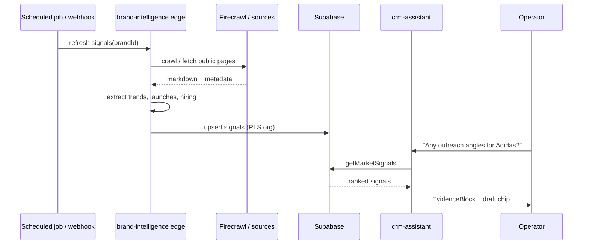
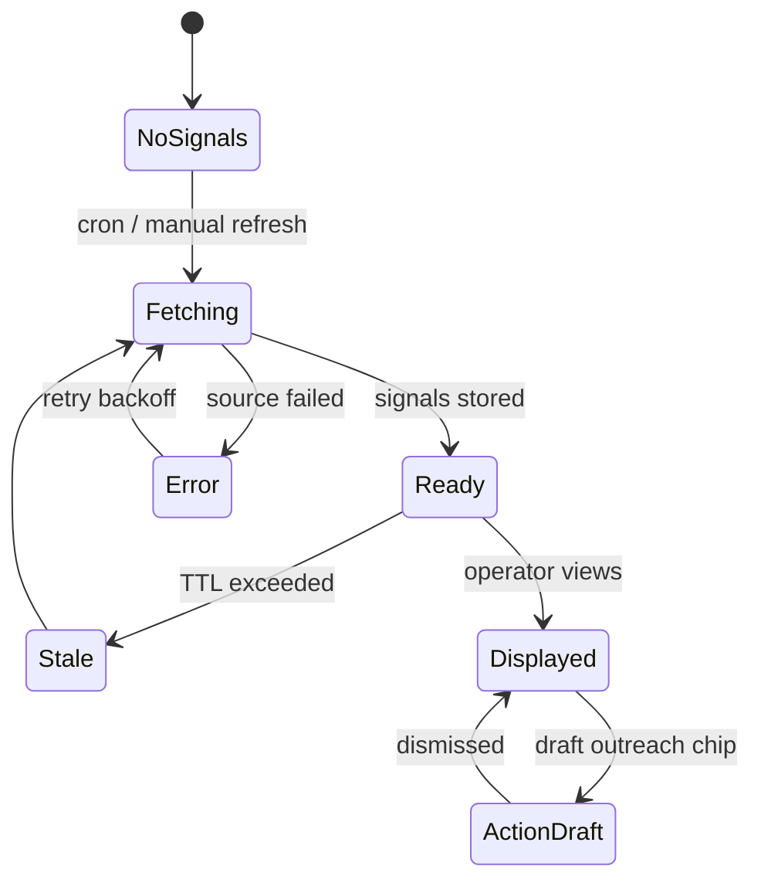
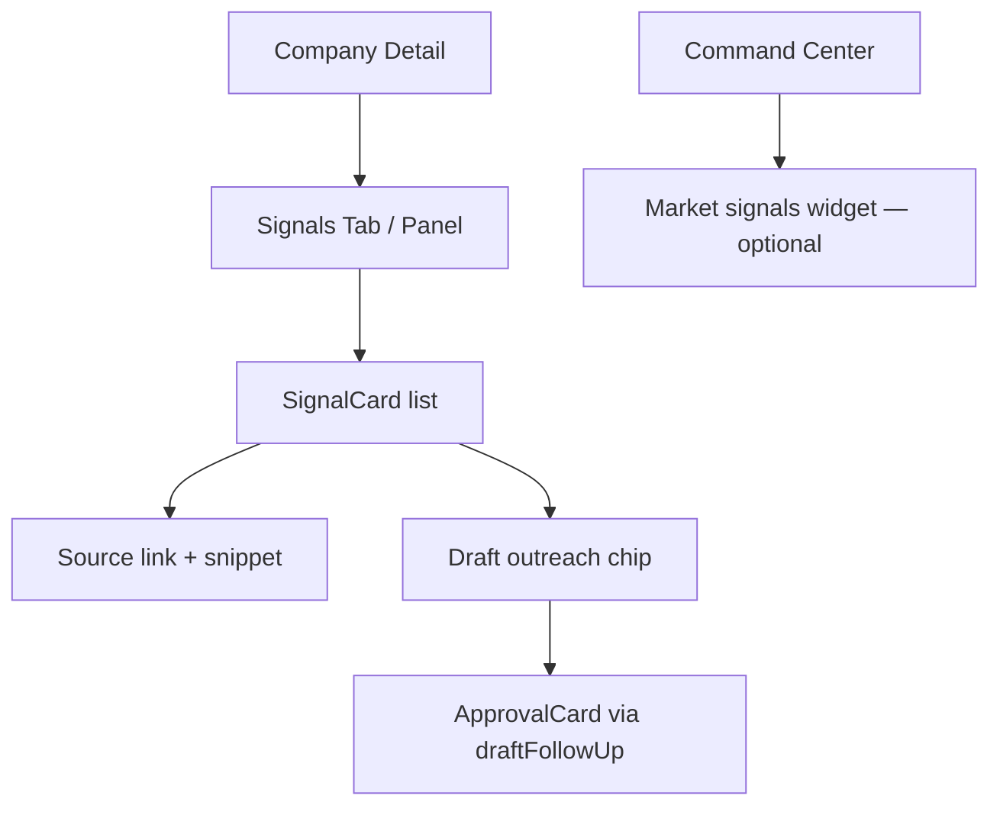
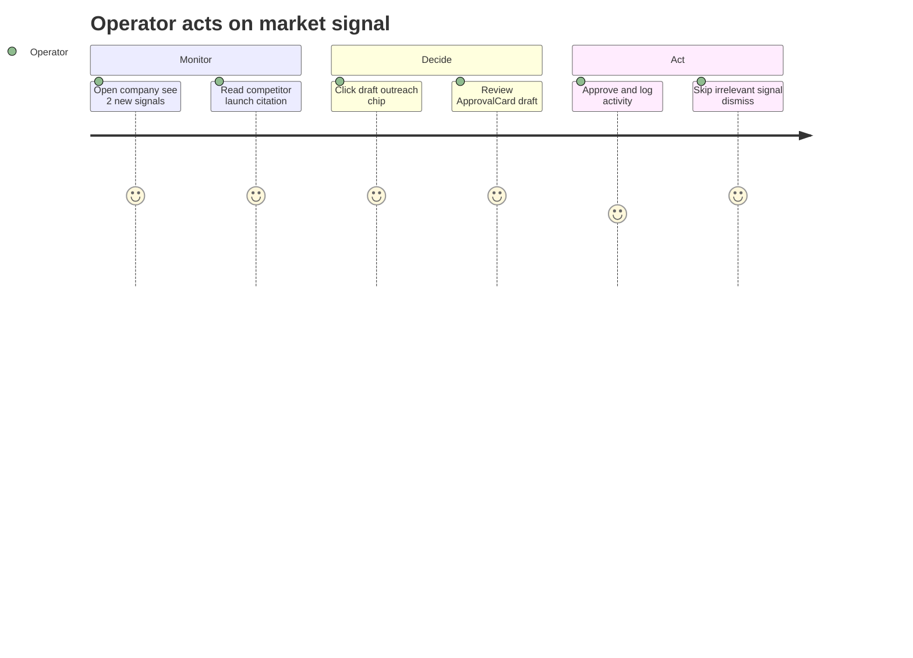

## CRM-POST-011 · Market & Trend Intelligence (outreach signals)

**In plain terms:** Monitors competitors, fashion trends, hiring, launches, and news to recommend outreach — surfaces *why now* for a relationship touch.

**Blocked by:** IPI-370 · **Related:** IPI-130 · CRM-POST-004 · `brand-intelligence` edge · `social-discovery`

**Skills:** `mastra` · `gemini` · `firecrawl` · `ipix-supabase` · `mermaid-diagrams`

**Labels:** CRM · AI · BRAND · EDGE

**Milestone:** CRM-M5 · Post-MVP Hub
**Spec:** `tasks/crm/07-relationship-hub-ai-roadmap.md` · `tasks/crm/05-crm-prd.md` §5.3

---

## Design Reference

**Primary:** `Universal design prompt/Command Center.v2.image-first.dc.html` · signals / alerts strip
**Related:** Brand Intelligence panels · `EvidenceBlock` for external source citations
**No duplicate crawl stack** — reuse `brand-intelligence` + Firecrawl webhook patterns

---

## Dependencies

**Required:**
- IPI-370 — CRM MVP gate
- Existing `brand-intelligence` edge fn + crawl pipeline (IPI-130 area)
- Company/brand linkage (`crm_companies` ↔ `brands` when converted)

**Optional:**
- CRM-POST-004 — scheduled enrichment jobs (same cron infrastructure)
- IPI-378 — rank outreach in daily NBA queue

**Setup:**
- Store signals in `crm_signals` or extend `brand_intelligence_snapshots` — migration in dedicated PR
- Edge cron or webhook-triggered refresh — no client-side Firecrawl keys

---

## Scope

- Ingest **read-only** external signals per company/brand: competitor moves, trend tags, hiring posts, product launches, news mentions (sources: existing crawl + optional RSS/News API behind edge)
- Mastra tool `getMarketSignals({ companyId?, brandId?, horizonDays?: number })` → ranked signals with `{ title, source, url, relevanceScore, suggestedOutreach?, evidence }`
- UI: "Signals" panel on Company Detail + optional Command Center widget; suggestion chip *"Draft outreach re: [signal]"* → `draftFollowUp` (IPI-369) — **never auto-send**
- CRM agent narrates: *"Competitor X launched sustainable line — good moment to pitch your SS27 lookbook"*

**Not in V1:** Autonomous outreach, paid news APIs without budget approval, scraping behind login walls, n8n orchestration (per roadmap — edge-first)

---

## Sequence Diagram



---

## State Diagram



---

## Component Tree



---

## User Journey



---

## Wireframes

```
Desktop — Company Detail · Signals
┌────────────────────────────────────────────────────────────┐
│ Adidas AG · Signals                    Last refreshed 2h   │
├────────────────────────────────────────────────────────────┤
│ 🔴 Competitor · Nike SS27 pre-launch (Vogue, link)  Score 91│
│    Suggested: reference your outdoor editorial track record │
│    [Draft outreach] [Dismiss]                               │
├────────────────────────────────────────────────────────────┤
│ 🟡 Trend · Quiet luxury momentum (WGSN summary)      Score 74│
│    [View evidence]                                          │
└────────────────────────────────────────────────────────────┘

Command Center widget (optional)
┌─ Market pulse ─────────────────────┐
│ 3 companies with fresh signals     │
│ [Review Adidas] [Review Acme]      │
└────────────────────────────────────┘
```

---

## API Wiring

| Route | Status | Auth | Returns | RLS |
|---|---|---|---|---|
| `getMarketSignals` Mastra tool | 🔴 create | server agent | `{ signals[], refreshedAt }` | ✅ |
| POST `/api/crm/companies/[id]/signals/refresh` | 🔴 create | `withOperatorAuth` | triggers edge job id | ✅ |
| `brand-intelligence` edge (extend) | 🟡 extend | service role internal | normalized signals | ✅ org_id on write |
| Migration `crm_signals` or snapshot extend | 🔴 create | — | signal rows | ✅ policies |

---

## User Stories

### Story 1: Operator sees timely outreach angles
**As an** Operator  
**I want** external news and trend signals on a company profile  
**So that** I reach out when context is hot not random.

**Acceptance:** ≥1 signal with source URL after refresh; relevance score visible; stale TTL shown.

### Story 2: Operator drafts outreach from a signal
**As an** Operator  
**I want** a one-click draft that references the signal  
**So that** I don't copy-paste headlines manually.

**Acceptance:** Draft chip invokes `draftFollowUp`; ApprovalCard required; activity logs signal id.

### Story 3: Operator dismisses irrelevant noise
**As an** Operator  
**I want** to dismiss bad signals  
**So that** the feed stays trustworthy.

**Acceptance:** Dismiss hides signal for org; does not affect other companies; refresh can surface new items only.

---

## Acceptance

- [ ] **A1** Signal ingest unit test — fixture HTML → structured signal — proof: edge or tool test
- [ ] **A2** `getMarketSignals` returns ranked list with sources — proof: vitest
- [ ] **A3** UI Signals panel + draft chip → ApprovalCard path — proof: manual / Playwright
- [ ] **A4** RLS + no secrets in client bundle — proof: grep + cross-org test
- [ ] **A5** Reuses brand-intelligence / Firecrawl — proof: no second crawl stack in diff
- [ ] **A6** `infisical run -- npm run supabase:verify` + verify-rls if migration
- [ ] **A7** `cd app && npm run lint && npm run typecheck && npm test` green

### Verify

```bash
cd app && npm run lint && npm run typecheck && npm test
infisical run -- npm run supabase:verify
infisical run -- npm run supabase:verify-rls
infisical run -- npm run supabase:verify-brand-intelligence
```
