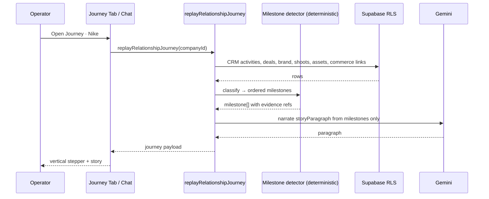
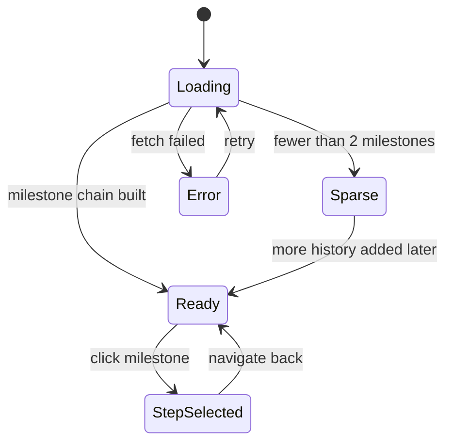
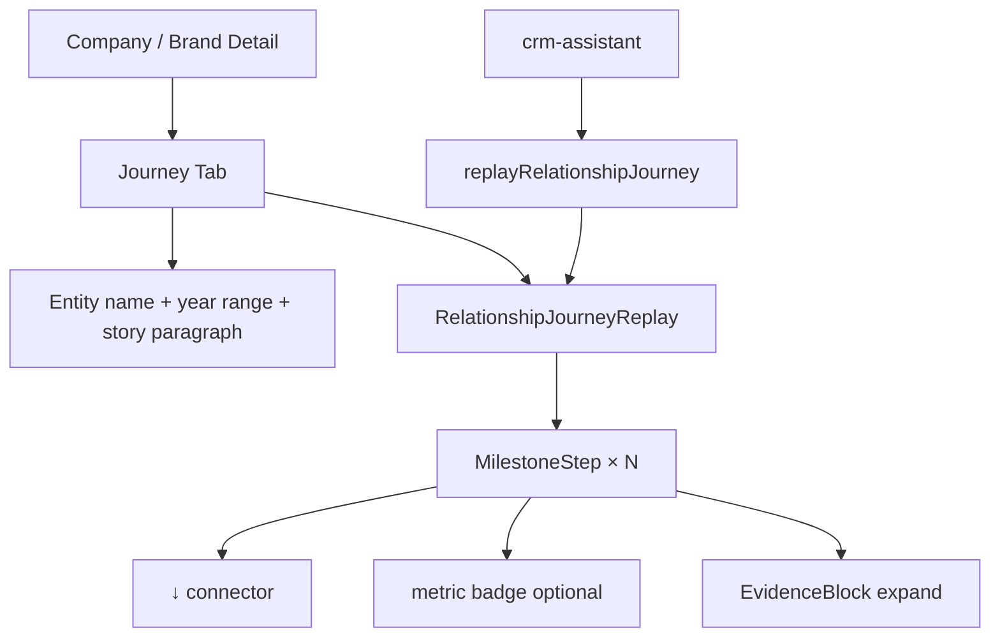
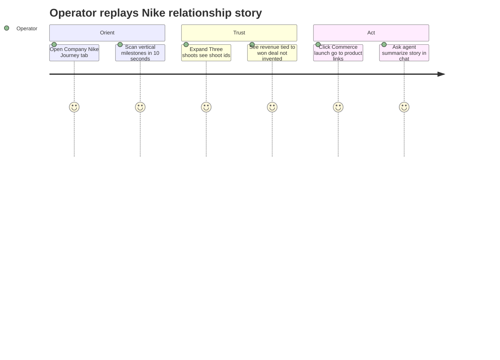

## CRM-POST-012 · Relationship Journey Replay (AI-generated story)

**In plain terms:** Every entity has an AI-generated **story** — a coherent milestone journey instead of dozens of raw records. Example for Nike:

```
2024
  ↓ First outreach
  ↓ Discovery meeting
  ↓ Brand audit
  ↓ Spring campaign
  ↓ Three shoots · Forty-two assets
  ↓ Commerce launch
  ↓ Fashion Week sponsorship
  ↓ Revenue +$240k
```

**Blocked by:** IPI-370 · **Related:** [IPI-379](https://linear.app/amo100/issue/IPI-379) (raw history) · IPI-367 · IPI-380 · IPI-376

**Skills:** `mastra` · `gemini` · `copilotkit` · `ipix-supabase` · `frontend-design` · `mermaid-diagrams`

**Labels:** CRM · AI · FRONTEND · DESIGN

**Milestone:** CRM-M5 · Post-MVP Hub
**Spec:** `tasks/crm/07-relationship-hub-ai-roadmap.md` · `tasks/crm/05-crm-prd.md` §5.3

---

## vs CRM-POST-010 (IPI-379)

| IPI-379 Timeline & Memory | **This issue — Journey Replay** |
|---|---|
| Chronological activity feed + "summarize since 2024" | **Curated story arc** with named milestone nodes |
| CRM-centric rows | **Cross-hub narrative:** CRM → Brand → Shoot → Asset → Commerce |
| EvidenceBlock prose | **Vertical journey UI** (stepper) + one-paragraph story |
| Operator reads bullets | Operator **scans the relationship movie poster** |

Both share fetch layer; Journey Replay adds milestone taxonomy + cross-entity linking + presentation component.

---

## Design Reference

**Primary:** `Universal design prompt/Brand Detail.v2.image-first.dc.html` · lifecycle / proof sections
**CRM:** `app/design/CRM/02b-crm-company-detail.md` · new **Journey** tab
**Pattern:** `recommendation` card + vertical stepper (`design-plan.md` · confidence/evidence on each step)
**Related:** `Command Center.v2.image-first.dc.html` · portfolio story strip (optional widget)

---

## Dependencies

**Required:**
- IPI-370 — CRM MVP verified
- IPI-379 or shared fetch helpers — activity + deal history (can ship same PR stack if coordinated)
- IPI-367 — won deal → brand conversion (brand milestones need `brands` link)
- Org-scoped FK graph: `crm_companies` ↔ `brands` ↔ shoots ↔ assets (existing platform tables)

**Optional (enhances milestones):**
- IPI-376 / IPI-377 — graph traversal for missing links
- Commerce aggregates — read-only Mercur product link / order summary when wired (no invented revenue)
- IPI-380 Digital Twin — "prefers editorial" as epilogue chip, not a milestone

**Setup:** Milestone detector runs server-side; revenue/outcome metrics **only** when sourced from linked commerce rows or operator-entered won deal value — never LLM-hallucinated dollars

---

## Scope

- Mastra tool `replayRelationshipJourney({ entityType: company|brand|contact, entityId, since?, until? })` →
  ```typescript
  {
    entityName: string
    storyParagraph: string      // Gemini — facts from milestones only
    milestones: Array<{
      id: string
      label: string              // e.g. "First outreach", "Three shoots"
      occurredAt: string | null
      category: crm|brand|production|commerce|outcome
      href?: string              // deep link to source record
      evidence: Array<{ type, id, label }>
      metric?: { label: string; value: string }  // e.g. assets: 42, revenue: +$240k
    }>
    confidence: number
  }
  ```
- **Deterministic milestone builder** (no LLM): map events → canonical steps (first activity, discovery deal stage, won/lost, brand created, shoot count, asset count, commerce link count, deal value sum)
- UI: **Journey** tab on Company Detail + Brand Hub — `RelationshipJourneyReplay` vertical stepper; click step → navigate; expand → `EvidenceBlock`
- Chat: *"Tell me Nike's story since 2024"* → tool + render in dock
- **Read-only** — no stage changes from journey view

**Not in V1:** Video export, public share links, auto-generated case-study PDF, fictional milestones, revenue without data source

---

## Sequence Diagram



---

## State Diagram



---

## Component Tree



---

## User Journey



---

## Wireframes

```
Desktop — Company Detail · Journey tab
┌─────────────────────────────────────────────────────────────────┐
│ Nike · Relationship Journey                    Since 2024         │
├─────────────────────────────────────────────────────────────────┤
│ "From first outreach in Q1 2024 through Fashion Week, Nike      │
│  became a full-stack partner — 3 shoots, 42 assets, commerce live."│
├─────────────────────────────────────────────────────────────────┤
│  2024                                                           │
│    ● First outreach          Mar 12   [CRM activity]              │
│    ↓                                                            │
│    ● Discovery meeting       Apr 03   [Meeting logged]          │
│    ↓                                                            │
│    ● Brand audit             May 18   [Brand Hub →]             │
│    ↓                                                            │
│    ● Spring campaign         Jun 01   [Campaign →]              │
│    ↓                                                            │
│    ● Three shoots            Jun–Aug  [3 shoots]                │
│    ↓                                                            │
│    ● Forty-two assets        —        [42 assets]                │
│    ↓                                                            │
│    ● Commerce launch         Sep 10   [Products →]              │
│    ↓                                                            │
│    ● Fashion Week sponsorship Oct 22  [Activity]                │
│    ↓                                                            │
│    ● Revenue +$240k          Won deal  [Deal →]  ⚠ sourced       │
└─────────────────────────────────────────────────────────────────┘

Mobile — collapsible steps, full-width ↓ connectors
```

---

## API Wiring

| Route / Tool | Status | Auth | Returns | RLS |
|---|---|---|---|---|
| `replayRelationshipJourney` Mastra tool | 🔴 create | server agent | journey payload (above) | ✅ |
| GET `/api/crm/companies/[id]/journey` | 🔴 optional | `withOperatorAuth` | cached journey JSON | ✅ |
| Cross-entity reads | 🟡 extend | server | brands, shoots, assets, commerce_product_links | ✅ existing policies |

**Revenue rule:** `outcome` milestone uses `crm_deals.value` on won deals and/or linked commerce metrics when present; omit step if no numeric source.

---

## User Stories

### Story 1: Operator grasps full relationship in one glance
**As an** Operator  
**I want** a vertical milestone story on a company or brand profile  
**So that** I onboard to an account without opening ten screens.

**Acceptance:** Journey tab shows ≥2 milestones when data exists; each step links to source record.

### Story 2: Operator trusts the narrative
**As a** Brand Manager  
**I want** every milestone backed by evidence ids  
**So that** the AI story never invents shoots or revenue.

**Acceptance:** Expand step shows evidence list; revenue step absent when no won deal value; unit test catches hallucination guard.

### Story 3: Operator shares context in chat
**As an** Operator  
**I want** to ask "what's Nike's story?" in the copilot  
**So that** I get the same journey in conversation before a exec call.

**Acceptance:** Tool invocation renders stepper or compact list in chat; matches Journey tab for same entity.

---

## Acceptance

- [ ] **A1** Milestone detector unit tests — fixture company with CRM + brand + shoots — proof: vitest, deterministic order
- [ ] **A2** No revenue milestone without numeric source — proof: test with/without won deal value
- [ ] **A3** `RelationshipJourneyReplay` UI on Company Detail (+ Brand when linked) — proof: screenshot/storybook
- [ ] **A4** Story paragraph cites only milestone labels present in payload — proof: schema validation test
- [ ] **A5** RLS cross-org isolation — proof: second org empty journey
- [ ] **A6** `cd app && npm run lint && npm run typecheck && npm test` green

### Verify

```bash
cd app && npm run lint && npm run typecheck && npm test
infisical run -- npm run supabase:verify-rls
```
