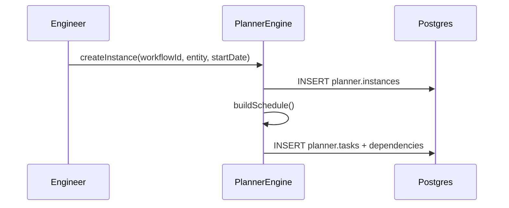

# IPI-476 · PLN-001 — Planner schema & reusable engine core

**Role:** You are implementing this as an iPix engineer. One concern per PR.

**Linear:** https://linear.app/amo100/issue/IPI-476
**Track:** Platform
**Blocked by:** — · **Unblocks:** IPI-477, IPI-478, IPI-479, IPI-480, IPI-481, IPI-482, IPI-483
**Skills:** ipix-task-lifecycle · ipix-supabase · worktrees · pr-workflow
**MVP proof:** #1

---

## The problem this solves

- Today, shoot scheduling in iPix is limited to `start_date`, `end_date`, and `location` on `shoot.shoots`. Campaigns and CRM deals have no shared timeline model.
- Every new workflow (campaign, deal, model booking) risks being built as a one-off planner, duplicating logic and fragmenting the UX.
- There is no place to store tasks, dependencies, assignments, gates, or view preferences in a way that works across product surfaces.

**Fix:** Introduce a single `planner` schema and TypeScript engine that can model any time-bound, multi-stakeholder workflow.

---

## User story

> As an iPix engineer, when I need to add a timeline to a new entity type,
> I can reuse the planner engine and schema,
> so I can ship consistent scheduling UX without forking code.

---

## Flow



---

## Acceptance criteria

- **A — Reusable schema:** New `planner` schema contains `workflows`, `phases`, `gate_conditions`, `instances`, `tasks`, `dependencies`, `assignments`, `events`, `notification_rules`, and `view_configs`.
- **B — Polymorphic linking:** `planner.instances` links to `shoots`, `campaigns`, or `crm_deals` via `entity_type` + `entity_id`. Entity types restricted via CHECK constraint: `entity_type IN ('shoot', 'campaign', 'crm_deal')`. Unique constraint on `(org_id, entity_type, entity_id, workflow_id)` prevents duplicate instances for the same entity/workflow.
- **C — RLS with defined roles:** Four-tier permission model:
  | Role | Read | Update tasks | Manage workflow |
  |---|---|---|---|
  | owner | ✅ | ✅ | ✅ |
  | manager | ✅ | ✅ | ✅ |
  | contributor | ✅ | assigned only | ❌ |
  | viewer | ✅ | ❌ | ❌ |
- **D — Status enums:**
  - Instance statuses: `draft`, `planned`, `active`, `blocked`, `completed`, `archived`, `cancelled`
  - Task statuses: `todo`, `in_progress`, `blocked`, `done`, `cancelled`
  - Dependency types: `finish_to_start`, `start_to_start`, `finish_to_finish`, `start_to_finish`
- **E — Engine package:** `app/src/lib/planner/engine.ts` exposes `createInstance`, `buildSchedule`, `shiftTask`, `resolveDependencies`, `checkGate`, and `getEffectivePermissions`. Engine is pure TypeScript — schedule calculation and permission resolution only, no DB writes. Cycle detection: `resolveDependencies` rejects circular dependencies (A → B → A).
- **F — Default workflow:** Seed a default workflow template with deterministic IDs so seed is idempotent.
- **G — Realtime ready:** `planner.instances`, `planner.tasks`, `planner.events`, and `planner.assignments` are published to Supabase Realtime with RLS respected.

---

## Technical notes

**Files to touch:**
- `supabase/migrations/20260708_planner_schema_rls.sql` — new schema, tables, indexes, RLS policies, Realtime publication.
- `app/src/lib/planner/engine.ts` — core engine class and schedule calculation.
- `app/src/lib/planner/types.ts` — shared TypeScript types.
- `supabase/seed-planner-workflows.sql` — default workflow skeleton.
- `scripts/verify-rls.mjs` — extend probes for planner tables.

**Do NOT:** Put service-role keys in the browser bundle or write planner tables directly from the client.

**Known data / constraints:** Business-day calculation excludes weekends; `org_id` is the tenancy boundary; phase order is `order_index`.

---

## Out of scope

- Cloudflare Durable Objects / Queue (IPI-480 / IPI-481)
- UI views beyond engine tests (IPI-478)
- AI schedule generation (IPI-482)
- Dependency auto-shift / gate enforcement (IPI-483)

---

## Indexes

```sql
planner_instances(org_id, entity_type, entity_id)
planner_tasks(instance_id, status)
planner_tasks(assignee_user_id, status)
planner_events(instance_id, created_at DESC)
planner_dependencies(from_task_id)
planner_dependencies(to_task_id)
```

## Wiring plan — two-PR split

**PR 1 — Schema + RLS + seed:**
| Action | Path | Notes |
|--------|------|-------|
| Create | `supabase/migrations/20260708_planner_schema_rls.sql` | Schema, enums, tables, CHECK constraints, indexes, RLS policies, Realtime publication |
| Create | `supabase/seed-planner-workflows.sql` | Default workflow, deterministic IDs |
| Modify | `scripts/verify-rls.mjs` | Add planner RLS probes |

**PR 2 — Engine + tests:**
| Action | Path | Notes |
|--------|------|-------|
| Create | `app/src/lib/planner/engine.ts` | Pure schedule calc, cycle detection, permission resolution |
| Create | `app/src/lib/planner/types.ts` | Shared types, enums, interfaces |

---

## Verify

### Per-task (Phase 3)
| Task | Test command | Proof |
|------|--------------|-------|
| 1 — Schema migration | `npm run supabase:push` (linked remote) | Migration applied |
| 2 — RLS verify | `npm run supabase:verify-rls` | All probes pass |
| 3 — Engine unit | `cd app && npx vitest run src/lib/planner/engine.test.ts` | ≥90% coverage, incl cycle detection + constraint validation |
| 4 — RLS test matrix | `scripts/test-rls-planner.mjs` | All four role levels (owner/manager/contributor/viewer) return expected results |

### Aggregate (Phase 4)
- [ ] `cd app && npm run lint && npm run typecheck && npm test`
- [ ] `npm run supabase:verify-rls`
- [ ] Browser smoke: `/app/shoots/[id]/schedule` loads without errors
- [ ] `tasks/plan/todo.md` row → green · Linear → Done
