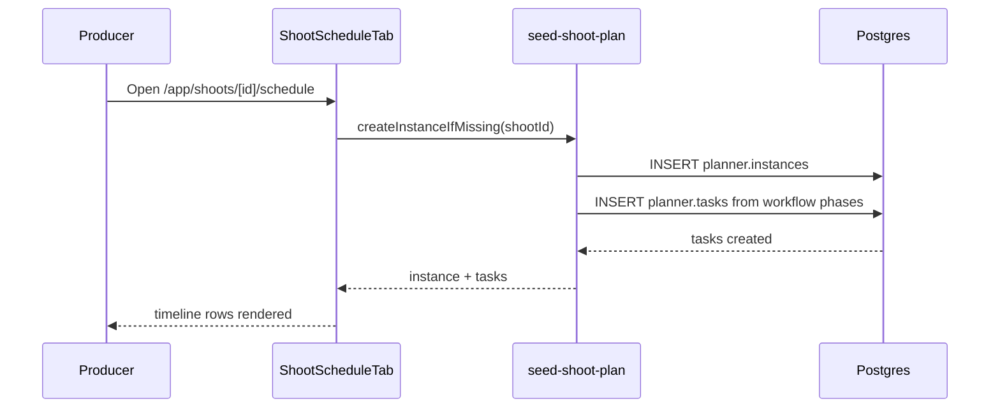

# IPI-477 · PLN-002 — Shoot production timeline template

**Role:** You are implementing this as an iPix engineer. One concern per PR.

**Linear:** https://linear.app/amo100/issue/IPI-477
**Track:** Platform
**Blocked by:** IPI-476 · **Unblocks:** IPI-478, IPI-482
**Skills:** ipix-task-lifecycle · ipix-supabase · fashion-production · worktrees · pr-workflow
**MVP proof:** #1

---

## The problem this solves

- iPix has no structured representation of the 5-week product/model shoot lifecycle shown in the SquareShot reference.
- Producers manually maintain start/end dates and external spreadsheets to track casting, item delivery, outfit confirmation, retouching, and product return.
- Without a template, every shoot is recreated from scratch and handoffs between roles are error-prone.

**Fix:** Ship a reusable "5-Week Product Shoot" workflow template that generates the full phase/task timeline when a shoot is created or explicitly scheduled.

---

## User story

> As a producer, when I create or open a shoot,
> I see a pre-built 5-week production timeline matching the SquareShot pattern,
> so I can coordinate casting, delivery, production, retouching, and return without starting from a blank sheet.

---

## Flow

---

## Acceptance criteria

- **A — Workflow template:** A `planner.workflows` row exists named "5-Week Product Shoot" with phases: Brief confirmation, Casting, Soft hold on shoot date, Item delivery, Outfit confirmation, Payment & Scheduling, Awaiting shoot, Production, Retouching, Final approval, Product return.
- **B — Default durations:** Each phase has a default duration in business days matching the SquareShot spacing (Brief 3d, Casting 4d, Soft hold 2d, Item delivery 4d, Outfit confirmation 3d, Payment & Scheduling 3d, Awaiting shoot 3d, Production 4d, Retouching 3d, Final approval 2d, Product return 2d).
- **C — Shoot binding:** Opening `/app/shoots/[id]/schedule` ensures a `planner.instances` row exists linked to that shoot and generates the task set from the template.
- **D — Idempotent:** Re-opening the schedule tab does not duplicate tasks if the instance already exists.
- **E — Data seed:** Existing shoots without instances can be backfilled via a one-off script or edge function.

---

## Technical notes

**Files to touch:**
- `supabase/seed-planner-workflows.sql` — append the "5-Week Product Shoot" workflow + phases.
- `supabase/functions/seed-shoot-plan/index.ts` — edge function that creates instance + tasks from template for a given shoot.
- `app/src/lib/planner/templates/shoot-5-week.ts` — typed template definition used by engine and seed.
- `app/src/app/(operator)/app/shoots/[id]/schedule/page.tsx` — call seed function on mount.

**Do NOT:** Hard-code phase names in the UI; read them from `planner.phases`.

**Known data / constraints:** The SquareShot screenshot stages are the visual SSOT. Phases map 1:1 to timeline rows; actual dates shift per shoot `planned_start`.

---

## Out of scope

- Drag-to-resize / edit UI (IPI-478)
- Dependencies and auto-shift (IPI-483)
- AI schedule generation (IPI-482)
- Real-time sync (IPI-480)

---

## Wiring plan

| Action | Path | Notes |
|--------|------|-------|
| Create | `supabase/functions/seed-shoot-plan/index.ts` | Instance + tasks from template |
| Create | `app/src/lib/planner/templates/shoot-5-week.ts` | Typed template |
| Modify | `supabase/seed-planner-workflows.sql` | Seed workflow + phases |
| Modify | `app/src/app/(operator)/app/shoots/[id]/schedule/page.tsx` | Trigger seed on open |

---

## Verify

### Per-task (Phase 3)
| Task | Test command | Proof |
|------|--------------|-------|
| 1 — Template seed | `npm run supabase:push` + seed script | Workflow + phases in DB |
| 2 — Seed function | `npx supabase functions invoke seed-shoot-plan --linked` | Instance + 11 tasks created |
| 3 — Idempotency | Invoke twice for same shoot | No duplicate tasks |

### Aggregate (Phase 4)
- [ ] `cd app && npm run lint && npm run typecheck && npm test`
- [ ] `npm run supabase:verify-rls`
- [ ] Browser smoke: `/app/shoots/[id]/schedule` shows 11 timeline rows
- [ ] `tasks/plan/todo.md` row → green · Linear → Done
