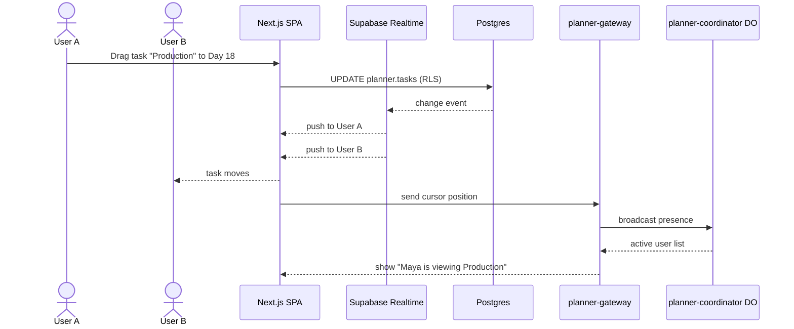

# IPI-480 · PLN-005 — Real-time sync via Supabase + Cloudflare Durable Objects

**Role:** You are implementing this as an iPix engineer. One concern per PR.

**Linear:** https://linear.app/amo100/issue/IPI-480
**Track:** Platform
**Blocked by:** IPI-476, IPI-478 · **Unblocks:** IPI-481
**Skills:** ipix-task-lifecycle · cloudflare · ipix-supabase · worktrees · pr-workflow
**MVP proof:** #1

---

## The problem this solves

- Multiple users viewing the same production plan see stale data until they refresh.
- Dragging a task in one browser can silently overwrite changes made by another user.
- There is no indication of who else is viewing or editing the plan.

**Fix:** Combine Supabase Realtime for database change streaming with a Cloudflare Durable Object per planner instance for ephemeral presence, cursor positions, and lock hints.

---

## User story

> As a producer, when my teammate moves a task on the timeline,
> I see the update within one second and know who is active in the plan,
> so we can collaborate without stepping on each other.

---

## Flow

---

## Acceptance criteria

- **A — Realtime DB:** Client subscribes to channel `planner:<instance_id>` and receives updates when `planner.tasks`, `planner.events`, or `planner.assignments` change.
- **B — Presence:** Cloudflare Durable Object tracks active users per instance and broadcasts a presence list including name, role, and currently viewed task.
- **C — Cursor sync:** Cursor positions are broadcast via the Durable Object with throttling (e.g., 50ms) and do not hit Postgres.
- **D — Conflict awareness:** When a task is being edited by another user, the UI shows a subtle "Maya is editing" indicator and disables conflicting drag operations.
- **E — Auth:** Cloudflare Worker validates the Supabase JWT before allowing WebSocket upgrade.

---

## Technical notes

**Files to touch:**
- `cloudflare/planner-gateway/src/index.ts` — Worker entry; validates JWT and routes WebSocket to DO.
- `cloudflare/planner-coordinator/src/index.ts` — Durable Object class; presence + cursor broadcast.
- `app/src/hooks/use-planner-realtime.ts` — Supabase Realtime subscription.
- `app/src/hooks/use-planner-presence.ts` — WebSocket client for DO presence/cursors.
- `app/src/components/planner/PresenceBar.tsx` — active users indicator.
- `wrangler.toml` / `wrangler.jsonc` — add DO binding and route.

**Do NOT:** Store cursor positions or presence state in Postgres; keep them ephemeral in the Durable Object.

**Known data / constraints:** Channel name format `planner:<instance_id>`; DO namespace `PLANNER_COORDINATOR`; JWT validation uses `SUPABASE_JWT_SECRET` secret in Cloudflare.

---

## Out of scope

- Notification delivery (IPI-481)
- AI planning (IPI-482)
- Workflow dependencies / auto-shift (IPI-483)
- Edit locking with conflict resolution (future)

---

## Wiring plan

| Action | Path | Notes |
|--------|------|-------|
| Create | `cloudflare/planner-gateway/src/index.ts` | Worker route + JWT check |
| Create | `cloudflare/planner-coordinator/src/index.ts` | DO class |
| Modify | `wrangler.toml` / `wrangler.jsonc` | Bindings + route |
| Create | `app/src/hooks/use-planner-presence.ts` | WebSocket client |
| Create | `app/src/components/planner/PresenceBar.tsx` | UI indicator |
| Modify | `app/src/hooks/use-planner-instance.ts` | Add Realtime sub |

---

## Verify

### Per-task (Phase 3)
| Task | Test command | Proof |
|------|--------------|-------|
| 1 — Realtime DB | Browser: two tabs edit same plan | Update visible <1s |
| 2 — DO presence | Open plan in two browsers | Both users in presence bar |
| 3 — JWT validation | Request WS without token | 401 rejected |

### Aggregate (Phase 4)
- [ ] `cd app && npm run lint && npm run typecheck && npm test`
- [ ] `wrangler deploy` smoke for DO + Worker
- [ ] Browser smoke: `/app/planner/[id]` with two sessions
- [ ] `tasks/plan/todo.md` row → green · Linear → Done
