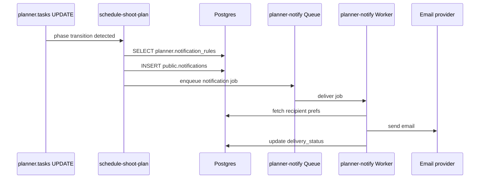

# IPI-481 · PLN-006 — Notification rules + Cloudflare Queue fan-out

**Role:** You are implementing this as an iPix engineer. One concern per PR.

**Linear:** https://linear.app/amo100/issue/IPI-481
**Track:** Platform
**Blocked by:** IPI-476, IPI-480 · **Unblocks:** IPI-482
**Skills:** ipix-task-lifecycle · cloudflare · ipix-supabase · worktrees · pr-workflow
**MVP proof:** #1

---

## The problem this solves

- Users only learn about plan changes when they manually open the app.
- Critical handoffs (e.g., retouching starts, final approval requested) are delayed because no one is pinged.
- There is no declarative way to define who gets notified for which event.

**Fix:** Add `planner.notification_rules`, reuse `public.notifications` for in-app alerts, and use a Cloudflare Queue + Worker for reliable external-channel fan-out (email/push/SMS).

---

## User story

> As a client approver, when the final approval gate opens,
> I receive an in-app notification and email with a direct link,
> so I can review and approve without missing the request.

---

## Flow

---

## Acceptance criteria

- **A — Rules model:** `planner.notification_rules` stores event type, role, channel (`in_app`, `email`, `push`, `sms`), template reference, delay, and active flag per org/workflow.
- **B — Trigger events:** Rules fire on phase transition, task assignment, approval gate pending, due-date proximity (24h/4h), dependency unblock, and mention.
- **C — In-app:** Every notification creates a `public.notifications` row; real-time badge updates via existing notification center.
- **D — External fan-out:** Cloudflare Queue receives jobs from edge functions; Worker sends email/push/SMS via configured providers with retries and dedup.
- **E — User preferences:** Users can mute channels per instance or globally (extend existing prefs).
- **F — Delivery tracking:** Notification status stored (`queued`, `delivered`, `failed`) with error log.

---

## Technical notes

**Files to touch:**
- `supabase/functions/planner-notify-enqueue/index.ts` — edge function that inserts in-app notification and enqueues external job.
- `cloudflare/planner-notify-worker/src/index.ts` — Worker consumer; sends email/push/SMS.
- `cloudflare/planner-notify-queue` — Queue binding.
- `app/src/components/notifications/NotificationCenter.tsx` — extend for planner alerts.
- `app/src/components/planner/NotificationSettings.tsx` — per-instance mute rules.
- `public.notifications` — add `planner_instance_id` and `delivery_status` columns if missing.

**Do NOT:** Send email directly from the edge function; always enqueue to Cloudflare Queue for reliability.

**Known data / constraints:** Providers are SendGrid/Resend for email, Firebase Cloud Messaging for push, Twilio for SMS (configure via secrets). Queue job payload ≤128 KB.

---

## Out of scope

- In-app notification center redesign (reuse existing)
- SMS provider setup beyond stub
- Digest/batch notifications (future)

---

## Wiring plan

| Action | Path | Notes |
|--------|------|-------|
| Create | `supabase/functions/planner-notify-enqueue/index.ts` | Enqueue edge fn |
| Create | `cloudflare/planner-notify-worker/src/index.ts` | Consumer Worker |
| Modify | `wrangler.toml` / `wrangler.jsonc` | Queue binding |
| Modify | `public.notifications` schema | Add planner fields |
| Modify | `app/src/components/notifications/NotificationCenter.tsx` | Planner CTA links |
| Create | `app/src/components/planner/NotificationSettings.tsx` | Mute UI |

---

## Verify

### Per-task (Phase 3)
| Task | Test command | Proof |
|------|--------------|-------|
| 1 — Rule trigger | Edge fn smoke: phase transition | In-app row + queue job |
| 2 — Email fan-out | Worker consumer test | Email sent within 60s |
| 3 — Mute prefs | Toggle email mute, trigger event | No email queued |

### Aggregate (Phase 4)
- [ ] `cd app && npm run lint && npm run typecheck && npm test`
- [ ] `wrangler deploy` smoke for Queue + Worker
- [ ] `npm run supabase:verify-rls`
- [ ] Browser smoke: trigger notification, verify badge + email
- [ ] `tasks/plan/todo.md` row → green · Linear → Done
