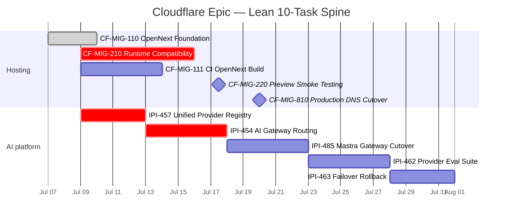

## IPI-487 · CLOUDFLARE-EPIC — Cloudflare Platform Migration

**Linear:** https://linear.app/amo100/issue/IPI-487  
**SSOT:** `tasks/cloudflare/CLOUDFLARE-EPIC.md`

**Next:** **CF-MIG-210 · Runtime Compatibility — Hono, OAuth & Groq Bundle**

---

## Progress tracker (lean 10 tasks)

| # | Full task name | Dot | % | Key proof / blocker |
|---|----------------|:---:|:---:|---------------------|
| 1 | **CF-MIG-110 · OpenNext Foundation — Scaffold & Edge Middleware** | 🟢 | 100% | PR #282 merged |
| 2 | **CF-MIG-210 · Runtime Compatibility — Hono, OAuth & Groq Bundle** | 🔴 | 25% | **NEXT** |
| 3 | **CF-MIG-111 · OpenNext CI Build Pipeline** | ⚪ | 0% | — |
| 4 | **CF-MIG-220 · Preview Smoke Testing & Validation** | ⚪ | 0% | Blocked on 210 |
| 5 | **CF-MIG-810 · Production DNS Cutover & Rollback** | 🔴 | 0% | Vercel still prod |
| 6 | **IPI-457 · CF-AI-005 — Unified AI Provider Types & Registry** | 🟡 | 60% | Merge to `main` |
| 7 | **IPI-454 · CF-AI-001 — AI Gateway — Cloudflare Provider Routing** | 🟡 | 45% | AC-F open |
| 8 | **IPI-485 · MASTRA-CF-001 — Mastra Provider Gateway Cutover** | ⚪ | 0% | After 454 AC-F |
| 9 | **IPI-462 · CF-AI-006 — AI Provider Evaluation Suite** | ⚪ | 0% | After gateway |
| 10 | **IPI-463 · CF-AI-008 — AI Provider Failover & Rollback** | ⚪ | 0% | After 462 |

**Overall:** 🟡 ~55%

---

## Gantt chart



### Plain-English guide

| Order | Full task name | What you ship |
|:-----:|----------------|---------------|
| ✅ | **CF-MIG-110 · OpenNext Foundation — Scaffold & Edge Middleware** | Worker preview on :8787 |
| **1** | **CF-MIG-210 · Runtime Compatibility — Hono, OAuth & Groq Bundle** | Operator works on workers.dev |
| ∥ | **CF-MIG-111 · OpenNext CI Build Pipeline** | CI OpenNext build |
| ∥ | **IPI-457 · CF-AI-005 — Unified AI Provider Types & Registry** | Single registry on main |
| **2** | **IPI-454 · CF-AI-001 — AI Gateway — Cloudflare Provider Routing** | Gateway REST for all inference |
| **3** | **IPI-485 · MASTRA-CF-001 — Mastra Provider Gateway Cutover** | Agents off direct SDKs |
| **4** | **CF-MIG-220 · Preview Smoke Testing & Validation** | E2E smoke green |
| **5** | **IPI-462 · CF-AI-006 — AI Provider Evaluation Suite** | Eval before Workers AI default |
| **6** | **IPI-463 · CF-AI-008 — AI Provider Failover & Rollback** | Failover runbook |
| **last** | **CF-MIG-810 · Production DNS Cutover & Rollback** | DNS cutover |

```text
✅ CF-MIG-110 done → NEXT: CF-MIG-210 ∥ IPI-457
→ IPI-454 → IPI-485 → CF-MIG-220 → IPI-462 → IPI-463 → CF-MIG-810
```
