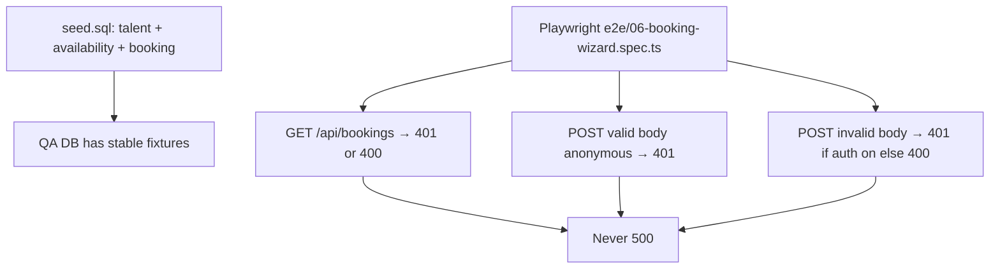
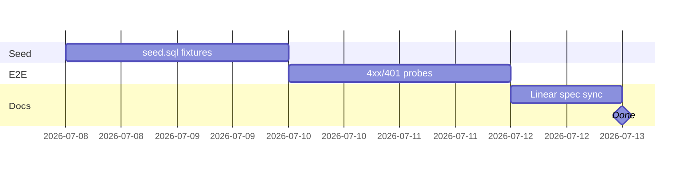

# IPI-488 · BE-SD1b — Booking QA seed data + E2E reliability

**In plain terms:** QA can exercise the Booking Wizard against stable seed talent/availability/booking rows, and Playwright probes prove unauthenticated booking API calls return deterministic 4xx/401 (never 500) under both `OPERATOR_AUTH_ENABLED` modes.

**Blocked by:** IPI-451 (DB seed data), IPI-410 (Booking Wizard) · **Unblocks:** Booking Wizard QA / IPI-411 follow-ons

**Skills:** `ipix-supabase` · `gen-test` · `task-verifier` · `worktrees`

**Labels:** BE · Booking · QA

**Linear:** https://linear.app/amo100/issue/IPI-488/be-sd1b-booking-qa-seed-data-e2e-reliability  
**Parent:** IPI-410 (Booking Wizard)  
**Visual SSOT:** N/A — seed + API reliability probes (no UI)

**Sibling PRs (one concern each):**

| PR | Concern | Path |
|----|---------|------|
| [#288](https://github.com/amo-tech-ai/lumina-studio/pull/288) | Seed only | `supabase/seed.sql` |
| [#299](https://github.com/amo-tech-ai/lumina-studio/pull/299) | E2E reliability probes | `e2e/06-booking-wizard.spec.ts` |
| [#300](https://github.com/amo-tech-ai/lumina-studio/pull/300) | This Linear issue spec | `linear/issues/IPI-488-…md` |

---

## The problem this solves

- Booking Wizard QA has no stable talent/availability/booking fixtures — engineers invent UUIDs and hit empty tables.
- API regressions that turn auth/validation failures into **500** are easy to miss without probes that assert 4xx/401.
- Seed `rates` / daterange / `expires_at` mismatches silently break `search_talent` tier filters and sample bookings.

**Fix:** Extend `supabase/seed.sql` with inclusive availability, durable `expires_at`, and `rates.half_day`; add root Playwright probes that assert deterministic 401/400 (never 500) for unauthenticated booking routes.

---

## User story

> As an **Engineer**, when I seed the remote DB and run booking E2E probes,
> I get stable QA rows plus green Playwright checks that unauthenticated `/api/bookings` never 500s,
> so I can trust Booking Wizard QA without inventing fixtures or chasing flaky auth-mode status codes.

---

## Flow

---

## Acceptance criteria

- **A1 — Seed talent:** At least two talent profiles (verified + pending) with `rates` keys `day` / `half_day` / `hour` so `talent.compute_rate_tier()` is non-null.
- **A2 — Seed availability:** Availability rows use inclusive daterange bounds `[]` matching booking overlap RPCs (not half-open `[)`).
- **A3 — Seed booking:** Sample booking stays in `requested` for the QA window (`expires_at` far-future, not ~72h TTL).
- **A4 — Auth probe (POST valid):** Unauthenticated POST with UUID_RE-valid body → **401** in both auth-on and auth-off modes (gate or RPC `authentication required`); never 500 / never talent 404.
- **A5 — Auth probe (POST invalid):** Unauthenticated POST with invalid body → **401** when operator auth gate is on, **400** when off; never 500.
- **A6 — List probe (GET):** Unauthenticated GET `/api/bookings` → **401** (auth on) or **400** (auth off / missing query); never 500. Mode is derived from the server response, not the Playwright runner env.
- **A7 — Regression:** No happy-path authenticated **201** write is required in this issue’s E2E scope (that belongs to a later auth-login E2E if needed).

---

## Technical notes

**Files to touch:**

- `supabase/seed.sql` — talent profiles, availability (`[]`), booking `expires_at`, `rates.half_day` (#288)
- `e2e/06-booking-wizard.spec.ts` — API reliability probes (#299)
- `linear/issues/IPI-488-BE-SD1b-booking-qa-seed-data-e2e.md` — this spec (#300)

**Do NOT:** Put Playwright under `app/` · Assert 201 happy-path in this issue’s E2E · Use version-invalid placeholder UUIDs that fail `UUID_RE` before auth · Mix seed + E2E + docs in one PR

**Seeded / known data (illustrative ranges):** talent `…080x`, availability `…090x`, bookings `…0axx` — use UUID_RE-valid v4-shaped IDs in E2E bodies (`…-4000-8000-…`).

**Auth-mode note:** Playwright does not start Next.js. Derive gate state from GET `/api/bookings` (401 vs 400), not from `OPERATOR_AUTH_ENABLED` in the runner process.

---

## Out of scope

- Talent availability editor UI (IPI-413)
- Booking Detail page E2E (IPI-411)
- Authenticated happy-path POST → 201 + DB write assertion
- Playwright browser login flows

---

### Completion steps

#### A. Setup
- [ ] **A1** Confirm IPI-410 booking routes exist — proof: `app/src/app/api/bookings/`
- [ ] **A2** Worktree + branch per concern — proof: `ipi/488-booking-qa-{seed,e2e,docs}`

#### B. Seed (#288)
- [ ] **B1** Add talent profiles with `rates.half_day` — proof: `supabase/seed.sql`
- [ ] **B2** Availability with inclusive `[]` dateranges — proof: seed literals
- [ ] **B3** Sample booking with far-future `expires_at` — proof: seed row

#### C. E2E reliability probes (#299)
- [ ] **C1** POST valid anonymous → 401 — proof: `e2e/06-booking-wizard.spec.ts`
- [ ] **C2** POST invalid → 401/400 by server auth mode — proof: same file
- [ ] **C3** POST missing talent never 404 when anonymous — proof: same file
- [ ] **C4** GET list / invalid query never 500 — proof: same file

#### D. Verify
- [ ] **D1** From **repo root:** `npm run test:e2e -- e2e/06-booking-wizard.spec.ts` — proof: green (server on :3002)
- [ ] **D2** `infisical run --env=dev -- npm run supabase:verify` — proof: green (after seed applied)
- [ ] **D3** `cd app && npm run lint` — proof: green (lint lives under `app/`, not root)

#### E. Ship
- [ ] **E1** Open/merge sibling PRs #288 → #299 → #300 — proof: GitHub
- [ ] **E2** Sync this markdown → Linear description — proof: `infisical run -- node scripts/linear-update-issue.mjs IPI-488`
- [ ] **E3** Linear → Done when seed + E2E landed — proof: Linear state

---

### Verifier probes

| Probe | Command / check | Pass |
|-------|-----------------|------|
| E2E reliability | `npm run test:e2e -- e2e/06-booking-wizard.spec.ts` (repo root) | All cases green; no 500 |
| Seed rates key | SQL/`search_talent` on seeded profile | `rate_tier` non-null |
| Seed expiry | Inspect seeded booking `expires_at` | Far-future; stays `requested` |
| Lint | `cd app && npm run lint` | Exit 0 |
| Supabase health | `infisical run --env=dev -- npm run supabase:verify` | Exit 0 |

---

### Gantt — IPI-488

