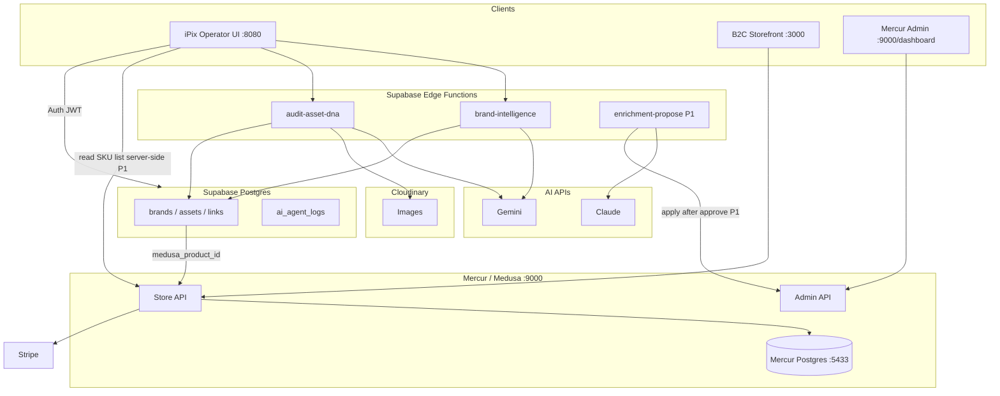

# iPix MVP Plan

**One sentence:** Prove that a fashion brand can go from **URL → AI brand profile → scored product assets → live Mercur SKU → real Stripe checkout** — without iPix owning cart or order truth.

**Team assumption:** 2–4 engineers + 1 product/design. **Timeline to first revenue signal:** 45–60 days if scope stays frozen.

---

# Current State Scorecard

*Synced with [todo.md](./todo.md) — verified 2026-06-14.*

| Area | Score /100 | Status | Evidence |
|------|------------|--------|----------|
| **Commerce** | **82** | 🟢 Strong | Mercur + seller + 14 SKUs + paid order + B2C in repo · [evidence](./docs/ecommerce/evidence/2026-06-14/ipix-b2c-checkout-e2e.md) |
| **AI** | **55** | 🟢 Partial | `brand-intelligence` edge · `supabase:verify-brand-intelligence` ✅ |
| **Dashboard** | **35** | 🟡 Partial | `/dashboard` routes + `AuthContext`; brand setup incomplete |
| **Auth** | **70** | 🟢 Partial | Supabase auth + RLS verified; login flows live |
| **Supabase** | **80** | 🟢 Partial | Migration + edge functions + verify scripts pass |
| **Marketplace** | **85** | 🟢 Strong | `my-marketplace/` committed · ipix seller, shipping, Stripe region link |
| **Stripe** | **90** | 🟢 Proven | Test PI succeeded · [checkout evidence](./docs/ecommerce/evidence/2026-06-14/ipix-b2c-checkout-e2e.md) |
| **Product Catalog** | **85** | 🟢 Done | `yarn seed:ipix-catalog` · fashion SKUs in Store API |
| **Brand Intelligence** | **85** | 🟢 Proven | Remote verify ✅ · dashboard UI pending |
| **Production Readiness** | **40** | 🟡 Partial | Infisical paths, build/test pass; deploy/CI not done |

**Overall platform:** **~48/100** execution · **MVP proofs: 6/8 green** (see [todo.md](./todo.md) § MVP 8 proofs).

| Layer | Built | Not built |
|-------|-------|-----------|
| iPix Vite app | Marketing + auth + dashboard shell | Brand intel UI, DNA scoring, product links |
| Mercur | API, admin, vendor, seeds, Stripe paid order | Connect, Algolia, multi-vendor |
| Supabase | Schema, RLS, edge health/test/brand-intelligence | DNA audit, Cloudinary sign |
| Docs | PRD, ecommerce tasks, ADR-002, checkout evidence | — |

---

# Section 1 — Executive Summary

### What are we building?

A **vertical slice** that combines:

1. **iPix** — AI brand profile + asset DNA scoring + (later) product copy enrichment  
2. **Mercur** — real product catalog, cart, checkout, orders  
3. **Supabase** — user/brand memory and **links** between creative work and commerce SKUs  

Not a full marketplace. Not a full Lean Canvas product. Not AI shopping chat.

### Why now?

- Mercur/Medusa is the [documented marketplace path](https://medusajs.com/marketplace/) (vendor UI, B2C template, Connect later).
- Backend is **already booted** on ipix — rare head start vs greenfield.
- Fashion/DTC brands overproduce content and undermeasure conversion; iPix wedge is differentiated from “another storefront.”
- Small team cannot win building checkout + multivendor + AI concierge simultaneously.

### Why will customers pay?

| Payer | Wedge (fastest $) | Mechanism |
|-------|-------------------|-----------|
| **Brand / DTC founder** | “Brief + DNA gate before the shoot” | SaaS subscription ($99–499/mo per `prd.md`) |
| **Agency** | Repeatable brand memory + production packages | Seat / brand pricing |
| **Marketplace (later)** | Curated fashion SKUs with better PDP content | Commission on GMV — **after** single-vendor proof |

**First revenue = planning SaaS**, not marketplace GMV. Commerce proof **increases conversion** (“we also sell what we plan”).

### Smallest possible version

**8 proofs** (P0). Nothing else ships until all green:

| # | Proof |
|---|--------|
| 1 | Mercur backend running |
| 2 | One approved vendor |
| 3 | 10 fashion SKUs |
| 4 | B2C reference storefront checkout |
| 5 | One Stripe test paid order |
| 6 | One brand profile (URL → Supabase) |
| 7 | One DNA-scored asset |
| 8 | One `commerce_product_links` row |

---

# Section 2 — MVP Thesis

### iPix = Creative Intelligence Layer

**Owns:**

| Domain | MVP | Post-MVP |
|--------|-----|----------|
| Brand Intelligence | URL → profile | Memory + re-analysis |
| Lean Canvas | — (P2) | Full wizard |
| Production Package | — (P2) | 8-doc generator |
| Asset DNA Scoring | ✅ P0 | Batch + gates |
| Product Enrichment | Drafts only (P1) | Approve → Mercur |
| Performance Learning | — (P2) | Feedback loop |

**Never owns:** price, inventory, cart, orders, payouts.

### Mercur = Commerce Layer

**Owns:** products, variants, inventory, cart, orders, checkout, vendors, payouts (Connect later).

**MVP:** one vendor, 10 SKUs, Store + Admin + Vendor UIs, Stripe customer payments only.

### Supabase = Memory Layer

**Owns:** users, profiles, brand data, AI logs, embeddings (P1+), analytics, **`commerce_product_links`**.

**Never owns:** authoritative catalog, carts, or orders.

### Commerce Write Policy (non-negotiable)

| AI may | AI may not without explicit approval |
|--------|--------------------------------------|
| Suggest titles, descriptions, tags, images | Publish to Mercur |
| Store drafts in Supabase | Change price or inventory |
| Read price/stock from Mercur | Create checkout or mutate cart |

---

# Section 3 — North Star User Journey

Full vision (90-day). **Bold = P0 in MVP.**

```text
Brand URL
  → [Human] pastes URL in Brand Setup
  → [AI] Brand Intelligence extracts profile → Supabase `brands`
  → [Human] confirms / edits profile

Product Creation
  → [Human] selects or creates listing in Mercur (vendor UI) OR picks seeded SKU
  → [Human] links brand ↔ `medusa_product_id` in iPix

Asset Upload
  → [Human] uploads image
  → [AI] optional background removal (P2)
  → Cloudinary stores binary

DNA Score
  → [AI] AestheticAuditor scores asset
  → [Human] approves / overrides with reason

Product Enrichment (P1)
  → [AI] proposes PDP copy + tags → draft table
  → [Human] approves
  → [AI/system] applies to Mercur Admin API

Publish Product
  → [Human] confirms images on Mercur product
  → Live on B2C storefront (temporary lab)

Customer Purchase
  → [Human shopper] B2C browse → cart → Stripe checkout
  → Mercur order + Stripe capture

Performance Feedback (P2)
  → [Human] imports CTR/conversion OR webhook
  → [AI] suggests next brief adjustments
```

| Step | User | AI | Approval |
|------|------|-----|----------|
| Brand URL | Paste URL, confirm | Analyze URL (Gemini) | Required before save |
| Product link | Pick Mercur SKU | Suggest match (P1) | Required |
| Upload | Select file | — | — |
| DNA | Review score | Vision score (Gemini) | Override needs reason |
| Enrichment | Edit draft | Propose copy (Claude) | Required before Mercur write |
| Purchase | Shopper checkout | — | — |
| Performance | View insight | Summarize (P2) | Informational |

---

# Section 4 — MVP Scope

Be aggressive. If it does not unblock the 8 proofs or first SaaS invoice, cut it.

### P0 — Must Have

| Feature | Owner | Notes |
|---------|-------|-------|
| Mercur local stack + health | Mercur | ✅ Done |
| Admin + 1 vendor + 10 fashion SKUs | Mercur | |
| B2C reference storefront (`:3000`) | Next clone | **Temporary** buyer UI |
| Stripe test paid order | Mercur + Stripe | Evidence doc |
| Supabase: `brands`, `assets`, `commerce_product_links`, `ai_agent_logs` | Supabase | Rename `products` → `brand_skus` |
| Minimal auth (email magic link or Google) | Supabase Auth | Needed for brand row ownership |
| Brand Intelligence edge function | Supabase + Gemini | One profile |
| DNA audit edge function | Supabase + Gemini + Cloudinary | One asset |
| Minimal operator UI (3–4 screens, not full dashboard) | iPix | See Section 5 |
| Commerce Write Policy enforced in code | iPix Edge | Drafts only |

### P1 — Nice to Have (after P0 gate)

| Feature | Notes |
|---------|-------|
| Full 3-panel dashboard shell | Context / Work / Intelligence |
| Product enrichment drafts + approve UI | No auto-publish |
| Read-only Mercur product hydrate in iPix | `@medusajs/js-sdk` server-side |
| `brand_skus` planning table | Shoot context, not catalog |
| iPix SaaS billing (Stripe subscriptions) | **First revenue lever** |
| Vercel deploy marketing + app preview | |
| Embedding sync | pgvector |

### P2 — Later (explicitly out of MVP)

| Cut | Why |
|-----|-----|
| Lean Canvas full wizard | XL; not needed to prove commerce + DNA |
| Production package (8 docs) | Same |
| CopilotKit / Mastra / AI shopping | Demo without checkout |
| WhatsApp commerce | Regional; distracts US wedge |
| Stripe Connect / multivendor payouts | After single-vendor GMV |
| iPix-native shop/checkout | B2C lab sufficient |
| Algolia, TalkJS, reviews at scale | Mercur extras |
| OpenClaw orchestration | No agents to orchestrate yet |
| Event/trip/venue links | Legacy mdeai scope |

---

# Section 5 — MVP Screens

Only screens required for P0 + minimal P1. **Cut** full dashboard chrome until P1.

| # | Screen | Purpose | User | Priority | P0? |
|---|--------|---------|------|----------|-----|
| 1 | **Login** | Supabase auth gate | Brand operator | P0 | ✅ Minimal |
| 2 | **Home / Hub** | Links to brand, assets, commerce status | Operator | P0 | ✅ Not full dashboard |
| 3 | **Brand Setup** | Paste brand URL, trigger analysis | Operator | P0 | ✅ |
| 4 | **Brand Intelligence** | Review/edit AI profile + scores | Operator | P0 | ✅ |
| 5 | **Product Links** | List Mercur SKUs + link to brand (`commerce_product_links`) | Operator | P0 | ✅ Read-only hydrate |
| 6 | **Asset Library** | Upload + list assets | Operator | P0 | ✅ |
| 7 | **DNA Review** | Score, pillars, approve/review/blocked | Operator | P0 | ✅ |
| 8 | **Enrichment Review** | Approve AI copy drafts | Operator | P1 | ❌ |
| 9 | **Marketplace Shop** | Browse/buy | Shopper | P0 | ❌ **Use B2C `:3000`** |
| 10 | **Checkout** | Pay | Shopper | P0 | ❌ **Use B2C** |
| 11 | **Settings** | Profile, API keys, billing | Operator | P1 | ❌ Stub only |

**Removed from MVP:** slide outline, canvas wizard steps, copilot chat, vendor onboarding UI (use Mercur `/seller`), admin catalog UI (use Mercur `/dashboard`).

**External UIs (not built in iPix):**

| UI | URL | User |
|----|-----|------|
| Mercur Admin | `:9000/dashboard` | Operator |
| Mercur Vendor | `:9000/seller` | Seller |
| B2C Storefront | `:3000` | Shopper |

---

# Section 6 — Database Plan

### Supabase (memory layer)

| Table | Action | Notes |
|-------|--------|-------|
| `brands` | **Add** | `user_id`, `brand_url`, `ai_profile jsonb`, `creative_temperature_default` |
| `brand_scores` | **Add** | DNA readiness scores from URL analysis |
| `assets` | **Add** | `brand_id`, `cloudinary_url`, `dna_score`, `dna_status`, pillars jsonb |
| `commerce_product_links` | **Add** | `brand_id`, `medusa_product_id`, optional `asset_id`, `shoot_id` |
| `commerce_product_enrichment_drafts` | **Add (P1)** | draft copy; status pending/approved/rejected |
| `ai_agent_logs` | **Add** | all agent I/O |
| `brand_skus` | **Add (P1)** | planning SKUs for shoots — **not** Mercur catalog |
| `wizard_sessions` | **Defer P2** | Lean Canvas state |
| `shoots` | **Defer P2** | production package |
| `performance` | **Defer P2** | metrics |
| `products` (if any) | **Delete / never create** | Collides with Mercur Product |
| `supabase/old/*` shoot tables | **Keep archived** | Do not apply wholesale; cherry-pick if needed |
| Current empty `remote_schema` migration | **Replace** | New forward migration with MVP tables + RLS |
| `pgvector` extension | **Add P1** | embeddings |

**RLS:** brand-scoped by `auth.uid()` on all user tables; service role for edge functions only.

### Mercur (commerce layer — do not duplicate in Supabase)

| Domain | Mercur modules / tables | iPix reads | iPix writes |
|--------|-------------------------|------------|-------------|
| Product, Variant, Price | Core Medusa | Store API | Admin API after human approval only |
| Inventory | Stock locations | Store API | Never from iPix MVP |
| Cart, Order | Core Medusa | — | Never |
| Seller / Vendor | Mercur marketplace | Admin | Via Mercur UI |
| Payment | Stripe module | — | Webhooks on Mercur |
| Payout | Connect (P2) | — | Defer |

**Link pattern:**

```text
supabase.commerce_product_links.medusa_product_id → mercur.product.id
```

No sync of price/stock into Supabase except optional TTL cache (P1).

---

# Section 7 — AI Agent Registry (MVP only)

| Agent | Purpose | Trigger | Human approval | Provider | P0? |
|-------|---------|---------|----------------|----------|-----|
| **Brand Intelligence** | URL → brand profile + scores | User submits URL | Confirm profile | Gemini Flash + URL Context | ✅ |
| **AestheticAuditor** | Asset DNA score + status | After upload | Approve / override | Gemini Pro Vision | ✅ |
| **Product Enricher** | PDP title, description, tags draft | User clicks “Suggest copy” | Before Mercur write | Claude | P1 |
| **Performance Feedback** | Summarize metrics → next actions | Manual import / cron | Informational | Gemini Pro | P2 |
| Lean Canvas Strategy | Canvas sections | Wizard step | Per section | Claude | P2 |
| Production Planner | 8-doc package | Generate click | Review docs | Claude | P2 |
| Commerce Search | Vector + hydrate | Chat | Before cart | Embeddings + Mercur | P2 |

All agents → `ai_agent_logs`. No agent calls Stripe or cart APIs in MVP.

---

# Section 8 — Technical Architecture



### Data flow (P0 happy path)

1. Operator logs in → Supabase Auth JWT.  
2. Paste URL → Edge `brand-intelligence` → Gemini → `brands.ai_profile`.  
3. Operator links brand to Mercur product ID → `commerce_product_links`.  
4. Upload asset → Cloudinary → Edge `audit-asset-dna` → Gemini Vision → `assets.dna_*`.  
5. Shopper buys on B2C → Mercur cart/checkout → Stripe capture → order in Mercur only.  
6. Operator verifies same SKU in Mercur admin matches linked ID.

**Secrets:** Gemini/Claude/Cloudinary/Stripe **never** in Vite bundle; edge + Mercur server only.

---

# Section 9 — Development Roadmap

### Phase 1 — Commerce Proof (Days 1–21)

**Goal:** One paid Stripe test order on ipix Mercur + B2C.

| Task | Deps | Risk |
|------|------|------|
| IPIX-COM-002 Admin account | — | Low |
| IPIX-COM-003 Approve vendor | Admin | Low |
| IPIX-COM-008 Seed 10 fashion SKUs | Vendor | Med |
| IPIX-COM-006 Clone B2C storefront | Publishable key | Med |
| IPIX-COM-005 Stripe webhook + checkout | B2C | **High** — webhook misconfig |
| IPIX-COM-004 Redis wiring | — | Low |

**Acceptance:** Order ID + `payment_status: captured` + screenshot + Stripe charge ID in `docs/ecommerce/evidence/`.

---

### Phase 2 — AI Integration (Days 22–45)

**Goal:** Brand intelligence + DNA scoring + link row.

| Task | Deps | Risk |
|------|------|------|
| Supabase migration (brands, assets, links, logs) | Project linked | Schema drift |
| Supabase Auth + Login + Hub screens | Migration | UX scope creep |
| Edge `brand-intelligence` | Gemini key | URL failures |
| Cloudinary + Edge `audit-asset-dna` | Upload flow | Cost/latency |
| Product Links screen (manual link) | Phase 1 SKUs | — |
| Minimal operator UI (4 screens) | Auth | — |

**Acceptance:** All 8 P0 proofs green; demo video ≤5 min.

---

### Phase 3 — Product Intelligence (Days 46–90)

**Goal:** Enrichment drafts + first SaaS revenue + performance stub.

| Task | Deps | Risk |
|------|------|------|
| Enrichment draft table + UI | Phase 2 | Silent write bug |
| Edge apply to Mercur Admin | Draft approve | **High** — guardrails |
| `@medusajs/js-sdk` server wrapper | Phase 1 | — |
| Stripe SaaS billing for iPix | Auth | Separate from marketplace Stripe |
| Performance feedback stub | Manual CSV | Low |
| Staging deploy Mercur + Supabase | — | **High** — ops |

**Acceptance:** One enrichment draft published to live PDP after approval; 1 paying beta customer OR 3 LOIs for planning tier.

---

# Section 10 — Reality Check

### Biggest risks

| Risk | Impact | Mitigation |
|------|--------|------------|
| Scope creep (Canvas, AI shop, multivendor) | Kill timeline | This doc + 8-proof gate |
| Two PRDs (iPix vs mdeai ecommerce) | Team confusion | `ecommerce-prd.md` = reference only |
| Building checkout in Vite | 3–6 mo waste | B2C lab + Mercur |
| AI writes catalog silently | Trust + legal | Commerce Write Policy + drafts |
| Supabase schema from old shoot dump | Wrong tables | Fresh MVP migration |
| No production deploy | Cannot charge | Staging by day 60 |

### Over-engineered today

- 69+ ecommerce task files for pre-revenue stage → use `mvp.md` + `todo.md` only day-to-day  
- Lean Canvas 4 levels before commerce proof  
- CopilotKit/Mastra/WhatsApp in legacy PRD  
- pgvector before 10 SKUs exist  
- Redis/Algolia/TalkJS before first paid order  

### Delay

- Multivendor, Connect, payouts  
- Full dashboard 3-panel  
- Performance ML loop  
- Shopify/Amazon sync  
- OpenClaw  

### Remove (for MVP)

- iPix checkout UI  
- Supabase cart/order/product tables  
- mdeai concierge buyer journey  
- “AI shopping” without checkout  

### Fastest path to revenue

1. **Week 3:** Commerce proof demo for sales calls.  
2. **Week 6:** Brand URL + DNA demo → **sell planning beta** ($99–199/mo, 5 design partners).  
3. **Week 10:** Enrichment + link to live PDP → case study (“content that converts on our shop”).  
4. **Month 4+:** Marketplace GMV / commission only after 10+ SKUs live and 1 vendor operating reliably.

**Do not wait for marketplace GMV to get first dollar.**

---

# Section 11 — Success Metrics

### 30 days

| Metric | Target |
|--------|--------|
| P0 proofs complete | 8/8 🟢 |
| Paid test orders (Stripe) | ≥1 |
| Brand profiles generated | ≥3 (internal/demo) |
| DNA-scored assets | ≥5 |
| Design partner conversations | 10 |
| Signed beta LOIs | 2 |

### 60 days

| Metric | Target |
|--------|--------|
| Paying planning beta customers | 3 @ $99+ MRR |
| SKUs live with linked assets | 10 |
| Enrichment drafts applied (approved) | ≥5 |
| B2C storefront on staging URL | 1 |
| Operator UI screens shipped | 6+ |

### 90 days

| Metric | Target |
|--------|--------|
| MRR (planning SaaS) | $1.5K+ |
| Active brands using DNA gate | 10 |
| GMV (test/staging acceptable) | $500+ real or pilot |
| Second vendor evaluated | Decision memo (yes/no Connect) |
| Production readiness score | ≥45/100 |

---

# Section 12 — Final Recommendation

### 1. Recommended architecture

```text
iPix (Vite) → Supabase (auth, memory, edge, links) → Mercur (commerce SoT) → Stripe
                     ↓
              Gemini / Claude / Cloudinary
B2C Next storefront → Mercur Store API (temporary buyer surface)
```

**Bounded contexts.** One integration rule: **link IDs, don’t copy commerce rows.**

### 2. Recommended stack

| Layer | Choice |
|-------|--------|
| Operator UI | Vite + React + Tailwind + shadcn (existing) |
| Auth + DB | Supabase |
| Edge AI | Deno functions + Gemini + Claude |
| Media | Cloudinary |
| Commerce | Mercur 2.x on Medusa 2.x (`my-marketplace/`) |
| Buyer UI | Mercur B2C template (clone, temporary) |
| Payments | Stripe via Medusa module (marketplace); separate Stripe Products for iPix SaaS |

### 3. Recommended MVP

**Ship the 8 proofs.** Operator UI = 4 screens + login. Shopper UI = B2C only. **No marketplace features.** **No Lean Canvas.** **No AI chat.**

### 4. Recommended launch strategy

| Phase | Audience | Offer |
|-------|----------|-------|
| Private beta | 5 fashion/DTC brands you can reach | Free planning + DNA; they provide URL + assets |
| Paid beta | Same + waitlist | $99/mo — brand intel + DNA + link to shop SKU |
| Public | Content-led | Case study: “From URL to scored PDP to sale in 48h” |
| Marketplace narrative | Investors/partners | After 1 vendor + 10 SKUs + paid order proof |

### 5. Confidence score

| Question | Score |
|----------|-------|
| Architecture choice (iPix / Supabase / Mercur split) | **88%** |
| 8-proof MVP achievable in 30 days (focused team) | **72%** |
| First SaaS revenue in 60 days | **58%** |
| Full marketplace in 90 days | **25%** — don’t target this |
| **Overall: right plan, execution-dependent** | **68%** |

**Brutal truth:** Documentation is ahead of code by ~6 months. The next 21 days are **commerce proof only** — no AI screens until Mercur paid order exists. That sequencing is the highest-leverage decision you can make.

---

## Quick reference

| Doc | Role |
|-----|------|
| [docs/ipix-commerce-prd.md](./docs/ipix-commerce-prd.md) | Architecture + policies |
| [docs/ipix-commerce-implementation-plan.md](./docs/ipix-commerce-implementation-plan.md) | Phases + task IDs |
| [todo.md](./todo.md) | Active checklist |
| [docs/ecommerce/plan/01-setup.md](./docs/ecommerce/plan/01-setup.md) | Mercur boot runbook |

**Next 3 actions:** Admin + vendor → 10 SKUs → B2C + paid Stripe order.
