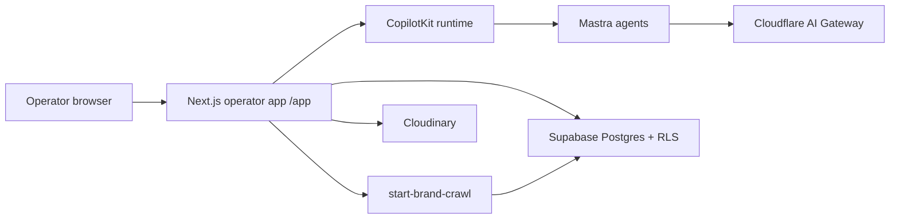

iPix is one product with a few real moving parts. This page is the map, not a catalog of every vendor.

Think of Brand Hub as the studio intake desk: a website comes in, DNA is filed, then planner and chat can use that file. The diagram is that desk, not a warehouse layout.

## What is live today

The operator app (`app/`, Next.js) is the product surface operators use at `/app`. Chat in that app talks to CopilotKit, which calls Mastra agents. Brand records and crawl results live in **Supabase** (remote Postgres, RLS). Lookbook images and DNA-related media go through **Cloudinary**. Model calls for production AI are routed through the **Cloudflare AI Gateway** worker — the full app is not on Workers yet.

## How the Start Here journey uses this map

1. **Login** — Supabase Auth issues a session. The operator app reads it on the server.
2. **`/app` then `/app/brand`** — Brand Hub lists `brands` rows your org is allowed to see.
3. **Brand URL** — Onboarding stores the website and kicks the Brand Intelligence workflow, which calls the `start-brand-crawl` edge function.
4. **Crawl → Brand DNA** — Crawl output and `brand_scores` land in Supabase. Brand Hub reads those scores onto the card (DNA chip / pillars).

## What this page does not claim

- The Next.js app has **not** cut over to OpenNext on Cloudflare. Do not document the operator UI as a Worker.
- Mastra agent memory is **not** a substitute for Brand Hub. DNA lives in the database after a crawl.
- This is not a PRD, audit, or Linear tracker. Those stay out of this sidebar until they are canonical product docs.

## Related code (for implementers)

| Piece | Where |
| --- | --- |
| Brand Hub list | `app/src/app/(operator)/app/brand/page.tsx` |
| Add brand / website | `app/src/components/onboarding/` (`websiteUrl` required) |
| Crawl | `start-brand-crawl` edge function via Brand Intelligence workflow |
| DNA on the card | `brand_scores` \+ `computeDnaScore` |
| Chat | `app/src/app/api/copilotkit/` \+ `app/src/mastra/` |