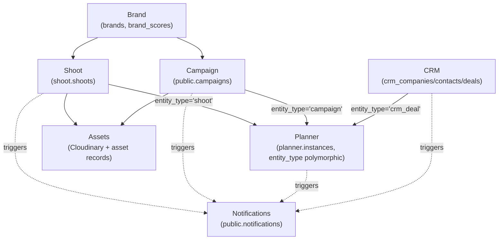

# iPix / FashionOS — Platform PRD

**Status:** Living reference document
**Date:** 2026-07-09
**Audience:** Engineers and AI agents building iPix
**Grounded in:** `tasks/plan/audit/00-05` (forensic reconciliation of all prior planning), `tasks/cloudflare/plan/cf-000-platform-architecture.md` (Approved), `tasks/cloudflare/plan/ai-agent-architecture.md` (Approved), `tasks/cloudflare/CLOUDFLARE-EPIC.md`/`todo.md`, `tasks/cloudflare/mastra/MASTRA-EPIC.md`, `linear/issues/IPI-476` through `IPI-483`, `Universal-design-prompt-new/plan/design-prompts/SCR-32/33/34`

Status-dot legend used throughout: 🟢 shipped/accurate · 🟡 partial/in progress · ⚪ planned, not started · 🔴 blocking gap or known-stale

---

## 1. Executive Summary

**Problem statement.** Fashion brand operators run photo/video production (shoots, campaigns, model bookings) across scattered tools — spreadsheets for scheduling, email for approvals, separate systems for CRM and asset delivery. Nothing understands the brand's own visual identity or DNA, so every campaign starts from a blank sheet and every approval is a manual bottleneck.

**Proposed solution.** iPix / FashionOS is an AI-native operator platform: a single 3-panel workspace (navigation, workspace, AI intelligence panel) where a fashion brand's operator manages brand intelligence, shoot production, campaigns, model bookings, CRM relationships, and asset delivery — with AI agents drafting the repetitive work (schedules, briefs, DNA scores, CRM activity) and a human approving every write before it lands (HITL — human-in-the-loop).

**Success criteria** (see full house-style AC conventions in §10):
- An operator can go from "brand URL" to an approved Brand DNA profile in under 2 minutes of active work (crawl + AI draft + one approval).
- A producer can generate a full 5-week shoot production timeline from a template in one action, with zero manually re-typed dates.
- Every AI-proposed write (schedule, DNA score, CRM activity, deal-stage move) is reversible and requires one explicit operator approval — never silent.
- The platform runs entirely on Cloudflare Workers (via OpenNext) with Workers AI as the default inference provider, Supabase Postgres as the single system of record, and Cloudinary as the only media pipeline — no competing infrastructure for the same job.
- New engineers or AI agents can read this document plus the 2 files it cites as "Approved" (§4, §5) and understand 90%+ of the platform without reading scattered chat history or stale docs.

**Current state in one paragraph.** The core operator product is real and working: Brand, CRM, Booking, and Shoot are shipped features with real Mastra agents, real Supabase schemas, and real UI. The platform is mid-migration from Vercel to Cloudflare Workers (~55-58% complete, foundation done, gateway wiring in progress) and mid-build on a reusable Planner engine (schema+RLS+engine already in 2 open PRs). Three areas are genuinely thin and are this document's main new content: **Campaign** (schema exists, everything else doesn't), **Planner UI** (backend spec-complete across 8 Linear issues, zero route/UI yet), and **Intelligence** (exists only as a side panel, no standalone page).

---

## 2. Product Vision & Users

**Vision:** guide operators, never make them wait. Per the product's own house principles (`DESIGN.md` §2-3): remove waiting (stream progress, never a blank spinner), remove guessing (show the spec/target/next step), remove repetitive work (smart defaults), prevent mistakes (live validation before save), always show the next step, keep users in context (preview/act inline), AI drafts + humans decide (every AI write is a reversible draft behind a gate), one click for common tasks, every AI recommendation is explainable (confidence + evidence), everything is undoable.

**Primary users (personas — these are hats on 5 underlying AI agents, not separate products):**
- **Producer** — plans and runs shoots end-to-end (brief → casting → production → delivery).
- **Creative Director / Brand Guardian** — owns brand DNA, campaign creative direction.
- **Client Approver** — reviews and approves gates (schedules, deliverables, final assets) on behalf of the brand.
- **Photographer / Retoucher / Stylist / Coordinator** — role-scoped collaborators inside a shoot or plan instance, seeing only what's relevant to their role.
- **Sales/Relationship owner** — runs the CRM pipeline (companies, contacts, deals).

**Non-goals (explicitly out of scope for the current build horizon):** payments/invoicing (Mercur handles commerce, no Stripe integration exists or is planned in this repo — confirmed via `00-repo-ground-truth.md` §5), native mobile apps, two-way external calendar sync (Google/Outlook — read-only ICS export only), full resource-leveling/PERT optimization, a general-purpose agent platform on Cloudflare Agents SDK (evaluated, not adopted).

---

## 3. Architecture Overview

```
End Users
   │
   ▼
Cloudflare Workers (via OpenNext) ── migration in progress, see §4
 ┌─────────────┐  ┌──────────────┐  ┌──────────────────────────┐
 │ Next.js App  │  │ Mastra       │  │ CopilotKit               │
 │ (Operator    │  │ (Agent       │  │ (AI Chat UI,             │
 │  Dashboard)  │  │  Orchestration, in-process) │  │  Frontend Tools, HITL)  │
 └─────────────┘  └──────────────┘  └──────────────────────────┘
        │                │                      │
        ▼                ▼                      ▼
 ┌──────────────────────────────────────────────────────────────┐
 │ API Routes: /api/copilotkit, /api/bookings, /api/shoots,      │
 │ /api/brands, /api/assets, /api/notifications, /api/intelligence│
 └──────────────────────┬───────────────────────────────────────┘
                        │
 ┌──────────────────────▼─────────────────────────────────────────┐
 │ AI Gateway Worker (services/cloudflare-worker/) — provider      │
 │ routing, OpenAI-compatible /v1/chat/completions                │
 └──────────────────────┬─────────────────────────────────────────┘
                        │
 ┌──────────────────────▼─────────────────────────────────────────┐
 │ Supabase — Postgres (system of record), Auth, pgvector,        │
 │ Realtime (notifications, live planner sync)                    │
 └──────────────────────────────────────────────────────────────────┘
                        │
 ┌──────────────────────▼─────────────────────────────────────────┐
 │ Cloudinary — media pipeline (upload → transform → deliver)     │
 └──────────────────────────────────────────────────────────────────┘
```

**Important correction versus the original approved diagram:** `cf-000-platform-architecture.md` §6 principle 3 states "Vercel hosts Next.js. Cloudflare Workers do not replace Vercel for the main app." This has been **superseded by later user direction** — confirmed in `tasks/cloudflare/migration/plan-migrate.md`'s own decision log, which self-flags this exact conflict, and confirmed on disk: `app/wrangler.jsonc` and `app/open-next.config.ts` exist and target a full Cloudflare Workers deploy (`ipix-operator` Worker, `.open-next/worker.js` entrypoint). The diagram above reflects the **current, real direction**: Next.js runs as a Cloudflare Worker via OpenNext, not on Vercel long-term. Vercel remains production host only until `CF-MIG-810` (DNS cutover) completes — see §4.

**3-panel operator shell** (unchanged across the whole app, v3 "Zeely Editorial" design system — white/light-grey/charcoal/black, Inter typography, black primary actions, no orange/beige, editorial fashion photography as the visual element):
```
grid-template-columns: 56px (NavSidebar, collapsed) | 1fr (Workspace) | 340px (IntelligencePanel)
```
- **NavSidebar** — icon rail, brand avatars, collapses/expands.
- **Workspace** — route content + a persistent, context-aware AI chat dock pinned to the bottom (never overlaps the IntelligencePanel).
- **IntelligencePanel** — fixed content order: context → AI insights → evidence → pending approvals → conversation. Never reordered.

**HITL (human-in-the-loop) pattern** — the single most important architectural invariant in this platform: **no AI agent writes data, publishes content, processes payments, or communicates externally without an explicit human approval.** Every agent that can write shows its proposed change as an `ApprovalCard` (before/after diff, confidence %, evidence) and only commits after the operator clicks Approve. This is enforced at two levels: UI (ApprovalCard is the only allowed write-trigger component) and workflow (Mastra `suspend/resume` gates).

*(Corrected 2026-07-09 — this section previously claimed a third enforcement level, "service-role edge functions are the only code path that performs the actual write, never a Mastra tool directly." Diagramming verification against `app/src/mastra/tools/booking-tools.ts` found this is not how writes actually happen: Mastra tools call Supabase RPCs directly via a user-scoped client, with RLS — not a service-role edge function — as the enforcement boundary. The HITL gate itself is real and correctly enforced at the UI/workflow levels; only the specific data-layer mechanism was mis-described. See `docs/architecture/diagrams/06-runtime-request-flow.md`.)*

---

## 4. Platform / Infrastructure

**Source of truth:** `tasks/cloudflare/plan/cf-000-platform-architecture.md` (Approved 2026-07-07). Reproduced verbatim below — this table is a decision record, not something this PRD re-derives.

### 4.1 Service Decision Table

| Service | Decision | Rationale |
|---|:---:|---|
| **Workers** | ✅ Use now | Default compute runtime for all AI inference + edge services |
| **Workers AI** | ✅ Use now | Free-first inference ($0.011/1K neurons, 10K/day free) — best for MVP |
| **AI Gateway** | ✅ Use now | Provider routing, caching, rate limiting, logging |
| **KV** | ✅ Use now (decision) — 🟡 not yet provisioned in code | Model registry seed, prompt registry, provider config. *(Corrected 2026-07-09: the KV binding is commented out in `services/cloudflare-worker/wrangler.jsonc`; `model-registry.ts` is currently a hardcoded in-memory object, not reading/writing KV. The decision stands; the implementation hasn't landed yet.)* |
| **Queues** | ⏳ Defer | Needed for batch DNA scoring + cost log export. Not MVP |
| **Workflows** | ⏳ Defer | Compare vs. Mastra workflows |
| **Durable Objects** | ⏳ Defer | Circuit breaker shared state, provider health tracking — and (new, from Planner spec) per-instance presence/cursor sync, IPI-480 |
| **Vectorize** | 🔬 Evaluate | vs. pgvector on cost, quality, latency |
| **AI Search** | 🔬 Evaluate | vs. Vectorize + pgvector for brand/knowledge search |
| **Browser Rendering** | 🔬 Evaluate | Brand intelligence web crawling, competitor capture |
| **Analytics Engine** | 🔬 Evaluate | vs. Supabase + Grafana for observability |
| **R2** | ⏳ Defer | Cost log exports, eval artifact storage. Not MVP |
| **Images** | ❌ Skip | Cloudinary is the dedicated media pipeline |
| **D1** | ❌ Skip | Supabase Postgres is system of record |
| **Hyperdrive** | ❌ Skip | No direct Supabase connection needed from Workers |

**Two additions the forensic audit found genuinely missing from this table** (everything else in the original "Phase 4" ask was already answered, just not co-located — see `tasks/plan/audit/01-cloudflare-infra-reconciliation.md` §4):
- **Rate limiting policy:** not yet explicit. Needs one paragraph in `cf-000` clarifying per-provider vs. per-tenant limits and burst behavior for the AI Gateway.
- **Cost optimization:** the only real cost data that exists lives in an un-adopted Draft doc (`deep-architecture-review.md` Phase 9: ~$20.09/mo Workers AI vs. ~$55.50/mo Gemini). Should be promoted into `cf-000` as a one-paragraph pointer, not re-derived.

### 4.2 Runtime boundaries

- **Cloudflare Workers:** stateless AI inference (via AI Gateway), async workloads (brand crawls, webhooks, scheduled jobs), stateless edge functions, KV-backed model/prompt registry.
- **Next.js (in-process, moving to Workers via OpenNext):** operator dashboard, API routes, CopilotKit UI, Mastra orchestration (stateful, HITL workflows, conversation memory).
- **Supabase:** all persistent data (system of record), Auth, pgvector (default vector store — Vectorize must clearly win on cost+quality to replace it), Realtime.
- **Cloudinary:** media pipeline only, unchanged.

### 4.3 Cloudflare migration status

*(Revised 2026-07-09 — this section previously embedded a per-task table with PR numbers and completion percentages inline. A forensic PRD review correctly flagged that mixing stable architecture with fast-changing implementation status makes the document stale within days. That detail now lives where it's actively maintained.)*

**This PRD intentionally does not track PR numbers, branch state, or completion percentages.** For live, task-by-task migration status, see:
- `tasks/cloudflare/todo.md` — the 10-task lean tracker, updated per-PR
- `tasks/cloudflare/CLOUDFLARE-EPIC.md` — the broader migration scorecard
- `roadmap.md` (companion to this document) — phase-level sequencing and a coarser current-state snapshot

**What stays here, because it's stable:** the migration is Vercel → Cloudflare Workers via OpenNext, in progress, with the AI Gateway wiring (`ProviderAdapter` → Gateway → provider) as a parallel, dependent track (see §4.4's "Key rule" — not yet enforced in code, tracked in the docs above). Vercel remains the production host until the migration's smoke-test gate passes.

### 4.4 Provider strategy

| Tier | MVP provider | Fallback |
|:---:|:---:|:---:|
| default | Workers AI | Gemini |
| fast | Workers AI | Gemini |
| structured | Workers AI | Gemini |
| vision | Gemini | NVIDIA NIM (eval) |
| embedding | Workers AI | Gemini (text-embedding) |

**Key rule:** no agent imports a provider SDK directly. All inference goes through `ProviderAdapter.chat()` → AI Gateway Worker. **Current reality:** this rule is not yet enforced in code — `provider.ts` still resolves `gemini`/`groq` directly with no gateway wiring (see §4.3, IPI-454 AC-F).

*(Corrected 2026-07-09: the table above states the intended MVP defaults per `cf-000-platform-architecture.md`. The AI Gateway Worker's actual deployed `model-registry.ts` `DEFAULT_REGISTRY` currently has **Gemini**, not Workers AI, as the provider for the `default`/`fast`/`structured` tiers — Workers AI is only wired for `embedding` today. This is a real divergence between the approved decision and the shipped default config, not a documentation error on either side; flagging so nobody assumes the table above already matches what's deployed. See `docs/architecture/diagrams/11-model-provider-routing.md`.)*

---

## 5. AI Agent Architecture

**Source of truth:** `tasks/cloudflare/plan/ai-agent-architecture.md` (Approved 2026-07-07). Definitions reproduced with **verified current-state corrections** from `tasks/plan/audit/02-mastra-ai-reconciliation.md` (every claim checked against `app/src/mastra/` on disk, not doc prose).

### 5.1 Principles (unchanged from Approved doc)

1. **Provider abstraction** — every agent calls inference through `ProviderAdapter.chat()`, never an AI SDK directly (not yet enforced — see §4.4).
2. **Tool registry** — every tool defined once, agents call by ID (IPI-465, tracked, in progress). Dangerous tools (write/delete/pay/publish) require HITL.
3. **Prompt registry** — every prompt lives in a shared registry, no hard-coded strings (IPI-473 — tracked in Linear and in this architecture doc, but had fallen out of `MASTRA-EPIC.md`'s own child-issue table; re-add it there).
4. **Runtime placement** — stateful/HITL/memory-needing agents run on Mastra (in-process, moving to Workers via OpenNext); stateless request-response agents run as Cloudflare Workers.
5. **Human-in-the-loop** — see §3.

### 5.2 Agent roster — described vs. real (verified 2026-07-09)

| Agent (product role) | Described in architecture doc | Real in code today | Notes |
|---|:---:|:---:|---|
| **Brand Agent** | Yes | ✅ **Real** — `brand-intelligence-agent.ts`, registered `"brand-intelligence"` | Edge function `brand-intelligence/handler.ts` exists (666 lines). |
| **CRM Agent** | Yes | ✅ **Real** — `crm-assistant-agent.ts`, registered `"crm-assistant"` | 4 tools registered (`searchCompanies`, `searchContacts`, `logActivity`, `moveDealStage`) — matches doc exactly. |
| **Booking Agent** | Yes | ✅ **Real** — `booking-agent.ts`, registered `"booking"` | Snapshot-tested to guarantee draft-only behavior (no `confirm_booking` tool exists). |
| **Shoot Agent** | Yes | ✅ **Real** — `productionPlannerAgent`, registered `"production-planner"` and `"default"` | 3-gate HITL `shoot-wizard` workflow. *(Corrected 2026-07-09: tool count was previously cited as "10" — the agent's destructuring only excludes 3 booking-write tools from the shared `agentTools` barrel, so it actually holds 17 of 20 registered tools, including CRM/talent-match tools its own instructions never mention. This is a registry-hygiene gap, not a functional bug — flagged in `docs/architecture/diagrams/12-shared-tool-registry.md`.)* |
| **Campaign Agent** | Yes | 🔴 **Not built** | `creative-director` agent exists in code but has zero tools and is not this agent. See §6.6 for target state. |
| **Research Agent** | Yes | 🔴 **Not built** | Doc is honest about this: brand-intelligence agent covers some research flows, no dedicated agent exists. |
| **Notification Agent** | Yes | N/A by design | Intentionally system-triggered (Supabase trigger → Realtime), not a Mastra agent. |

Four more registered Mastra agents exist that aren't part of this 7-role taxonomy: `creative-director` (empty shell, no tools), `visual-identity`, `social-discovery`, `model-match` — all real, all registered, none yet mapped to a named product role.

### 5.3 Provider/registry status (verified, not aspirational)

- `app/src/lib/ai/model-registry.ts` — **missing on `main`.** Only exists on branch `ai/ipi-471-agent-001-ai-agent-architecture`.
- `AI_GATEWAY_URL` — **zero references** anywhere in `app/src/lib/ai/` or `app/src/mastra/`.
- Agent memory — **already shipped** (`getMastraMemory()`, `getPlannerMemory()` via `PostgresStore`). Not a gap.
- Model evaluation, failover, cost routing — all tracked in Linear (IPI-462, IPI-463, IPI-460), not built yet, not a missing architectural layer — just not shipped.
- **No new agent-platform abstraction is needed.** The gap across this entire section is "ship what's already designed," not "design something new."

---

## 6. Feature Specs

Mature features get a compact current-state summary (real code + existing specs already cover them in depth — this PRD doesn't re-derive what's already correct). Campaign, Planner-UI, and Intelligence get full target-state specs, since the forensic ground-truth audit found these three genuinely thin.

### 6.1 CRM — 🟢 Mature

**Current state:** Route `app/(operator)/app/crm/` (companies, contacts, pipeline + `[id]` detail views). Lib: `app/src/lib/crm/`. Agent: `crm-assistant-agent.ts` (4 tools). Components: `crm-detail-shell.tsx`, `crm-list-workspace.tsx`. Schema: `crm_companies`, `crm_contacts`, `crm_deals`, `crm_activities` (migrations `20260704090000_crm_core_schema.sql` + hardening/FK-cascade follow-ups).

**Target state:** feature-complete for MVP. Remaining work is incremental (see Linear `CRM — Relationship Layer` project, 18 issues, healthy ratio).

### 6.2 Booking — 🟢 Mature

**Current state:** API `app/api/bookings/` (`route.ts`, `[id]/route.ts`, `[id]/approve/route.ts`). Lib: `booking-service.ts`. Agent: `booking-agent.ts` (3 tools, snapshot-tested draft-only). No standalone page route — booking lives inside the Shoot Wizard flow (`flow=booking` variant, shares components with Shoot per the design system's SCR-21/22 convention).

**Target state:** feature-complete for MVP.

### 6.3 Brand — 🟢 Mature

**Current state:** Route `app/(operator)/app/brand/[id]/`. API: `app/api/brands/route.ts`, `[id]/route.ts`, `[id]/assets/route.ts`. Agent: `brand-intelligence-agent.ts`. Context: `active-brand-context.tsx`.

**Target state:** feature-complete for MVP. `BRAND` Linear project (80 issues) covers ongoing Brand Intelligence Phase 2/3 expansion (product/collection/competitor/persona/SEO agents) — correctly parked in Backlog, not current-MVP scope.

### 6.4 Shoot — 🟢 Mature

**Current state:** Route `app/(operator)/app/shoots/` (`new/`, `[shootId]/`). API: `app/api/shoots/` (`commit/`, `[shootId]/`, `suggest-brief/`). Workflow: `shoot-wizard.ts` (6 steps, 3 HITL gates). Agent: `productionPlannerAgent` (10 tools).

**Target state:** feature-complete for MVP; extending into the reusable Planner engine for its schedule tab (see §6.7).

### 6.5 Assets & Notifications — 🟢 Mature

**Assets:** route `app/(operator)/app/assets/` + API `app/api/assets/` (`route.ts`, `upload-sign/route.ts`, `cloudinary/webhook/route.ts`). Cloudinary is the dedicated pipeline (`app/src/lib/cloudinary/url.ts`).

**Notifications:** API `app/api/notifications/` (`route.ts`, `read/route.ts`), lib `notification-service.ts`. **Corrected 2026-07-09:** no `NotificationCenter` component exists anywhere in the codebase today — this was previously described as an existing dropdown reusing Claude Design screen `SCR-15`, but that's the *design* file, not shipped frontend code. The API/DB layer is real; nothing currently renders it. **Target state:** build the frontend consumer against `SCR-15`'s design (don't invent a new one), then extend for Planner events (see §6.7).

### 6.6 Campaign — 🔴 Thin, full target-state spec

**Current state:** Route directory exists (`app/(operator)/app/campaigns/`) but is a UI stub. Database schema deployed (`public.campaigns`, migration `20260707100000_ipi268_campaigns_schema.sql`). **No dedicated lib module, no `/api/campaigns` route, no Campaign agent.** `creative-director` Mastra agent exists but has zero tools and is not the Campaign Agent described in the architecture doc.

**User story:** As a creative director, when I plan a campaign, I define a brief, set channels (Instagram/TikTok/Amazon/Shopify), and track deliverables against that brief — so the campaign has one source of truth instead of a spreadsheet.

**Target data model:** `public.campaigns` (already deployed — brief, channels, status, brand_id FK), `public.campaign_deliverables` (**already deployed too** — corrected 2026-07-09: this was previously described as needing a schema; migration `20260707100000_ipi268_campaigns_schema.sql` already has it, with columns `phase`/`label`/`status`/`due_date`/`assigned_to` rather than the "deliverable type, channel, linked asset" shape previously assumed here. The API/agent/UI layers described below remain genuinely unbuilt.).

**Target API:** `app/api/campaigns/route.ts` (list/create), `app/api/campaigns/[id]/route.ts` (detail/update), `app/api/campaigns/[id]/deliverables/route.ts` (CRUD).

**Target agent:** a real Campaign Agent (not the empty `creative-director` shell) — tools: read/write `campaigns` + `campaign_deliverables`, `lookupChannelSpecs` (already exists, reuse), Cloudinary media lookup. HITL gates: campaign brief approval, deliverable-set approval before publish (per `ai-agent-architecture.md` §3.5 — already specified, just not built).

**Acceptance criteria (house style, see §10):**
- A creative director can create a campaign with brief + channel list in one form submission.
- Each deliverable shows status (`draft → in_review → approved → published`) and links to its Cloudinary asset.
- The Campaign Agent proposes a deliverable set from a brief; committing it requires one explicit approval (`ApprovalCard`, full variant).
- `npm run build && npm test` green; `/app/campaigns` renders a real campaign list, not the current stub.

**Future (explicitly deferred — not designed here):** deliverable-level analytics ownership (which team/dashboard owns performance data once published) and a formal multi-step publish workflow (beyond the single approval gate above) are genuinely undefined — no Linear issue or architecture doc answers either today. Open one before building either; don't invent the answer in this PRD.

### 6.7 Planner — 🟡 Backend spec-complete, UI target-state spec

**Current state:** Lib-only (`app/src/lib/planner/`), **no route exists yet**. Backend is the most spec-complete gap in the platform: 8 Linear issues (`IPI-476` through `IPI-483`, epic `IPI-484`) already define schema, engine, UI shell, role views, real-time sync, notifications, AI tools, and dependency/approval workflow v2 in full detail (acceptance criteria, wiring plans, verify steps — see `linear/issues/IPI-476-PLN-001-*.md` through `IPI-483-PLN-008-*.md`). `IPI-476` (schema + engine) already has 2 open, CI-green PRs. **This PRD does not re-spec that backend work — it defines the missing UI/route layer**, which 3 Claude Design prompts already exist for but have not been implemented: `SCR-32` (Workspace: Timeline/Kanban/Calendar/List), `SCR-33` (Dashboard), `SCR-34` (Instance Settings — Members tab only for MVP).

**Target routes:** `/app/planner` (hub), `/app/planner/[instanceId]` (workspace, per `SCR-32`), `/app/planner/dashboard` (per `SCR-33`), `/app/planner/[instanceId]/settings` (per `SCR-34`, Members tab only — Notifications/Workflow/Danger tabs are explicitly post-MVP, not acceptance-tested by any current issue).

**Target data model:** `planner` schema — 10 tables, 3 enums, four-tier RLS (owner/manager/contributor/viewer), already defined in `IPI-476`'s spec and largely implemented in open PR #283.

**HITL:** `commitSchedule` tool only writes after explicit approval (per `IPI-482`'s 4-gate HITL workflow) — reuses the existing `ApprovalCard` component, full variant.

**Acceptance criteria summary** (full detail — wiring plans, verify steps, out-of-scope lists — stays in each Linear issue; this table exists so the PRD is usable if Linear is unavailable, per the "fully self-contained" choice this document made):

| Issue | Core acceptance criterion (abridged) |
|---|---|
| `IPI-476` PLN-001 | `planner` schema (10 tables, 3 enums, 4-tier RLS) + pure TS engine (`createInstance`, `buildSchedule`, `shiftTask`, `resolveDependencies` with cycle detection, `checkGate`) — read-only, no DB writes in v1 |
| `IPI-477` PLN-002 | "5-Week Product Shoot" workflow template (11 phases, business-day durations) auto-generates an instance + tasks when a shoot's schedule tab is opened; idempotent on re-open |
| `IPI-478` PLN-003 | `PlannerTimeline`/`Kanban`/`Calendar` views share one data model and one `TaskDetailDrawer`; last-used view persists per user |
| `IPI-479` PLN-004 | `planner.assignments` + role permissions (7 roles); invite-by-email flow; views filter by role server-side (RLS-enforced, not client-only) |
| `IPI-480` PLN-005 | Supabase Realtime pushes task/event changes to all subscribers in <1s; Durable Object broadcasts presence + cursor position, JWT-gated |
| `IPI-481` PLN-006 | `planner.notification_rules` fire on phase transition/assignment/gate-pending/due-date proximity; in-app row + Cloudflare Queue fan-out to email/push/SMS |
| `IPI-482` PLN-007 | `production-planner` agent gets 8 new tools (`buildSchedule`, `detectScheduleRisks`, `suggestDependencies`, `shiftTimeline`, `assignTasks`, `commitSchedule`, `explainDelay`, `summarizeTimeline`); `commitSchedule` only writes after explicit approval |
| `IPI-483` PLN-008 | Dependency edges (finish-start/start-start/finish-finish/start-finish + lag) with cycle rejection; auto-shift propagates date changes to successors; gate conditions block phase advance until the required role approves |

This is a summary, not the spec — implementers still read the Linear issue directly for wiring plans and verify commands.

### 6.8 Intelligence — 🟡 Panel-only, target-state spec

**Current state:** No standalone page route. API: `app/api/intelligence/panel/route.ts` + `app/api/workflows/brand-intelligence/{start,approve,resume}/route.ts`. Component: `IntelligencePanel` (reused everywhere per §3's fixed content order). Agent: `brand-intelligence-agent.ts`, workflow `brand-intelligence-workflow.ts`.

**Open target-state question (needs a product decision, not an engineering one):** does Intelligence need a standalone page (e.g., `/app/intelligence` — a cross-brand, cross-shoot AI insight dashboard), or does the existing panel-everywhere pattern already satisfy the product need? The architecture doc and ground-truth audit found no evidence either way — this is the one place in this PRD where the honest answer is "undecided," not "missing."

**If a standalone page is wanted**, target spec: `/app/intelligence` — aggregates "needs attention" + "recommendations" + "recent activity" across all brands/shoots/plans the operator has access to, using the same `IntelligencePanel` content-order convention scaled up to a full page. No new agent needed — reuses `brand-intelligence-agent.ts`'s existing outputs.

---

## 7. Data Model (Supabase, system of record)

157 migrations total as of 2026-07-09. Key schemas:

| Schema/table group | Purpose | Status |
|---|---|:---:|
| `shoot.*` (shoots, shoot_items, shoot_assets, shoot_payments) | Shoot production — bookings, deliverables, assets | 🟢 Mature |
| `crm_companies` / `crm_contacts` / `crm_deals` / `crm_activities` | CRM relationship layer | 🟢 Mature |
| `public.campaigns` | Campaign metadata | 🟡 Schema only — see §6.6 |
| `planner.*` (10 tables: workflows, phases, instances, tasks, dependencies, assignments, events, view_configs, notification_rules, gate_conditions) | Reusable multi-stakeholder scheduling engine | 🟡 Schema + engine in 2 open PRs — see §6.7 |
| `public.notifications` | Cross-feature notification store | 🟡 Table mature, **not actually Realtime-enabled** — corrected 2026-07-09: not in the `supabase_realtime` publication; frontend polls via REST. Only brand-crawl progress is genuinely live-Realtime today. |
| `talent.*` (talent_profiles, talent_availability, bookings) | Model/talent booking | 🟢 Mature |

**RLS pattern (established, reuse — do not invent a new one):** the Planner's four-tier model (`owner > manager > contributor > viewer`, via `planner.is_assigned`/`planner.is_at_least` helper functions) is the current best-practice reference for any new multi-stakeholder schema. All RLS uses `(SELECT auth.uid())` for caching, per project convention.

---

## 8. Non-Functional Requirements

**Security & RLS:** every table with multi-tenant or multi-role access has RLS enabled; service-role writes only from approved edge functions, never from a Mastra tool directly (see §3's HITL enforcement). No `SUPABASE_SERVICE_ROLE_KEY` in any browser bundle. No `NEXT_PUBLIC_*` env var for any AI service key.

**Accessibility:** WCAG 2.1 AA baseline (repo's `accessibility` skill). Concretely: all interactive elements keyboard-focusable with visible focus states, color never the sole status signal (pair with icon/text — enforced already via `StatusChip`), drag interactions (Planner timeline/kanban) require a non-drag alternative (an "Edit dates" form), `prefers-reduced-motion` respected on all shimmer/transition animation.

**Performance:** Planner real-time updates visible to a second collaborator in under 1 second (IPI-480 acceptance criterion — the concrete, measurable version of "fast"). AI Gateway inference routes through Workers AI as free-first default specifically to keep steady-state inference cost near $20/month at current volume (vs. ~$55/month all-Gemini) — see §4.1's cost note.

**Design system compliance:** any new UI must match v3 "Zeely Editorial" tokens (`Universal-design-prompt-new/DESIGN.md` §5) — pure white/grey/black, Inter, Geist Mono for all numeric data, black primary actions, no orange/beige. Every card-shaped surface extends the shared `Card` primitive; every status indicator uses `StatusChip`; every loading state uses `SkeletonLoader`, never a spinner.

---

## 9. Risks & Known Gaps

Pulled directly from the 5-part forensic audit (`tasks/plan/audit/00` through `05`) — nothing here is new speculation:

| Risk | Severity | Status |
|---|:---:|---|
| `Universal-design-prompt5`/`-new` git split-brain (untracked folder holding today's only copy of new Planner design work) | 🔴 | **Resolved 2026-07-09** — content merged into tracked `-new`, staged, old folder renamed to a backup, not deleted. Awaiting a commit decision. |
| Uncommitted deletion of `config/groq-models.json` in working tree | 🟡 | Flagged, not yet fixed — would break the Groq provider path if committed as-is. |
| `todo.md` (~58%) vs. its declared SSOT `CLOUDFLARE-EPIC.md` (~55%) — self-contradicting progress numbers | 🟡 | Open — pick one number or label the two as measuring different scope. |
| Two Linear issues (IPI-471, IPI-461) cite proof files that don't exist (one moved, one appears fabricated) | 🟡 | Open — fix issue descriptions; the higher-level docs weren't fooled by either. |
| 5 `CF-MIG-*` hosting tasks have no Linear issue — invisible to any Linear view | 🟡 | Open, cheap fix (create 5 issues under `IPI-487`). |
| `deep-architecture-review.md` (60KB Draft) claims to supersede `cf-000` but was never wired in — holds an un-actioned 70-issue Linear audit + cost table | 🟡 | Open — action the findings into Linear or mark the doc "not adopted." |
| Campaign has zero backend beyond its schema | 🔴 | This PRD's §6.6 is the target-state spec; not yet built. |
| Planner has zero UI/route despite a spec-complete backend | 🟡 | This PRD's §6.7 + `SCR-32/33/34` are the target-state spec; not yet built. |
| Intelligence standalone-page need is genuinely undecided | ⚪ | Needs a product decision, not engineering — see §6.8. |

---

## 10. Acceptance-Criteria Conventions

New feature work in this repo follows the existing `linear/issues/IPI-*.md` spec template — reuse it, don't invent a new format:

```markdown
# IPI-<id> · <TRACK-NNN> — <Title>

**Role:** You are implementing this as an iPix engineer. One concern per PR.
**Linear:** <url> · **Track:** <track> · **Blocked by:** ... · **Unblocks:** ...
**Skills:** <relevant skill names> · **MVP proof:** #<n>

## The problem this solves
- <concrete pain point, not vague>

## User story
> As a <persona>, when I <action>, I <outcome>, so I can <benefit>.

## Acceptance criteria
- **A —** <concrete, testable, no "fast"/"easy"/"intuitive" — e.g. "Timeline renders 11 rows within 300ms of instance load">
- **B —** ...

## Technical notes
**Files to touch:** <exact paths>
**Do NOT:** <explicit anti-pattern to avoid>

## Out of scope
- <explicitly excluded items, so scope doesn't creep>

## Verify
| Task | Test command | Proof |
|---|---|---|
```

Every acceptance criterion in this PRD's §6.6/§6.7/§6.8 targets this exact shape when it becomes a real Linear issue — concrete file paths, measurable behavior, an explicit out-of-scope list, and a verify command, never a subjective adjective.

---

## 11. Architecture Decision Record Index

Pointer-only — these decisions are already made and documented elsewhere; this is a navigation aid, not a new decision.

| ADR | Decision | Document |
|---|---|---|
| ADR-001 | Cloudflare Workers (via OpenNext) as the hosting runtime, replacing Vercel | `tasks/cloudflare/plan/cf-000-platform-architecture.md` §6, this PRD §3 |
| ADR-002 | Supabase Postgres is the sole system of record; Cloudflare KV/D1/R2 are never primary storage | `cf-000-platform-architecture.md` §6 principle 1 |
| ADR-003 | Cloudinary is the sole media pipeline; Cloudflare Images explicitly skipped | `cf-000-platform-architecture.md` §2 |
| ADR-004 | Mastra stays the orchestration layer for stateful/HITL agents; Cloudflare Agents SDK evaluated, not adopted | `tasks/cloudflare/plan/ai-agent-architecture.md` §1.4 |
| ADR-005 | CopilotKit is the AI chat/frontend-tools UI layer, unchanged by the Cloudflare migration | this PRD §3 |
| ADR-006 | Workers AI is the free-first default inference provider; Gemini/NVIDIA NIM are fallback only | `cf-000-platform-architecture.md` §4, this PRD §4.4 |
| ADR-007 | Planner uses a four-tier RLS role model (owner/manager/contributor/viewer) as the reusable pattern for any future multi-stakeholder schema | `linear/issues/IPI-476-PLN-001-*.md`, this PRD §7 |

## 12. Feature Maturity Matrix

Consolidates the per-feature status already stated in §6 into one table — no new information, just one place to see it at a glance.

| Feature | Maturity | Notes |
|---|:---:|---|
| CRM | 🟢 MVP-complete | §6.1 |
| Booking | 🟢 MVP-complete | §6.2 |
| Brand | 🟢 MVP-complete | §6.3 (Phase 2/3 expansion correctly parked in Backlog) |
| Shoot | 🟢 MVP-complete | §6.4 |
| Assets | 🟢 MVP-complete | §6.5 |
| Notifications | 🟢 MVP-complete | §6.5 (extension for Planner events is Core, not new MVP work) |
| Planner (backend) | 🟡 Core, in progress | §6.7 — schema/engine in 2 open PRs |
| Planner (UI) | ⚪ Core, not started | §6.7 — design complete (`SCR-32`–`35`), no route built |
| Campaign | 🔴 Core, not started | §6.6 — schema only |
| Intelligence | 🟡 Undecided | §6.8 — product decision pending, not an engineering gap |
| Cloudflare hosting migration | 🟡 Infrastructure, in progress | §4.3 — see `roadmap.md` for live status |
| AI Gateway / provider registry | 🟡 Infrastructure, in progress | §4.4, §5.3 |

## 13. Glossary

| Term | Meaning |
|---|---|
| **HITL** | Human-in-the-loop — no AI agent write commits without an explicit operator approval. The platform's central invariant, see §3. |
| **ApprovalCard** | The one component every HITL gate uses — shows a before/after diff, confidence %, and evidence, with Approve/Edit/Discard actions. |
| **IntelligencePanel** | The right-hand panel present on every operator screen; fixed content order context → insights → evidence → approvals → conversation. |
| **Planner instance** | A concrete, running plan bound to one shoot, campaign, or CRM deal (`planner.instances` row) — as opposed to a `planner.workflows` *template*. |
| **Workflow template** | A reusable pattern (e.g. "5-Week Product Shoot") that a Planner instance is generated from. SQL-seeded for v1 — no template-builder UI exists or is planned yet. |
| **Provider Adapter** | The single interface (`ProviderAdapter.chat()`) every agent is required to call inference through, so no agent imports a vendor SDK directly. Designed, not yet enforced in code — see §4.4. |
| **AI Gateway** | The Cloudflare Worker that routes inference requests to Workers AI/Gemini/etc. behind an OpenAI-compatible API — see §4.1, §4.3. |

## 14. Cross-Feature Dependencies

Real relationships (schema FKs and `entity_type` links), not an invented sequence — corrects an earlier suggested linear chain (Brand→Campaign→Shoot→Planner→Assets→CRM→Notifications) that doesn't match the actual data model:



**Reading this:** Brand is upstream of both Shoot and Campaign (both reference `brand_id`). Planner is not a linear next-step after Campaign — it's a polymorphic consumer of Shoot, Campaign, *and* CRM deals simultaneously (via `entity_type`). CRM is otherwise independent of Brand/Shoot/Campaign. Every feature triggers Notifications; nothing depends on Notifications.
