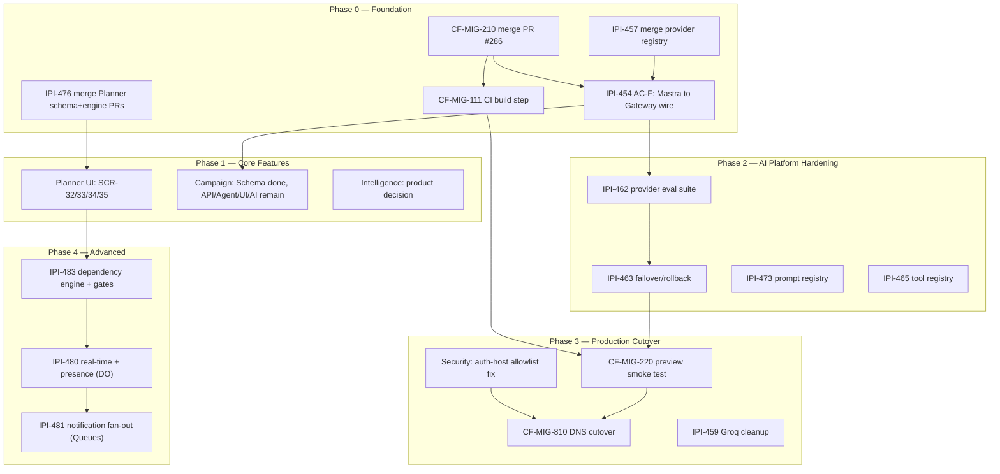

# iPix / FashionOS — Platform Roadmap

**Status:** Living reference document
**Date:** 2026-07-09
**Companion to:** `prd.md` (product/technical spec) — this document is sequencing and timing only; it does not restate what `prd.md` already defines. Full ADR detail lives in `prd.md` §11 — this roadmap's Decision Log (§9) is a chronological pointer to it, not a duplicate.
**Grounded in:** `tasks/plan/audit/00-05`, `tasks/cloudflare/CLOUDFLARE-EPIC.md`, `todo.md`, `tasks/cloudflare/mastra/MASTRA-EPIC.md`, live Linear (488 issues, confirmed via `linear/ALL issues.csv`)

Status-dot legend: 🟢 shipped/accurate · 🟡 partial/in progress · ⚪ planned, not started · 🔴 blocked or at-risk

---

## 1. Current-State Snapshot (2026-07-09)

| Track | Progress | Source of truth |
|---|:---:|---|
| Cloudflare hosting migration (Vercel → Workers via OpenNext) | 🟡 ~55-58% | `CLOUDFLARE-EPIC.md` / `todo.md` — both verified accurate against `origin/main` + live GitHub API |
| AI Gateway / provider registry | 🟡 ~45-60% | AC-C shipped (PR #279 merged); AC-F (Mastra→Gateway wire) open |
| Mastra AI agents | 🟡 4 of 7 roles real | Brand/CRM/Booking/Shoot shipped; Campaign/Research not built; Notification is system-triggered by design |
| Planner (backend) | 🟡 Schema+engine in 2 open PRs | `IPI-476`, PRs #283/#284, both CI-green |
| Planner (UI) | ⚪ 0% | Design prompts exist (`SCR-32`–`35`); no route built |
| Campaign | 🔴 Schema only | See §2 Phase 1 for the milestone split |
| Intelligence | 🟡 Panel-only | No standalone page; open product question, not a build gap |
| CRM / Booking / Brand / Shoot / Assets / Notifications | 🟢 Mature | Shipped, incremental work only |
| Linear backlog health | 🟢 Healthy | 488 issues: 41% Done+Canceled, disciplined duplicate-tagging |
| Design docs (`Universal-design-prompt-*`) | 🟢 Fixed today | Git split-brain resolved 2026-07-09 (see §8) |

**What this roadmap does NOT include:** a rebuild of Cloudflare architecture, AI agent architecture, or Linear triage — the forensic audit (`tasks/plan/audit/05-master-synthesis.md`) already concluded those are accurate as-is. No RACI, OKRs, sprint planning, or beta/shadow-traffic program — this is a single-operator project (see §8's Owner column) and those processes don't fit its scale.

---

## 2. Build-Order Phases

Each phase includes a **success metric** (how you know it's done) and **exit criteria** (what must be true before the next phase starts) — both drawn only from acceptance criteria already documented in `prd.md` or Linear, not invented targets.

### Phase 0 — Foundation (in progress now)
1. Merge PR #286 (CF-MIG-210 — runtime compat: Hono adapter, OAuth `.workers.dev` trust, Groq bundle fix).
2. Add OpenNext/Wrangler build step to CI (CF-MIG-111) — currently zero coverage.
3. Wire Mastra → AI Gateway (IPI-454 AC-F) — currently zero `AI_GATEWAY_URL` references anywhere in the app.
4. Merge the unified provider registry (IPI-457) — `model-registry.ts` exists only on a branch today.
5. Merge `IPI-476`'s two open PRs (Planner schema + engine) — foundation for Phase 1's Planner UI work.

**Success metric:** PR #286 merged; OpenNext build job green in CI; `AI_GATEWAY_URL` present in `provider.ts`; `model-registry.ts` on `main`; `IPI-476` PRs #283/#284 merged.
**Exit criteria:** all 5 items above true.

### Phase 1 — Core Features (next)

**Planner UI** (`prd.md` §6.7) — build `SCR-32` (Workspace), `SCR-33` (Dashboard), `SCR-34` (Settings), `SCR-35` (Hub — pending its own Linear issue) against the already-complete backend spec (`IPI-477`–`483`).

**Campaign** (`prd.md` §6.6) — split into visible milestones instead of one line, since it spans more ground than the other Phase 1 items:

| Milestone | Status | What it is |
|---|:---:|---|
| Schema | 🟢 Done | `public.campaigns` deployed (`IPI-268`) |
| API | ⚪ Not started | `app/api/campaigns/route.ts`, `[id]/route.ts`, `[id]/deliverables/route.ts` |
| Agent | ⚪ Not started | A real Campaign Agent registered with read/write tools (not the empty `creative-director` shell) |
| UI | ⚪ Not started | `/app/campaigns` renders a real list + detail view, replacing the current stub |
| AI | ⚪ Not started | Campaign Agent proposes a deliverable set from a brief; HITL approval gate wired (`ApprovalCard`) |

**Intelligence decision** (`prd.md` §6.8) — resolve the open product question (standalone page or panel-only) before any engineering starts here.

**Success metric:** `/app/planner` and `/app/campaigns` both render real data (no stubs); Intelligence decision recorded in `prd.md` §6.8.
**Exit criteria:** Planner UI passes `IPI-478`/`479`'s acceptance criteria; Campaign's API+Agent+UI milestones each pass their own (to-be-opened) Linear issue's acceptance criteria.

### Phase 2 — AI Platform Hardening
1. AI provider evaluation suite (IPI-462) before flipping any default-provider tier.
2. Provider failover & rollback (IPI-463).
3. Prompt registry (IPI-473) — re-attach to `MASTRA-EPIC.md`'s tracking table (currently fell out of it, see §8).
4. Shared tool registry completion (IPI-465).

**Success metric:** IPI-462's eval suite has run at least once against the current default tier; IPI-463 failover implemented; IPI-473 back in `MASTRA-EPIC.md`'s child-issue table; IPI-465 complete.
**Exit criteria:** eval suite results reviewed before any provider-tier default is changed.

### Phase 3 — Production Cutover

**Rollout plan** (deliberately simple — no beta program or shadow traffic, this is an internal operator tool, not a consumer launch):

```
Preview (*.workers.dev, already scripted via `npm run preview`)
   ↓
Smoke Testing — CF-MIG-220 (scripted checks against preview)
   ↓
Production DNS Cutover — CF-MIG-810 (Vercel → Cloudflare)
   ↓
Rollback Window (revert DNS to Vercel if issues surface — see CLOUDFLARE-EPIC.md's existing rollback plan)
```

1. Preview smoke testing (CF-MIG-220).
2. Production DNS cutover (CF-MIG-810) — only after Phase 0-2 are green.
3. Groq code/config cleanup (IPI-459) — the Groq epic (GROQ-001–007) is already Canceled in Linear; this is just removing dead code.

**Success metric:** CF-MIG-220 smoke tests pass on preview; CF-MIG-810 DNS cutover complete; IPI-459 Groq code removed.
**Exit criteria:** smoke tests green AND the rollback window plan is confirmed runnable before the DNS switch — see §4 (Security Milestones) for the auth-host check that specifically blocks this cutover today.

### Phase 4 — Advanced (Planner workflow v2, deferred Cloudflare services)
1. Planner dependency engine + auto-shift + gate approvals (`IPI-483`).
2. Real-time sync + presence (`IPI-480`) using Durable Objects.
3. Notification fan-out via Cloudflare Queues (`IPI-481`).
4. Re-evaluate the "🔬 Evaluate" row in `prd.md` §4.1 (Vectorize, AI Search, Browser Rendering, Analytics Engine) once Phase 0-3 traffic gives real usage data to evaluate against.

**Success metric:** each item passes its own Linear acceptance criteria (summarized in `prd.md` §6.7's AC table).
**Exit criteria:** N/A — this is the platform's ongoing advanced-feature backlog, not a gate to a further phase.

---

## 3. MVP Release Gate

A Go/No-Go checklist — every line is a criterion already documented in `prd.md`, this roadmap, or a Linear issue. Nothing here is a new target.

| # | Criterion | Source |
|---|---|---|
| 1 | Cloudflare DNS cutover complete (`CF-MIG-810`), Vercel decommissioned as production host | §2 Phase 3 |
| 2 | All CI jobs green, including the new OpenNext build step (`CF-MIG-111`) | §2 Phase 0, §4 |
| 3 | AI Gateway wired — `AI_GATEWAY_URL` live in `provider.ts`, `model-registry.ts` merged (`IPI-454` AC-F, `IPI-457`) | §2 Phase 0 |
| 4 | OAuth callback trusts the production Cloudflare host, not only `.vercel.app` | `tasks/plan/audit/00-repo-ground-truth.md` §11 — see §4 below, this is a known blocker |
| 5 | Planner operational — `IPI-476` merged, `IPI-478`/`479` UI shipped | §2 Phase 1 |
| 6 | Campaign operational — passes `prd.md` §6.6's acceptance criteria | §2 Phase 1 |
| 7 | Preview smoke tests passing (`CF-MIG-220`) | §2 Phase 3 |
| 8 | RLS verified across all schemas (`npm run supabase:verify-rls`) | §4 |
| 9 | No `SUPABASE_SERVICE_ROLE_KEY` in any browser bundle (existing rule, `prd.md` §8) | §4 |
| 10 | Rollback window confirmed runnable (`CLOUDFLARE-EPIC.md`'s existing rollback plan) | §2 Phase 3 |

No performance targets or KPIs are listed here — none are documented anywhere in this repo today. Add them to this table only when a real target exists to check against.

---

## 4. Testing & Validation

**What exists today (verified against `.github/workflows/ci.yml` and the scripts directory):**

| Type | Coverage | Where |
|---|---|---|
| Unit/integration tests | `npm test` (Vitest) | CI job `app-build` |
| RLS verification | `scripts/verify-rls.mjs` | CI job `supabase-web015`, plus `npm run supabase:verify-rls` |
| Booking-flow gate | Real Supabase project smoke check | CI job `booking-gate` (conditional on `DATABASE_URL` secret) |
| Manual/scripted E2E | Playwright MCP tool available in this environment | **Not wired into CI** — used ad hoc, not an automated suite today |

**Explicitly missing (future gaps, not built — do not treat as done):**
- Load testing — no tooling or Linear issue exists for this.
- Failover/resilience testing (provider fallback, DO/Queue failure modes) — `IPI-463` covers provider failover *logic*, not a test harness for it.
- Formal security testing (penetration testing, dependency scanning beyond what CI's env-guard script checks) — not scheduled anywhere.
- Automated accessibility testing — the `accessibility` skill provides manual review guidance; no automated a11y CI check exists.

These four gaps are flagged, not scheduled — add them to a phase only when there's a concrete plan to build the harness, not as a placeholder.

---

## 5. Security Milestones

Based only on the current, real architecture (`prd.md` §8, §4.1) — not a new security program.

| Area | Current state | Gate for production cutover? |
|---|---|:---:|
| RLS | Four-tier model (owner/manager/contributor/viewer) established via Planner, applied per-schema; `verify-rls.mjs` script exists | Yes — item 8 in §3 |
| Authentication | Supabase Auth; OAuth callback host-allowlist currently trusts same-origin, `SITE_URL`, and `.vercel.app` only — **does not yet trust the Cloudflare production host** | **Yes — this blocks `CF-MIG-810` today**, see §3 item 4 |
| Secrets | No `SUPABASE_SERVICE_ROLE_KEY` in any browser bundle (enforced rule); Cloudflare-side secret management via Wrangler — not yet documented | Rule enforced; Wrangler secrets process is a documentation gap, not a code gap |
| Rate limiting | AI Gateway has no explicit rate-limit policy yet — already flagged as a real gap in `prd.md` §4.1 | Not currently a hard gate, but should be resolved before production traffic scales |
| Audit logging | `planner.events` (Planner instance audit trail); `ai_agent_logs` (Mastra tool-call logging) — both already shipped | Already satisfied |

---

## 6. Dependency Diagram

Consolidates the Cloudflare Gantt (`CLOUDFLARE-EPIC.md` §8), the Planner issue chain (`IPI-484`'s epic), and the Mastra phase plan (`MASTRA-EPIC.md`) into one picture.



---

## 7. Per-Track Detail

### 7.1 Cloudflare hosting migration
**Next milestone:** merge PR #286, add CI build step.
**Blocker:** none — both are unblocked, ready to execute.

### 7.2 AI Gateway / provider registry
**Next milestone:** IPI-454 AC-F (wire `resolveModel()` to the gateway via `@ai-sdk/openai-compatible`).
**Blocker:** IPI-457 (provider registry) must merge first — `model-registry.ts` doesn't exist on `main` yet.

### 7.3 Planner
**Next milestone:** merge PRs #283/#284 (schema + engine), then start `SCR-32` (Workspace) — the highest-value UI piece since it embeds into the existing Shoot schedule tab.
**Blocker:** none currently — backend PRs are CI-green and ready for review.

### 7.4 Campaign
**Next milestone:** the API milestone (§2 Phase 1 table) — lib module + `/api/campaigns` route against the already-deployed schema.
**Blocker:** none — this is pure backlog, not blocked by anything else in this roadmap.

### 7.5 Intelligence
**Next milestone:** a product decision (standalone page vs. panel-only) — not an engineering task.
**Blocker:** needs a decision-maker, not a PR.

---

## 8. Risk Register

| Risk | Status | Owner | Action |
|---|:---:|---|---|
| `Universal-design-prompt5`/`-new` git split-brain | 🟢 Resolved 2026-07-09 | Project (Single Operator) | Content merged + staged; awaiting your go-ahead to commit |
| `config/groq-models.json` uncommitted deletion in working tree | 🟡 Open | Project (Single Operator) | Do not commit current working-tree state as-is; restore or explicitly re-delete with intent |
| `todo.md` (~58%) vs. `CLOUDFLARE-EPIC.md` (~55%) self-contradiction | 🟡 Open | Project (Single Operator) | Pick one number, update the other, before next status report |
| 5 `CF-MIG-*` tasks have no Linear issue | 🟡 Open | Project (Single Operator) | Create them under `IPI-487` — blocks nothing today, but breaks any future Linear-native dependency view |
| `IPI-473` (Prompt Registry) missing from `MASTRA-EPIC.md`'s child list | 🟡 Open | Project (Single Operator) | One-line fix, add it back |
| Two Linear issues (IPI-471, IPI-461) cite nonexistent proof files | 🟡 Open | Project (Single Operator) | Fix descriptions — doesn't block any current work, `MASTRA-EPIC.md`/`mastra-audit.md` already ignore the bad claims |
| `deep-architecture-review.md` un-actioned findings (70-issue Linear audit, cost table) | 🟡 Open | Project (Single Operator) | Action into Linear or mark "not adopted" so the doc stops claiming to supersede `cf-000` |
| OAuth callback doesn't trust the Cloudflare production host | 🔴 Open, blocks cutover | Project (Single Operator) | Fix `isTrustedForwardedHost()` before `CF-MIG-810` — see §5 |
| Campaign / Planner-UI / Intelligence gaps | 🟡 Tracked | Project (Single Operator) | This is Phase 1 — see §2 |

*(This is a single-operator project — nearly every Linear issue shares the same creator/assignee. "Project (Single Operator)" reflects that reality rather than inventing team roles.)*

---

## 9. Decision Log

Chronological record of key architectural decisions already made. Full ADR-numbered detail lives in `prd.md` §11 — this is a "when and why," not a duplicate of that index.

| Date | Decision | Why |
|---|---|---|
| 2026-07-07 | Approved Cloudflare Workers (via OpenNext) as the hosting runtime | Original `cf-000` draft still named Vercel as host; superseded by later direction, confirmed on disk (`app/wrangler.jsonc` exists) |
| 2026-07-07 | Approved AI Agent Architecture — Mastra stays for orchestration, Workers AI is free-first default | Avoids a costly rewrite onto Cloudflare Agents SDK; Workers AI has a 10K/day free tier |
| 2026-07-07 | Groq epic (`GROQ-001`–`007`) Canceled | Provider strategy consolidated to Workers AI (default) + Gemini (fallback) |
| 2026-07-09 | Planner RLS model set to four-tier (owner/manager/contributor/viewer) | Audit revision of `IPI-476` tightened an earlier binary org-member model |
| 2026-07-09 | `Universal-design-prompt5`/`-new` git split-brain resolved to a single tracked folder | Untracked folder held the only copy of new Planner design work — real data-loss exposure |

---

## 10. Doc-Hygiene Checklist

Small, concrete, non-blocking cleanup — do opportunistically, not as a gate on Phase 0-4:

- [ ] Delete/replace `tasks/cloudflare/audits/09-gemini-groq-audit.md` (treats a Canceled epic as a live blocker).
- [ ] Archive 7 of 12 files in `tasks/cloudflare/migration/*.md` (superseded snapshots + one raw session transcript).
- [ ] Delete or re-label `tasks/cloudflare/mastra/cloudflare-mastra-build.md` (verbatim public blog post, zero iPix content).
- [ ] Archive `tasks/cloudflare/mastra/mastra issues.md` (300KB raw Linear export — source of the two fabricated proof claims).
- [ ] Add 2 short paragraphs to `cf-000-platform-architecture.md` (rate limiting policy, cost-optimization pointer).
- [ ] Fix `DESIGN.md`'s 3 broken Quick Start paths (`docs/design/claude-design/...` doesn't exist — real files split across `uploads/claude-design/` and `design-patched/`).
- [ ] Fold `design-patched/plan.md` + `design-patched/changelog.md` into the root `PLAN.md`/`changelog.md` (already self-flagged as "Reconcile pending" in the doc set itself).
- [ ] Archive `design-audit-2026-06-28-rev2.md` (explicitly superseded).
- [ ] Attach a Project to ~19 Cloudinary `CLD-1xx` Linear issues + both top-level epics (IPI-486, IPI-487).
- [ ] Point future Linear audits at `linear/ALL issues.csv` (current, 488 rows) instead of `linear/all-issues.md` (15-row recent-activity slice, mislabeled).

Full detail and evidence for every item above: `tasks/plan/audit/01` through `04`.
