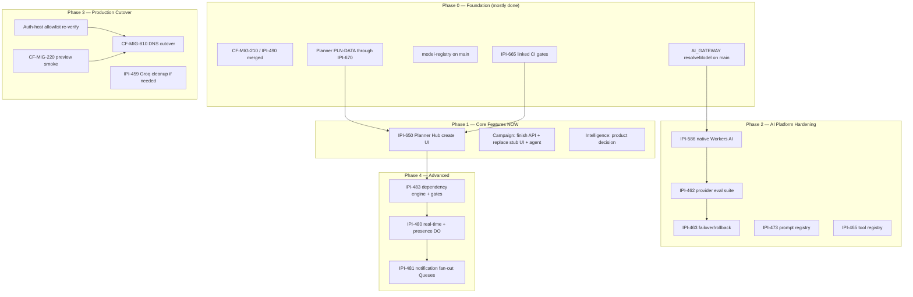

# iPix / FashionOS — Platform Roadmap

**Status:** Living reference document  
**Date:** 2026-07-09 · **Verified:** 2026-07-18  
**Companion to:** `prd.md` (product/technical spec) — this document is sequencing and timing only; it does not restate what `prd.md` already defines. Full ADR detail lives in `prd.md` §11 — this roadmap's Decision Log (§9) is a chronological pointer to it, not a duplicate.  
**Grounded in:** `prd.md` (verified 2026-07-18), `todo.md` (cross-lane NOW master), `tasks/prime/todo`, `tasks/cloudflare/todo.md`, `CLOUDFLARE-EPIC.md`, live Linear + `origin/main`

Status-dot legend: 🟢 shipped/accurate · 🟡 partial/in progress · ⚪ planned, not started · 🔴 blocked or at-risk

---

## Verification pass (2026-07-18)

| Claim in Jul 9 roadmap | Verdict | Correction |
|---|---|---|
| CF hosting ~55–58%; next = merge PR #286 | ❌ Stale | **IPI-490 · CF-MIG-210** / PR #286/#410 merged; native OpenNext **`ipix-prod`** is live; custom Worker **frozen** |
| AI Gateway / AC-F “zero `AI_GATEWAY_URL`” | ❌ Stale | `resolveModel()` + `AI_GATEWAY_URL` / `AI_ROUTING_MODE=gateway` on `main`; further work = **IPI-586 · CF-AI-005** (native Workers AI) |
| `model-registry.ts` only on a branch | ❌ Stale | On `main` (`app/src/lib/ai/model-registry.ts`) |
| Planner backend = 2 open PRs (#283/#284) | ❌ Stale | Schema/engine + materialization shipped through **IPI-649 / 653 / 670**; next = Hub create UI (**IPI-650**) |
| Planner UI = 0% / no route | ❌ Stale | Dashboard + settings shells + shoot tab shipped; Hub create still open |
| Campaign schema-only + API not started | 🟡 Partial | Schema done; **list API** shipped; page still stub; no Campaign agent |
| Phase 0 “in progress now” (all 5 items open) | ❌ Stale | Phase 0 foundation items largely **done**; remaining CF work is cutover + native AI path |
| OAuth trusts `.vercel.app` only | 🟡 Recheck at cutover | Runtime host trust improved with Workers work; treat as **gate to re-verify** before `CF-MIG-810`, not assumed fixed forever |
| Risks: design split-brain, 55 vs 58%, groq JSON | 🟡 Mostly obsolete | Closed or superseded by later merges; see §8 |

---

## 1. Current-State Snapshot (2026-07-18)

| Track | Progress | Source of truth |
|---|:---:|---|
| Cloudflare hosting (Vercel → Workers via OpenNext) | 🟡 Preview / `ipix-prod` live; DNS cutover open | `CLOUDFLARE-EPIC.md`, `tasks/cloudflare/todo.md` — custom Worker **frozen** |
| AI Gateway / provider routing | 🟡 Core wire shipped; native Workers AI next | `provider.ts` + **IPI-586 · CF-AI-005** |
| Mastra AI agents | 🟡 Multi-agent registry live | Planner / Brand / CRM / Booking paths real; Campaign/Research still thin or missing |
| Planner (backend) | 🟢 Schema + engine + complete-phase materialization | **IPI-649 / 653 / 664 / 670** Done on remote |
| Planner (UI) | 🟡 Shells + dashboard; Hub create open | **IPI-650 · PLN-UI-001** next; SCR-32/33/34 partially landed |
| Campaign | 🟡 Schema + list API; page stub | `/app/campaigns` still “Coming soon”; no Campaign agent |
| Intelligence | 🟡 Panel-only | Product question remains (standalone vs panel) |
| CRM / Booking / Brand / Shoot / Assets / Notifications | 🟢 Mature | Incremental work only |
| Supabase linked CI | 🟡 PR open | **IPI-665 · SB-CI-001** — PR [#431](https://github.com/amo-tech-ai/lumina-studio/pull/431) |
| NOW queue | 🟢 Healthy | Root `todo.md` + `tasks/prime/todo` |

**What this roadmap does NOT include:** a rebuild of Cloudflare architecture, AI agent architecture, or Linear triage. No RACI, OKRs, sprint planning, or beta/shadow-traffic program — this is a single-operator project (see §8) and those processes don't fit its scale.

---

## 2. Build-Order Phases

Each phase includes a **success metric** and **exit criteria** drawn from `prd.md` / Linear, not invented targets.

### Phase 0 — Foundation (mostly complete — 2026-07-18)

| # | Item | Status |
|---|---|---|
| 1 | CF-MIG-210 runtime compat (Hono / OAuth / Groq bundle) — PRs #286 / #410 | 🟢 Done |
| 2 | OpenNext / Wrangler path in CI / preview | 🟢 Partial → treat as continuous; `ipix-prod` preview path exists |
| 3 | Mastra → AI Gateway (`AI_GATEWAY_URL` / `resolveModel`) | 🟢 Done on `main` (opt-in `AI_ROUTING_MODE=gateway`) |
| 4 | Unified provider registry (`model-registry.ts`) | 🟢 On `main` |
| 5 | Planner schema + engine (`IPI-476` lineage → PLN-DATA series) | 🟢 Done through **IPI-670** |

**Remaining Phase-0-adjacent work (not the Jul 9 list):**
1. Land **IPI-665 · SB-CI-001** (linked drift / lint / types gates) — PR #431.
2. Advance **IPI-586 · CF-AI-005** (native Workers AI path) — do **not** extend the frozen custom Worker.
3. Keep OpenNext preview smoke green while preparing cutover.

**Success metric (updated):** Phase 0 Jul 9 checklist items 1–5 true on `main`; linked Supabase gates green after #431 merges.  
**Exit criteria:** #431 merged; no open “foundation” blockers for Planner Hub / Campaign API work.

### Phase 1 — Core Features (NOW)

**Planner UI** (`prd.md` §6.7) — finish Hub create (**IPI-650 · PLN-UI-001**), then settings polish / remaining SCR-32–35 gaps against the shipped backend.

**Campaign** (`prd.md` §6.6):

| Milestone | Status | What it is |
|---|:---:|---|
| Schema | 🟢 Done | `public.campaigns` deployed |
| API | 🟡 Partial | List route exists; detail / deliverables still thin or missing |
| Agent | ⚪ Not started | Real Campaign Agent with read/write tools |
| UI | ⚪ Stub | `/app/campaigns` must replace “Coming soon” |
| AI | ⚪ Not started | Deliverable proposals + HITL (`ApprovalCard`) |

**Intelligence decision** (`prd.md` §6.8) — resolve standalone page vs panel-only before large engineering.

**Success metric:** `/app/planner` Hub can create a real instance; `/app/campaigns` renders real data (no stub); Intelligence decision recorded in `prd.md` §6.8.  
**Exit criteria:** **IPI-650** AC met; Campaign API+UI milestones each pass their Linear AC.

### Phase 2 — AI Platform Hardening
1. AI provider evaluation suite (**IPI-462**) before flipping any default-provider tier.
2. Provider failover & rollback (**IPI-463**).
3. Prompt registry (**IPI-473**) — keep attached in `MASTRA-EPIC.md`.
4. Shared tool registry completion (**IPI-465**).
5. Native Workers AI cutover path (**IPI-586 · CF-AI-005**) — replaces “wire the frozen Worker” as the AI platform next step.

**Success metric:** eval suite run once against current default tier; failover implemented; IPI-586 acceptance advancing; IPI-465 complete.  
**Exit criteria:** eval results reviewed before any provider-tier default change.

### Phase 3 — Production Cutover

```
Preview (*.workers.dev / ipix-prod — already in use)
   ↓
Smoke Testing — CF-MIG-220
   ↓
Production DNS Cutover — CF-MIG-810 (Vercel → Cloudflare)
   ↓
Rollback Window (revert DNS to Vercel if needed — CLOUDFLARE-EPIC.md)
```

1. Preview smoke testing (**CF-MIG-220**).
2. Production DNS cutover (**CF-MIG-810**) — only after Phase 1–2 risks acceptable.
3. Groq dead-code cleanup (**IPI-459**) if any remain after prior merges.
4. Re-verify OAuth / auth host allowlist against the **production** Cloudflare hostname before flip.

**Success metric:** CF-MIG-220 green on preview; CF-MIG-810 complete; auth-host check green.  
**Exit criteria:** smoke green **and** rollback plan confirmed runnable (§4 / §5).

### Phase 4 — Advanced (Planner workflow v2, deferred Cloudflare services)
1. Planner dependency engine + auto-shift + gate approvals (**IPI-483**).
2. Real-time sync + presence (**IPI-480**) via Durable Objects.
3. Notification fan-out via Cloudflare Queues (**IPI-481**).
4. Re-evaluate `prd.md` §4.1 “Evaluate” row (Vectorize, AI Search, Browser Rendering, Analytics Engine) once traffic exists.

**Success metric:** each item passes its Linear AC (summarized in `prd.md` §6.7).  
**Exit criteria:** N/A — ongoing advanced backlog.

---

## 3. MVP Release Gate

| # | Criterion | Source | 2026-07-18 note |
|---|---|---|---|
| 1 | Cloudflare DNS cutover complete (`CF-MIG-810`), Vercel decommissioned as production host | §2 Phase 3 | Still open |
| 2 | All CI jobs green, including OpenNext / linked Supabase gates | §2 Phase 0, §4 | **IPI-665** adds linked gates |
| 3 | AI routing usable in production — gateway or native Workers AI path documented + env complete | §2 Phase 0 / 2 | Core gateway wire **done**; prefer **IPI-586** for long-term default |
| 4 | OAuth callback trusts the production Cloudflare host | §5 | **Re-verify** before cutover |
| 5 | Planner operational — backend Done; Hub create + core UI usable | §2 Phase 1 | Backend ✅; **IPI-650** open |
| 6 | Campaign operational — `prd.md` §6.6 AC | §2 Phase 1 | Still open (page stub) |
| 7 | Preview smoke tests passing (`CF-MIG-220`) | §2 Phase 3 | Still open as formal gate |
| 8 | RLS verified (`npm run supabase:verify-rls`) | §4 | Ongoing; Planner probes expanded via PLN-DATA series |
| 9 | No `SUPABASE_SERVICE_ROLE_KEY` in any browser bundle | `prd.md` §8 | Still enforced |
| 10 | Rollback window confirmed runnable | §2 Phase 3 | Still required at cutover |

No performance KPIs listed — none are documented as hard targets in-repo today.

---

## 4. Testing & Validation

**What exists today:**

| Type | Coverage | Where |
|---|---|---|
| Unit/integration | `npm test` (Vitest) | CI `app-build` |
| RLS verification | `scripts/verify-rls.mjs` | CI `supabase-web015` + `npm run supabase:verify-rls` |
| Booking-flow gate | Real Supabase smoke | CI `booking-gate` (needs `DATABASE_URL`) |
| Linked Supabase gates | Drift / `db lint` / types regen | **IPI-665** workflow (merge via PR #431) |
| Manual/scripted E2E | Playwright / MCP | Ad hoc — **not** a full automated CI suite |

**Explicitly missing (flagged, not scheduled):**
- Load testing
- Failover/resilience harness beyond **IPI-463** logic
- Formal pen-test / broad security program
- Automated a11y CI

---

## 5. Security Milestones

| Area | Current state | Gate for production cutover? |
|---|---|:---:|
| RLS | Four-tier Planner model + org-scoped assets; `verify-rls.mjs` | Yes — §3 item 8 |
| Authentication | Supabase Auth; host allowlist must include production CF host | **Yes — re-verify before `CF-MIG-810`** |
| Secrets | No service-role in browser; Infisical + Wrangler secrets | Rule enforced; keep Infisical as SSOT |
| Rate limiting | AI Gateway / Workers AI policy still thin | Soft gate until traffic scales |
| Audit logging | `planner.events`, `ai_agent_logs` | Already satisfied |

---

## 6. Dependency Diagram



---

## 7. Per-Track Detail

### 7.1 Cloudflare hosting migration
**Next milestone:** keep `ipix-prod` preview healthy; run **CF-MIG-220** smoke; prepare **CF-MIG-810** DNS cutover.  
**Do not:** extend the frozen custom Worker as the primary product path.  
**Blocker:** auth-host + smoke gates before DNS flip — not “merge #286” anymore.

### 7.2 AI Gateway / provider registry
**Next milestone:** **IPI-586 · CF-AI-005** (native Workers AI) and Phase 2 eval/failover.  
**Blocker:** none for registry merge — already on `main`. Gateway wire is opt-in via `AI_ROUTING_MODE`.

### 7.3 Planner
**Next milestone:** **IPI-650 · PLN-UI-001** — Hub create UI against shipped RPC.  
**Blocker:** none for backend; UI is the gap.

### 7.4 Campaign
**Next milestone:** replace `/app/campaigns` stub + deepen API/agent.  
**Blocker:** none — pure backlog.

### 7.5 Intelligence
**Next milestone:** product decision (standalone vs panel-only).  
**Blocker:** decision-maker, not a PR.

### 7.6 Supabase / CI
**Next milestone:** merge **IPI-665 · SB-CI-001** (#431).  
**Blocker:** CI green on that PR.

---

## 8. Risk Register

| Risk | Status | Owner | Action |
|---|:---:|---|---|
| Custom Worker vs native OpenNext dual-path confusion | 🟡 Managed | Project (Single Operator) | Treat custom Worker as **frozen**; ship product on `ipix-prod` / IPI-586 |
| OAuth / auth host mismatch at DNS cutover | 🔴 Open until re-verified | Project (Single Operator) | Explicit check before `CF-MIG-810` |
| Campaign stub while schema/API partial | 🟡 Tracked | Project (Single Operator) | Phase 1 — §2 |
| Planner Hub create missing while backend Done | 🟡 Tracked | Project (Single Operator) | **IPI-650** |
| Linked remote drift without CI | 🟡 Mitigating | Project (Single Operator) | Merge **IPI-665** #431 |
| `Universal-design-prompt5` git split-brain | 🟢 Resolved 2026-07-09 | — | Historical |
| `todo.md` 55% vs 58% contradiction | 🟢 Superseded | — | Root `todo.md` is NOW master (2026-07-18) |
| `IPI-473` missing from Mastra epic table | 🟡 Open if still true | Project (Single Operator) | One-line epic hygiene |
| Fabricated Linear proof-file citations | 🟡 Hygiene | Project (Single Operator) | Fix descriptions when touched |

*(Single-operator project — “Project (Single Operator)” is literal, not a fake RACI.)*

---

## 9. Decision Log

| Date | Decision | Why |
|---|---|---|
| 2026-07-07 | Approved Cloudflare Workers (via OpenNext) as hosting runtime | Superseded Vercel-as-host drafts; `app/wrangler.jsonc` on disk |
| 2026-07-07 | Mastra stays for orchestration; Workers AI free-first default | Avoid Agents SDK rewrite; Workers AI free tier |
| 2026-07-07 | Groq epic (`GROQ-001`–`007`) Canceled | Strategy → Workers AI + Gemini |
| 2026-07-09 | Planner RLS four-tier (owner/manager/contributor/viewer) | Tightened earlier binary org-member model |
| 2026-07-09 | Design-prompt git split-brain resolved | Prevented loss of Planner design work |
| 2026-07-14 | Custom Cloudflare Worker frozen; native OpenNext is product path | Stop dual-maintenance; `ipix-prod` is the deploy surface |
| 2026-07-18 | Planner complete-phase materialization enforced (`IPI-670`) | Zero-phase instances blocked at RPC + app |
| 2026-07-18 | Linked Supabase CI gates (`IPI-665`) required for schema PRs | Drift/lint/types must fail closed |

---

## 10. Doc-Hygiene Checklist

Opportunistic cleanup — not a gate on Phase 0–4:

- [ ] Delete/replace stale Groq-as-blocker audits under `tasks/cloudflare/audits/`
- [ ] Archive superseded `tasks/cloudflare/migration/*.md` snapshots
- [ ] Delete or re-label zero-iPix Mastra blog mirrors
- [ ] Archive huge raw Linear exports that seeded bad proof claims
- [ ] Keep `prd.md` / this roadmap / `todo.md` dates aligned after each verify pass
- [ ] Fix broken design Quick Start paths if still wrong in `DESIGN.md`
- [ ] Prefer root `todo.md` + lane `tasks/*/todo.md` over Jul 2 `tasks/plan/todo.md` (historical)

Full historical audit trail: `tasks/plan/audit/01`–`04` (Jul 9 forensic set — useful history, not current NOW queue).
