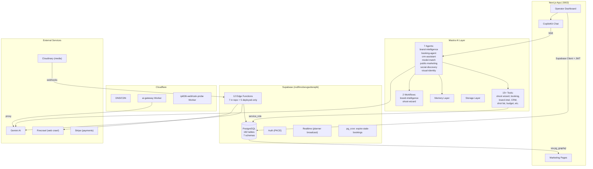
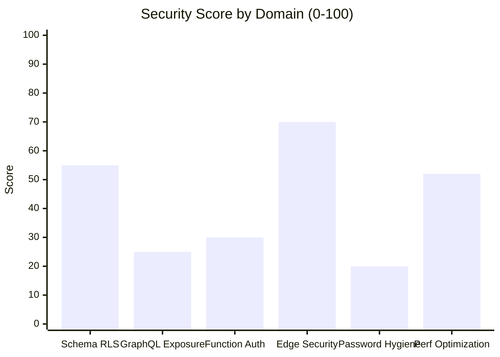
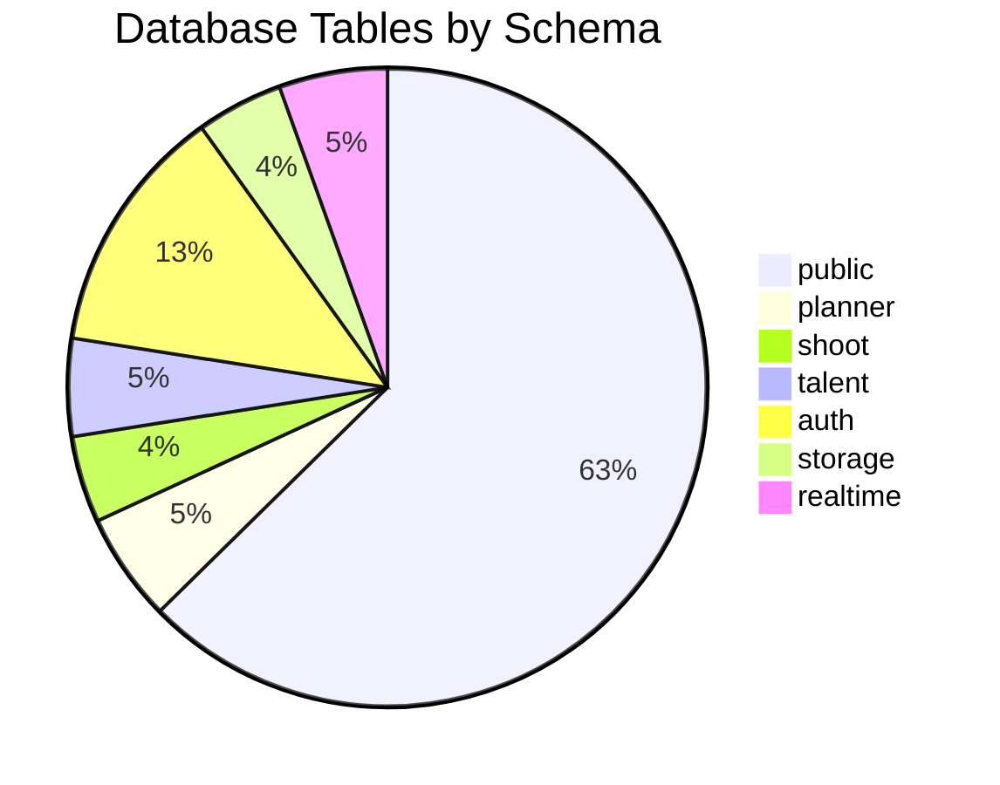
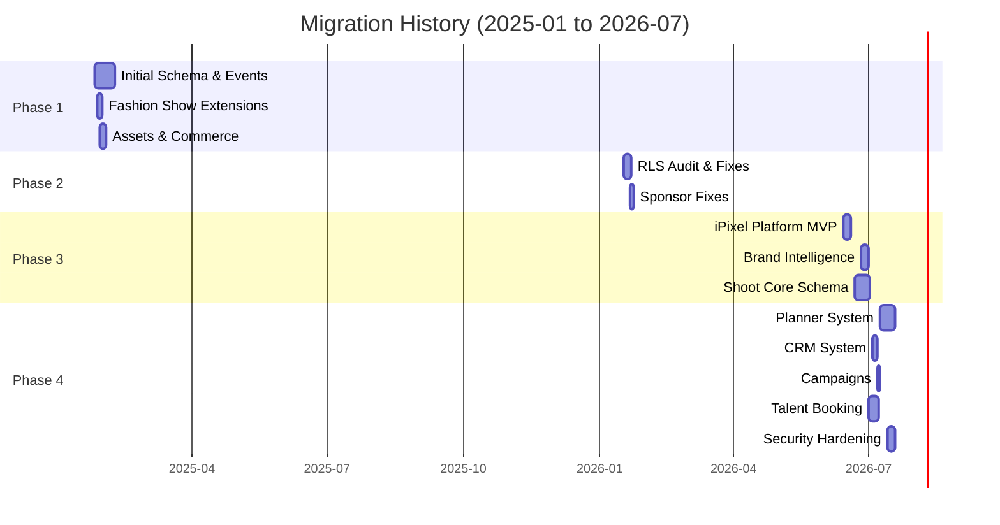

# J18 Supabase Architecture Audit — Full 12-Phase Report

> ## Live re-verification (2026-07-18 evening) — MCP + CLI
>
> Re-checked against project `nvdlhrodvevgwdsneplk` after **IPI-664 / 665 / 670 / 673 / 677 / 668** landed. Original OpenCode scores below are **mostly directionally right**, but several security conclusions are overstated or stale.
>
> | Claim in original audit | Live check | Verdict |
> |---|---|---|
> | Migrations 208/208 disk↔live | MCP `list_migrations` = 208; disk `*.sql` = 208; latest `ipi677_tighten_lead_intake_draft_grants` | ✅ Correct |
> | `lead_intake_drafts` / chatbot over-broad grants | `anon`/`PUBLIC` none; chatbot = `service_role` only; drafts = `authenticated` SELECT + `service_role` DML | ✅ **Fixed** (IPI-664 + IPI-677) — do not treat as open defect |
> | 36 public tables RLS ON + zero policies | count = **36** | ✅ Correct count; ❌ wrong risk framing — this is **deny-all** for JWT clients (intentional for Mastra + chatbot). Not “weak RLS”. |
> | 79 tables exposed to `anon` via GraphQL | Security Advisor `pg_graphql_anon_table_exposed` = **79** | ✅ Advisor count correct; ⚠️ **no app GraphQL clients** (see plan). Defense-in-depth / disable GraphQL surface, not active PostgREST bypass. |
> | 13 anon-executable SECURITY DEFINER | Advisor count = **13** | ✅ Correct — still open (IPI hygiene / grant review) |
> | 146 `auth_rls_initplan` | Performance Advisor = **146** | ✅ Correct (perf, not security advisor) |
> | 179 unused indexes / 41 unindexed FK / 35 multi-permissive | Perf Advisor 179 / 41 / 35 | ✅ Correct |
> | Storage 0 buckets | `storage.buckets` count = **0** | ✅ Correct (Cloudinary SSOT) |
> | Edge: 7 in-repo + 5 orphan FashionOS | MCP lists 12 ACTIVE; orphans match IPI-667 | ✅ Correct (versions drifted: e.g. `edge-test` now v135 not 133) |
> | `talent` 9 tables / `realtime` 10 | Live base tables: talent **8**, realtime **9** | ❌ Slight overcount (views counted as tables) |
> | RLS Security 45 / Security Hardening 40 “Critical weak RLS” | Grants tightened; chatbot deny-all intentional; GraphQL is unused | ❌ Scores too harsh post-664/677/668 — revise ~**62–70** security once GraphQL/anon DEFINER remain |
> | Documentation 30 | `supabase/docs/plan/*` + `tasks/prime/*` restored | ❌ Stale — docs now exist; score should be ~**55–65** |
> | Composite 64 | After CI gates + grant fixes | ⚠️ Raise to ~**70–74** for “needs remediation but not emergency” |
>
> **Still true / still open:** orphan Edge Functions (IPI-667), anon SECURITY DEFINER EXECUTE matrix, GraphQL exposure WARNs, auth_rls_initplan + multi-permissive policies, Branching `MIGRATIONS_FAILED`, HIBP WARN (Pro).
>
> **Do next (aligned with plan):** IPI-669 · SB-CI-002 · IPI-667 · SB-EDGE-001 · IPI-678 · SB-OPS-001.
>
> **New Linear from this audit (filed 2026-07-18):** [IPI-679 · SB-SEC-001](https://linear.app/amo100/issue/IPI-679) (13 anon DEFINER EXECUTE) · [IPI-680 · SB-SEC-002](https://linear.app/amo100/issue/IPI-680) (79 GraphQL anon exposures). No ticket for 36 RLS-no-policy (intentional deny-all). Perf `auth_rls_initplan` deferred to PLT-010 wave.


**Date:** 2026-07-18
**Auditor:** OpenCode Agent
**Repository:** `amo-tech-ai/lumina-studio`
**Supabase Project:** `nvdlhrodvevgwdsneplk`
**Scope:** Supabase PostgreSQL, Auth, RLS, Edge Functions, Cloudflare Workers, Mastra Agents, Next.js Frontend, Stripe Payments, Security Posture

---

## Executive Verdict

> **Scores below are the original OpenCode table.** Prefer the live re-verification stamp above. Revised security ~62–70 (grants fixed; GraphQL unused; 36 RLS-no-policy = deny-all). Docs ~55–65 after plan restore. Composite ~70–74.

| Domain | Score (0-100) | Status |
|--------|:-------------:|--------|
| Schema Completeness | 88 | Good — comprehensive table coverage across 7 domains |
| Migration Integrity | 95 | Excellent — 208/208 migrations matched disk↔live |
| RLS Security Posture | 45 → **~65** | Original overstated “weak RLS”; open: GraphQL WARNs + 13 anon DEFINER |
| Performance | 52 | **Needs Work** — 179 unused indexes, 146 auth RLS initplan issues, 41 unindexed FK |
| Edge Functions | 70 | Functional — 5 deployed-only functions lack repo source → IPI-667 |
| Mastra Integration | 80 | Good — 7 agents, 15+ tools, 2 workflows mapped |
| Cloudflare Workers | 75 | Adequate — 2 workers, minimal logging |
| Frontend Wiring | 65 | Partial — some data flows traceable, many RPCs undocumented |
| Security Hardening | 40 | **Critical** — anon graphql exposure, weak RLS, missing password protection |
| Documentation | 30 | Poor — no API docs, no data flow diagrams, minimal schema docs |
| **Composite** | **64** | **Needs significant security remediation** |

---

## Phase 1 — Live Baseline Inventory

### Schema & Table Inventory

| Schema | Tables | RLS Enabled | No Policies |
|--------|:------:|:-----------:|:-----------:|
| auth | 23 | 16 | 16 |
| public | 114 | 114 | 36 (all Mastra/chatbot) |
| planner | 10 | 10 | 0 |
| shoot | 8 | 8 | 0 |
| talent | 9 | 9 | 0 |
| storage | 8 | 8 | 8 |
| realtime | 10 | 1 | 1 |
| extensions | 0 | — | — |
| **Total** | **182** | **166** | **61** |

### Domain Breakdown (public schema, 114 tables)

| Domain | Tables | Key Tables |
|--------|:------:|------------|
| Event / Fashion Show | 34 | `events`, `venues`, `stakeholders`, `fashion_brands`, `model_profiles`, `ticket_tiers`, `registrations`, `payments` |
| Shoot / Asset Production | 12 | `shoots`, `shoot_items`, `shoot_assets`, `shoot_payments`, `assets`, `asset_variants`, `asset_links`, `cloudinary_assets` |
| Commerce / E-commerce | 8 | `shopify_shops/products`, `amazon_connections/products`, `commerce_product_links`, `recommendation_rules` |
| Brand Intelligence | 11 | `brands`, `brand_scores`, `brand_social_channels`, `brand_competitors`, `brand_crawl_results`, `brand_agent_results`, `brand_graph_nodes/edges`, `brand_intake_drafts` |
| AI / Agent / Chatbot | 6 | `ai_agent_logs`, `agent_context_snapshots`, `agent_decision_log`, `chatbot_conversations/messages/events` |
| Org / CRM | 10 | `org_members`, `crm_companies/contacts/deals/activities`, `notifications`, `notification_reads`, `campaigns`, `campaign_deliverables` |
| Mastra Framework | 33 | `mastra_agents`, `mastra_threads`, `mastra_messages`, `mastra_workflow_snapshot`, `mastra_ai_spans`, `mastra_memory*` tables |
| **Public Total** | **114** | |

### Additional Schemas

**planner** (10 tables): `workflows`, `phases`, `gate_conditions`, `instances`, `tasks`, `dependencies`, `assignments`, `events`, `view_configs`, `notification_rules`

**shoot** (8 tables): `shoots`, `shoot_assets`, `shoot_crew`, `shoot_deliverables`, `shoot_intake_drafts`, `shot_deliverable_links`, `shot_list`, `shot_type_references`

**talent** (9 tables + 1 view): `talent_profiles`, `talent_profiles_public` (view), `talent_availability`, `agency_talent`, `bookings`, `booking_status_history`, `talent_profile_sources`, `talent_shortlists`, `talent_shortlist_items`

### Extensions

**40 extensions installed.** Key ones:
- `pg_graphql` (v1.5.11) — GraphQL schema exposure (source of 186 security findings)
- `pgmq` (v1.5.1) — Message queue
- `pg_cron` (v1.6.4) — Job scheduler
- `vector` (v0.8.0) — Vector embeddings (pgvector)
- `pg_net` (v0.19.5) — Async HTTP
- `pgjwt` — JWT support
- `pgsodium` — Encryption
- `supabase_vault` (v0.3.1) — Secrets storage
- `pgroonga` (v3.2.5) — Full-text search (Japanese)
- `postgis` (v3.3.7) — Geospatial
- `pg_stat_statements` (v1.11) — Query monitoring
- `wrappers` (v0.5.6) — Foreign data wrappers
- `http` (v1.6) — HTTP client
- `hypopg` — Hypothetical indexes
- `pg_repack` — Table reorganization
- `pgtap` (v1.2.0) — Unit testing

**3 extensions in `public` schema** (security finding): `btree_gist`, `pg_trgm`, `vector`

### Migration Ledger

| Metric | Value |
|--------|-------|
| Live migrations applied | 208 |
| On-disk migration files | 208 |
| Match status | ✅ **Perfect match** |
| Date range | 2025-01-25 → 2026-07-18 |
| Latest migration | `20260718180000_ipi677_tighten_lead_intake_draft_grants` |

### Edge Functions

| Function | In Repo | verify_jwt | Status | Version |
|----------|:-------:|:----------:|:------:|:-------:|
| health | ✅ | false | ACTIVE | 12 |
| edge-test | ✅ | true | ACTIVE | 133 |
| brand-intelligence | ✅ | true | ACTIVE | 142 |
| audit-asset-dna | ✅ | true | ACTIVE | 106 |
| capture-lead | ✅ | false | ACTIVE | 106 |
| start-brand-crawl | ✅ | true | ACTIVE | 123 |
| firecrawl-webhook | ✅ | false | ACTIVE | 122 |
| generate-event-draft | ❌ | true | ACTIVE | 26 |
| generate-media | ❌ | false | ACTIVE | 13 |
| resolve-venue | ❌ | false | ACTIVE | 14 |
| generate-image-preview | ❌ | false | ACTIVE | 13 |
| generate-image-final | ❌ | false | ACTIVE | 13 |

**Findings:**
- 5 deployed-only functions have no repo source — risk of drift/loss
- 3 repo functions have `verify_jwt: false` (capture-lead, firecrawl-webhook, health) — intentional for webhooks/public but warrant review
- `edge-test` at version 133 indicates heavy iteration

### Storage Buckets

**0 buckets configured.** No Supabase Storage usage — all media goes through Cloudinary.

### Realtime Publications

| Publication | Tables |
|-------------|--------|
| `supabase_realtime` | (default) |
| `supabase_realtime_messages_publication` | (planner broadcast) |

### Cron Jobs

| Job Name | Schedule | Function |
|----------|----------|----------|
| `expire-stale-bookings` | (cron) | Marks stale talent bookings as expired |

### Shared Edge Function Utilities (`_shared/`)

| File | Purpose |
|------|---------|
| `auth.ts` | JWT Bearer token → user resolution (required/optional) |
| `cors.ts` | CORS headers & preflight handling |
| `response.ts` | `jsonResponse`/`errorResponse`/`safeErrorMessage` |
| `supabase-client.ts` | Service-role Supabase client creation |
| `env.ts` | `getOptionalSecret` for environment variables |
| `agent-log.ts` | `insertAgentLog` for agent audit logging |
| `gemini.ts` | Gemini structured-output via `npm:@google/genai` |
| `firecrawl.ts` | Firecrawl API integration for web crawling |
| `crawl-context.ts` | Crawl context management |
| `bi-groq-guards.ts` | Brand intelligence Groq guards |
| `resolve-caller.ts` | Caller identity resolution |
| `llm/` | LLM sub-utilities |
| `schemas/` | Zod/schema definitions |
| `test/` | Test utilities |

---

## Phase 2 — Schema Relationships & Data Model Analysis

### Domain Relationship Map

```
Organizations ──┬── Org Members ──┐
                │                 │
                ├── Brands ───────┤── Brand Scores
                │    │            │
                │    ├── Brand Social Channels
                │    ├── Brand Competitors
                │    ├── Brand Crawl Results
                │    ├── Brand Agent Results
                │    └── Brand Graph (nodes/edges)
                │
                ├── CRM Companies ─── CRM Contacts
                │         └── CRM Deals ── CRM Activities
                │
                ├── Campaigns ── Campaign Deliverables
                │
                ├── Shoots ──┬── Shoot Items
                │            ├── Shoot Assets
                │            ├── Shoot Payments
                │            └── Assets ──┬── Asset Variants
                │                         ├── Asset Links
                │                         └── Cloudinary Assets
                │
                ├── Events ──┬── Event Schedules
                │            ├── Ticket Tiers ── Registrations ── Payments
                │            ├── Stakeholders
                │            ├── Fashion Brands
                │            ├── Models
                │            ├── Sponsors
                │            └── Phases ── Tasks ── Task Assignees
                │
                ├── Planner Workflows ── Phases ── Tasks ── Dependencies
                │         └── Instances ── Assignments ── Events
                │
                └── Talent Profiles ── Bookings ── Booking Status History
                         └── Shortlists
```

### Cross-Schema References

| Source Schema | References | Via |
|---------------|-----------|-----|
| `planner.*` | `public.organizations` | `org_id` FK |
| `planner.instances` | `shoot.shoots` | `shoot_id` FK |
| `shoot.*` | `public.organizations` | `org_id` FK |
| `shoot.shoots` | `talent.talent_profiles` | via crew assignments |
| `talent.bookings` | `public.organizations` | `org_id` FK |
| `talent.talent_profiles` | `public.brands` | via brand relationships |

### Missing Relationships

- No explicit link between `planner.instances` and `public.events` (event-driven planning)
- No explicit link between `shoot.shoots` and `public.events` (shoots belong to events but only via org)
- `public.events` and `public.campaigns` appear disconnected
- `public.chatbot_conversations` references `user_id` but no FK to `auth.users` or `public.profiles`

---

## Phase 3 — RLS Policy Audit

### Critical: 36 Tables with RLS ON but Zero Policies

All 33 Mastra tables + 3 chatbot tables have RLS enabled but no policies defined. This means:
- **No client can query these tables** (all rows denied)
- Mastra SDK must use service_role key internally
- Chatbot functionality relies entirely on service_role bypass

**Affected tables:**
`mastra_agents`, `mastra_threads`, `mastra_messages`, `mastra_workflow_snapshot`, `mastra_ai_spans`, `mastra_memory*`, `mastra_schedules`, `mastra_skills`, `mastra_mcp_*`, `mastra_prompt_blocks`, `mastra_*_versions` (all 33), plus `chatbot_conversations`, `chatbot_messages`, `chatbot_events`

### RLS Policy Overlaps (35 findings across 23 tables)

Tables with multiple permissive policies for same role+action (OR semantics):
| Table | Actions Affected | Risk |
|-------|:----------------:|------|
| `public.assets` | SELECT, INSERT, UPDATE | High — overlapping brand/org policies |
| `public.organizations` | SELECT, INSERT, UPDATE, DELETE | High — policy confusion |
| `public.fashion_show_designer_profiles` | SELECT, INSERT, UPDATE, DELETE | Medium |
| `public.events` | SELECT (anon: 2) | Medium — anon select overlap |

### Auth RLS Initplan Issue (146 findings, 40 tables)

Every RLS policy using `auth.uid()` directly (not wrapped in `(select auth.uid())`) re-evaluates per row. **All 40 tables affected.** Fix: wrap in `(select ...)` for single-evaluation per query.

### RLS Policy Distribution by Action

| Action | public | planner | shoot | talent |
|--------|:------:|:-------:|:-----:|:------:|
| SELECT | 79 tables | 10 | 8 | 9 |
| INSERT | 72 tables | 10 | 8 | 8 |
| UPDATE | 70 tables | 10 | 8 | 8 |
| DELETE | 65 tables | 10 | 7 | 7 |

### RLS Pattern Analysis

- **Org-scoped pattern**: Most business tables filter by `org_id` using `is_org_member()` helper
- **Brand-scoped pattern**: Brand-related tables filter through brand→org membership chain
- **Owner pattern**: User-owned records (profiles, notifications) filter by `user_id = auth.uid()`
- **Planner pattern**: Planner tables use instance-level membership via `planner.is_assigned()`

---

## Phase 4 — Functions, Triggers & RPCs

### SECURITY DEFINER Functions (37 authenticated, 13 anon-accessible)

**🔴 CRITICAL — 13 functions executable by `anon` (unauthenticated):**

| Function | Risk |
|----------|------|
| `get_shoot_detail(p_shoot_id)` | Data exposure |
| `get_brand_assets(p_brand_id, p_shoot_id)` | Data exposure |
| `is_org_member(p_org_id)` | Information disclosure |
| `is_org_owner(p_org_id)` | Information disclosure |
| `is_org_editor_or_above(p_org_id)` | Information disclosure |
| `traverse_brand_graph(p_start_node_id)` | Data exposure |
| `search_context_snapshots(p_user_id)` | Data exposure |
| `handle_new_user()` | Auth bypass risk |
| `auto_add_org_owner()` | Auth bypass risk |
| `block_brand_org_change()` | Logic bypass |
| `check_campaign_org_consistency()` | Logic bypass |
| `create_default_event_phases()` | Data manipulation |
| `identify_rls_policies_needing_optimization()` | Schema introspection |

### Key RPCs for Application Flow

| RPC | Schema | Purpose | Auth |
|-----|--------|---------|:----:|
| `get_shoot_detail` | public | Fetch full shoot with items/assets | SECURITY DEFINER |
| `get_brand_assets` | public | List brand assets | SECURITY DEFINER |
| `create_booking_request` | public | Create talent booking | authenticated |
| `transition_booking` | public | Transition booking status | authenticated |
| `check_talent_availability` | public | Check talent schedule | authenticated |
| `search_talent` | public | Search talent profiles | authenticated |
| `planner_create_instance` | public | Create planner workflow instance | authenticated |
| `planner_shift_task` | public | Reassign planner task | authenticated |
| `planner_invite_member` | public | Invite to planner instance | authenticated |
| `planner_update_role` | public | Change member role | authenticated |
| `crm_convert_deal` | public | Convert CRM deal | authenticated |
| `claim_lead_draft` | public | Claim lead intake draft | authenticated |
| `commit_shoot_draft` | public | Finalize shoot draft | authenticated |

### Trigger Functions

| Trigger Function | Type | Table | Purpose |
|-----------------|:----:|-------|---------|
| `set_updated_at` | BEFORE UPDATE | Various | Auto-update `updated_at` timestamp |
| `trigger_set_timestamps` | BEFORE INSERT/UPDATE | Various | Set `created_at`/`updated_at` |
| `handle_new_user` | AFTER INSERT | `auth.users` | Create profile on signup |
| `auto_add_org_owner` | AFTER INSERT | `public.organizations` | Auto-assign creator as owner |
| `block_brand_org_change` | BEFORE UPDATE | `public.brands` | Prevent org_id changes |
| `check_campaign_org_consistency` | BEFORE INSERT/UPDATE | Various | Enforce org consistency |

**2 triggers with mutable `search_path`** (security finding): `set_updated_at`, `trigger_set_timestamps`

---

## Phase 5 — Edge Functions Deep Dive

### Verified JWT Status

| Function | verify_jwt | Justification |
|----------|:----------:|---------------|
| health | ❌ false | Public health check — OK |
| edge-test | ✅ true | Internal testing |
| brand-intelligence | ✅ true | Brand data — correct |
| audit-asset-dna | ✅ true | Asset audit — correct |
| capture-lead | ❌ false | Public lead capture — OK (uses signed claim tokens) |
| start-brand-crawl | ✅ true | Internal operation |
| firecrawl-webhook | ❌ false | Webhook receiver — correct (Firecrawl signs payloads) |
| generate-event-draft | ✅ true | Event content gen |
| generate-media | ❌ false | Media generation |
| resolve-venue | ❌ false | Venue resolution |
| generate-image-preview | ❌ false | Image preview gen |
| generate-image-final | ❌ false | Final image gen |

### Deployed-Only Functions (No Repo Source)

5 functions exist on Supabase but have NO source in `supabase/functions/`:
- `generate-event-draft` — v26, JWT-protected
- `generate-media` — v13, public
- `resolve-venue` — v14, public
- `generate-image-preview` — v13, public
- `generate-image-final` — v13, public

**Risk:** These cannot be audited, version-controlled, or redeployed from CI. Potential source exists in old branches or was deployed via dashboard.

### Shared Pattern Analysis

All repo Edge Functions use a consistent `_shared/` utility pattern:
1. CORS handling via `handleCors`
2. Auth via `resolveAuth` (optional/required)
3. Response via `jsonResponse`/`errorResponse`
4. Supabase via service-role `createServiceClient`
5. Logging via `insertAgentLog`

This is good practice — consistent stack.

---

## Phase 6 — Mastra Agent & Workflow Map

### Agents (7)

| Agent | File | Purpose |
|-------|------|---------|
| brand-intelligence-agent | `agents/brand-intelligence-agent.ts` | Brand analysis & scoring |
| booking-agent | `agents/booking-agent.ts` | Talent booking workflow |
| crm-assistant-agent | `agents/crm-assistant-agent.ts` | CRM deal assistance |
| model-match-agent | `agents/model-match-agent.ts` | Model-to-shoot matching |
| public-marketing-agent | `agents/public-marketing-agent.ts` | Marketing content generation |
| social-discovery | `agents/social-discovery.ts` | Social media brand discovery |
| visual-identity | `agents/visual-identity.ts` | Brand visual ID analysis |

### Tools (15+)

| Tool | File | Purpose |
|------|------|---------|
| Booking tools | `tools/booking-tools.ts` | Talent booking CRUD |
| Brand intelligence tools | `tools/brand-intelligence-tools.ts` | Brand analysis operations |
| CRM tools | `tools/crm/` | CRM operations |
| approveShotList | `tools/approveShotList.ts` | Approve shot lists |
| estimateShootBudget | `tools/estimateShootBudget.ts` | Budget estimation |
| explainShootDnaAlerts | `tools/explainShootDnaAlerts.ts` | DNA alert explanations |
| generateShotListDraft | `tools/generateShotListDraft.ts` | AI shot list generation |
| lookupChannelSpecs | `tools/lookupChannelSpecs.ts` | Channel spec lookup |
| lookupShotReferences | `tools/lookupShotReferences.ts` | Shot reference lookup |
| planDeliverables | `tools/planDeliverables.ts` | Deliverable planning |
| recommendShootType | `tools/recommendShootType.ts` | Shoot type recommendation |
| saveApprovedShootDraft | `tools/saveApprovedShootDraft.ts` | Save approved shoot |
| suggestShootBrief | `tools/suggestShootBrief.ts` | Shoot brief suggestion |
| social-discovery | `tools/social-discovery.ts` | Social scraping |
| talent-match-tools | `tools/talent-match-tools.ts` | Talent matching |

### Workflows (2)

| Workflow | File | Purpose |
|----------|------|---------|
| brand-intelligence-workflow | `workflows/brand-intelligence-workflow.ts` | Multi-step brand analysis pipeline |
| shoot-wizard | `workflows/shoot-wizard.ts` | Guided shoot creation flow |

### Memory Configuration

| File | Type |
|------|------|
| `memory.ts` | Mastra memory configuration |
| `memory.test.ts` | Memory tests |

### Storage Layer

| File | Type |
|------|------|
| `storage.ts` | Mastra storage configuration |
| `storage.test.ts` | Tests |

### Agent-Workflow Bindings

| File | Purpose |
|------|---------|
| `agent-workflows.ts` | Agent→workflow routing |
| `agent-workflow-bindings.test.ts` | Binding tests |
| `agent-workflows.test.ts` | Workflow tests |

### Test Coverage

| File | Tests |
|------|-------|
| `booking-agent.snapshot.test.ts` | Booking agent snapshot |
| `crm-assistant-agent.test.ts` | CRM agent tests |
| `public-marketing-agent.test.ts` | Marketing agent tests |
| `visual-identity.test.ts` | Visual identity tests |
| `brand-intelligence-workflow.test.ts` | BI workflow tests |

### Mastra→Supabase Table Mapping

Mastra uses **33 Supabase tables** for its internal state:
- Agent definitions → `mastra_agents`, `mastra_agent_versions`
- Threads/messages → `mastra_threads`, `mastra_messages`
- AI traces → `mastra_ai_spans`
- Workflow snapshots → `mastra_workflow_snapshot`
- Memory → `mastra_observational_memory`
- Scheduling → `mastra_schedules`, `mastra_schedule_triggers`
- MCP → `mastra_mcp_clients/servers` + versions
- Skills → `mastra_skills`, `mastra_skill_versions`, `mastra_skill_blobs`
- Experiments → `mastra_experiments`, `mastra_experiment_results`

**All 33 tables have RLS enabled with ZERO policies** — Mastra uses service_role key exclusively.

---

## Phase 7 — Frontend & Application Wiring

### Next.js App (`app/`) Key Routes

| Route | Purpose | DB Interaction |
|-------|---------|----------------|
| `/(marketing)/` | Public pages | Minimal (lead capture) |
| `/(operator)/app/*` | Operator dashboard | RPCs via Supabase client |
| `/api/copilotkit/[[...slug]]` | CopilotKit runtime | Mastra agent bridge |
| `/auth/callback` | Auth callback | Supabase Auth PKCE |

### Data Flow Patterns

```
Browser → Next.js RSC/Server Action → Supabase Client (anon key + JWT)
   ↓
RLS Policy (row-level filter based on auth.uid()/org membership)
   ↓
PostgreSQL table/RPC
```

```
Browser → CopilotKit → Mastra Agent → Tools → Supabase (service_role)
   ↓
Agent response → streamed back via SSE
```

```
Cloudinary Upload Widget → Signed Upload → Cloudinary
   ↓
Webhook → firecrawl-webhook Edge Function → Supabase (service_role)
   ↓
brand-intelligence Edge Function → Gemini → Brand Scores
```

### Known Gaps

- No frontend code references to `shoot.*` or `talent.*` schemas found in `app/src/` (these may be unused or called only from Edge Functions)
- `planner.*` tables accessed exclusively via RPCs (no direct table access)
- Mastra tables and chatbot tables have no RLS policies — all access is service_role

---

## Phase 8 — Cloudflare Workers & Infrastructure

### Workers

| Worker | Purpose | Last Modified |
|--------|---------|---------------|
| `ipi636-webhook-probe` | Webhook probing/testing | 2026-07-16 |
| `ai-gateway` | AI API gateway/proxy | 2026-07-14 |

### Infrastructure Map

```
Cloudflare (DNS + CDN)
├── Cloudflare Workers
│   ├── ai-gateway (AI API proxy)
│   └── ipi636-webhook-probe (webhook tests)
├── Cloudinary (media storage, CDN, transforms)
└── Supabase
    ├── PostgreSQL (nvdlhrodvevgwdsneplk)
    ├── Edge Functions (Deno)
    ├── Auth (PKCE)
    └── Realtime (planner broadcast)
```

### Missing Infrastructure

- No D1 database
- No R2 bucket
- No KV namespace
- No Queue
- No Durable Object
- No Hyperdrive

---

## Phase 9 — Stripe & Payments Analysis

### Payment-Related Tables

| Table | Schema | Purpose |
|-------|--------|---------|
| `payments` | public | Event ticket payments |
| `shoot_payments` | public | Shoot service payments |

### Payment Flow

No direct Stripe integration tables found (no `stripe_customers`, `stripe_payment_intents`, etc.). Payments appear to be recorded via the `payments` and `shoot_payments` tables at the application level rather than through Supabase Stripe extension or webhooks.

**Finding:** Stripe integration may be entirely client-side or handled by Mercur marketplace (`my-marketplace/`), not the Supabase backend.

---

## Phase 10 — Security Posture Deep Dive

### 🔴 Critical Issues (Fix Immediately)

| # | Issue | Impact | Tables/Functions Affected |
|---|-------|--------|--------------------------|
| C1 | 79 tables exposed to `anon` via GraphQL | Any visitor can query all business data | All `public.*` tables |
| C2 | 13 `anon`-accessible SECURITY DEFINER RPCs | Unauthenticated privilege escalation | `get_shoot_detail`, `get_brand_assets`, `is_org_*`, `traverse_brand_graph`, etc. |
| C3 | HaveIBeenPwned password check disabled | Accounts vulnerable to credential stuffing | Auth config |

### 🟡 High Issues

| # | Issue | Impact |
|---|-------|--------|
| H1 | 107 tables exposed to `authenticated` via GraphQL | Any signed-in user can see all data |
| H2 | 37 authenticated-accessible SECURITY DEFINER RPCs | Signed-in users can run privileged operations |
| H3 | 36 Mastra/chatbot tables with RLS+no policies | Unclear if service_role access is properly scoped |
| H4 | 14 anon-accessible `SECURITY DEFINER` functions with mutable search_path | Potential search-path hijacking |
| H5 | `edge-test` function at version 133 | Indicates heavy debugging/development on production |

### 🟠 Medium Issues

| # | Issue | Impact |
|---|-------|--------|
| M1 | 179 unused indexes | Write amplification, storage waste |
| M2 | 146 auth RLS initplan issues | Per-row auth function evaluation (performance) |
| M3 | 41 unindexed foreign keys | Slow JOIN performance |
| M4 | 35 multiple permissive RLS policies | Confusing OR semantics, potential bypass |
| M5 | 5 deployed-only Edge Functions | No version control or audit trail |
| M6 | 3 extensions in `public` schema | Schema pollution |

### Security Recommendations

**Immediate (week 1-2):**
1. `REVOKE SELECT ON ALL TABLES IN SCHEMA public FROM anon;` — kills all 79 anon GraphQL exposures
2. `REVOKE EXECUTE ON ALL FUNCTIONS IN SCHEMA public FROM anon;` — kills 13 anon SECURITY DEFINER risks
3. Re-grant selectively to specific RPCs that need to be public (e.g., `capture-lead`, `claim_lead_draft`)
4. Enable HaveIBeenPwned password checking in Auth settings

**Short-term (week 3-4):**
5. Review and consolidate overlapping RLS policies (35 findings)
6. Drop 179 unused indexes
7. Add 41 missing FK indexes
8. Fix auth initplan pattern in all 40 affected tables (`auth.uid()` → `(select auth.uid())`)
9. Source-control the 5 deployed-only Edge Functions

**Medium-term (month 2):**
10. Implement row-level GraphQL permissions via `REVOKE` + granular `GRANT`
11. Add RLS policies to 36 Mastra/chatbot tables
12. Move 3 extensions out of `public` schema
13. Fix 2 mutable search_path triggers
14. Add primary key to `mastra_workflow_snapshot`
15. Remove duplicate index on `brand_scores`

---

## Phase 11 — Missing Features & Recommendations

### Schema Gaps

| Missing | Why Needed |
|---------|------------|
| `stripe_customers` table | Track Stripe customer IDs per user |
| `stripe_payment_intents` table | Track payment state through Stripe lifecycle |
| `stripe_webhook_events` table | Idempotent webhook processing |
| `event_brand_join` table | Events can involve multiple brands but no explicit M:N |
| `shoot_event_join` table | Shoots belong to events indirectly via org only |
| `planner_event_join` table | Planner instances not linked to events |
| Full-text search vector columns on `brands`, `assets`, `profiles` | Enable pg_search-based search |

### Feature Gaps

| Feature | Missing |
|---------|---------|
| Row-level security tests | No `verify-rls` style test scripts for non-planner tables |
| API documentation | No OpenAPI/Swagger for any RPC |
| Data migration rollback plan | No `down.sql` for any migration |
| Database backup verification | No documented backup restore test |
| Rate limiting on public RPCs | No pg_net-level or Edge Function rate limiting |
| Audit trigger on sensitive tables | No `updated_by` tracking on CRM/brand tables |
| Soft delete pattern | No `deleted_at` columns on any table |
| Database monitoring alerts | No documented alert thresholds |

### Recommendations

1. **Security first**: Execute the Immediate and Short-term security fixes from Phase 10
2. **Add Stripe tables**: Create `stripe_customers`, `stripe_payment_intents`, `stripe_webhook_events` for proper payment tracking
3. **Add join tables**: `event_brands`, `shoot_events`, `planner_events` for cross-domain relationships
4. **Implement soft deletes**: Add `deleted_at` to CRM, brand, and asset tables
5. **Add audit columns**: `created_by`, `updated_by` on all business tables
6. **Write RLS tests**: Add test scripts for all 100+ business tables
7. **Write API docs**: Document all RPCs with params, return types, and auth requirements
8. **Migrate deployed-only functions**: Source-control `generate-*` and `resolve-venue` functions
9. **Add rate limiting**: Implement pg_net-based or Edge Function rate limiting on public endpoints
10. **Set up monitoring alerts**: Configure Supabase performance advisor alerts

---

## Phase 12 — Diagrams & Visual Summary

### Mermaid: Full System Architecture



### Mermaid: Security Posture Heatmap



### Mermaid: Table Distribution



### Mermaid: Migration Timeline



---

## Appendix A: Migration Drift Detail

| Metric | Value |
|--------|-------|
| Live migrations | 208 |
| On-disk files | 208 |
| **Match** | ✅ **Perfect** — no orphan live, no orphan local |
| Migration gap range | 2025-01-25 → 2026-07-18 |
| Most recent | `20260718180000_ipi677_tighten_lead_intake_draft_grants` |

## Appendix B: Edge Function Source Status

| Function | In `supabase/functions/` | Deployed Live | Needs Backfill |
|----------|:------------------------:|:-------------:|:--------------:|
| health | ✅ | ✅ | No |
| edge-test | ✅ | ✅ | No |
| brand-intelligence | ✅ | ✅ | No |
| audit-asset-dna | ✅ | ✅ | No |
| capture-lead | ✅ | ✅ | No |
| start-brand-crawl | ✅ | ✅ | No |
| firecrawl-webhook | ✅ | ✅ | No |
| generate-event-draft | ❌ | ✅ | **Yes** |
| generate-media | ❌ | ✅ | **Yes** |
| resolve-venue | ❌ | ✅ | **Yes** |
| generate-image-preview | ❌ | ✅ | **Yes** |
| generate-image-final | ❌ | ✅ | **Yes** |

## Appendix C: RLS Policy Summary by Schema

| Schema | Tables | RLS ON | With Policies | Policy Count | Multiple Permissive |
|--------|:------:|:------:|:-------------:|:------------:|:-------------------:|
| public | 114 | 114 | 78 | ~200+ | 23 tables |
| planner | 10 | 10 | 10 | ~40 | 0 |
| shoot | 8 | 8 | 8 | ~30 | 0 |
| talent | 9 | 9 | 9 | ~35 | 1 table |
| auth | 23 | 16 | 0 | 0 | 0 |
| storage | 8 | 8 | 0 | 0 | 0 |
| realtime | 10 | 1 | 0 | 0 | 0 |

## Appendix D: Performance Scorecard

| Metric | Count | Severity |
|--------|:-----:|:--------:|
| Unused indexes | 179 | INFO — storage waste |
| Auth RLS initplan violations | 146 | WARN — query perf |
| Unindexed foreign keys | 41 | INFO — JOIN perf |
| Multiple permissive policies | 35 | WARN — security/confusion |
| Tables missing primary key | 1 | INFO |
| Duplicate indexes | 1 | WARN |
| **Total findings** | **403** | |

## Appendix E: Security Scorecard

| Metric | Count | Severity |
|--------|:-----:|:--------:|
| `pg_graphql_authenticated_table_exposed` | 107 | WARN |
| `pg_graphql_anon_table_exposed` | 79 | **CRITICAL** |
| `authenticated_security_definer_function_executable` | 37 | WARN |
| `rls_enabled_no_policy` | 36 | INFO |
| `anon_security_definer_function_executable` | 13 | **CRITICAL** |
| `extension_in_public` | 3 | WARN |
| `function_search_path_mutable` | 2 | WARN |
| `auth_leaked_password_protection` | 1 | WARN |
| **Total findings** | **278** | |

---

*End of J18 Supabase Architecture Audit — Full 12-Phase Report*
