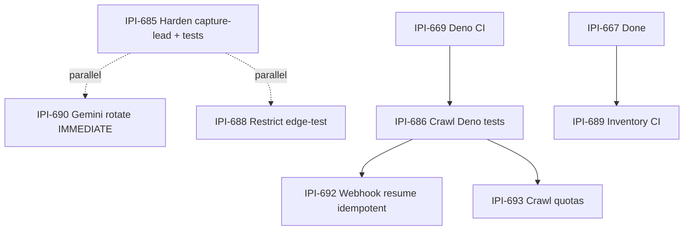
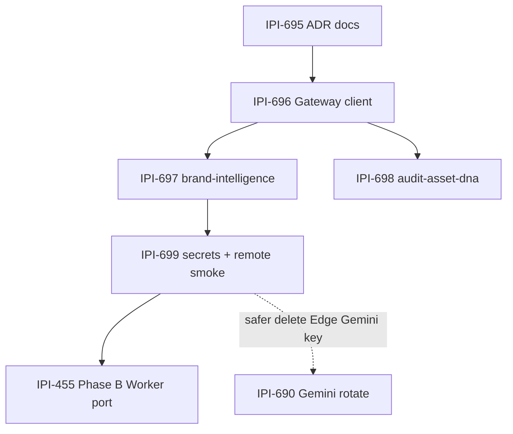

# Edge + parallel wave plan (efficiency)

**Date:** 2026-07-18 · **Verified:** notes-edge-5 + live MCP/HTTP  
**Skills:** `ipix-supabase` · `ipix-task-lifecycle` · `task-verifier` · `mermaid-diagrams`  
**Rule:** one concern per PR · never `--prune` · never mix docs + production

## Live inventory (nvdlhrodvevgwdsneplk · 2026-07-18)

| Slug | verify_jwt | Probe (anon/empty) |
|------|------------|--------------------|
| `health` | false | GET/POST **200** |
| `capture-lead` | false | POST **422** validation (handler reached) |
| `firecrawl-webhook` | false | POST **401** HMAC |
| `start-brand-crawl` | true | POST **401** session |
| `brand-intelligence` | true | POST **401** session |
| `audit-asset-dna` | true | POST **401** session |
| `edge-test` | true | POST **401** anon; authed **200** + log write |
| Quarantine orphans | — | **404** |

Dashboard: [functions](https://supabase.com/dashboard/project/nvdlhrodvevgwdsneplk/functions)

## Parallel wave — merge status

| Task | Status |
|------|--------|
| **IPI-679** DEFINER revoke | ✅ Merged #445 |
| **IPI-667** Edge quarantine | [#443](https://github.com/amo-tech-ai/lumina-studio/pull/443) — remote already clean |
| **IPI-678** DB URL session | [#444](https://github.com/amo-tech-ai/lumina-studio/pull/444) |
| **IPI-681** Anon row proof | [#442](https://github.com/amo-tech-ai/lumina-studio/pull/442) |
| **IPI-669** Edge Deno CI | [#441](https://github.com/amo-tech-ai/lumina-studio/pull/441) |
| **IPI-691** Real JWT for DEFINER probe | [#446](https://github.com/amo-tech-ai/lumina-studio/pull/446) |

## Next Edge queue (notes-edge-5 applied)

| Task | Spec | Efficient path | Parallel? |
|------|------|----------------|-----------|
| **[IPI-690](https://linear.app/amo100/issue/IPI-690)** | SB-EDGE-007 — Gemini exposure | **IMMEDIATE ops** — Google rotate+revoke; no wait on 667 | Yes |
| **[IPI-685](https://linear.app/amo100/issue/IPI-685)** | SB-EDGE-002 — Harden capture-lead **+ tests** | Proxy secret for writes · RPC · origin defense · Deno tests **same PR** | Yes vs 688/690 |
| **[IPI-688](https://linear.app/amo100/issue/IPI-688)** | SB-EDGE-005 — Restrict edge-test | Strip log write; `REQUIRE_AUTH_EDGE_SMOKE=1` | Yes |
| **[IPI-686](https://linear.app/amo100/issue/IPI-686)** | SB-EDGE-003 — Crawl Deno tests | One PR both fns; **blockedBy 669** | After 669 |
| **[IPI-689](https://linear.app/amo100/issue/IPI-689)** | SB-EDGE-006 — Inventory CI | Secretless PR vs config; remote on main/schedule | After 667 Done |
| **[IPI-692](https://linear.app/amo100/issue/IPI-692)** | SB-EDGE-008 — Webhook resume idempotent | Product fix; tests alone insufficient | After/with 686 |
| **[IPI-693](https://linear.app/amo100/issue/IPI-693)** | SB-EDGE-009 — Crawl quotas | Per-brand cost control | After 686 |
| ~~IPI-687~~ | SB-EDGE-004 | **Canceled** — merged into 685 | — |

## Critical red flags (live)

1. **capture-lead** — `verify_jwt=false`; Origin open when `ALLOWED_ORIGINS` unset; proxy secret does not gate writes; multi-step writes not transactional.
2. **edge-test** — production ACTIVE; authenticated probe inserts `ai_agent_logs` (verify-edge script).
3. **firecrawl-webhook** — JWT off (HMAC OK) but resume may not be idempotent under replay.
4. **Gemini** — orphan functions 404, but key rotation still required if URLs ever leaked.

## Efficiency rules

| Do | Don't |
|----|-------|
| Harden + **its** tests in one PR (685) | Separate 687 after harden |
| One Deno PR for firecrawl **and** start-brand-crawl | Two PRs for same mocks |
| Inventory remote check on main/schedule | Path-filter-only inventory (misses Dashboard drift) |
| Named `functions delete` | `functions deploy --prune` |
| Rotate Gemini at **Google** then Infisical/Supabase | Update secrets only / skip revoke |
| Ops ticket for key rotate | Commit secrets |

## Validation levels

| Task | Level when Done |
|------|-----------------|
| 685 / 688 / 692 | Local Runtime + Remote Preview |
| 686 / 689 / 693 | Unit + CI |
| 690 | Ops evidence (Production if rotated) |

## notes-edge-5 score (this verification)

**Overall ~84/100** — structural corrections accepted; Linear updated accordingly.

## Cloudflare Workers — Edge LLM path (new · 2026-07-18)

**Reality check:** Edge Functions still call Gemini/Groq today. They are **not** on Cloudflare Workers. Lean path = keep Deno Edge, send LLM HTTP to the **AI Gateway Worker** → **Workers AI**.

| Task | Spec | What success looks like |
|------|------|-------------------------|
| **[IPI-694](https://linear.app/amo100/issue/IPI-694)** | CF-EDGE-AI epic | Parent under IPI-487 |
| **[IPI-695](https://linear.app/amo100/issue/IPI-695)** | CF-EDGE-001 ADR | Docs-only: Edge stays Deno; LLM via Gateway HTTP |
| **[IPI-696](https://linear.app/amo100/issue/IPI-696)** | CF-EDGE-002 client | `AI_PROVIDER=cloudflare` + Deno client + unit tests |
| **[IPI-697](https://linear.app/amo100/issue/IPI-697)** | CF-EDGE-003 BI | Brand Hub analysis uses Workers AI path |
| **[IPI-698](https://linear.app/amo100/issue/IPI-698)** | CF-EDGE-004 DNA | Wire DNA **or** honest defer after vision spike |
| **[IPI-699](https://linear.app/amo100/issue/IPI-699)** | CF-EDGE-005 smoke | Remote secrets + smoke; Edge can drop Gemini key |
| **[IPI-455](https://linear.app/amo100/issue/IPI-455)** | CF-EDGE-B Phase B | Full handler port to Worker — **after** 699 |

