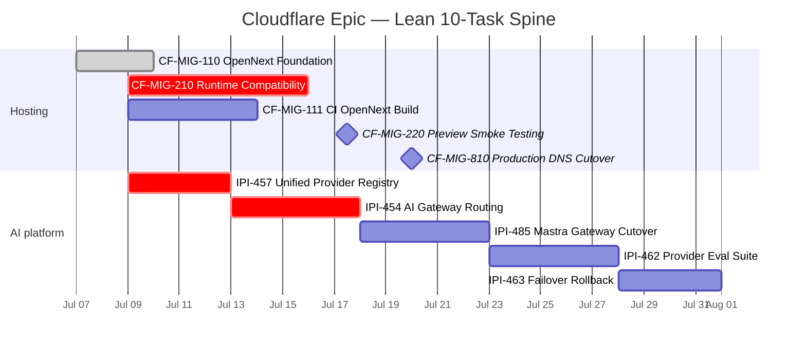
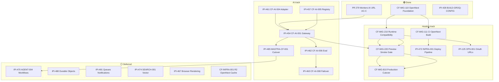

# CLOUDFLARE-EPIC · Cloudflare Platform Migration & AI Infrastructure

**SSOT for all Cloudflare work at iPix** · **Last updated:** 2026-07-09 (verdict: 86% epic · 55% migration · 93% architecture direction)
**Companion:** [`mastra/MASTRA-EPIC.md`](./mastra/MASTRA-EPIC.md) (agent layer) · [`migration/plan-migrate.md`](./migration/plan-migrate.md) (technical plan) · [`migration/startup.md`](./migration/startup.md) (preview runbook)  
**Linear epic:** [IPI-487 · CLOUDFLARE-EPIC](https://linear.app/amo100/issue/IPI-487) · attach children per §10  
**Mastra epic:** [IPI-486 · MASTRA-EPIC](https://linear.app/amo100/issue/IPI-486)

**Hard rule:** Task names use **ID + spec + plain English title** (see lean roadmap below).

---

## Lean roadmap — 10 active tasks (SSOT)

**Do not add CF-INFRA-* tasks.** Bindings, env matrix, and deploy checks fold into CF-MIG specs or **IPI-472** when needed.

### Cloudflare hosting (5)

| # | Full task name | Status |
|---|----------------|:------:|
| 1 | **CF-MIG-110 · OpenNext Foundation — Scaffold & Edge Middleware** | 🟢 Done (#282) |
| 2 | **CF-MIG-210 · Runtime Compatibility — Hono, OAuth & Groq Bundle** | 🔴 **NEXT** |
| 3 | **CF-MIG-111 · OpenNext CI Build Pipeline** | ⚪ |
| 4 | **CF-MIG-220 · Preview Smoke Testing & Validation** | ⚪ |
| 5 | **CF-MIG-810 · Production DNS Cutover & Rollback** | ⚪ DNS last |

### AI platform (5)

| # | Full task name | Status |
|---|----------------|:------:|
| 6 | **IPI-457 · CF-AI-005 — Unified AI Provider Types & Registry** | 🟡 merge to `main` |
| 7 | **IPI-454 · CF-AI-001 — AI Gateway — Cloudflare Provider Routing** | 🟡 AC-F open |
| 8 | **IPI-485 · MASTRA-CF-001 — Mastra Provider Gateway Cutover** | ⚪ |
| 9 | **IPI-462 · CF-AI-006 — AI Provider Evaluation Suite** | ⚪ |
| 10 | **IPI-463 · CF-AI-008 — AI Provider Failover & Rollback** | ⚪ |

**Sub-work (not top-level):** **IPI-461 · CF-AI-004 — AI Provider Adapter** — gateway Worker code; tracked under IPI-454.

**Feature epics** (Brand, Booking, Shoot, CRM, Campaign, Assets, Intelligence) — **reuse existing Linear epics**; they consume this infrastructure. Do not create duplicate business epics.

### Execution order

```text
CF-MIG-210 → CF-MIG-111 → IPI-457 → IPI-454 AC-F → IPI-485 → CF-MIG-220 → IPI-462 → IPI-463 → CF-MIG-810
(CF-MIG-110 ✅ already merged)
```

---

## 1. Executive summary

iPix is migrating the **Next.js operator app** from Vercel to **Cloudflare Workers via OpenNext**, while routing AI inference through **Cloudflare AI Gateway + Workers AI** (OpenAI-compatible REST). **Vercel stays production** until **CF-MIG-220 · Preview Smoke Gate** passes on `*.workers.dev`. **Do not cut DNS** until that gate is green.

| Track | Status | Next action |
|-------|:------:|-------------|
| **Hosting (OpenNext)** | 🟡 P1 active | **CF-MIG-210 · Runtime Compatibility** — operator CopilotKit + OAuth + groq bundle |
| **AI Gateway / Workers AI** | 🟡 parallel | **IPI-454 · CF-AI-001** AC-F — Mastra → gateway; merge **IPI-457 · CF-AI-005** registry |
| **Production cutover** | 🔴 blocked | CF-MIG-220 → CF-MIG-810 only after smoke |
| **Linear accuracy** | 🔴 ~52–60% | Retract false Done; use this epic |

**What changed today (Jul 9):** **PR #282 merged** — **CF-MIG-110 · OpenNext Foundation** is **🟢 Done** on `main` (`wrangler.jsonc`, `open-next.config.ts`, Edge `middleware.ts`, preview scripts).

**Recommended next task (single PR):**  
**CF-MIG-210 · Runtime Compatibility** — branch `ipi/cf-mig-210-runtime-compat`  
Fix `hono/vercel` → `hono/cloudflare-workers`, OAuth `*.workers.dev`, bundle `groq-models.json`.  
*Do not mix with IPI-454 AC-F — one concern per PR.*

**Parallel (second PR queue):** `ipi/454-ac-f-mastra-gateway` after **IPI-457 · CF-AI-005** registry merges.

| Area | Score | Dot |
|------|------:|:---:|
| Planning | 95% | 🟢 |
| OpenNext foundation | 95% | 🟢 |
| Cloudflare architecture | 96% | 🟢 |
| AI Gateway design | 93% | 🟢 |
| Mastra integration | 91% | 🟢 |
| Runtime readiness | 35% | 🔴 |
| AI Gateway wiring (runtime) | 45% | 🔴 |
| Production readiness | 50% | 🔴 |
| Documentation quality | 95% | 🟢 |
| **Epic correctness** | **86%** | 🟡 → **93%** after ops hardening |
| **Overall migration progress** | **55%** | 🟡 |

**Bottom line:** Architecture is sound. **Not ready for DNS.** Biggest blockers are **runtime compatibility + gateway wiring + smoke testing** — not redesign.

**Doc verification (official):**

| Claim | Source | Verified |
|-------|--------|:--------:|
| Next.js on Workers via OpenNext (not Pages-only) | [CF Next.js guide](https://developers.cloudflare.com/workers/framework-guides/web-apps/nextjs/) | 🟢 |
| Workers AI OpenAI-compat `/ai/v1/...` | [Workers AI OpenAI compat](https://developers.cloudflare.com/workers-ai/configuration/open-ai-compatibility/) | 🟢 |
| AI Gateway `/compat` deprecated — use REST | [AI Gateway unified API](https://developers.cloudflare.com/ai-gateway/usage/chat-completion/) | 🟢 |
| Mastra: deploy via web framework when in-process | [Mastra CF deploy](https://mastra.ai/guides/deployment/cloudflare) | 🟢 |
| Service Bindings for Worker→Worker (prefer over public HTTP) | [Service bindings](https://developers.cloudflare.com/workers/runtime-apis/bindings/service-bindings/) | 🟢 evaluate in IPI-454 |
| Secrets in Wrangler Secrets only — never commit | [Workers secrets](https://developers.cloudflare.com/workers/configuration/secrets/) | 🟢 |
| OpenNext R2 for ISR/incremental cache (not KV) | [OpenNext caching](https://opennext.js.org/cloudflare/caching) | 🟢 → CF-INFRA-003 |

### 🔴 Red flags

| Area | Issue | Fix |
|------|-------|-----|
| Runtime | `hono/vercel` blocks operator CopilotKit | **CF-MIG-210** first |
| Auth | Supabase OAuth missing `*.workers.dev` | CF-MIG-210 C3 |
| AI | `AI_GATEWAY_URL` absent in app | **IPI-454 AC-F** |
| Registry | IPI-457 branch/main split | Merge before cutover |
| CI | No OpenNext CI job | **CF-MIG-111** |
| Smoke | No CF-MIG-220 script | Add after runtime green |
| DNS | Cutover correctly deferred | **Do not start until CF-MIG-220 green** |
| Config drift | `.env` + `.dev.vars` + Wrangler Secrets | **CF-INFRA-005** env matrix |
| Registry | Dual registry until IPI-457 lands | Merge to `main` |

### Best next order

```text
1. CF-MIG-210 · Runtime Compatibility — Hono, Groq JSON, OAuth, Bundle
2. CF-MIG-111 · CI OpenNext Build — GitHub Actions Gate
3. IPI-457 · CF-AI-005 — Unified AI Provider Types & Registry
4. IPI-454 · CF-AI-001 — AI Gateway — Cloudflare Provider Routing (AC-F)
5. CF-MIG-220 · Preview Smoke Gate — End-to-End workers.dev Validation
6. IPI-462 · CF-AI-006 — AI Provider Evaluation Suite
7. CF-MIG-810 · Production Cutover — DNS + Rollback (LAST)
```

**Parallel after step 1:** CF-INFRA-002 bindings audit · IPI-457 merge PR

---

## 2. Current Cloudflare architecture

```text
┌─────────────────────────────────────────────────────────────────────────┐
│ PRODUCTION (today)                                                       │
│ Vercel — Next.js 16 operator app + in-process Mastra + CopilotKit v2    │
│ Inference: resolveModel() → Gemini direct (AI_PROVIDER=gemini)          │
└─────────────────────────────────────────────────────────────────────────┘
                                    │
                                    │ migration in progress
                                    ▼
┌─────────────────────────────────────────────────────────────────────────┐
│ PREVIEW (workers.dev) — partial green                                    │
│ OpenNext Worker (ipix-operator) — CF-MIG-110 ✅ merged PR #282        │
│   ├── /, /login, /api/marketing-chat → 200 ✅ (Gemini outbound)         │
│   ├── /api/copilotkit (operator) → 🔴 hono/vercel blocker               │
│   ├── Mastra in-process → PostgresStore (Supabase) ✅                   │
│   └── wrangler: ASSETS, IMAGES binding, observability ✅                  │
│                                                                          │
│ Separate Worker: services/cloudflare-worker/ (AI Gateway scaffold)      │
│   ├── model-registry.ts, workers-ai.ts, gemini.ts ✅ on main            │
│   ├── PR #279 Workers AI URL fix ✅                                     │
│   └── NOT called by Mastra app 🔴                                       │
└─────────────────────────────────────────────────────────────────────────┘
                                    │
                                    ▼
┌─────────────────────────────────────────────────────────────────────────┐
│ UNCHANGED SSOT                                                           │
│ Supabase (Postgres, Auth, RLS, pgvector) · Cloudinary · Edge fns (Deno) │
└─────────────────────────────────────────────────────────────────────────┘
```

### Repo probes (main, Jul 9)

| Probe | Result |
|-------|--------|
| `app/wrangler.jsonc` | 🟢 present — OpenNext worker, `nodejs_compat`, Images binding |
| `app/open-next.config.ts` | 🟢 minimal config |
| `services/cloudflare-worker` tests | 🟢 14/14 (AC-C URL) |
| `hono/vercel` in CopilotKit route | 🔴 still present |
| `readFileSync(groq-models.json)` | 🔴 `provider.ts` |
| OAuth `*.workers.dev` | 🔴 callback trusts Vercel only |
| CI OpenNext build job | 🔴 not in `.github/workflows/ci.yml` |
| `AI_GATEWAY_URL` in app | 🔴 absent |

---

## 3. Target Cloudflare architecture

```text
                    Operators & visitors
                              │
                              ▼
              ┌───────────────────────────────┐
              │ Cloudflare Workers (OpenNext)  │
              │ ipix-operator                  │
              │  • Next.js App Router          │
              │  • CopilotKit v2 (CF Hono)     │
              │  • Mastra in-process           │
              │  • API routes / middleware     │
              └───────────────┬───────────────┘
                              │
         ┌────────────────────┼────────────────────┐
         │                    │                    │
         ▼                    ▼                    ▼
  Service Binding      AI Gateway REST      Cloudflare Images
  ipix-operator →      api.cloudflare.com/    (wrangler binding)
  ai-gateway Worker    .../ai/v1/chat/completions
         │                    │
         │         ┌──────────┴──────────┐
         │         ▼                     ▼
         │    Workers AI            Gemini (vision/
         │    @cf/meta/...           fallback)
         │
         ▼
┌────────────────────────────────────────────────────────┐
│ Cloudflare platform services (phased — see §3.1)      │
│ AI Gateway · KV · R2 · Queues · DO · Workflows · Obs   │
└────────────────────────────────────────────────────────┘
                              │
                              ▼
              Supabase · Cloudinary · (Groq until IPI-462)
```

**ADR-003 — Worker-to-Worker routing:** Prefer **[Service Bindings](https://developers.cloudflare.com/workers/runtime-apis/bindings/service-bindings/)** for `ipix-operator` → `services/cloudflare-worker`. Keep **REST** for managed AI Gateway / external APIs until binding benchmark in **IPI-454** completes.

### 3.1 Cloudflare resource matrix

| Resource | Purpose | iPix use | Status |
|----------|---------|----------|:------:|
| **Workers** | Next.js + API runtime (OpenNext) | `app/wrangler.jsonc` | 🟡 |
| **AI Gateway** | AI routing, logging, fallbacks, WAF | IPI-454 | 🟡 |
| **Workers AI** | Default inference (post IPI-462) | OpenAI-compat REST | 🟡 |
| **Service Bindings** | Worker→Worker internal calls | ipix-operator → gateway Worker | ⚪ evaluate |
| **Images** | Image optimization binding | `wrangler.jsonc` | 🟢 |
| **R2** | OpenNext ISR/incremental cache | CF-INFRA-003 | ⚪ |
| **KV** | Model/prompt registry hot-reload | IPI-454 AC-G | ⚪ |
| **Durable Objects** | Coordination, circuit breaker | IPI-480 | ⚪ defer |
| **Queues** | Async fan-out, notifications | IPI-481 | ⚪ defer |
| **Workflows** | Long-running external jobs | IPI-470 | ⚪ defer |
| **Browser Rendering** | Crawl / automation | IPI-467 | ⚪ Phase 2 |
| **Secrets** | API keys, DB URLs | [Wrangler Secrets](https://developers.cloudflare.com/workers/configuration/secrets/) | 🟡 |
| **Observability** | Logs, traces, gateway analytics | wrangler + IPI-460 | 🟡 |

### 3.2 MVP vs Phase 2

**MVP critical path (migration):** CF-MIG-110 → 210 → 111 → IPI-457 → IPI-454 → 220 → 462 → 810

**Move to Phase 2 (not migration blockers):**

- IPI-467 · Browser Rendering
- IPI-470 · Cloudflare Workflows
- IPI-480 · Durable Objects
- IPI-474 / IPI-177 · Search / RAG
- IPI-458 · NVIDIA NIM evaluation
- IPI-141–145 · pgvector RAG epic

### 3.3 Architecture decision records (ADR)

| ADR | Title | Decision |
|-----|-------|----------|
| ADR-001 | Why OpenNext instead of staying on Vercel | Workers + OpenNext for single Worker app ([CF Next.js](https://developers.cloudflare.com/workers/framework-guides/web-apps/nextjs/)) |
| ADR-002 | Why AI Gateway | Central routing, logging, fallbacks — not direct provider SDKs |
| ADR-003 | Gateway-first + Service Bindings | REST for managed gateway; Service Binding for internal Worker calls |
| ADR-004 | Why Mastra stays in-process | [Mastra CF](https://mastra.ai/guides/deployment/cloudflare): deploy via web framework; no standalone deployer yet |
| ADR-005 | Why Workers AI becomes default | After IPI-462 eval only; Gemini vision/fallback retained |

### 3.4 Deployment environments

| Env | Worker | Domain | Secrets | AI provider | OAuth |
|-----|--------|--------|---------|-------------|-------|
| **Local** | `next dev` / optional `wrangler dev` | localhost:3002 | `.env.local` | Gemini direct | localhost callback |
| **Preview** | OpenNext `npm run preview` | `*.workers.dev` | `.dev.vars` + dashboard | Gemini (today) | CF-MIG-210 |
| **Staging** | Workers deploy (pre-prod) | staging subdomain TBD | Wrangler Secrets | Gateway (target) | allowlist |
| **Production** | Workers deploy | custom domain | Wrangler Secrets | Gateway + IPI-462 gate | IPI-125 |

Document full matrix in **CF-INFRA-005 · Environment Matrix — Vercel to Wrangler Secrets Parity**.

### 3.5 Provider capability matrix (CF-AI-012)

Track capabilities for `resolveModel()` tier selection — not provider name alone.

| Provider | Chat | Vision | Embeddings | JSON / structured | Streaming |
|----------|:----:|:------:|:----------:|:-----------------:|:---------:|
| Workers AI | ✅ | ⚠️ eval | ✅ | ✅ | ✅ |
| Gemini | ✅ | ✅ | ✅ | ✅ | ✅ |
| Groq | ✅ | ❌ | ❌ | ✅ | ✅ |
| OpenAI (via gateway) | ✅ | ✅ | ✅ | ✅ | ✅ |

Implement in **CF-AI-012 · Provider Capability Matrix** (P2) or extend **IPI-457** registry schema.

**Inference target (gateway-first):**

```text
CopilotKit → Mastra agent → resolveModel(tier)
  → @ai-sdk/openai-compatible
  → AI Gateway REST (preferred over deprecated /compat)
  → Workers AI default / Gemini vision fallback
```

Official REST base (not deprecated `/compat`):  
`https://api.cloudflare.com/client/v4/accounts/{ACCOUNT_ID}/ai/v1/chat/completions`

---

## 4. Phase-by-phase roadmap

| Phase | Name | Focus | Exit gate |
|:-----:|------|-------|-----------|
| **P0** | Planning | CF-000, research, migration plan | 🟢 Complete |
| **P1a** | OpenNext foundation | Wrangler, OpenNext, middleware | 🟢 **CF-MIG-110 Done** (#282) |
| **P1b** | Runtime + CI | CopilotKit, OAuth, groq bundle, CI build | CF-MIG-210 + CF-MIG-111 |
| **P1.5** | Bindings & infra | Single SSOT for all Worker bindings + secrets | CF-INFRA-002 |
| **P1c** | AI foundation | Registry, gateway, adapter | IPI-457 + IPI-454 AC-F/I |
| **P2** | Smoke + hardening | Preview gate, security, deploy pipeline | CF-MIG-220 + IPI-468 |
| **P3** | Eval + failover | Provider quality, rollback | IPI-462 + IPI-463 |
| **P4** | Mastra cutover | Agent-wide gateway path | IPI-485 |
| **P5** | Workload migration | BI edge → Worker, DNA defer | IPI-455, IPI-456 |
| **P6** | Platform expansion | Workflows, Queues, DO, Search | IPI-470, IPI-480/481, IPI-474 |
| **P7** | Production cutover | DNS, rollback tested | **CF-MIG-810** (last) |

**Two tracks (always separate in PRs):**

1. **Hosting migration** — CF-MIG-110 → 111/210 → 220 → 810  
2. **AI infrastructure** — IPI-454/457/461 → 485 → 462 → 463  

They meet at preview smoke (both must work on `*.workers.dev`).

---

## 5. Task table

**Legend:** 🟢 Done · 🟡 In Progress · 🔴 Blocked · ⚪ Backlog · ⚫ Canceled · ⬜ Missing (add to Linear)

### P0 — Planning

| Issue ID | Full task name | Purpose | Owner area | Status | Blocker | Next action |
|----------|----------------|---------|------------|:------:|---------|-------------|
| — | CF-000 doc | Platform architecture decision | Architecture | 🟢 | — | Mark **IPI-469 · CF-000 — Cloudflare Platform Architecture** Done in Linear |
| — | `plan-migrate.md` | Vercel→Workers technical plan | Migration | 🟢 | — | Keep updated as phases complete |
| — | `startup.md` | Preview troubleshooting SSOT | Migration | 🟢 | — | Update after CF-MIG-210 |

### P1a — OpenNext foundation (hosting)

| Issue ID | Full task name | Purpose | Owner area | Status | Blocker | Next action |
|----------|----------------|---------|------------|:------:|---------|-------------|
| CF-MIG-110 | **CF-MIG-110 · OpenNext Foundation — Wrangler + OpenNext Scaffold** | Add OpenNext, wrangler, middleware, preview scripts | `app/` infra | 🟢 | — | Mark Done in Linear; verify `main` has #282 |
| IPI-472 | **IPI-472 · INFRA-001 — Cloudflare Worker Deployment Pipeline** | CI/CD + deploy commands for Workers Builds | DevOps | ⚪ | CF-MIG-111 | Extend AC for OpenNext deploy + secrets |

### P1.5 — Bindings & infrastructure *(reference only — not creating separate Linear tasks)*

> **Lean decision (2026-07-09):** Do **not** create CF-INFRA-002..005. Fold bindings, R2 cache, env matrix, and verify script into **CF-MIG-111/210/220** and **IPI-472**.

| Spec ID | Name (reference) | Fold into |
|---------|------------------|-----------|
| CF-INFRA-002 | Bindings & runtime config | CF-MIG-210, CF-MIG-220 |
| CF-INFRA-003 | OpenNext R2 cache | CF-MIG-111 or post-220 if ISR needed |
| CF-INFRA-004 | Deploy verify script | CF-MIG-220 smoke |
| CF-INFRA-005 | Env matrix | IPI-472 / `migration/env-matrix.md` |

**Bindings checklist (when doing CF-MIG-210/220):**

- [ ] Service Bindings (ipix-operator → ai-gateway Worker)
- [ ] R2 (OpenNext cache)
- [ ] KV (model registry)
- [ ] Images binding
- [ ] Durable Objects (defer IPI-480)
- [ ] Queues (defer IPI-481)
- [ ] Secrets vs vars vs `.dev.vars`
- [ ] Observability / analytics

### P1b — Runtime + CI (hosting) ← **NEXT**

| Issue ID | Full task name | Purpose | Owner area | Status | Blocker | Next action |
|----------|----------------|---------|------------|:------:|---------|-------------|
| **CF-MIG-210** | **CF-MIG-210 · Runtime Compatibility — Hono, Groq JSON, OAuth, Bundle** | Operator CopilotKit + auth on Workers | `app/` runtime | 🔴 | — | **Start worktree `ipi/cf-mig-210-runtime-compat`** |
| CF-MIG-111 | **CF-MIG-111 · CI OpenNext Build — GitHub Actions Gate** | PR CI runs `opennextjs-cloudflare build` | CI | ⚪ | CF-MIG-110 ✅ | Add job to `.github/workflows/ci.yml` |
| IPI-125 | **IPI-125 · OPS-001 — OAuth Callback + Supabase Auth URLs** | Prod OAuth URLs | Auth | 🟢 | CF-MIG-210 for preview | Extend callback for `*.workers.dev` in 210 PR |

### P1c — AI Gateway foundation (parallel)

| Issue ID | Full task name | Purpose | Owner area | Status | Blocker | Next action |
|----------|----------------|---------|------------|:------:|---------|-------------|
| IPI-454 | **IPI-454 · CF-AI-001 — AI Gateway — Cloudflare Provider Routing** | Unified inference routing + logging | AI platform | 🟡 | IPI-457 | **AC-F:** Mastra `resolveModel` → gateway |
| IPI-457 | **IPI-457 · CF-AI-005 — Unified AI Provider Types & Registry** | Single tier registry SSOT | AI platform | 🟡 | branch merge | Merge `ai/ipi-471-...` to `main` |
| IPI-461 | **IPI-461 · CF-AI-004 — AI Provider Adapter Layer** | Gateway Worker providers | `services/cloudflare-worker/` | 🟡 | IPI-454 AC-F | Wire Mastra after AC-F |
| IPI-469 | **IPI-469 · CF-000 — Cloudflare Platform Architecture** | Approved architecture doc | Architecture | 🟡 | — | Mark Done (doc approved) |

### P2 — Smoke + security

| Issue ID | Full task name | Purpose | Owner area | Status | Blocker | Next action |
|----------|----------------|---------|------------|:------:|---------|-------------|
| CF-MIG-220 | **CF-MIG-220 · Preview Smoke Gate — End-to-End workers.dev Validation** | Scripted smoke before cutover | QA / infra | 🔴 | CF-MIG-210 | Write smoke script after operator path green |
| IPI-468 | **IPI-468 · SEC-001 — Cloudflare AI Security Architecture** | WAF, rate limits, BYOK, guardrails *(includes ex-CF-SEC-002)* | Security | ⚪ | IPI-454 | Service Binding vs HTTP decision in AC |
| IPI-465 | **IPI-465 · AGENT-002 — Shared AI Tool Registry** | Tools + **AI Gateway request ID → `ai_agent_logs`** | Agents | 🟡 | IPI-454 | Log gateway request metadata |

### P3 — Eval + failover

| Issue ID | Full task name | Purpose | Owner area | Status | Blocker | Next action |
|----------|----------------|---------|------------|:------:|---------|-------------|
| IPI-462 | **IPI-462 · CF-AI-006 — AI Provider Evaluation Suite** | Quality gate before Workers AI default | AI platform | ⚪ | IPI-454 AC-F | Create `scripts/ai/run-provider-eval.mjs` |
| IPI-463 | **IPI-463 · CF-AI-008 — AI Provider Failover & Rollback** | Gateway fallbacks + runbook | AI platform | ⚪ | IPI-462 | `docs/operations/ai-failover.md` |
| IPI-460 | **IPI-460 · CF-AI-010 — AI Cost Tracking & Observability** | Cost logs + gateway analytics | Observability | ⚪ | IPI-454 | Defer until gateway live |

### P4 — Mastra gateway cutover

| Issue ID | Full task name | Purpose | Owner area | Status | Blocker | Next action |
|----------|----------------|---------|------------|:------:|---------|-------------|
| IPI-485 | **IPI-485 · MASTRA-CF-001 — Mastra Provider Gateway Cutover** | No direct Gemini/Groq in agents | Mastra | ⚪ | IPI-457, IPI-454 | See [`mastra/MASTRA-EPIC.md`](./mastra/MASTRA-EPIC.md) |
| IPI-486 | **IPI-486 · MASTRA-EPIC — Mastra × Cloudflare Operating System** | Mastra work SSOT epic | Mastra | ⚪ | — | Attach Mastra child issues |

### P5 — Workload migration

| Issue ID | Full task name | Purpose | Owner area | Status | Blocker | Next action |
|----------|----------------|---------|------------|:------:|---------|-------------|
| IPI-455 | **IPI-455 · CF-AI-002 — Migrate Brand Intelligence to Cloudflare** | Edge fn → Worker path | Edge / AI | ⚪ | IPI-454, IPI-485 | After gateway cutover |
| IPI-456 | **IPI-456 · CF-AI-003 — Migrate Asset DNA Scoring to Cloudflare** | DNA on Workers | Media / AI | ⚪ | IPI-462 | **Deferred** per CF-000 |
| IPI-459 | **IPI-459 · CF-AI-009 — Groq Code & Config Cleanup** | Remove Groq after eval | AI platform | ⚪ | IPI-462 | Do not start during hosting mig |

### P6 — Platform expansion (defer)

| Issue ID | Full task name | Purpose | Owner area | Status | Blocker | Next action |
|----------|----------------|---------|------------|:------:|---------|-------------|
| IPI-470 | **IPI-470 · AGENT-004 — Cloudflare Workflows & Orchestration** | External durable orchestration | Agents | ⚪ | CF-MIG-220 | Evaluate vs Mastra workflows |
| IPI-467 | **IPI-467 · AGENT-006 — Browser Automation Architecture** | CF Browser Rendering | Agents | ⚪ | — | Defer post-cutover |
| IPI-474 | **IPI-474 · SEARCH-001 — AI Search & Vector Architecture** | Vectorize vs pgvector | Search | ⚪ | IPI-485 | RAG not migration blocker |
| IPI-466 | **IPI-466 · AGENT-005 — MCP Server Integration Strategy** | MCP on Workers | Agents | ⚪ | — | Backlog |
| IPI-473 | **IPI-473 · AGENT-003 — Shared Prompt Registry** | KV-backed prompts | Agents | ⚪ | IPI-457 | After registry SSOT |
| IPI-471 | **IPI-471 · AGENT-001 — AI Agent Architecture** | Architecture doc | Agents | 🟡 | — | Mark Done; fix proof path |
| IPI-458 | **IPI-458 · CF-AI-007 — NVIDIA NIM Evaluation** | Optional NIM provider | AI platform | ⚪ | — | P2 expansion |

### P2 — Observability (defer)

| Issue ID | Full task name | Purpose | Phase |
|----------|----------------|---------|:-----:|
| CF-AI-011 | **CF-AI-011 · AI Health Dashboard — Latency, Failures, Cost, Fallbacks** | Gateway analytics + `ai_agent_logs` | P2 |
| CF-AI-012 | **CF-AI-012 · Provider Capability Matrix** | Chat/vision/JSON/streaming per provider | P2 |
| OPS-002 | **OPS-002 · Rollback Automation — DNS Revert Script** | Executable rollback proof for CF-MIG-810 | P2 |

### P6 — Bindings defer (see CF-INFRA-002)

| Issue ID | Full task name | Purpose | Status |
|----------|----------------|---------|:------:|
| IPI-454 AC-G | **IPI-454 · CF-AI-001 AC-G — KV Model Registry Seed** | KV hot-reload | ⚪ |
| IPI-480 | **IPI-480 · Real-Time Sync via Supabase + Cloudflare Durable Objects** | DO coordination | ⚪ defer |
| IPI-481 | **IPI-481 · Notification Rules + Cloudflare Queue Fan-Out** | Async notifications | ⚪ defer |

**Removed / folded:** ~~CF-SEC-002~~ → **IPI-468** · ~~CF-MIG-ENV~~ → **CF-INFRA-005** · ~~CF-INFRA-001~~ renamed **CF-INFRA-003**

### Canceled (do not reopen for hosting)

| Issue ID | Full task name | Note |
|----------|----------------|------|
| IPI-354 | GROQ epic | Canceled — code merged; cleanup via IPI-459 |
| IPI-355–361 | GROQ-001–007 | Canceled |
| IPI-106,107,182,464 | Superseded CF tasks | Canceled — replaced by IPI-454/457/462 |

---

## 6. Progress tracker (lean 10 tasks)

| # | Full task name | Dot | % | Key proof / blocker |
|---|----------------|:---:|:---:|---------------------|
| 1 | **CF-MIG-110 · OpenNext Foundation — Scaffold & Edge Middleware** | 🟢 | 100% | PR #282 merged; preview on :8787 |
| 2 | **CF-MIG-210 · Runtime Compatibility — Hono, OAuth & Groq Bundle** | 🔴 | 25% | **NEXT** — CopilotKit, OAuth, groq bundle |
| 3 | **CF-MIG-111 · OpenNext CI Build Pipeline** | ⚪ | 0% | No OpenNext job in CI yet |
| 4 | **CF-MIG-220 · Preview Smoke Testing & Validation** | ⚪ | 0% | Blocked on CF-MIG-210 |
| 5 | **CF-MIG-810 · Production DNS Cutover & Rollback** | 🔴 | 0% | Vercel still prod; DNS last |
| 6 | **IPI-457 · CF-AI-005 — Unified AI Provider Types & Registry** | 🟡 | 60% | Branch-only; merge to `main` |
| 7 | **IPI-454 · CF-AI-001 — AI Gateway — Cloudflare Provider Routing** | 🟡 | 45% | AC-C ✅; AC-F/I open |
| 8 | **IPI-485 · MASTRA-CF-001 — Mastra Provider Gateway Cutover** | ⚪ | 0% | After IPI-454 AC-F |
| 9 | **IPI-462 · CF-AI-006 — AI Provider Evaluation Suite** | ⚪ | 0% | After gateway wire |
| 10 | **IPI-463 · CF-AI-008 — AI Provider Failover & Rollback** | ⚪ | 0% | After IPI-462 |

**Overall migration:** 🟡 **~55%** (foundation done; runtime + gateway remain)

### Monitor closely

- Dual registry until **IPI-457 · CF-AI-005 — Unified AI Provider Types & Registry** merges to `main`
- Env drift: `.env.local` vs `.dev.vars` vs Wrangler Secrets — fold into **CF-MIG-210** / **IPI-472**
- No DNS until **CF-MIG-220 · Preview Smoke Testing & Validation** green
- No Workers AI default until **IPI-462 · CF-AI-006 — AI Provider Evaluation Suite** passes

---

## 7. Mermaid Gantt chart



### 7.1 Plain-English guide

| Order | Gantt bar | Full task name | What you ship |
|:-----:|-----------|----------------|---------------|
| ✅ | CF-MIG-110 | **CF-MIG-110 · OpenNext Foundation — Scaffold & Edge Middleware** | Next.js builds as Cloudflare Worker; preview on :8787 |
| **1** | CF-MIG-210 | **CF-MIG-210 · Runtime Compatibility — Hono, OAuth & Groq Bundle** | Operator CopilotKit + OAuth on `*.workers.dev` |
| ∥ | CF-MIG-111 | **CF-MIG-111 · OpenNext CI Build Pipeline** | CI builds + deploys OpenNext artifact |
| ∥ | IPI-457 | **IPI-457 · CF-AI-005 — Unified AI Provider Types & Registry** | Single `model-registry.ts` on `main` |
| **2** | IPI-454 | **IPI-454 · CF-AI-001 — AI Gateway — Cloudflare Provider Routing** | Mastra + edge call AI Gateway REST |
| **3** | IPI-485 | **IPI-485 · MASTRA-CF-001 — Mastra Provider Gateway Cutover** | No direct Gemini/Groq SDK in agents |
| **4** | CF-MIG-220 | **CF-MIG-220 · Preview Smoke Testing & Validation** | Scripted E2E proof on `*.workers.dev` |
| **5** | IPI-462 | **IPI-462 · CF-AI-006 — AI Provider Evaluation Suite** | Data before Workers AI default |
| **6** | IPI-463 | **IPI-463 · CF-AI-008 — AI Provider Failover & Rollback** | Runbook when gateway fails |
| **last** | CF-MIG-810 | **CF-MIG-810 · Production DNS Cutover & Rollback** | DNS to Cloudflare — only after smoke green |

**∥** = parallel with row above. **Sub-work:** IPI-461 adapter under IPI-454.

### 7.2 Current position (Jul 9)

```text
✅ CF-MIG-110 · OpenNext Foundation — Done (#282)
→ NEXT: CF-MIG-210 · Runtime Compatibility (hosting) ∥ IPI-457 · CF-AI-005 registry merge (AI)
Then: IPI-454 AC-F → IPI-485 → CF-MIG-220 → IPI-462 → IPI-463 → CF-MIG-810
```

---

## 8. Mermaid dependency diagram



---

## 9. Missing tasks to add

| Proposed ID | Full task name | Why | Phase | Reuse? |
|-------------|----------------|-----|:-----:|--------|
| **CF-INFRA-002** | **CF-INFRA-002 · Cloudflare Bindings & Runtime Configuration** | Single bindings SSOT | P1.5 | **New — P0 priority** |
| **CF-INFRA-003** | **CF-INFRA-003 · OpenNext R2 Cache Configuration** | [OpenNext R2 caching](https://opennext.js.org/cloudflare/caching) — not KV | P1 | New |
| **CF-INFRA-004** | **CF-INFRA-004 · Deployment Verification Script** | Pre-deploy binding/secrets/OAuth check | P1 | New |
| **CF-INFRA-005** | **CF-INFRA-005 · Environment Matrix — Vercel to Wrangler Secrets Parity** | Stop config drift | P1 | Fold into **IPI-472** OK |
| **CF-AI-011** | **CF-AI-011 · AI Health Dashboard** | Latency, failures, cost, fallbacks | P2 | Extend **IPI-460** |
| **CF-AI-012** | **CF-AI-012 · Provider Capability Matrix** | `resolveModel()` by capability | P2 | Extend **IPI-457** |
| **OPS-002** | **OPS-002 · Rollback Automation — DNS Revert Script** | Executable proof, not text only | P2 | Part of **CF-MIG-810** |
| ~~CF-SEC-002~~ | — | WAF/rate limits | — | **Fold into IPI-468** |
| ~~CF-MIG-ENV~~ | — | Env matrix | — | **Renamed CF-INFRA-005** |

**Do not duplicate:** CF-MIG-110/111/210/220/810 (`linear/issues/IPI-CF-MIG-*.md`), IPI-454/457/461/462/463, IPI-480/481.

---

## 10. Tasks to reopen, rename, cancel, or merge

### Reopen / correct status

| Issue | Action | Reason |
|-------|--------|--------|
| **IPI-457 · CF-AI-005 — Unified AI Provider Types & Registry** | Keep **In Progress** | `app/src/lib/ai/model-registry.ts` not on `main` |
| **IPI-461 · CF-AI-004 — AI Provider Adapter Layer** | Keep **In Progress** | Worker on main; Mastra wire pending |
| **IPI-454 · CF-AI-001 — AI Gateway — Cloudflare Provider Routing** | Keep **In Progress** | AC-F/I open |

### Mark Done

| Issue | Action |
|-------|--------|
| **CF-MIG-110 · OpenNext Foundation** | Mark **Done** — PR #282 merged |
| **IPI-469 · CF-000 — Cloudflare Platform Architecture** | Mark **Done** — doc approved |
| **IPI-471 · AGENT-001 — AI Agent Architecture** | Mark **Done** after proof path fix |
| **IPI-428 · BUILD-GROQ-CONFIG** | Already Done |

### Rename (already applied where noted)

| Issue | Correct full name |
|-------|-------------------|
| IPI-454 | **IPI-454 · CF-AI-001 — AI Gateway — Cloudflare Provider Routing** |
| IPI-457 | **IPI-457 · CF-AI-005 — Unified AI Provider Types & Registry** |
| IPI-461 | **IPI-461 · CF-AI-004 — AI Provider Adapter Layer** |

### Merge / consolidate

| From | Into | Note |
|------|------|------|
| IPI-454 AC-G (KV registry) | **IPI-454 · CF-AI-001** sub-AC | Do not create IPI-464 (canceled) |
| CF-MIG-001..010 in old plan | **CF-MIG-110..810** lean track | Superseded — 5 issues only |
| GROQ epic IPI-354 | **IPI-459 · CF-AI-009** cleanup | Do not reopen for hosting |

### Cancel — keep canceled

IPI-354, IPI-355–361, IPI-106, IPI-107, IPI-182, IPI-464

### Epic parents

| Epic | Issue | Children |
|------|-------|----------|
| **CLOUDFLARE-EPIC** | **IPI-487** | CF-MIG-*, IPI-454/457/461/462/463/468/472, IPI-469 |
| **MASTRA-EPIC** | **IPI-486** | IPI-485, IPI-465, IPI-470, agent issues |

---

## 11. Critical blockers

| # | Blocker | Track | Fix |
|---|---------|-------|-----|
| B1 | `hono/vercel` in operator CopilotKit route | Hosting | **CF-MIG-210** C1 |
| B2 | OAuth callback lacks `*.workers.dev` | Hosting | **CF-MIG-210** C3 |
| B3 | `readFileSync(groq-models.json)` at runtime | Hosting + AI | **CF-MIG-210** C2 |
| B4 | No `AI_GATEWAY_URL` / gateway in `resolveModel()` | AI | **IPI-454 AC-F** |
| B5 | Registry split (`main` vs branch) | AI | **IPI-457** merge |
| B6 | No CI OpenNext build | Hosting | **CF-MIG-111** |
| B7 | Workers AI default before eval | AI | **IPI-462** gate |
| B8 | DNS cutover before smoke | Ops | Policy — **CF-MIG-220** first |

---

## 12. Production cutover checklist

**Gate:** All items must pass on latest `*.workers.dev` preview before **CF-MIG-810 · Production Cutover**.

### Hosting

- [ ] `npm run preview` — `/`, `/login`, operator routes load
- [ ] `/api/copilotkit` — operator agent SSE (no 500 on boot)
- [ ] `/api/marketing-chat` — public chat streams
- [ ] Mastra workflows — `shoot-wizard`, `brand-intelligence` HTTP routes
- [ ] `middleware.ts` — auth gate matches Vercel behavior
- [ ] Worker bundle size within platform limits (CF-MIG-210 C4)
- [ ] All Vercel env vars mirrored in Workers dashboard / `wrangler secret`

### Auth

- [ ] Supabase OAuth round-trip on `*.workers.dev`
- [ ] Production custom domain in callback allowlist
- [ ] Session refresh via middleware

### AI

- [ ] Gateway REST path used (not deprecated `/compat` only)
- [ ] `resolveModel(fast|structured)` routes through gateway
- [ ] IPI-462 eval sign-off documented
- [ ] Gemini vision/fallback verified
- [ ] Failover runbook exists (IPI-463)

### Data & integrations

- [ ] `DATABASE_URL` PostgresStore works from Worker
- [ ] Supabase RLS unchanged
- [ ] Cloudinary webhooks + `next/after()` DNA trigger
- [ ] Edge functions still reachable (BI until IPI-455)

### CI / deploy

- [ ] CI OpenNext build green on PRs (CF-MIG-111)
- [ ] IPI-472 deploy pipeline documented
- [ ] Rollback tested (§13)

### Cutover (CF-MIG-810 only)

- [ ] CF-MIG-220 smoke script green
- [ ] DNS TTL lowered
- [ ] Stakeholder sign-off
- [ ] Vercel project kept warm 48h for rollback

---

## 13. Rollback plan

```text
Trigger: smoke failure, auth outage, inference regression, or error budget breach after DNS cutover

Step 1 — Immediate (< 5 min)
  • OPS-002 (automated DNS revert script) is still P2/deferred — not built yet (2026-07-09). Today the only real option is: revert DNS manually (CF-MIG-810 runbook). Prefer building OPS-002 before relying on this plan under real incident pressure.
  • Vercel production still warm — no redeploy needed if not decommissioned

Step 2 — Communicate
  • Post incident note with failing probe + SHA
  • Linear: reopen CF-MIG-220 blocker on affected issue

Step 3 — Fix forward
  • Fix on branch → preview on workers.dev → re-run CF-MIG-220
  • Do NOT re-cut DNS until smoke green twice consecutively

Step 4 — AI-specific rollback
  • Set AI_PROVIDER=gemini (direct) via env — bypass gateway if gateway fault
  • IPI-463 failover: gateway provider fallback order documented

Step 5 — Decommission guard
  • Do not delete Vercel project until 7 days stable on Cloudflare
```

---

## 14. Official docs links used

| Topic | URL |
|-------|-----|
| Next.js on Workers | https://developers.cloudflare.com/workers/framework-guides/web-apps/nextjs/ |
| Wrangler autoconfig | https://developers.cloudflare.com/workers/framework-guides/automatic-configuration/ |
| OpenNext Cloudflare | https://opennext.js.org/cloudflare |
| OpenNext env vars | https://opennext.js.org/cloudflare/howtos/env-vars |
| OpenNext R2 caching | https://opennext.js.org/cloudflare/caching |
| Workers AI get started | https://developers.cloudflare.com/workers-ai/get-started/ |
| Workers AI Wrangler binding | https://developers.cloudflare.com/workers-ai/get-started/workers-wrangler/ |
| Workers AI REST API | https://developers.cloudflare.com/workers-ai/get-started/rest-api/ |
| Workers AI OpenAI compat | https://developers.cloudflare.com/workers-ai/configuration/open-ai-compatibility/ |
| Workers AI model catalog | https://developers.cloudflare.com/workers-ai/models/ |
| AI Gateway unified API | https://developers.cloudflare.com/ai-gateway/usage/chat-completion/ |
| AI Gateway REST changelog | https://developers.cloudflare.com/changelog/post/2026-05-21-rest-api/ |
| Cloudflare Workflows | https://developers.cloudflare.com/workflows/ |
| Cloudflare Queues | https://developers.cloudflare.com/queues/ |
| Durable Objects | https://developers.cloudflare.com/durable-objects/ |
| KV | https://developers.cloudflare.com/kv/ |
| R2 | https://developers.cloudflare.com/r2/ |
| Cloudflare Images | https://developers.cloudflare.com/images/ |
| Browser Rendering | https://developers.cloudflare.com/browser-rendering/ |
| Service bindings | https://developers.cloudflare.com/workers/runtime-apis/bindings/service-bindings/ |
| Wrangler secrets | https://developers.cloudflare.com/workers/wrangler/configuration/#secrets |
| AI Gateway SDK (Vercel AI) | https://developers.cloudflare.com/ai-gateway/integrations/vercel-ai-sdk/ |
| Mastra Cloudflare deploy | https://mastra.ai/guides/deployment/cloudflare |
| Mastra Workers AI models | https://mastra.ai/models/providers/cloudflare-workers-ai |
| CopilotKit Mastra | https://docs.copilotkit.ai/mastra |

---

## Appendix — Notes review (notes-2, notes-3)

| Note | Key takeaway | Epic alignment |
|------|--------------|----------------|
| **notes-2** | AC-C ✅; next AC-F → IPI-457 merge → IPI-462 | §5 P1c, critical path |
| **notes-3** | #282 shipped; **CF-MIG-210 is explicit next**; 3 PRs one-concern each | §1 recommended next task |
| **notes-3** | Disk probes: hono, OAuth, groq FS, CI missing | §11 blockers B1–B3, B6 |
| **notes-2** | Prefer REST `.../ai/v1/chat/completions` over `/compat` | §3 target architecture |

---

## Sign-off

**Epic: 86% correct · Architecture direction: 93/100 · Migration progress: 55%**

**Next task:** **CF-MIG-210 · Runtime Compatibility — Hono, Groq JSON, OAuth, Bundle**  
**Then:** CF-MIG-111 → IPI-457 → IPI-454 AC-F → CF-MIG-220 → IPI-462 → CF-MIG-810 (DNS last)  
**Parallel:** CF-INFRA-002 bindings audit  
**Do not:** DNS cutover · Workers AI default · mix hosting + AI in one PR

**Linear:** [IPI-487 · CLOUDFLARE-EPIC](https://linear.app/amo100/issue/IPI-487) synced from this file · **Mastra:** [IPI-486](https://linear.app/amo100/issue/IPI-486)
