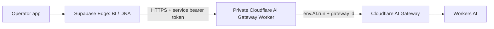
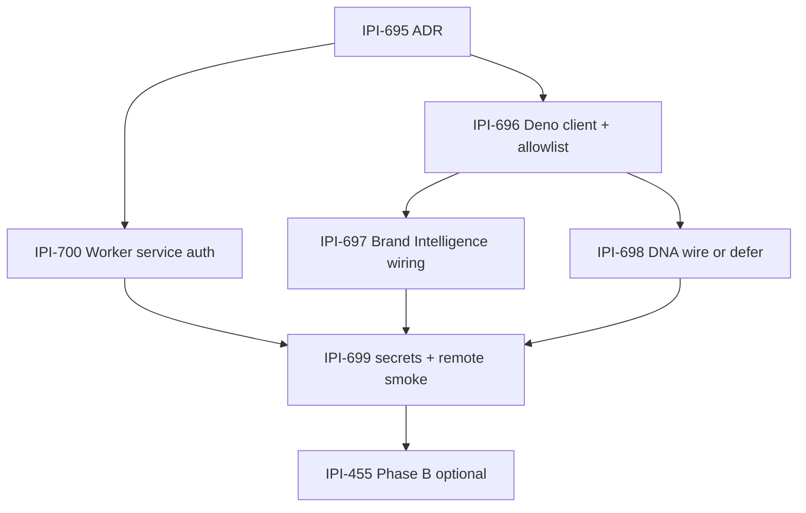

# IPI-695 · CF-EDGE-001 — ADR: Keep Supabase Edge on Deno and Route LLM Calls Through a Cloudflare Worker

- **Status:** Accepted
- **Date:** 2026-07-18
- **Epic:** IPI-694 · CF-EDGE-AI — Route Supabase Edge LLM Through Cloudflare AI Gateway Worker
- **Phase B:** IPI-455 · CF-EDGE-B — Port Brand Intelligence Handler to Cloudflare Worker

## Decision summary

Brand Intelligence and Asset DNA remain Supabase Edge Functions running in the Supabase Deno-compatible runtime.

For Phase A, only the model call moves:



The Supabase function does **not** use a Workers `env.AI` binding. Bindings exist only inside a Cloudflare Worker.

## Context

Current repository evidence:

| Area | Current state |
|---|---|
| Edge provider allowlist | `supabase/functions/_shared/llm/allowlist.ts` accepts `gemini`, `groq`, and partially wired `openai`; no Cloudflare provider exists |
| BI / DNA runtime | Supabase Edge Functions remain Deno handlers |
| Gateway contract | `services/cloudflare-worker/src/router.ts` exposes `/v1/chat/completions` and `/v1/embeddings` |
| Existing app client | `app/src/lib/ai/provider-adapter.ts` already calls the Worker with an OpenAI-shaped contract and optional bearer token |
| Worker AI access | The Worker currently uses a REST-token provider and `wrangler.jsonc` has no `ai` binding |
| Incoming Worker auth | POST routes currently do not validate the optional bearer token |

Supabase documents Edge Functions as TypeScript functions running in its Deno-compatible Edge Runtime. Cloudflare documents `env.AI` as a Worker binding available inside Cloudflare Workers.

## Chosen architecture

### Phase A — lean provider migration

1. Keep `brand-intelligence` and `audit-asset-dna` hosted on Supabase Edge.
2. Add `AI_PROVIDER=cloudflare` to the shared Edge provider allowlist.
3. Send an OpenAI-shaped HTTPS request to the custom Cloudflare Worker.
4. Require a narrow service credential on every model POST route.
5. The Worker validates the route, credential, payload size, and approved model tier.
6. The Worker calls Workers AI through `env.AI.run()` with an AI Gateway configuration.
7. Preserve Gemini and Groq as explicit rollback providers until remote smoke and soak complete.

### Phase B — optional handler migration

IPI-455 may later move the entire Brand Intelligence handler to Cloudflare. That is a separate decision with a larger blast radius because it changes authentication, database access, deployment, runtime behavior, and rollback.

## Required security boundary

The custom Worker is the trust boundary between Supabase Edge and Cloudflare AI.

Before remote Edge traffic is enabled:

- complete **IPI-700 · CF-EDGE-006 — Require Service Authentication on AI Gateway Worker**;
- require `Authorization: Bearer <AI_GATEWAY_TOKEN>` for `/v1/chat/completions` and `/v1/embeddings`;
- keep `/health` public and minimal;
- reject requests before model selection when authentication fails;
- never place a broad Cloudflare account API token in Supabase Edge secrets;
- maintain a fixed server-side model/tier allowlist;
- enforce request-size, timeout, and rate/budget limits;
- sanitize logs and error bodies.

The current Worker route accepts POST requests without validating the optional bearer token. IPI-700 is therefore a prerequisite for remote smoke, not an optional hardening step.

## Current Cloudflare API choice

For new Worker code, use the Worker AI binding and AI Gateway options, for example:

```ts
const result = await env.AI.run(
  "@cf/<approved-model>",
  input,
  { gateway: { id: "ipix-prod" } },
);
```

Do not build new integration code on the deprecated AI Gateway Universal endpoint or deprecated `/compat` endpoint. Cloudflare now recommends the Workers binding for Worker-hosted calls, or the current REST API for external callers.

## Secrets and configuration

### Supabase Edge secrets

| Name | Purpose |
|---|---|
| `AI_PROVIDER=cloudflare` | Select the Cloudflare provider path |
| `AI_GATEWAY_URL` | Base URL of the custom Worker |
| `AI_GATEWAY_TOKEN` | Narrow shared service credential accepted by the Worker |
| `BI_USE_GEMINI` | Emergency BI rollback override |
| `DNA_USE_GEMINI` | Emergency DNA rollback override |

### Cloudflare Worker configuration

| Name / binding | Purpose |
|---|---|
| `AI` binding | Workers AI access inside the Worker |
| Gateway ID `ipix-prod` | AI Gateway analytics, limits, routing, and observability |
| `EDGE_AI_SHARED_SECRET` | Validates the Supabase Edge service request |
| Server-side model registry | Maps stable tiers to approved Workers AI model IDs |

No secret values belong in Git, Linear, screenshots, or audit markdown.

## Failure modes

| Failure | Expected behavior |
|---|---|
| Missing or invalid service token | Worker returns sanitized `401`; no provider call |
| Unsupported model/tier | Worker returns `400`; no arbitrary model passthrough |
| Worker timeout or `5xx` | Edge returns a typed retryable provider error |
| Workers AI rate or budget limit | Worker returns typed `429`; fallback decision remains explicit |
| Invalid structured response | Edge schema validation fails closed; do not persist partial profile data |
| Worker unavailable | Flip BI/DNA provider back to Gemini or Groq |
| Vision model does not meet DNA quality | Keep DNA on Gemini and record the deferral in IPI-698 |

## Rollback

Rollback is configuration-first:

1. Set `BI_USE_GEMINI=1`, `DNA_USE_GEMINI=1`, or `AI_PROVIDER=groq|gemini`.
2. Keep direct-provider code and secrets until IPI-699 remote smoke and the agreed soak period pass.
3. Do not remove `GEMINI_API_KEY` from Edge until every retained Gemini path is identified.
4. A Worker failure must not require moving the Edge handler or reverting database changes.

## Alternatives considered

### Direct Supabase Edge → Cloudflare AI REST API

**Rejected for Phase A.** It would place a Cloudflare account-scoped API token in Supabase Edge and expose a broader Cloudflare surface than a narrow custom Worker endpoint.

### Full handler port now

**Deferred to IPI-455.** It mixes provider migration with runtime, authentication, database, and deployment changes.

### Continue direct Gemini / Groq only

**Retained as rollback, not the target.** It does not remove provider-key exposure from Supabase Edge or centralize Cloudflare controls.

### Deprecated Universal or `/compat` AI Gateway endpoints

**Rejected for new work.** Use the current Worker binding or current Cloudflare AI REST API instead.

## Consequences

### Benefits

- Small Phase A blast radius.
- No full Edge handler rewrite.
- Cloudflare owns model execution, gateway observability, limits, and routing.
- Supabase retains existing JWT, RLS, and database behavior.
- Gemini/Groq rollback remains fast and explicit.

### Costs

- One additional HTTPS hop.
- Shared contract must stay compatible between Deno and the Worker.
- The Worker becomes a security and availability dependency.
- Structured and vision quality must be evaluated against current Gemini baselines.

## Non-goals

- No full Brand Intelligence handler port in Phase A.
- No direct `env.AI` access from Supabase Edge.
- No OpenNext/operator hosting changes.
- No Firecrawl, capture-lead, database, RLS, or migration changes.
- No Gemini key removal in this ADR PR.
- No production deployment or secret rotation in this ADR PR.

## Implementation sequence



IPI-700 and IPI-696 may be implemented in parallel after this ADR, but IPI-699 remote smoke must wait for Worker service authentication.

## Validation for this ADR

- Confirmed Edge allowlist and BI/DNA provider behavior in `supabase/functions/_shared/llm/allowlist.ts`.
- Confirmed custom Worker routes in `services/cloudflare-worker/src/router.ts`.
- Confirmed current Worker configuration in `services/cloudflare-worker/wrangler.jsonc`.
- Confirmed app-side Gateway contract in `app/src/lib/ai/provider-adapter.ts`.
- Confirmed IPI-455 is Phase B and blocked by IPI-699.

## Official references

- Supabase Edge Functions: https://supabase.com/docs/guides/functions
- Cloudflare Workers AI bindings: https://developers.cloudflare.com/ai-gateway/usage/worker-binding-methods/
- Cloudflare AI Gateway REST API: https://developers.cloudflare.com/ai-gateway/usage/rest-api/
- Cloudflare AI Gateway dynamic routing: https://developers.cloudflare.com/ai-gateway/features/dynamic-routing/
- Deprecated Universal endpoint: https://developers.cloudflare.com/ai-gateway/usage/universal/
- Deprecated `/compat` endpoint: https://developers.cloudflare.com/ai-gateway/usage/chat-completion/
