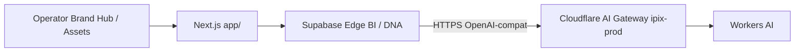
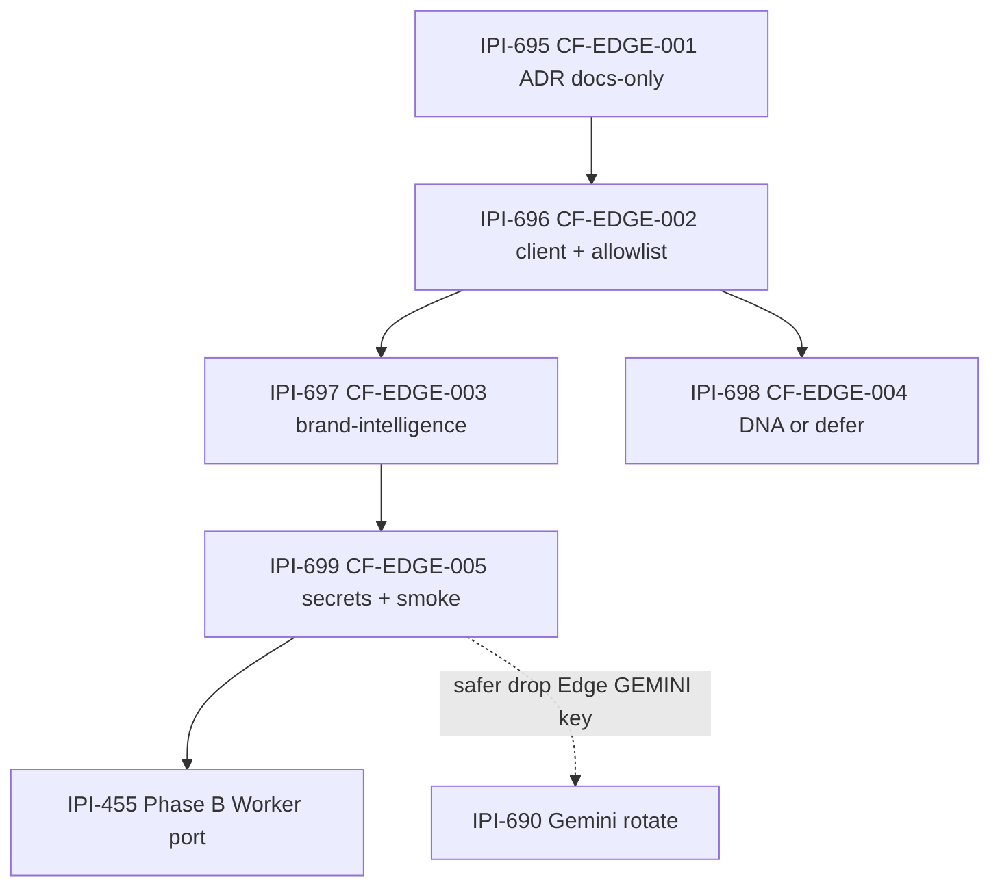

# Agent plan — CF-EDGE-AI (Edge LLM → Cloudflare)

**Created:** 2026-07-18  
**Epic:** [IPI-694 · CF-EDGE-AI](https://linear.app/amo100/issue/IPI-694)  
**Parent:** [IPI-487 · CLOUDFLARE-EPIC](https://linear.app/amo100/issue/IPI-487)  
**Task docs:** [`../Tasks/060-CF-EDGE-AI-epic.md`](../Tasks/060-CF-EDGE-AI-epic.md)

## Plain English

Brand Hub analysis and Asset DNA still call **Gemini/Groq from Supabase Edge**. Operators should keep the same flows; engineers route the **model call** to **Cloudflare AI Gateway (`ipix-prod`) → Workers AI** over HTTPS. We are **not** moving Edge handlers onto Workers in Phase A ([IPI-455](https://linear.app/amo100/issue/IPI-455) is Phase B).

## Architecture



| Do | Don’t |
|----|-------|
| HTTP from Deno Edge → `ipix-prod` | Pretend Edge has `env.AI` |
| Prefer native gateway over custom Worker | New features in `services/cloudflare-worker/` |
| One child PR per Linear issue | Mix ADR + client + secrets |
| Keep `BI_USE_GEMINI=1` rollback | Silent dual-provider |

## Execution order



| Order | Linear | Spec | PR type | Validation when Done |
|------:|--------|------|---------|----------------------|
| 1 | [IPI-695](https://linear.app/amo100/issue/IPI-695) | CF-EDGE-001 | Docs-only | Docs Verified |
| 2 | [IPI-696](https://linear.app/amo100/issue/IPI-696) | CF-EDGE-002 | Code | Unit Verified |
| 3a | [IPI-697](https://linear.app/amo100/issue/IPI-697) | CF-EDGE-003 | Code | Unit (+ Local Runtime) |
| 3b | [IPI-698](https://linear.app/amo100/issue/IPI-698) | CF-EDGE-004 | Code or defer | Unit or Spike Verified |
| 4 | [IPI-699](https://linear.app/amo100/issue/IPI-699) | CF-EDGE-005 | Ops + evidence | **Remote Preview Verified** |
| later | [IPI-455](https://linear.app/amo100/issue/IPI-455) | CF-EDGE-B | Code | After 699 |

## Parallel with Edge security queue

CF-EDGE can run **in parallel** with SB-EDGE harden tickets ([j18-edge-plan](../../../supabase/docs/plan/j18-edge-plan.md)): **IPI-685**, **IPI-688**, **IPI-690** (rotate still IMMEDIATE if key leaked). Do not block 690 on Cloudflare cutover.

## Agent checklist (each child)

```text
[ ] Read Linear issue + Tasks/06x file
[ ] graphify query "Edge LLM brand-intelligence AI_PROVIDER"
[ ] worktree:audit → worktree:add ipi/NNN-cf-edge-…
[ ] Implement one concern only
[ ] Verify matrix for touched paths
[ ] PR with plain-English body (pr-description rule)
[ ] Comment evidence on Linear; mark Done only with validation level
```
