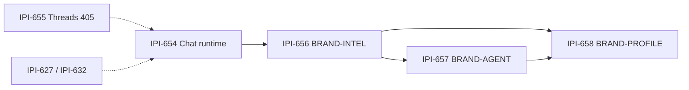
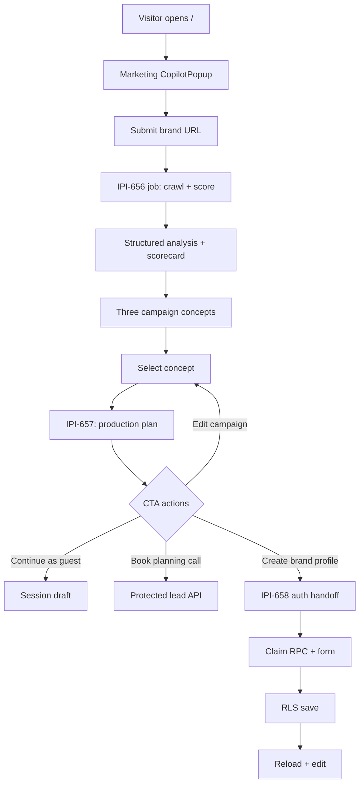
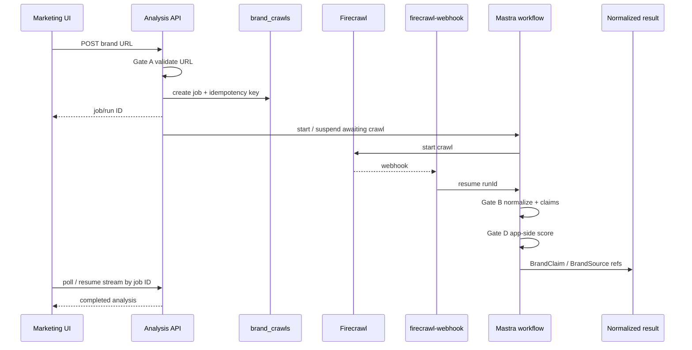
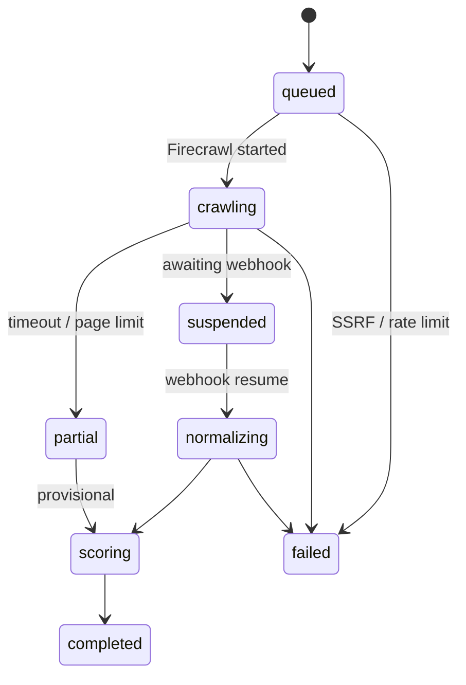
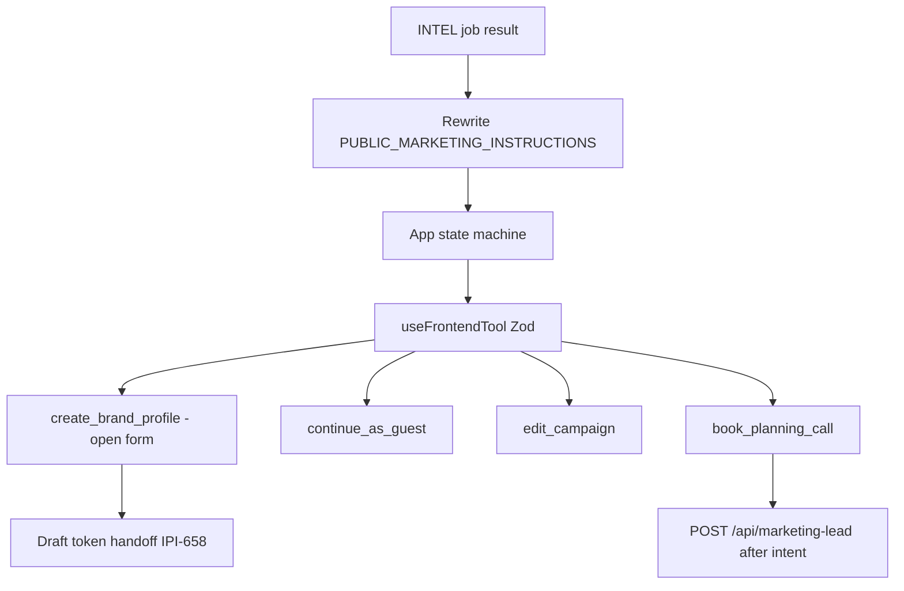
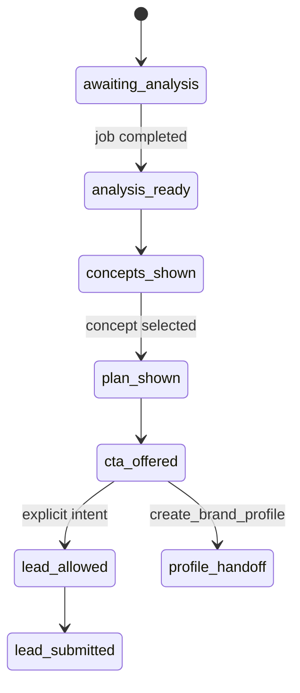
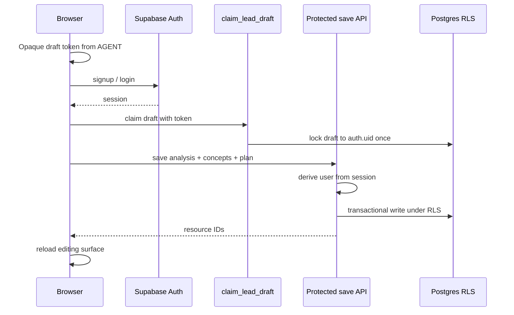
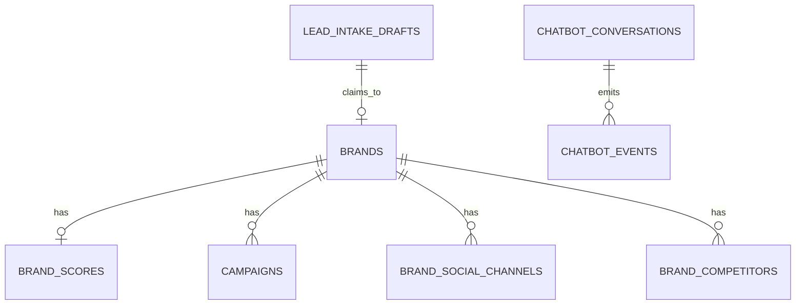

# Public brand-analysis workflow — 3-task plan

**Status:** Plan corrected + efficiency ladder (2026-07-16) — **no production code** until review sign-off.  
**Created:** 2026-07-16 · **Audit:** `4-chat-notes.md` (verified ✅)  
**SSOT plan:** this file  
**Supporting docs:** `1-chat.md` (conversation) · `2-prompt.md` (intelligence) · `3-prompt.md` (persistence)

**Readiness:** ~87% → target **~94%** after IPI-656 Gates A–D accepted.

| Task | Linear | Spec | PR |
|---|---|---|---|
| Multi-source intelligence | [IPI-656](https://linear.app/amo100/issue/IPI-656) | BRAND-INTEL-001 | one PR |
| Conversation + CTAs | [IPI-657](https://linear.app/amo100/issue/IPI-657) | BRAND-AGENT-001 | one PR |
| Auth save + RLS | [IPI-658](https://linear.app/amo100/issue/IPI-658) | BRAND-PROFILE-001 | one PR |

**Hard rules:** one concern per task / PR / commit · no remote deploy · audit before coding · `@task-verifier` before Done · **reuse-first** (below) before custom code.

---

## Reuse-first efficiency ladder (mandatory)

Before writing custom orchestration, climb this ladder. Document the chosen rung in the PR.

```text
1. Dashboard / CLI prebuilts
2. Existing iPix modules + tables + edge fns
3. Official docs recipes / tutorials / GitHub examples
4. Installed SDK APIs (Mastra, CopilotKit, Firecrawl, Supabase, Wrangler)
5. Only then: minimal custom glue
```

| Rung | Tools / sources | When |
|---|---|---|
| **CLI / Dashboard** | Supabase CLI (`supabase migration new`, `db push`, Dashboard SQL/RLS); Wrangler (`wrangler types`, bindings); Firecrawl Dashboard webhooks; Infisical | Schema, secrets, webhook URL, bindings |
| **iPix prebuilt** | `brand-intelligence-workflow.ts`, `start-brand-crawl`, `firecrawl-webhook`, `audit-asset-dna` SSRF helpers, `claim_lead_draft`, `marketing-chat.tsx`, `brand_crawls.idempotency_key` | Default path |
| **Official recipes** | [Mastra suspend/resume](https://mastra.ai/docs/workflows/suspend-and-resume) · [snapshots](https://mastra.ai/docs/workflows/snapshots) · [CopilotKit frontend tools](https://docs.copilotkit.ai/frontend-tools) · [Mastra generative UI](https://docs.copilotkit.ai/integrations/mastra/generative-ui/tool-rendering) · [CF Workflows](https://developers.cloudflare.com/workflows/get-started/guide/) · [Supabase RLS](https://supabase.com/docs/guides/database/postgres/row-level-security) | Pattern copy before inventing |
| **Escalate** | CF Workflows `step.waitForEvent` / Queues | Only if Mastra+Firecrawl job cannot survive disconnect / multi-minute waits |

**Efficient default for IPI-656 (chosen):** Mastra suspend + Firecrawl webhook resume + `brand_crawls` job row — **not** a new Cloudflare Workflow + **not** SSE+`waitUntil`-only.

---

## Current setup (audited)

Evidence: graphify, disk, Supabase MCP, CopilotKit docs MCP, Cloudflare docs MCP, Mastra MCP.

### What already works

| Surface | Path / asset | Notes |
|---|---|---|
| Public chat UI | `app/src/components/marketing/marketing-chat.tsx` | CopilotKit v2, `runtimeUrl=/api/marketing-chat` |
| Public runtime | `app/src/app/api/marketing-chat/[[...slug]]` | Ungated; `public-marketing` only |
| Public agent | `app/src/mastra/agents/public-marketing-agent.ts` | **No tools**; lead-centric instructions |
| Lead proxy | `/api/marketing-lead` + `marketing-chat-lead.tsx` | Zod → `capture-lead` |
| Operator BI workflow | `brand-intelligence-workflow.ts` | Crawl → enrich → HITL; auth-owned |
| Edge crawl | `start-brand-crawl`, `firecrawl-webhook`, `brand-intelligence` | Reuse; harden SSRF |
| Claim draft | `lead_intake_drafts` + `claim_lead_draft()` | WEB-015 pattern for IPI-658 |
| Chat runtime | [IPI-654](https://linear.app/amo100/issue/IPI-654) | Residual threads → IPI-655 |

### Schema reuse map

| Table / RPC | Role |
|---|---|
| `brands` + `brand_scores` | Canonical brand + scores |
| `brand_intake_drafts` | HITL draft pattern |
| `lead_intake_drafts` + `claim_lead_draft()` | Anon → owned claim |
| `brand_crawls` (+ `idempotency_key`) / `brand_crawl_results` | Firecrawl jobs |
| `brand_social_channels` / `brand_competitors` / `brand_agent_results` | Intel rows |
| `campaigns` / `campaign_deliverables` | Campaign candidates |
| `chatbot_conversations` / `messages` / `events` | Session + funnel |
| `brands.embedding` | **Do not expand** until PROFILE retrieval proven |

**Not present:** `brand_profiles`, `brand_analysis_drafts`, `campaign_concepts`, `production_plans` — create only in IPI-658 if reuse fails AC.

---

## Sequencing



Do **not** start IPI-658 until INTEL JSON + AGENT CTA handoff are stable.

---

## End-to-end product flow



---

## Task 1 — IPI-656 · BRAND-INTEL-001

**Purpose:** Evidence-backed multi-source intelligence + explainable scoring before signup.  
**Readiness:** ~78/100 until Gates A–D land.

### Efficient path (prefer over custom)

| Prefer | Avoid inventing |
|---|---|
| Extend `brand-intelligence-workflow` guest-safe branch | New crawl framework |
| `start-brand-crawl` + `firecrawl-webhook` + `brand_crawls.idempotency_key` | New job table without reuse audit |
| Port `audit-asset-dna` SSRF helpers | Ad-hoc URL regex |
| Mastra `suspend()` / `resume()` + snapshot refs ([docs](https://mastra.ai/docs/workflows/suspend-and-resume)) | Long SSE + `waitUntil` only |
| App-side weighted score util | LLM invents final total |
| Fixture site for CI | Live Maaji as sole CI |

**Escalate to CF Workflows** (`step.waitForEvent`) only if Mastra storage cannot hold guest runs across webhook latency — [CF Workflows guide](https://developers.cloudflare.com/workflows/get-started/guide/).

### Mandatory gates A–D

- **A SSRF:** http(s); block private/metadata; redirect revalidate; rate limits  
- **B Hostile crawl:** page text = data; injection fixtures  
- **C Durable job:** POST → job ID → webhook resume → poll/stream  
- **D Provenance + deterministic scoring:** BrandClaim/BrandSource; app-side overall score; provisional when low evidence  

### Architecture





**PR:** `ipi/656-brand-intel-001` · phases inside one PR: discovery → evidence → scoring → render.  
**Non-goals:** CTAs, profile persistence, pgvector expansion, remote deploy, new CF Workflow unless escalated.

---

## Task 2 — IPI-657 · BRAND-AGENT-001

**Purpose:** Value-first conversation, production plan, CTAs — **no DB persist**.  
**Readiness:** ~91/100.

### Efficient path

| Prefer | Avoid |
|---|---|
| [CopilotKit `useFrontendTool`](https://docs.copilotkit.ai/frontend-tools) + Zod | Markdown fake buttons |
| [Mastra generative UI tool rendering](https://docs.copilotkit.ai/integrations/mastra/generative-ui/tool-rendering) | Custom chat widget |
| Existing `marketing-chat.tsx` / `marketing-chat-lead.tsx` / `/api/marketing-lead` | New lead pipeline |
| App/session state machine for `lead_capture_requested` | Prompt-only flag |
| Tutorial pattern: [AI todo frontend tools](https://docs.copilotkit.ai/integrations/built-in-agent/tutorials/ai-todo-app/step-4-frontend-tools) | One-off DIY handlers |

### Architecture





**Hardening:** CTA idempotency; substantial-value gate; frontend tools never save ownership; a11y; Zod model output.  
**PR:** `ipi/657-brand-agent-001`.

---

## Task 3 — IPI-658 · BRAND-PROFILE-001

**Purpose:** Auth handoff + RLS save; reload and continue.  
**Readiness:** ~86/100.

### Efficient path

| Prefer | Avoid |
|---|---|
| Extend `lead_intake_drafts` / `claim_lead_draft()` (WEB-015) | sessionStorage-only draft |
| Supabase CLI migration + Dashboard advisors | Hand-rolled SQL outside migrations |
| Reuse `brands` / `brand_scores` / `campaigns` JSONB | Blind new table set |
| RLS `(select auth.uid())` + indexed `user_id` | Client-supplied `user_id` |
| Protected server route / RPC | Frontend tool writes DB |

### Architecture





**PR:** `ipi/658-brand-profile-001` · split migration if policy requires.  
**Non-goals:** redoing INTEL/AGENT; remote deploy; blind pgvector.

---

## Shared verify matrix

| Gate | Command / probe |
|---|---|
| Audit first | graphify + schema + reuse ladder note in PR |
| Typecheck / tests | `cd app && npm run typecheck && npm test` |
| OpenNext | `npm run build:cf` |
| RLS (658) | `infisical run --env=dev -- npm run supabase:verify-rls` |
| Adversarial (656) | private IP, redirect localhost, injection HTML, duplicate webhook |
| Playwright | Fixture journey CI; Maaji smoke only |
| Deploy | **none remote** |
| Done | `@task-verifier` |

---

## Skills & MCP evidence (this revision)

| Skill / MCP | Probe result |
|---|---|
| `task-verifier` | IPI type; skills hubs on disk ✅ |
| `mastra` MCP | suspend/resume + snapshots — store refs not giant HTML ✅ |
| `cloudflare` docs MCP | Workflows for multi-step/`waitForEvent`; Agents for chat ✅ |
| `copilotkit` MCP | `useFrontendTool` Zod; Mastra tool-rendering recipe ✅ |
| `ipix-supabase` | CLI + `claim_lead_draft` + RLS `(select auth.uid())` ✅ |
| Graphify | marketing-chat + Firecrawl + BI workflow nodes ✅ |

---

## Review checklist (before coding)

- [ ] Accept three-way split + reuse-first ladder
- [ ] Accept IPI-656 Gates A–D + Mastra+Firecrawl default (CF Workflows escalate-only)
- [ ] Guest analysis must **not** write owned `brands` until IPI-658
- [ ] Confirm CTA names + handoff JSON for 657 → 658
- [ ] Confirm 658 extends claim-draft vs new tables
- [ ] IPI-655 remains separate
- [ ] After review → implement **IPI-656 only**
