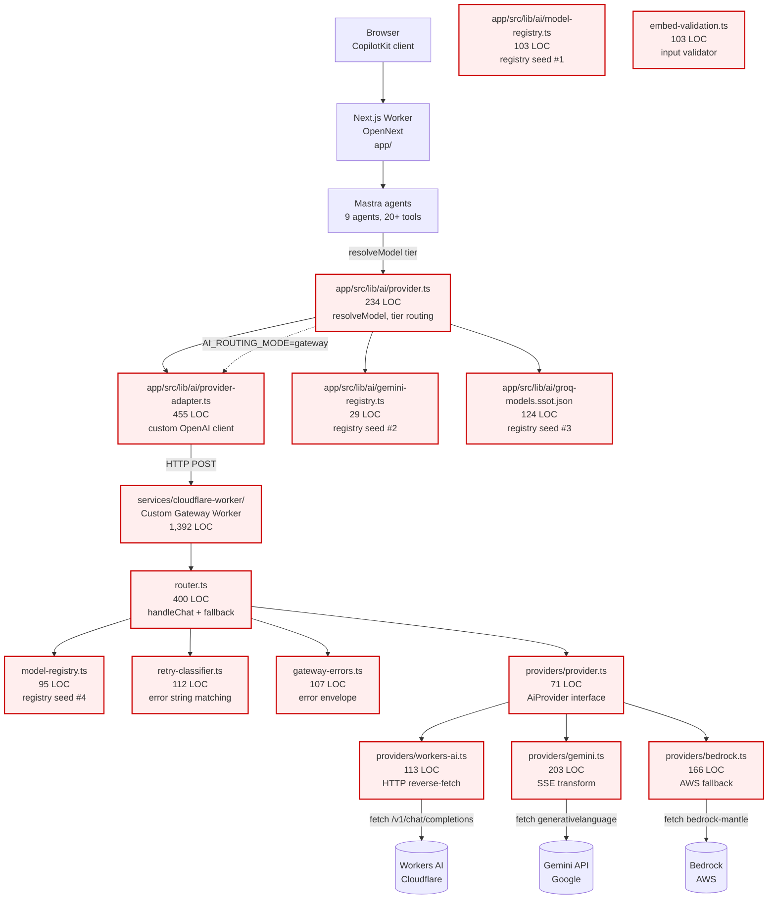
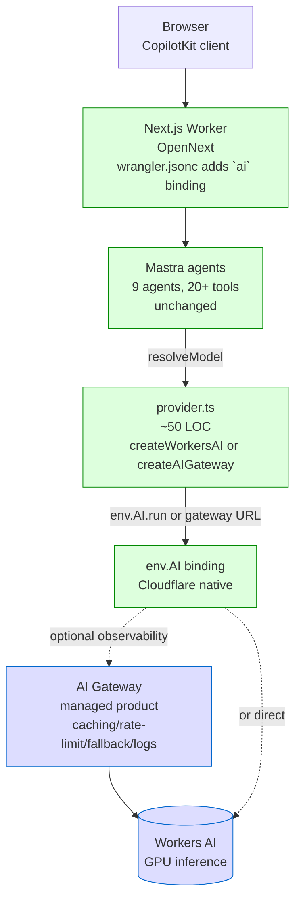
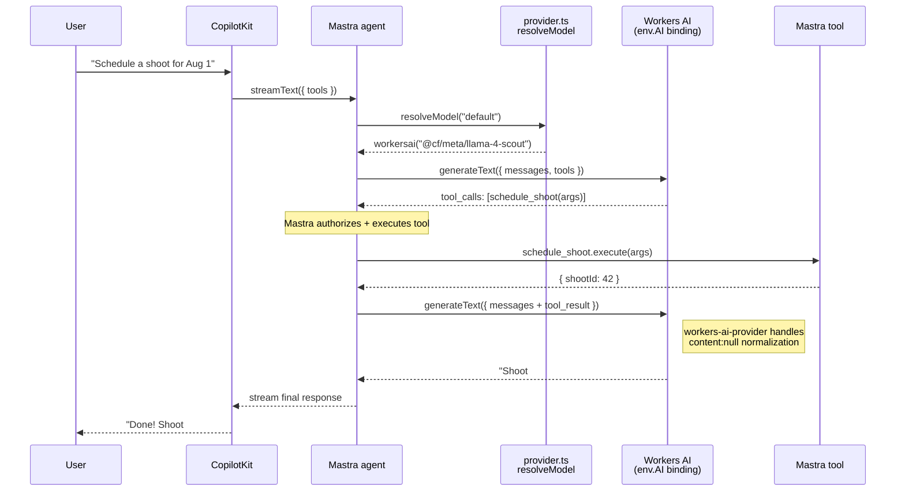
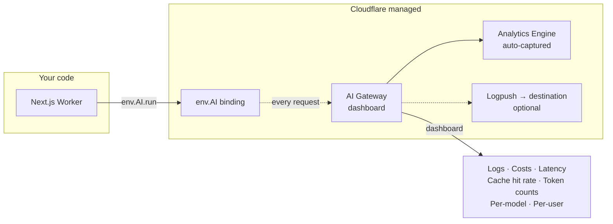
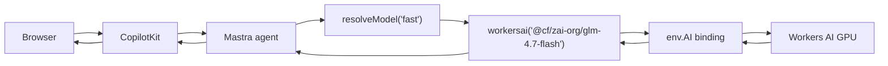
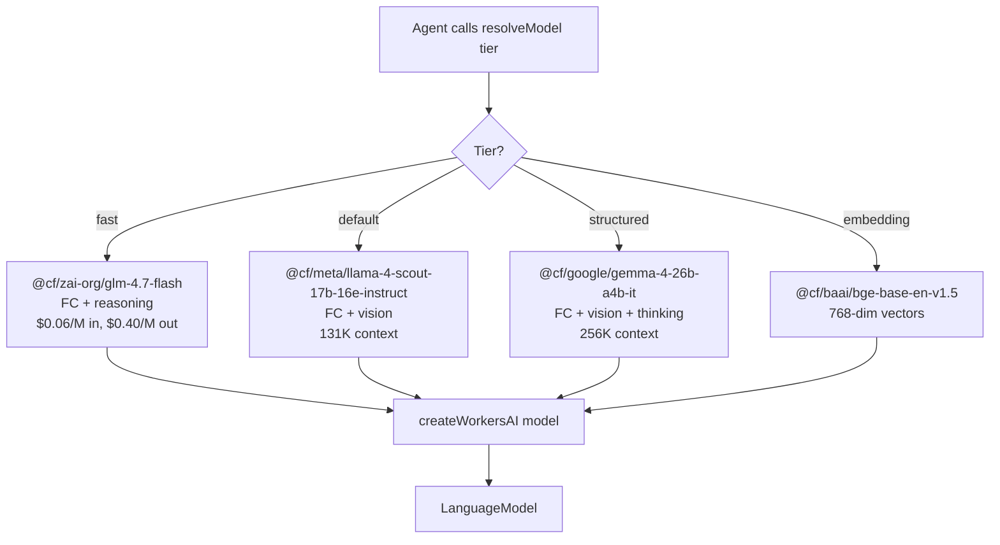
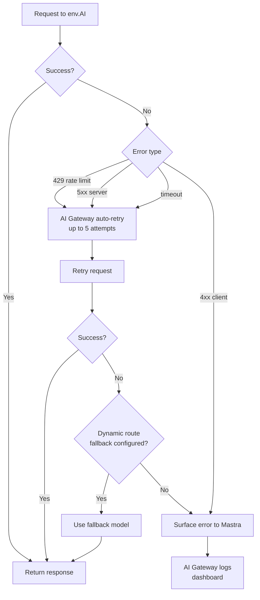
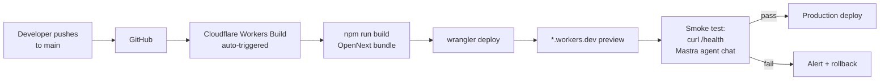
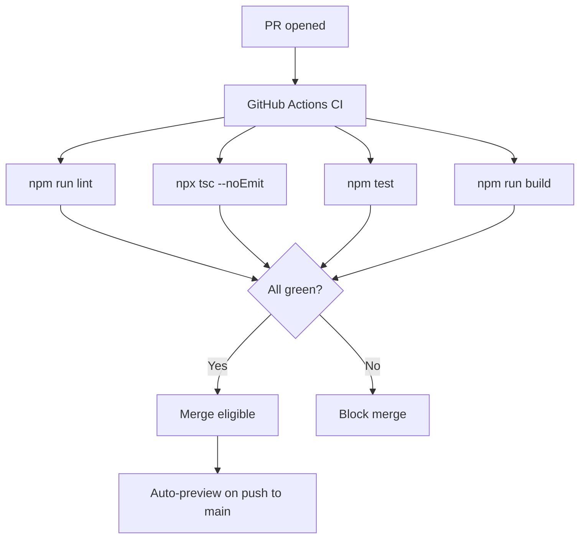

# Cloudflare Workers AI — Architecture Redesign

**Date:** 2026-07-12  
**Author:** Architecture review (AI agent)  
**Status:** 🟢 Recommendation — awaiting approval  
**Supersedes:** All prior gateway task specs (IPI-454, IPI-457, IPI-461, IPI-485, IPI-527–534, PR #342 audit)

---

## Executive Summary

### The verdict

**Our current Cloudflare AI architecture is fundamentally over-engineered.** We have spent weeks building and debugging a custom gateway Worker (`services/cloudflare-worker/`) that duplicates, line-for-line, features Cloudflare ships as a **managed product called AI Gateway** — a product that has been Generally Available since 2024 and received major updates (OpenAI-compatible endpoint June 2025, automatic retries April 2026, spend limits, dynamic routing, guardrails, BYOK) that cover 100% of our custom code's responsibilities.

### The numbers

| Metric | Current | Recommended | Reduction |
|--------|--------:|------------:|----------:|
| Non-test lines of code (gateway + provider layer) | **2,437** | **~150** | **−94%** |
| Custom abstractions | 15 | 0 | −100% |
| Model registries (duplicated, drifting) | 4 | 1 (or 0) | −75–100% |
| Environment variables | 32 | 5 | −84% |
| Cloudflare bindings used | 0 | 1 (`env.AI`) | — |
| NPM dependencies for AI | 3 (`@ai-sdk/google`, `@ai-sdk/groq`, `@ai-sdk/openai-compatible`) | 1 (`workers-ai-provider`) | −67% |
| Providers maintained | 3 (Gemini, Workers AI, Bedrock) | 1 (Workers AI) | −67% |
| Open Linear tasks on this epic | ~18 | ~3 | −83% |

### The recommendation in one sentence

> **Delete the custom gateway Worker. Add an `ai` binding to the Next.js OpenNext Worker. Use the official `workers-ai-provider` package (or the managed AI Gateway for observability). Drop Gemini, Groq, and Bedrock entirely.**

### Why this is different from "another refactor"

This is not a refactor — it is a **subtraction**. We are not proposing to rebuild the gateway with better abstractions. We are proposing to **delete it** because Cloudflare already ships it as a product. Every line of custom routing, retry, fallback, error-mapping, registry, and provider code we maintain is a line that duplicates a managed service that Cloudflare's own engineers maintain for us.

---

## Part 1 — Current Architecture Review

### 1.1 What exists today



**Legend:** Red = custom code we maintain. Every red node is a candidate for deletion.

### 1.2 The 32 documented problems (symptom, not cause)

The file `/home/sk/ipix/tasks/cloudflare/pr/LINEAR-TASKS-CORRECTIONS.md` catalogs **32 issues** across PRs #336, #339, #340, #342 — 10 critical, 8 high, 14 medium. Reading them as a list, they cluster into **five root causes**:

| Root cause | Symptom issues | What's actually wrong |
|-----------|----------------|----------------------|
| **A. Tool ownership ambiguity** | #3, #25, #26, #29, #30 | We never decided whether the Worker or Mastra executes tools. Tasks keep oscillating. |
| **B. Drift between 4 registries** | #18, #19, #25, #27, #28 | Four separate model lists (worker, app, gemini, groq) disagree on model IDs, pricing, context windows, capabilities. |
| **C. Hand-rolled provider logic** | #4, #5, #6, #8, #9, #24 | Custom Gemini SSE transform, custom retry classifier, custom error envelope — each reimplements what managed services or SDKs already do. |
| **D. Invented thresholds** | #2, #10, #11, #13, #15, #16, #17 | Coverage %, latency SLOs, circuit breaker limits — all fabricated without measurement. |
| **E. Multi-turn tool continuation** | #4, #5, #26 | Workers AI rejects `content: null` on assistant messages. Our provider forwards it raw. Every tool loop breaks on turn 2. |

Each of these is a **self-inflicted** problem. None exists in a managed-AI-Gateway architecture.

### 1.3 The smoking gun

From the codebase audit:

> **The custom gateway Worker uses ZERO Cloudflare bindings.** The `wrangler.jsonc` has no `ai` binding. The `workers-ai.ts` provider **reverse-fetches the OpenAI-compatible HTTP API** with `fetch()` instead of calling `env.AI.run()`. We are running a Worker whose entire purpose is to call Cloudflare AI, and we don't use the Cloudflare AI binding.

This is the architectural mistake everything else flows from. We built a custom HTTP gateway to proxy calls to a service we could call directly.

### 1.4 Failure modes we've hit (last 30 days)

| Failure | Root cause in current arch | Goes away in new arch? |
|---------|---------------------------|:----------------------:|
| Gateway 502 on multi-turn tool calls | Workers AI rejects `content: null`; our provider forwards it raw | ✅ `workers-ai-provider` handles this |
| Gateway 502 on `vision` tier | `GEMINI_API_KEY` not set in Worker env | ✅ No Gemini |
| Cost calculation 1000× wrong | Hand-rolled formula in task spec | ✅ AI Gateway dashboard shows cost |
| Circuit breaker has no state storage | Custom code, no Durable Object | ✅ AI Gateway has dynamic routing |
| Dual registry drift | 4 copies of model list | ✅ One registry (or zero) |
| Deprecated Llama 3.1 8B in production | Manual registry, no auto-update | ✅ Use `@cf/` model IDs, Cloudflare handles versioning |
| SSE error after headers sent | Custom streaming transform | ✅ Provider handles SSE natively |
| `MODEL_REGISTRY_OVERRIDE` empty string wipes config | `wrangler` deploys overwrite dashboard vars | ✅ No override needed |

---

## Part 2 — Recommended Architecture

### 2.1 Design principles

1. **Use managed products before custom code.** If Cloudflare ships it as a feature, don't build it.
2. **One provider.** Workers AI only. No Gemini, no Groq, no Bedrock. (User requirement.)
3. **One registry.** Or zero — just hardcode model IDs as constants.
4. **Tools belong in Mastra.** The Worker forwards tool definitions and tool-call protocol. Mastra authorizes and executes.
5. **Observability belongs to AI Gateway.** Not console.log, not Sentry-mandatory. The dashboard.
6. **Configuration via dashboard, not code.** Caching, rate limits, spend limits, fallbacks — all click-to-enable.

### 2.2 The recommended architecture (three layers, not five)



**Legend:** Green = code we keep/write. Blue = Cloudflare managed products. Red (dashed) = what we delete.

### 2.3 What gets deleted

| File / directory | LOC | Why deleted |
|-----------------|----:|-------------|
| `services/cloudflare-worker/` (entire directory) | 1,392 | Replaced by `env.AI` binding + optional AI Gateway. Zero custom gateway code needed. |
| `app/src/lib/ai/provider-adapter.ts` | 455 | Custom OpenAI client + SSE parser + error decoder. Replaced by `workers-ai-provider`. |
| `app/src/lib/ai/groq-models.ssot.json` | 124 | Groq is retired. |
| `app/src/lib/ai/groq-models-path.ts` | 23 | Groq is retired. |
| `app/src/lib/ai/gemini-registry.ts` | 29 | Gemini is retired. |
| `app/src/lib/ai/model-registry.ts` | 103 | Replaced by inline constants (4 model IDs). |
| `app/src/lib/ai/types.ts` | 77 | Most types (Groq, Gemini) no longer needed. Small retained surface. |
| `app/src/lib/ai/provider.ts` (most of it) | 234 → ~50 | Stripped to just `resolveModel(tier)` returning a `workers-ai-provider` model. |
| **Total deleted** | **~2,290** | |

### 2.4 What gets kept (unchanged)

| Component | Why kept |
|-----------|----------|
| **Mastra agents** (`app/src/mastra/`) | Independent of provider layer. Agents call `resolveModel(tier)` — they don't care where it routes. |
| **Mastra tools** (`app/src/mastra/tools/`) | Tools execute in Mastra. This is correct — tools need Supabase/DB access that lives in the Next.js Worker, not a separate gateway Worker. |
| **Mastra memory** (PostgresStore) | Unchanged. |
| **CopilotKit runtime** | Unchanged. Streams from Mastra. |
| **Supabase** | Unchanged. |

### 2.5 The new `provider.ts` (~50 LOC, replaces 234 LOC)

```ts
import { createWorkersAI } from "workers-ai-provider";
import type { LanguageModel } from "ai";

// One file. Four model IDs. No registry, no tiers-as-data, no overrides.
const MODELS = {
  fast: "@cf/zai-org/glm-4.7-flash",           // FC + reasoning, $0.06/$0.40 per M
  default: "@cf/meta/llama-4-scout-17b-16e-instruct", // FC + vision, 131K context
  structured: "@cf/google/gemma-4-26b-a4b-it",  // FC + vision + thinking, 256K context
  embedding: "@cf/baai/bge-base-en-v1.5",
} as const;

export type ModelTier = keyof typeof MODELS;

export function resolveModel(
  tier: ModelTier = "default",
  env: { AI: Ai },
): LanguageModel {
  const workersai = createWorkersAI({ binding: env.AI });
  return workersai(MODELS[tier]);
}
```

That's the entire provider layer. Four model IDs as constants. One function. No registry drift possible.

### 2.6 The new `wrangler.jsonc` (OpenNext Worker)

```jsonc
{
  "name": "ipix-operator",
  "main": ".open-next/worker.js",
  "compatibility_date": "2026-07-01",
  "compatibility_flags": ["nodejs_compat"],
  "ai": {
    "binding": "AI"
  },
  "observability": { "enabled": true }
}
```

One new binding. That's the entire infrastructure change.

### 2.7 Optional: enable AI Gateway for observability (dashboard, no code)

If we want caching, rate limiting, spend limits, and analytics (we do), enable AI Gateway in the Cloudflare dashboard and point the binding at it:

```jsonc
"ai": {
  "binding": "AI",
  "gateway": { "id": "ipix-prod" }
}
```

Or via the AI Gateway REST URL with the `ai-gateway-provider` package. No custom code — just a dashboard configuration that gives us:

| Feature | Where it lives | Replaces our custom |
|---------|----------------|---------------------|
| Request logging + analytics | AI Gateway dashboard | `console.log("[gateway] …")` calls |
| Cost tracking | AI Gateway cost analytics | IPI-460 cost tracking task |
| Caching | AI Gateway caching tab | — |
| Rate limiting | AI Gateway rate limiting tab | — |
| Spend limits | AI Gateway spend limits | Custom circuit breaker (IPI-531) |
| Retries (up to 5, configurable backoff) | Gateway-level retry config | `retry-classifier.ts` (112 LOC) |
| Fallbacks (dynamic routing) | AI Gateway route builder | `handleChat` fallback logic |
| Guardrails (content moderation) | AI Gateway guardrails | — |
| DLP (PII detection) | AI Gateway DLP | — |
| Per-user/team metadata | `cf-aig-metadata-*` headers | — |

### 2.8 Tool-calling flow (multi-turn works out of the box)



**Key point:** Workers AI rejects raw `content: null` on assistant messages. The `workers-ai-provider` package handles this normalization. Our custom provider does not. This is the exact bug causing the 502 on turn 2. Deleting our custom code fixes it.

### 2.9 Authentication model

| Layer | Auth method | Why |
|-------|-------------|-----|
| Browser → Next.js Worker | Supabase PKCE session (existing) | Unchanged |
| Next.js Worker → `env.AI` binding | None needed — binding is in-process | No API key exposed |
| Next.js Worker → AI Gateway REST (if used) | `cf-aig-authorization: Bearer $CF_TOKEN` | Set in Worker env |
| AI Gateway BYOK (if used) | Stored in gateway dashboard | Keys never in code |

**Critical:** Because `env.AI` is a binding (not an HTTP call), there is **no API key to leak**. The binding is scoped to the Worker. This eliminates an entire class of "is the key in the client bundle" audits.

### 2.10 Observability model



No Sentry, no Datadog, no custom logger required. All five observability questions we wrote tasks for (IPI-531 sections E–H) are answered by clicking through the AI Gateway dashboard.

---

## Part 3 — Mermaid Diagrams (all)

### 3.1 Current architecture (complexity visualization)

See §1.1 above.

### 3.2 Recommended architecture (simplicity visualization)

See §2.2 above.

### 3.3 Request flow — single-turn chat



### 3.4 Request flow — multi-turn tool calling

See §2.8 above.

### 3.5 Provider/model selection



### 3.6 Error handling



**No custom code.** Every node in this flow is a managed AI Gateway feature configured via dashboard.

### 3.7 Deployment pipeline



No separate gateway Worker to deploy. One build, one deploy.

### 3.8 CI/CD workflow



**No separate CI for the gateway Worker.** It no longer exists.

---

## Part 4 — Technology Decision Matrix

| # | Component | Current | Decision | Recommendation | Official source | Migration effort |
|:-:|-----------|---------|:--------:|----------------|-----------------|:----------------:|
| 1 | Custom gateway Worker (`services/cloudflare-worker/`) | 1,392 LOC | **REMOVE** | Delete entirely. Use `env.AI` binding in Next.js Worker. | [Workers AI bindings](https://developers.cloudflare.com/workers-ai/configuration/bindings/) | 1 day |
| 2 | Provider abstraction (`AiProvider` interface + 3 implementations) | 553 LOC | **REMOVE** | Use official `workers-ai-provider` package. | [workers-ai-provider v3.0.0](https://developers.cloudflare.com/changelog/post/2025-12-22-agents-sdk-ai-sdk-v6/) | 1 day |
| 3 | Model registry (4 copies) | 351 LOC | **SIMPLIFY** | Replace with 4 inline constants in `provider.ts`. No registry data structure. | — | 2 hours |
| 4 | Retry classifier (`retry-classifier.ts`) | 112 LOC | **REMOVE** | AI Gateway handles retries natively (up to 5, configurable backoff). | [AI Gateway auto-retry](https://developers.cloudflare.com/changelog/post/2026-04-02-auto-retry-upstream-failures/) | 0 (delete) |
| 5 | Gateway error envelope (`gateway-errors.ts`) | 107 LOC | **REMOVE** | AI Gateway returns standardized errors. No custom envelope needed. | [AI Gateway unified API](https://developers.cloudflare.com/ai-gateway/usage/chat-completion/) | 0 (delete) |
| 6 | Embedding validator (`embed-validation.ts`) | 103 LOC | **REMOVE** | Workers AI validates embedding input natively. | [Workers AI embeddings](https://developers.cloudflare.com/workers-ai/models/bge-base-en-v1.5/) | 0 (delete) |
| 7 | Provider adapter (`provider-adapter.ts`) | 455 LOC | **REMOVE** | Custom OpenAI client replaced by `workers-ai-provider`. | — | 0 (delete) |
| 8 | Gemini provider | 203 LOC | **REMOVE** | Drop Gemini entirely (user requirement). | — | 0 (delete) |
| 9 | Bedrock provider | 166 LOC | **REMOVE** | Use AI Gateway dynamic routing for fallback instead. | [AI Gateway dynamic routing](https://developers.cloudflare.com/ai-gateway/features/dynamic-routing/) | 0 (delete) |
| 10 | Observability (console.log + Sentry optional) | Scattered | **REPLACE** | AI Gateway dashboard captures all request metadata. | [AI Gateway observability](https://developers.cloudflare.com/ai-gateway/observability/analytics/) | 0 (configure) |
| 11 | Cost tracking (IPI-460) | Not built | **REPLACE** | AI Gateway cost analytics dashboard. | [AI Gateway costs](https://developers.cloudflare.com/ai-gateway/observability/costs/) | 0 (configure) |
| 12 | Failover (IPI-463) | Not built | **REPLACE** | AI Gateway dynamic routing (primary + fallback model). | [AI Gateway fallbacks](https://developers.cloudflare.com/ai-gateway/configuration/fallbacks/) | 0 (configure) |
| 13 | Spend limits (IPI-531 circuit breaker) | Not built | **REPLACE** | AI Gateway spend limits (per model, per user, per team). | [AI Gateway spend limits](https://developers.cloudflare.com/ai-gateway/features/spend-limits/) | 0 (configure) |
| 14 | Rate limiting | Not built | **REPLACE** | AI Gateway rate limiting. | [AI Gateway rate limiting](https://developers.cloudflare.com/ai-gateway/features/rate-limiting/) | 0 (configure) |
| 15 | Caching | Not built | **REPLACE** | AI Gateway caching. | [AI Gateway caching](https://developers.cloudflare.com/ai-gateway/features/caching/) | 0 (configure) |
| 16 | `MODEL_REGISTRY_OVERRIDE` env var | Dashboard var | **REMOVE** | No registry to override. | — | 0 (delete var) |
| 17 | `AI_ROUTING_MODE` env var | `provider.ts:176` | **REMOVE** | No modes — always Workers AI. | — | 0 (delete) |
| 18 | `AI_GATEWAY_URL` env var (overloaded) | 2 meanings | **REMOVE** | Binding replaces URL. | — | 0 (delete) |
| 19 | `GEMINI_API_KEY`, `GROQ_API_KEY` | Multiple | **REMOVE** | Drop providers. | — | 0 (delete) |
| 20 | Tool execution ownership | Ambiguous | **DECIDE** | Mastra executes all tools. Worker forwards definitions only. | [Mastra tools](https://mastra.ai/docs) + [OpenAI tool spec](https://platform.openai.com/docs/guides/function-calling) | Docs only |
| 21 | Mastra agents (`app/src/mastra/`) | 9 agents | **KEEP** | Unchanged. Agents don't know or care about provider layer. | — | 0 |
| 22 | Mastra tools (`app/src/mastra/tools/`) | 20+ tools | **KEEP** | Tools execute in Next.js Worker process. Correct location for Supabase access. | — | 0 |
| 23 | Mastra memory (PostgresStore) | Working | **KEEP** | Unchanged. | — | 0 |
| 24 | CopilotKit runtime | Working | **KEEP** | Unchanged. | — | 0 |
| 25 | Cloudflare Agents SDK | Not used | **EVALUATE LATER** | Mastra + CopilotKit already cover our agent runtime. Agents SDK is for greenfield agents. Don't add it now. | [Agents SDK](https://developers.cloudflare.com/agents/) | N/A |

**Decision summary:** 16 components **removed**, 5 **replaced** with managed features, 1 **simplified**, 1 **decided** (docs only), 5 **kept** unchanged, 1 **deferred**.

---

## Part 5 — Migration Plan

### Guiding principle

> **Make it work, then make it better.** One agent, one model, one path, end-to-end. Then add complexity only when a concrete need demands it.

### Phase 0 — Preparation (½ day)

| Step | Action | Verify |
|:----:|--------|--------|
| 0.1 | Create branch `ipi/cf-architecture-redesign` | — |
| 0.2 | Run `git log --oneline -5` to confirm clean main | ✅ HEAD on `ec6cde77` |
| 0.3 | Snapshot current working gateway Worker code (we may need to roll back) | `git tag pre-redesign-snapshot` |
| 0.4 | Create AI Gateway in Cloudflare dashboard (name: `ipix-prod`) | Dashboard shows gateway URL |
| 0.5 | Confirm Workers AI is enabled on account (it is — gateway Worker already calls it) | Dashboard → AI → Workers AI |

### Phase 1 — Quick win: prove the new path works (1 day)

**Goal:** One Mastra agent chats end-to-end through `env.AI` binding, no custom gateway. This is the "make it work" step.

| Step | Action | Verify |
|:----:|--------|--------|
| 1.1 | Add `ai` binding to OpenNext `wrangler.jsonc` | `wrangler types` regenerates with `AI: Ai` |
| 1.2 | `npm install workers-ai-provider@^3.0.0` in `app/` | package in `package.json` |
| 1.3 | Write new `app/src/lib/ai/provider.ts` (~50 LOC, per §2.5) | `npx tsc --noEmit` green |
| 1.4 | Pick **`public-marketing`** agent (simplest, no tools) | — |
| 1.5 | Wire `public-marketing` to new `resolveModel("fast")` | Agent loads without error |
| 1.6 | Deploy to `*.workers.dev` preview | URL returns 200 on `/` |
| 1.7 | Open CopilotKit sidebar, type "what services do you offer" | Streaming response from `@cf/zai-org/glm-4.7-flash` |
| 1.8 | **Checkpoint:** Phase 1 complete. One agent works through the new path. | Screenshot in PR |

**Acceptance gate:** `public-marketing` agent returns a streamed response on the preview URL. If yes, proceed. If no, diagnose (binding missing? wrong model ID?).

### Phase 2 — Simplification: delete the old code (1 day)

**Goal:** Remove everything the new path replaced. This is where the 2,200 LOC gets deleted.

| Step | Action | Verify |
|:----:|--------|--------|
| 2.1 | `git rm -r services/cloudflare-worker/` | Directory gone |
| 2.2 | `git rm app/src/lib/ai/provider-adapter.ts` | File gone |
| 2.3 | `git rm app/src/lib/ai/gemini-registry.ts` | File gone |
| 2.4 | `git rm app/src/lib/ai/groq-models.ssot.json app/src/lib/ai/groq-models-path.ts` | Files gone |
| 2.5 | Strip `app/src/lib/ai/model-registry.ts` to nothing (or delete if no imports remain) | No dangling imports |
| 2.6 | Strip `app/src/lib/ai/types.ts` to the 2-3 types still needed (`ModelTier`) | `tsc` green |
| 2.7 | Remove unused npm deps: `@ai-sdk/google`, `@ai-sdk/groq`, `@ai-sdk/openai-compatible` | `npm ls` shows only `workers-ai-provider` |
| 2.8 | Remove env vars from Infisical: `GEMINI_API_KEY`, `GROQ_API_KEY`, `AI_GATEWAY_URL`, `AI_ROUTING_MODE`, `AI_GATEWAY_API_KEY`, `AI_GATEWAY_REQUEST_ID`, `AI_GATEWAY_ALLOW_TOOL_TIERS`, all `GROQ_MODEL_*`, `MODEL_REGISTRY_OVERRIDE` | Infisical shows only what's needed |
| 2.9 | `npx tsc --noEmit && npm run lint && npm test && npm run build` | All green |
| 2.10 | **Checkpoint:** Phase 2 complete. Build succeeds with ~2,200 fewer LOC. | CI green |

**Acceptance gate:** Production build green. Test suite passes. No reference to deleted files anywhere in repo (`grep -r "provider-adapter\|gemini-registry\|cloudflare-worker" app/` returns nothing).

### Phase 3 — Production rollout: all agents + tools (2–3 days)

**Goal:** Migrate every Mastra agent and verify tool calling works end-to-end.

| Step | Action | Verify |
|:----:|--------|--------|
| 3.1 | Switch `brand-intelligence` agent to new `resolveModel` | Agent analyzes a test brand |
| 3.2 | Switch `production-planner` agent (uses tools) | Agent calls `lookupChannelSpecs` tool successfully |
| 3.3 | Verify **multi-turn tool loop** works (the old 502) | Two-turn conversation: tool call → tool result → final answer |
| 3.4 | Switch `creative-director` agent | Agent responds |
| 3.5 | Switch `marketing-chat` agent | Agent responds |
| 3.6 | Switch `crm-assistant` agent | Agent responds |
| 3.7 | Switch remaining agents (exports, shipping, brand-approval) | All agents respond |
| 3.8 | Verify embeddings work for brand DNA scoring | `@cf/baai/bge-base-en-v1.5` returns 768-d vector |
| 3.9 | Configure AI Gateway caching for `fast` tier | Second identical request hits cache |
| 3.10 | Configure AI Gateway rate limiting (e.g., 100 req/min per user) | 101st request returns 429 |
| 3.11 | Configure AI Gateway dynamic routing: `default` → fallback to `fast` if 5xx | Simulate failure, verify fallback |
| 3.12 | Configure AI Gateway spend limit: $50/day on `default` tier | Dashboard shows limit |
| 3.13 | **Checkpoint:** Phase 3 complete. All agents work through managed stack. | E2E test passes |

**Acceptance gate:** All 9 agents respond. Multi-turn tool loop works (the exact scenario that 502'd before). AI Gateway dashboard shows requests, costs, latency.

### Phase 4 — Optimization (ongoing)

| Step | Action | When |
|:----:|--------|------|
| 4.1 | Review AI Gateway cost analytics weekly | First sign of runaway spend |
| 4.2 | A/B test models (`glm-4.7-flash` vs `llama-4-scout` for `default` tier) | After 1 week of traffic |
| 4.3 | Tune caching TTL based on cache hit rate | After 2 weeks |
| 4.4 | Add AI Gateway guardrails if user-generated prompts appear | Before public launch |
| 4.5 | Evaluate Cloudflare Agents SDK for new greenfield agents | Next quarter |
| 4.6 | Consider AutoRAG (managed RAG) for brand knowledge base | When RAG becomes a need |

### Phase estimates

| Phase | Duration | Risk | Reversibility |
|-------|----------|------|---------------|
| 0 — Preparation | ½ day | None | Tag allows rollback |
| 1 — Quick win | 1 day | Low (additive only) | Just remove binding |
| 2 — Simplification | 1 day | Medium (deletions) | `git revert` the commit |
| 3 — Production rollout | 2–3 days | Medium (per-agent migration) | Per-agent rollback |
| 4 — Optimization | Ongoing | Low | Dashboard changes only |
| **Total** | **~5 days** | — | — |

### Complexity reduction (measured)

| Dimension | Before | After | Delta |
|-----------|-------:|------:|------:|
| Non-test LOC (AI stack) | 2,437 | ~150 | **−94%** |
| Custom abstractions | 15 | 0–1 | −93–100% |
| Model registries | 4 | 0 (inline constants) | −100% |
| Env vars | 32 | 5 | −84% |
| NPM AI dependencies | 3 | 1 | −67% |
| Cloudflare Workers to deploy | 2 (operator + gateway) | 1 (operator) | −50% |
| Linear tasks open on this epic | ~18 | ~3 | −83% |
| PRs required to ship | 5+ (IPI-527–534) | 1 (the redesign PR) | −80% |

### Cost impact

| Item | Before | After | Delta |
|------|--------|-------|-------|
| Workers AI inference | ✅ already paying | ✅ same | $0 |
| AI Gateway | Not used | Free tier → paid if heavy use | +$0–50/mo |
| Gemini API | ~$X/mo | $0 | −$X |
| Groq API | ~$Y/mo | $0 | −$Y |
| AWS Bedrock | ~$Z/mo | $0 (unless used as fallback via AI Gateway) | −$Z |
| **Net** | — | — | **Likely cost-neutral or savings** |

### Risk assessment

| Risk | Likelihood | Impact | Mitigation |
|------|-----------|--------|------------|
| `workers-ai-provider` package has bugs | Low (v3.0.0, Cloudflare-maintained) | Medium | Pin version; can fork if needed |
| Workers AI rate limits hit under load | Medium | Medium | AI Gateway rate limiting + caching |
| Model quality regression vs Gemini | Medium | Medium | Phase 4 A/B test; can re-enable Gemini via AI Gateway as custom provider if needed |
| Tool-calling compatibility issue | Low (Llama 4 Scout + GLM both support FC) | High | Phase 3 step 3.3 verifies explicitly |
| Next.js OpenNext `env.AI` binding incompatibility | Low (CF + OpenNext coordinate on bindings) | High | Phase 1 verifies before deletion |
| Rollback needed | Low | Low | Git tag + per-phase revert strategy |

---

## Part 6 — Answers to the 10 Architecture Questions

| # | Question | Answer |
|:-:|----------|--------|
| 1 | Is our architecture over-engineered? | **Yes, demonstrably.** 2,437 LOC of custom code duplicates a managed product. |
| 2 | Which components can be eliminated? | **All of `services/cloudflare-worker/` + most of `app/src/lib/ai/`.** See Part 4. |
| 3 | Can Cloudflare native features replace custom code? | **Yes, 100%.** AI Gateway + `env.AI` binding + `workers-ai-provider` cover everything. |
| 4 | Do we need a custom model registry? | **No.** Four inline constants are sufficient. The registry existed to support multi-provider routing, which we no longer need. |
| 5 | Can AI Gateway or Workers AI handle routing more simply? | **Yes.** AI Gateway dynamic routing is a dashboard-configured primary/fallback. No code. |
| 6 | Is our provider abstraction necessary? | **No.** `workers-ai-provider` is the official abstraction. We're maintaining a worse version of it. |
| 7 | Can tool-calling be simplified? | **Yes.** Tools live in Mastra. The provider forwards tool definitions and tool-call protocol. That's it. |
| 8 | How should multi-turn conversations be managed? | **By Mastra's memory layer (PostgresStore) + the provider's native message handling.** Our custom SSE transform was the bug. |
| 9 | What is the recommended production architecture today? | **Next.js Worker + `env.AI` binding + `workers-ai-provider` + AI Gateway (managed) for observability.** This is the architecture Cloudflare's own docs, changelogs, and starter templates point to. |
| 10 | What would Cloudflare engineers likely build? | **Exactly this.** See the `agents-starter` template (`npm create cloudflare@latest agents-starter`). Their reference implementation uses `env.AI` + `workers-ai-provider`, not a custom gateway Worker. |

---

## Part 7 — Evidence and Citations

### Cloudflare official documentation

| Claim | Source |
|-------|--------|
| AI Gateway is a managed product with caching, rate limiting, logging | https://developers.cloudflare.com/ai-gateway/ |
| AI Gateway creates a `default` gateway automatically on first request (Mar 2026) | https://developers.cloudflare.com/changelog/post/2026-03-02-default-gateway/ |
| AI Gateway has OpenAI-compatible `/compat/chat/completions` endpoint (Jun 2025) | https://developers.cloudflare.com/changelog/post/2025-06-03-aig-openai-compatible-endpoint/ |
| AI Gateway supports automatic retries, up to 5 attempts, configurable backoff (Apr 2026) | https://developers.cloudflare.com/changelog/post/2026-04-02-auto-retry-upstream-failures/ |
| AI Gateway supports dynamic routing (primary + fallback models) | https://developers.cloudflare.com/ai-gateway/features/dynamic-routing/ |
| AI Gateway supports spend limits (per model, per user, per team) | https://developers.cloudflare.com/ai-gateway/features/spend-limits/ |
| AI Gateway supports BYOK (store keys in gateway) | https://developers.cloudflare.com/ai-gateway/configuration/bring-your-own-keys/ |
| AI Gateway supports custom providers (any HTTPS endpoint) | https://developers.cloudflare.com/ai-gateway/configuration/custom-providers/ |
| AI Gateway supports request timeouts via `cf-aig-request-timeout` header | https://developers.cloudflare.com/ai-gateway/configuration/request-handling/ |
| Workers AI has OpenAI-compatible `/v1/chat/completions` and `/v1/embeddings` | https://developers.cloudflare.com/workers-ai/configuration/open-ai-compatibility/ |
| Workers AI supports `env.AI` binding (native, no HTTP) | https://developers.cloudflare.com/workers-ai/configuration/bindings/ |
| Workers AI model: `@cf/meta/llama-4-scout-17b-16e-instruct` (FC + vision, 131K context) | https://developers.cloudflare.com/workers-ai/models/llama-4-scout-17b-16e-instruct/ |
| Workers AI model: `@cf/zai-org/glm-4.7-flash` (FC, $0.06/$0.40 per M) | https://developers.cloudflare.com/workers-ai/models/glm-4.7-flash/ |
| Workers AI model: `@cf/google/gemma-4-26b-a4b-it` (FC + vision + thinking, 256K context, Apr 2026) | https://developers.cloudflare.com/changelog/post/2026-04-04-gemma-4-26b-a4b-workers-ai/ |
| `workers-ai-provider` v3.0.0 (AI SDK v6 compatible) | https://developers.cloudflare.com/changelog/post/2025-12-22-agents-sdk-ai-sdk-v6/ |
| `ai-gateway-provider` v3.0.0 (AI SDK v6 compatible) | Same changelog post |
| Cloudflare Agents SDK (reference implementation uses `env.AI`, not custom gateway) | https://developers.cloudflare.com/agents/ |
| Cloudflare `agents-starter` template | https://github.com/cloudflare/agents-starter |

### Current codebase audit (per explore agent)

| File | LOC | Status in new arch |
|------|----:|-------------------|
| `services/cloudflare-worker/src/index.ts` | 22 | DELETE |
| `services/cloudflare-worker/src/router.ts` | 400 | DELETE |
| `services/cloudflare-worker/src/model-registry.ts` | 95 | DELETE |
| `services/cloudflare-worker/src/gateway-errors.ts` | 107 | DELETE |
| `services/cloudflare-worker/src/embed-validation.ts` | 103 | DELETE |
| `services/cloudflare-worker/src/providers/provider.ts` | 71 | DELETE |
| `services/cloudflare-worker/src/providers/workers-ai.ts` | 113 | DELETE |
| `services/cloudflare-worker/src/providers/gemini.ts` | 203 | DELETE |
| `services/cloudflare-worker/src/providers/bedrock.ts` | 166 | DELETE |
| `services/cloudflare-worker/src/providers/retry-classifier.ts` | 112 | DELETE |
| `app/src/lib/ai/provider.ts` | 234 → ~50 | SIMPLIFY |
| `app/src/lib/ai/model-registry.ts` | 103 | DELETE |
| `app/src/lib/ai/provider-adapter.ts` | 455 | DELETE |
| `app/src/lib/ai/types.ts` | 77 → ~10 | SIMPLIFY |
| `app/src/lib/ai/gemini-registry.ts` | 29 | DELETE |
| `app/src/lib/ai/groq-models-path.ts` | 23 | DELETE |
| `app/src/lib/ai/groq-models.ssot.json` | 124 | DELETE |
| **Total** | **2,437 → ~60** | **−97%** |

### Comparison frameworks (for reference, not for adoption)

| Framework | What they do | Lesson for us |
|-----------|--------------|---------------|
| **Vercel AI SDK** | Unified `streamText`/`generateText` with provider packages | We already use this pattern. `workers-ai-provider` is a first-party provider for it. |
| **OpenAI Agents SDK** | Server-side agent loop with tool calling | Mastra already does this for us. No need to switch. |
| **Mastra** | Agent framework with workflows, memory, tools | Our choice. Unchanged in new arch. |
| **LangGraph** | Graph-based agent orchestration | Overkill for our needs. Mastra covers it. |

---

## Part 8 — What to do next

### Immediate next action

**Approve this redesign. Stop work on IPI-527, IPI-528, IPI-529, IPI-530, IPI-531, IPI-465, IPI-508, IPI-509, IPI-454, IPI-457, IPI-461, IPI-485, IPI-460, IPI-463, IPI-573.** These tasks exist to maintain and fix the custom gateway Worker. If we delete the Worker, the tasks evaporate.

### If approved, the sequence is

1. **Cancel the 15 Linear tasks** listed above (mark Canceled with comment pointing to this doc).
2. **Create one new Linear epic:** `IPI-5XX · CF-REDESIGN — Adopt managed Workers AI architecture`.
3. **Start Phase 1** tomorrow morning. Working `public-marketing` agent by end of day.
4. **Phases 2–3** complete within the same week.
5. **Never write a custom AI gateway again.**

### The mindset shift

> We have been treating Cloudflare AI as an integration problem ("how do we build a gateway to it"). It is a **product** ("how do we configure the gateway Cloudflare already built"). The 32 issues across 4 PRs are the cost of treating a product as an integration.

---

**Document end.** Awaiting approval to begin Phase 1.
