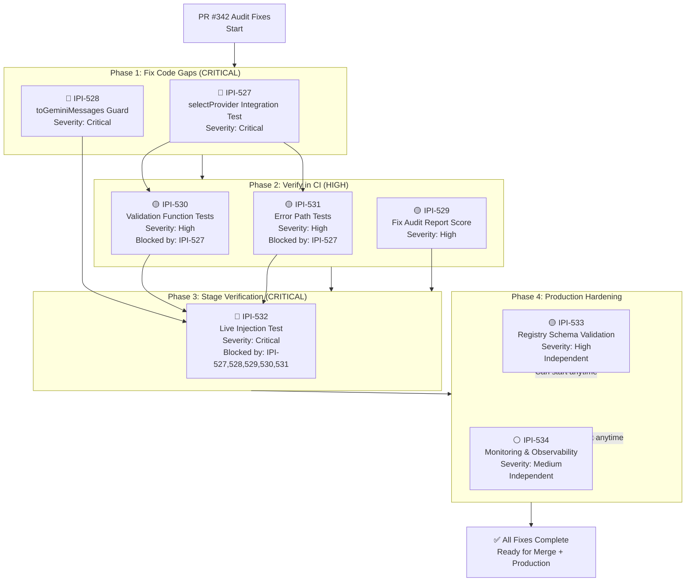

# PR #342 Audit Fixes — Task Dependency Diagram

## Execution Flow



---

## Task Matrix

| Task | ID | Type | Severity | Status | Blockers | Est. Effort |
|------|-----|------|----------|--------|----------|-------------|
| selectProvider integration test | IPI-527 | Bug Fix | 🔴 Critical | Ready | None | 2h |
| toGeminiMessages guard | IPI-528 | Bug Fix | 🔴 Critical | Ready | None | 1h |
| Fix audit report score | IPI-529 | Docs | 🟡 High | Ready | None | 30min |
| Validation function tests | IPI-530 | Bug Fix | 🟡 High | Blocked | IPI-527 | 2h |
| Error path tests | IPI-531 | Bug Fix | 🟡 High | Blocked | IPI-527 | 2h |
| Live injection test | IPI-532 | Security | 🔴 Critical | Blocked | IPI-527,528,529,530,531 | 3h |
| Registry schema validation | IPI-533 | Feature | 🟡 High | Ready | None | 3h |
| Monitoring & observability | IPI-534 | Feature | ⚪ Medium | Ready | None | 4h |

**Total effort:** ~17.5 hours  
**Critical path:** IPI-527 → IPI-530/531 → IPI-532 (requires all Phase 1 & 2 complete)  
**Can parallelize:** IPI-533, IPI-534 independent; Phase 2 tasks parallel

---

## Merge Gate

```
✅ Phase 1 Complete (IPI-527, 528)
├─ selectProvider routes to GLM
├─ toGeminiMessages rejects tool messages
└─ No new type errors
    ↓
✅ Phase 2 Complete (IPI-529, 530, 531)
├─ All validation functions imported and tested
├─ Error paths verified
├─ Audit score corrected
└─ CI passes typecheck, test, build
    ↓
🟢 **PR READY TO MERGE**
```

---

## Production Gate

```
✅ Merge Complete + Deployed to Staging
├─ Phase 3: Live injection test PASSED
│  └─ Tool results don't hijack model
├─ Phase 4: Production hardening
│  ├─ Registry schema validation in place
│  └─ Monitoring alerts configured
└─ Manual smoke test passed
    ↓
🟢 **READY FOR PRODUCTION DEPLOYMENT**
```

---

## Parallel Execution Strategy

**Can do in parallel (no blocking dependencies):**
- IPI-527 & IPI-528 (both Phase 1, independent)
- IPI-533 & IPI-534 (Phase 4 independent tasks)
- IPI-529 (documentation, anytime)

**Must wait for:**
- IPI-529, IPI-530, IPI-531 wait for IPI-527 ✅
- IPI-532 waits for all Phase 1 & 2 complete ⚠️
- Phase 4 can start after Phase 3, but IPI-533/534 independent

**Recommended execution order:**
1. Week 1: IPI-527 + IPI-528 + IPI-529 (in parallel, ~2-3 days)
2. Week 1: IPI-530 + IPI-531 (after 527, ~2-3 days)
3. Week 2: Merge PR #342 to main
4. Week 2: IPI-532 (staging verification, ~3 hours)
5. Week 2: IPI-533 + IPI-534 (production hardening, parallel, ~4 hours)
6. Week 3: Production deployment

