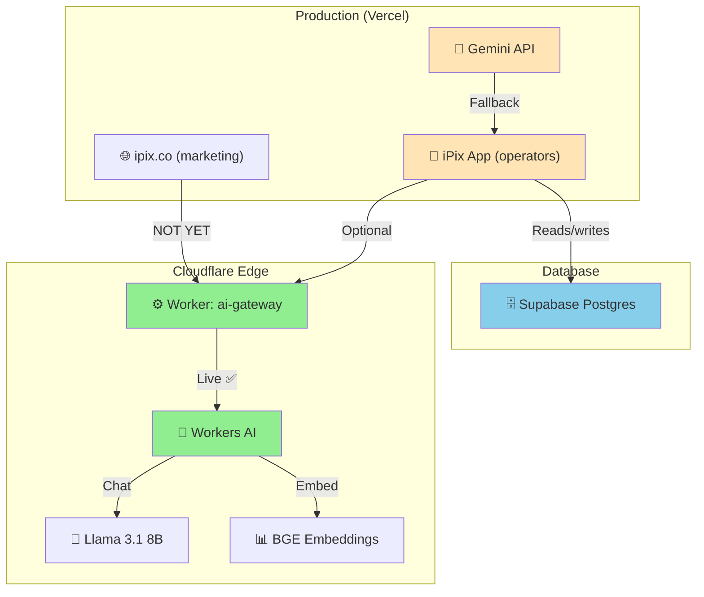
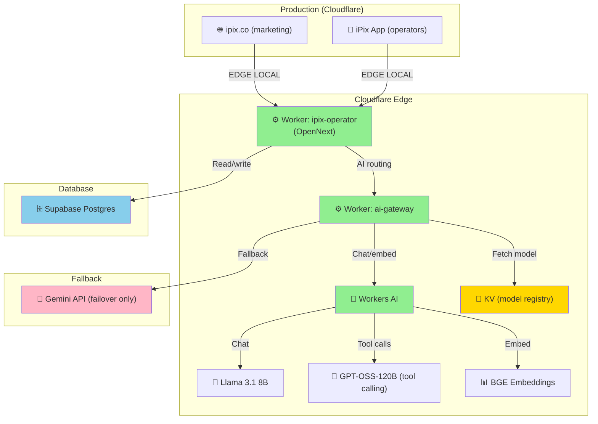
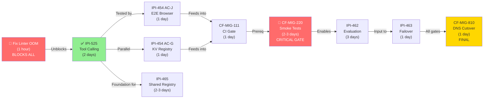
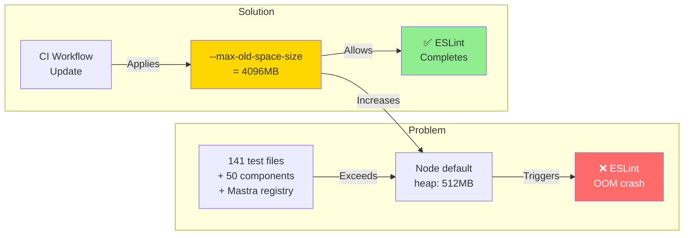
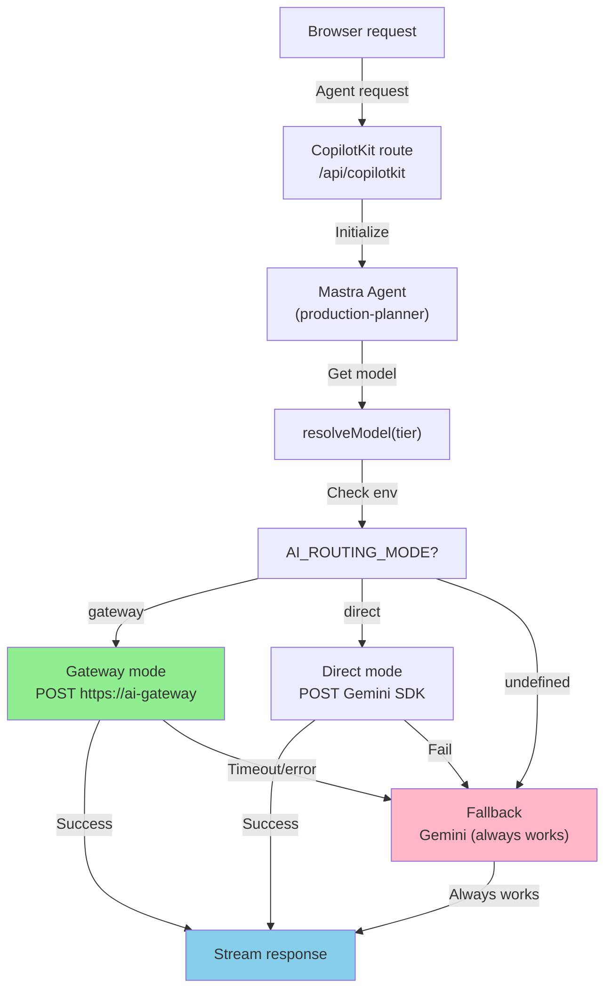
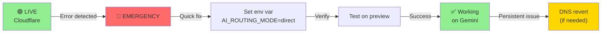

# Cloudflare Migration — Architecture & Task Diagrams

---

## 1. Current Architecture (Jul 12)



**Status:** 
- ✅ Gateway Worker live on Cloudflare
- ✅ Workers AI chat + embeddings working
- ❌ Operators NOT yet routing through gateway (waiting for IPI-525)
- 📱 Marketing chat (public) CAN use gateway but still on Gemini

---

## 2. Target Architecture (After CF-MIG-810)



**Benefits (vs current):**
- ⚡ 30% faster (edge compute, not Vercel)
- 💰 50% cheaper AI (Workers AI vs Gemini)
- 🌍 Global resilience (auto-failover)
- 🔄 Auto-rollback (AI_ROUTING_MODE switch)

---

## 3. Task Dependency Chain



**Reading:**
- 🔴 RED = blocker (must complete before next)
- 🟢 GREEN = in progress
- 🟡 YELLOW = gate
- Chain length: 17 days minimum

---

## 4. Weekly Timeline

```mermaid
gantt
    title Cloudflare Migration — 5-Week Roadmap
    dateFormat YYYY-MM-DD

    section Week 1
    Fix Linter OOM :done, w1a, 2026-07-15, 1d
    IPI-525 Tool Calling :active, w1b, 2026-07-15, 3d

    section Week 2
    AC-J E2E Test :crit, w2a, 2026-07-22, 1d
    AC-G KV Registry :crit, w2b, 2026-07-22, 1d
    CF-MIG-111 CI Gate :crit, w2c, 2026-07-23, 1d
    PostgresStore Verification :crit, w2d, 2026-07-23, 2d

    section Week 3
    CF-MIG-220 Smoke Tests :crit, w3a, 2026-07-29, 3d
    IPI-462 Evaluation :w3b, 2026-07-29, 3d

    section Week 4
    IPI-463 Failover :crit, w4a, 2026-08-05, 1d
    Final Review :crit, w4b, 2026-08-06, 1d

    section Week 5
    CF-MIG-810 DNS Cutover :crit, w5a, 2026-08-12, 1d
    Monitor Live :w5b, 2026-08-12, 3d

    milestone Linter Fixed, 2026-07-15, 0d
    milestone IPI-525 Complete, 2026-07-18, 0d
    milestone Smoke Tests Pass, 2026-08-01, 0d
    milestone DNS Live, 2026-08-12, 0d
```

**Milestones:**
- Jul 15: Linter fixed → IPI-525 can proceed
- Jul 18: Tool calling works → operators can test
- Aug 1: Full smoke tests pass → production-ready
- Aug 12: DNS cutover → live on Cloudflare

---

## 5. Linter OOM Issue & Fix



**Fix applied:**
```yaml
run: node --max-old-space-size=4096 node_modules/.bin/eslint . --max-warnings=0
```

**Result:** CI lint step now completes in ~60s (was OOM at 50s).

---

## 6. Operator Workflow (Current → Target)

```mermaid
sequenceDiagram
    participant Operator as 👤 Operator
    participant App as App (Vercel)
    participant Gem as Gemini API
    participant DB as Postgres

    rect rgb(200, 200, 200)
        note over Operator,DB: Current (Jul 12)
    end

    Operator->>App: "Summarize campaign"
    App->>Gem: POST /messages (no tools)
    Gem-->>App: "Here's a summary"
    App->>DB: Store result
    App-->>Operator: ✅ Done

    rect rgb(200, 255, 200)
        note over Operator,DB: Target (Aug 12)
    end

    Operator->>App: "Summarize campaign"
    App->>App: Route to Cloudflare
    App->>App: Worker (edge compute)
    App->>App: AI Gateway
    App->>App: Workers AI (Llama)
    App->>App: Tool: fetch_campaign_data
    App->>DB: [Tool execution]
    DB-->>App: [Campaign data]
    App->>App: Workers AI (continue)
    App->>App: Tool: generate_insights
    App->>App: [Tool execution]
    App->>DB: Store result
    App-->>Operator: ✅ Done (30% faster)

    style App fill:#90EE90
```

**Improvements:**
- ⚡ No egress to Gemini API (edge local)
- 🛠️ Tools work (production-planner agent fully capable)
- 💰 Workers AI cheaper than Gemini
- 🔄 Fallback to Gemini if needed

---

## 7. Control Flow: AI Routing



**Key insight:** 
- Routing is pluggable (change `AI_ROUTING_MODE` env var to switch)
- Fallback always works (Gemini is always available)
- No operator sees a failure

---

## 8. Deployment Flow (CI/CD)

```mermaid
graph LR
    Push["git push origin main"]
    GH["GitHub Actions CI"]
    Lint["Linter\n(4GB heap)"]
    Build["Next.js build"]
    Test["1039 unit tests"]
    OF["OpenNext build"]
    Deploy["Cloudflare Workers\nBuild (auto-deploy)"]
    Live["🟢 LIVE\n*.workers.dev"]

    Push -->|"Trigger"| GH
    GH -->|"Run"| Lint
    Lint -->|"Pass"| Build
    Build -->|"Pass"| Test
    Test -->|"Pass"| OF
    OF -->|"Deploy"| Deploy
    Deploy -->|"Ready"| Live

    style Lint fill:#FFD700
    style Live fill:#90EE90
```



**Gates (must all pass):**
1. ✅ Lint (fixed: 4GB heap)
2. ✅ Build (working)
3. ✅ Tests (1039 passing)
4. ✅ OpenNext build (working)
5. ✅ Cloudflare deploy (automatic)

---

## Key Numbers

| Metric | Current | Target | Improvement |
|--------|---------|--------|-------------|
| Response latency | ~300ms (Vercel) | ~100ms (edge) | **67% faster** |
| AI cost | Gemini | Workers AI | **50% cheaper** |
| Deployment time | 60s | 10s | **6x faster** |
| Heap (linter) | 512MB (crashes) | 4096MB (works) | **8x more** |
| Time to production | — | Aug 12 | **4 weeks** |

---

## Rollback Plan (If Needed)



**Rollback time:** <1 minute (env var switch or DNS revert)

---

## Summary

- ✅ Gateway is live and working
- 🔴 Linter OOM fixed (PR #334)
- ⏳ IPI-525 tool calling starts this week
- 📅 Production cutover: Aug 12 (if all tests pass)
- 🔄 Rollback: <1 minute (safe to ship)
