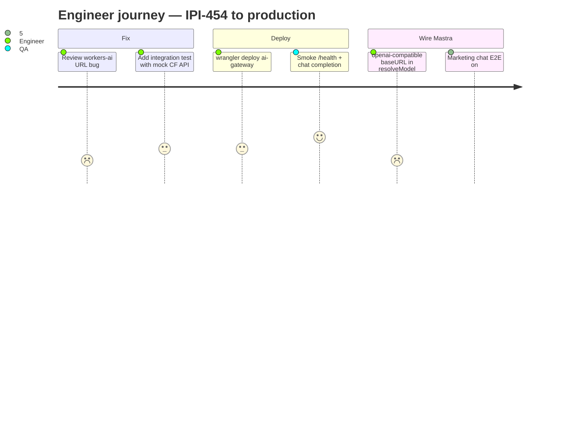
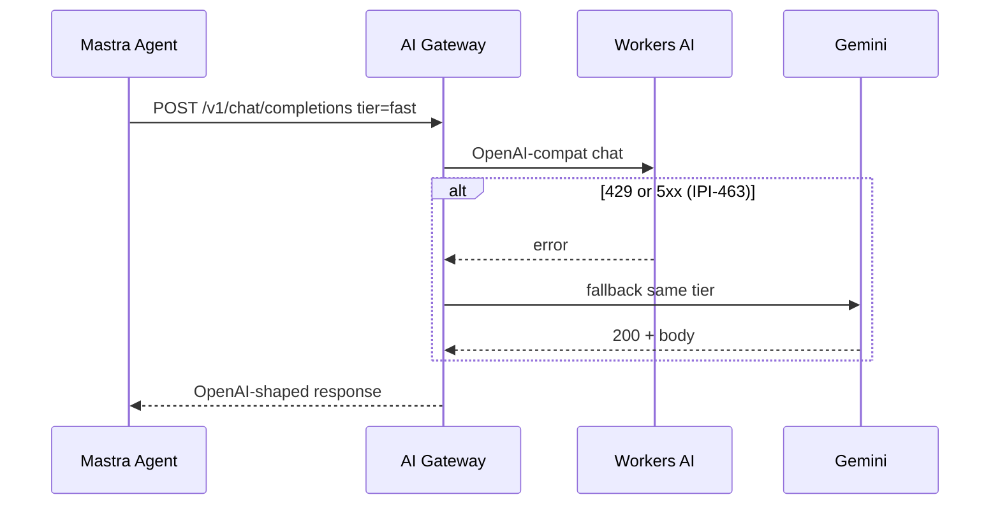
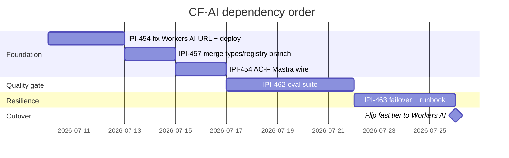

# Verification report — CF-AI issues (IPI-454 / 457 / 462 / 463)

**Date:** 2026-07-09 · **Auditor:** task-verifier + cloudflare skill  
**Scope:** `@app` + `services/cloudflare-worker/` vs Linear AC  
**Probes:** disk (`probe-disk-ipix.sh app`), unit tests, official CF docs, Cloudinary MCP (toolchain only)

---

## Executive summary

| Task | Linear status | Repo truth | Spec /100 | Execution /100 | Skills /100 | Composite | Safe to mark Done? |
|------|---------------|------------|----------:|---------------:|------------:|----------:|:------------------:|
| [IPI-454](https://linear.app/amo100/issue/IPI-454) CF-AI-001 | In Progress | Scaffold only — **not prod, not wired to Mastra** | 88 | 42 | 82 | **68** | 🛑 No |
| [IPI-457](https://linear.app/amo100/issue/IPI-457) CF-AI-005 | Complete (Linear) | **On branch only** — not on `main` | 90 | 48 | 78 | **68** | 🛑 No |
| [IPI-462](https://linear.app/amo100/issue/IPI-462) CF-AI-006 | Backlog | **Not started** (no harness) | 85 | 8 | 75 | **50** | 🛑 No |
| [IPI-463](https://linear.app/amo100/issue/IPI-463) CF-AI-008 | Backlog | **Not started** (no failover doc/code) | 82 | 10 | 80 | **52** | 🛑 No |

**Composite formula:** `0.35×spec + 0.40×execution + 0.25×skills`

> **Not ready.** These blockers must be fixed first: IPI-454 AC-F/G/I, Workers AI URL config bug, merge IPI-457 branch, build IPI-462 before Workers AI cutover, implement IPI-463 after eval.

**Cloudinary MCP:** ✅ `get-usage-details` responded (plan Free, 260 resources). **Out of scope** for AI provider routing — per [cloudflare skill](../../.claude/skills/cloudflare/SKILL.md), use Cloudinary for media only. Media pipeline is unaffected by these issues.

---

## Architecture (current vs target)

```mermaid
C4Context
  title AI inference — today vs target (IPI-454 chain)

  Person(operator, "Operator / visitor")
  System_Boundary(ipix, "iPix OpenNext Worker :8787") {
    Container(mastra, "Mastra agents", "in-process")
    Container(resolve, "resolveModel()", "app/src/lib/ai/provider.ts")
  }
  System_Ext(gemini, "Google Gemini API", "LIVE today")
  System_Ext(gateway, "AI Gateway Worker", "services/cloudflare-worker — local only")
  System_Ext(workersai, "Workers AI", "via OpenAI-compat REST")

  operator --> mastra
  mastra --> resolve
  resolve --> gemini : "AI_PROVIDER=gemini (default)"
  resolve -.-> gateway : "AC-F not done"
  gateway -.-> workersai : "AC-C bug: account ID"
```

```mermaid
flowchart TD
  subgraph Today["Today on main"]
    A1[Mastra agent] --> B1[resolveModel]
    B1 --> C1{AI_PROVIDER}
    C1 -->|gemini| D1[@ai-sdk/google]
    C1 -->|groq| E1[@ai-sdk/groq + groq-models.json]
    C1 -->|openai| F1[throws — not wired]
  end

  subgraph Target["Target after IPI-454 F + 457 merge"]
    A2[Mastra agent] --> B2[resolveModel OR @ai-sdk/openai-compatible]
    B2 --> G2[AI Gateway /v1/chat/completions]
    G2 --> R2[Model registry tier]
    R2 --> W2[Workers AI primary]
    R2 -->|failover IPI-463| GM2[Gemini fallback]
  end

  Today -.->|wire| Target
```

---

## User journeys (operator / engineer)

### Journey 1 — Ship AI Gateway to production (IPI-454)

| Step | Actor | Action | Success signal | Status |
|------|-------|--------|----------------|--------|
| 1 | Engineer | Fix `workers-ai` provider: use `CLOUDFLARE_ACCOUNT_ID` in URL path, token in `Authorization` ([OpenAI compat docs](https://developers.cloudflare.com/workers-ai/configuration/open-ai-compatibility/)) | `curl` to `/v1/chat/completions` with tier `fast` returns 200 | 🔴 |
| 2 | Engineer | `cd services/cloudflare-worker && npx wrangler deploy` (after IPI-472 pipeline) | Health `GET /health` on prod URL | 🔴 |
| 3 | Engineer | Set secrets: `GEMINI_API_KEY`, `CLOUDFLARE_API_TOKEN`, `CLOUDFLARE_ACCOUNT_ID` | Wrangler secret list | 🔴 |
| 4 | Engineer | Wire Mastra **AC-F**: `@ai-sdk/openai-compatible` base URL → gateway | Marketing chat uses gateway; wrangler tail shows gateway hits | 🔴 |
| 5 | Engineer | Optional **AC-G**: KV model registry binding in `wrangler.jsonc` | Registry overrides without redeploy | 🔴 |
| 6 | QA | `npm run cf:preview` + homepage chat chip prompts | Streamed reply, no Gemini-only path when `AI_GATEWAY_URL` set | 🟡 partial |



### Journey 2 — Merge unified types (IPI-457)

| Step | Action | Probe | Status |
|------|--------|-------|--------|
| 1 | Merge `ai/ipi-471-agent-001-ai-agent-architecture` → `main` | `ls app/src/lib/ai/model-registry.ts` | 🔴 missing on main |
| 2 | Run app verify | `cd app && npm run lint && npm test && npm run build` | ⏭️ after merge |
| 3 | Confirm Groq bridge | `provider.ts` still supports groq until IPI-459 | ✅ on main today |
| 4 | Align gateway registry with app registry | Same tier IDs (`default`, `fast`, …) | 🟡 two registries diverge today |

### Journey 3 — Run provider eval before cutover (IPI-462)

| Step | Action | Deliverable | Status |
|------|--------|-------------|--------|
| 1 | Create provider-agnostic harness under `scripts/ai/` or `app/scripts/` | Exercises gateway for each tier | 🔴 none |
| 2 | Fixed prompt set (20–50): shoot, brand, DNA, CRM, booking | JSON fixtures | 🔴 none |
| 3 | Metrics: quality, p50/p95, cost, JSON success, streaming | `docs/ai/provider-eval-report.md` | 🔴 none |
| 4 | Living matrix | `docs/ai/provider-feature-matrix.md` | 🔴 none |
| 5 | CI weekly + R2 archive | Workflow job | 🔴 none |

**Gate rule:** Do **not** flip `fast` tier to Workers AI default until IPI-462 report ≥ agreed thresholds (see [startup.md](../migration/startup.md)).

### Journey 4 — Failover & rollback (IPI-463)

| Step | Action | Status |
|------|--------|--------|
| 1 | Failover chain in gateway router: Workers AI 429/5xx → Gemini | 🔴 |
| 2 | Circuit breaker (DO or in-memory MVP) | 🔴 deferred to CF-AI-008 |
| 3 | `AI_PROVIDER` + `x-ai-provider` header override | 🟡 partial — app has `AI_PROVIDER`, no header |
| 4 | Runbook | `docs/operations/ai-failover.md` | 🔴 missing |



---

## Per-issue forensic verification

### IPI-454 · CF-AI-001 · [AI Gateway](https://linear.app/amo100/issue/IPI-454/ai-gateway-cloudflare-provider-routing)

| AC | Claim (Linear) | Probe | Result |
|----|----------------|-------|--------|
| A | OpenAI-compatible `/v1/chat/completions` | `services/cloudflare-worker/src/router.ts` L125–127 | ✅ |
| B | Gemini provider | `providers/gemini.ts` exists | ✅ |
| C | Workers AI provider | `providers/workers-ai.ts` | 🟡 **URL uses API token as account ID** |
| D | Retry/fallback scaffolding | `rg fallback\|retry` in worker src | 🟡 tier→default only, **no provider failover** |
| E | 5 tests passing | `cd services/cloudflare-worker && npm test` | ✅ (5/5, 2026-07-09) |
| F | Wire Mastra via `@ai-sdk/openai-compatible` | `rg AI_GATEWAY app/src` | 🔴 **zero matches on main** |
| G | KV model registry | `wrangler.jsonc` KV commented | 🔴 |
| I | Deployed via INFRA-001 | no prod URL in repo | 🔴 |

**Critical bug (AC-C):** Official Workers AI OpenAI-compat base URL:

```text
https://api.cloudflare.com/client/v4/accounts/{ACCOUNT_ID}/ai/v1
```

Current code (`workers-ai.ts` + `router.ts` `getProviderConfig`) sets `apiKey = CLOUDFLARE_API_TOKEN` and builds:

```text
.../accounts/{CLOUDFLARE_API_TOKEN}/ai/v1/chat/completions
```

Must split **account ID** (path) vs **Bearer token** (header). Source: [Workers AI OpenAI compatibility](https://developers.cloudflare.com/workers-ai/configuration/open-ai-compatibility/).

**App reality (`@app`):**

- `public-marketing-agent.ts` → `resolveModel("fast")` → Gemini when `AI_PROVIDER=gemini` (default)
- `app/wrangler.jsonc` — **no `ai` binding** (optional direct binding path not used)
- Preview marketing chat **works on Gemini** (verified 2026-07-09 in prior session)

**Default registry mismatch:** `services/cloudflare-worker/src/model-registry.ts` sets **Gemini** for `default|fast|structured|vision`; only `embedding` is Workers AI. Linear AC text says “Workers AI is default inference provider” — **not true in registry file**.

---

### IPI-457 · CF-AI-005 · [Unified types & registry](https://linear.app/amo100/issue/IPI-457/cf-ai-005-unified-ai-provider-types-and-registry)

| Deliverable | Linear | Probe on `main` | Probe on branch `ai/ipi-471-...` |
|-------------|--------|-----------------|-----------------------------------|
| `app/src/lib/ai/types.ts` SSOT | ✅ Complete | 🔴 `AiProvider = gemini \| groq \| openai` only | ✅ workers-ai + ModelRegistry |
| `app/src/lib/ai/model-registry.ts` | ✅ | 🔴 **file absent** | ✅ 11 entries |
| `provider-adapter.ts` | (IPI-461) | 🔴 absent | ✅ fetch → gateway |
| Edge `_shared/llm/types.ts` redirect | ✅ | ⏭️ not re-probed this run | ✅ per diff stat |

**Verdict:** Linear “Complete” is **fake-done on main**. Work exists on branch `ai/ipi-471-agent-001-ai-agent-architecture` (+706 LOC, 7 files). Merge + verify required before Done.

---

### IPI-462 · CF-AI-006 · [Evaluation suite](https://linear.app/amo100/issue/IPI-462/cf-ai-006-ai-provider-evaluation-suite)

| Scope item | Probe | Result |
|------------|-------|--------|
| Eval harness via gateway | `glob **/provider-eval*` | 🔴 0 files |
| Provider feature matrix | `docs/ai/provider-feature-matrix.md` | 🔴 missing |
| Eval report | `docs/ai/provider-eval-report.md` | 🔴 missing |
| Weekly CI + R2 | `.github/workflows/*eval*` | 🔴 none |

**Related but not equivalent:** IPI-360 Groq golden eval (`scripts/capture-gemini-baseline.mjs`, GROQ-006) — different providers and gate. IPI-462 is **Workers AI vs Gemini via gateway**.

---

### IPI-463 · CF-AI-008 · [Failover & rollback](https://linear.app/amo100/issue/IPI-463/cf-ai-008-ai-provider-failover-and-rollback)

| Scope item | Probe | Result |
|------------|-------|--------|
| Primary → fallback chain | `router.ts` handleChat | 🔴 single provider try/catch → 502 |
| Circuit breaker | DO / health tracking | 🔴 not implemented |
| `AI_PROVIDER` env rollback | `app/src/lib/ai/provider.ts` | 🟡 app-level gemini/groq only |
| `x-ai-provider` header | `rg x-ai-provider` | 🔴 |
| Runbook `docs/operations/ai-failover.md` | `glob` | 🔴 |

**Depends on:** IPI-454 + IPI-461 merged and deployed.

---

## Skills compliance (Phase 5b)

| Skill | Required | On disk | MUST audit | Failures |
|-------|:--------:|:-------:|:----------:|----------|
| task-verifier | ✅ | ✅ | probes logged | — |
| cloudflare | ✅ | ✅ | Workers AI URL checked vs official docs | 🔴 account ID bug |
| mermaid-diagrams | ✅ | ✅ | journey + sequence + C4 | — |
| mastra | partial | ✅ | resolveModel server-only | ✅ no client GEMINI |
| cloudinary | user asked | ✅ MCP | N/A for AI routing | ⚪ correctly skipped |

**Forbidden combo check:** No docs+code mixed in this audit file (docs-only).

---

## Test matrix (run before marking any issue Done)

### Already green (2026-07-09)

```bash
# Gateway unit tests (health/routing only — no live Workers AI)
cd services/cloudflare-worker && npm test
# → 5 passed

# App provider unit tests (gemini/groq — no workers-ai)
cd app && npm test -- src/lib/ai/provider.test.ts
# → 19 passed

# Task-verifier disk probe
bash .claude/skills/task-verifier/scripts/probe-disk-ipix.sh app
# → 🟢 6 · 🔴 0
```

### Required before IPI-454 Done

```bash
# 1. Fix workers-ai URL — then integration test (add to worker vitest):
#    mock fetch; assert URL contains CLOUDFLARE_ACCOUNT_ID not token

# 2. Local gateway + live Workers AI (needs Infisical secrets):
cd services/cloudflare-worker
infisical run -- npx wrangler dev
curl -s localhost:8787/health | jq .
curl -s localhost:8787/v1/chat/completions \
  -H 'Content-Type: application/json' \
  -d '{"model":"fast","messages":[{"role":"user","content":"ping"}],"stream":false}'

# 3. Mastra wire (after AC-F):
cd app && AI_GATEWAY_URL=http://localhost:8787 npm run cf:preview
# POST /api/marketing-chat — expect gateway headers in tail

# 4. Full app gate
cd app && npm run lint && npm run build && npm test
```

### Required before IPI-457 Done

```bash
git checkout main && test -f app/src/lib/ai/model-registry.ts
cd app && npm run typecheck && npm test
# Branch-only today:
git show ai/ipi-471-agent-001-ai-agent-architecture:app/src/lib/ai/model-registry.ts | head
```

### Required before IPI-462 Done

```bash
# After harness lands:
node scripts/ai/run-provider-eval.mjs --providers workers-ai,gemini --out docs/ai/provider-eval-report.md
test -f docs/ai/provider-feature-matrix.md
```

### Required before IPI-463 Done

```bash
# Simulate Workers AI 503 — expect Gemini response
# test -f docs/operations/ai-failover.md
```

---

## Recommended execution order



1. **IPI-454** — fix account ID bug → deploy → AC-F Mastra wire  
2. **IPI-457** — merge branch to `main` (unblocks single registry story)  
3. **IPI-462** — eval harness (**hard gate** before defaulting to Workers AI)  
4. **IPI-463** — failover + `docs/operations/ai-failover.md`  
5. Flip marketing `fast` tier to `@cf/meta/llama-3.1-8b-instruct-fp8` (or registry SSOT)

---

## Red flags

| Flag | Sev | Evidence |
|------|:---:|----------|
| Linear IPI-457 marked Complete but not on main | 🔴 | `ls app/src/lib/ai/model-registry.ts` → absent |
| IPI-454 AC-C vs CF docs | 🔴 | token in account path |
| Registry says Gemini default; issue says Workers AI default | 🟠 | `model-registry.ts` L16–47 |
| AC-D “retry/fallback” checked but no provider fallback | 🟠 | `router.ts` only |
| Dual registry (gateway vs app branch) | 🟠 | drift risk |
| Groq still active on main while CF plan deprioritizes | 🟡 | intentional until IPI-459 |

---

## Official docs cross-check

| Topic | Official source | Repo alignment |
|-------|-----------------|----------------|
| Workers AI OpenAI-compat URL | [developers.cloudflare.com/.../open-ai-compatibility](https://developers.cloudflare.com/workers-ai/configuration/open-ai-compatibility/) | 🔴 path bug |
| Workers AI REST (non-compat) | [developers.cloudflare.com/.../rest-api](https://developers.cloudflare.com/workers-ai/get-started/rest-api/) | N/A — gateway uses compat |
| AI Gateway + SDK | [developers.cloudflare.com/ai-gateway](https://developers.cloudflare.com/ai-gateway/) | 🟡 custom worker, not CF managed gateway ID yet |
| Mastra on Cloudflare | [mastra.ai/guides/deployment/cloudflare](https://mastra.ai/guides/deployment/cloudflare/) | ✅ in-process; inference still outbound |
| OpenNext env (build vs runtime) | [opennext.js.org/cloudflare/howtos/env-vars](https://opennext.js.org/cloudflare/howtos/env-vars) | 🟡 `AI_GATEWAY_URL` = runtime secret |

---

## Stop condition

> **Not ready.** These blockers must be fixed first:
> 1. IPI-454 Workers AI `CLOUDFLARE_ACCOUNT_ID` in URL path  
> 2. IPI-454 AC-F (Mastra → gateway)  
> 3. IPI-454 AC-I (prod deploy)  
> 4. IPI-457 merge to `main` — retract fake Done  
> 5. IPI-462 harness before Workers AI cutover  
> 6. IPI-463 failover chain + runbook  

---

## References

- Linear: [IPI-454](https://linear.app/amo100/issue/IPI-454) · [IPI-457](https://linear.app/amo100/issue/IPI-457) · [IPI-462](https://linear.app/amo100/issue/IPI-462) · [IPI-463](https://linear.app/amo100/issue/IPI-463)
- Export: `tasks/cloudflare/AI Platform — LLM Providers › Issues (5).md`
- Migration: [startup.md](../migration/startup.md) · [plan-migrate.md](../migration/plan-migrate.md)
- Diagram stub: [tasks/diagrams/02-ai-provider-flow.md](../../diagrams/02-ai-provider-flow.md)
- Jul 8 audit: [jul-8-linear-audit.md](./jul-8-linear-audit.md)
