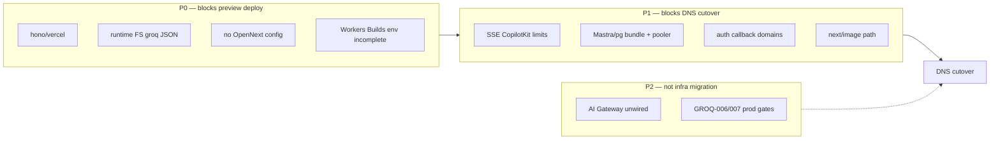
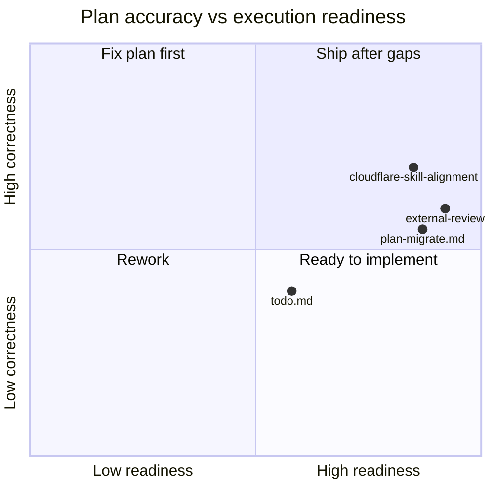

# Jul 8 Linear + Cloudflare Migration Audit

**Date:** 2026-07-08  
**Scope:** Validate external review of `plan-migrate.md` (~86%), audit `tasks/cloudflare/todo.md`, cross-check `.claude/skills/cloudflare`, map to [AI Platform — LLM Providers](https://linear.app/amo100/project/ai-platform-llm-providers-8088f63224f2/issues) and [Cloudflare view](https://linear.app/amo100/view/cloudflare-ac1eb4d5035d).

---

## Executive verdict

| Artifact | Score | Grade |
|----------|------:|:-----:|
| **`plan-migrate.md` (migration plan)** | **87%** | 🟢 B+ |
| **External review suggestions** | **92% accurate** | 🟢 |
| **`tasks/cloudflare/todo.md` (roadmap)** | **58%** | 🔴 D+ |
| **Linear ↔ repo alignment** | **65%** | 🟠 |
| **Combined readiness to implement** | **72%** | 🟡 |

**Bottom line:** Architecture direction is correct — **Workers + OpenNext, not Pages**. The external review is right that this is **not config-only**; runtime compatibility is the real work. **`todo.md` was stale** — patched 2026-07-08. **Linear project is ~52% accurate** — see [`tasks/audit/jul-8-linear-audit.md`](../../audit/jul-8-linear-audit.md) for per-issue fixes.

---

## 1. External review validation (your 86% → our 87%)

### What the review got right ✅

| Claim | Verdict | Evidence |
|-------|:-------:|----------|
| Workers + OpenNext is correct target | ✅ | [CF Next.js guide](https://developers.cloudflare.com/workers/framework-guides/web-apps/nextjs/), [Vercel→Workers](https://developers.cloudflare.com/workers/static-assets/migration-guides/vercel-to-workers/) |
| No `next-on-pages`, no second Next app | ✅ | `cloudflare-vercel.md`, plan §3.1 |
| Vercel live until preview smoke passes | ✅ | plan §4 Phase 1, §12 |
| Supabase + Cloudinary unchanged | ✅ | plan §3.4, CF-000 |
| Mastra in-process first | ✅ | plan §3.2, [Mastra CF guide](https://mastra.ai/guides/deployment/cloudflare) |
| Separate PRs (OpenNext / compat / AI Gateway) | ✅ | plan §6, repo one-concern-per-PR rule |
| `hono/vercel` is 🔴 blocker | ✅ | `app/src/app/api/copilotkit/[[...slug]]/route.ts:13` |
| Runtime `readFileSync(groq-models.json)` is 🔴 blocker | ✅ | Workers ephemeral FS; plan understated as 🟡 — **upgrade to 🔴** |
| Workers Builds needs **build-time** env, not secrets-only | ✅ | [OpenNext env vars](https://opennext.js.org/cloudflare/howtos/env-vars#workers-builds); plan §5 mentions but under-emphasizes |
| SSE / CopilotKit load-test before DNS | ✅ | plan §1.2, §7 — present but needs explicit gate |
| Auth callback Vercel-only domains | ✅ | `auth/callback/route.ts:27` |

### Where the review is slightly overstated or already covered

| Claim | Adjustment |
|-------|------------|
| "Missing rollback plan" | **Partially covered** — plan Phase 3 says 48h monitor + keep Vercel until then. **Missing:** explicit rollback runbook (DNS revert, env flip, comms). |
| "Missing Cloudflare Images strategy" | **Partially covered** — plan §1.2 lists `next/image` + Cloudinary remotePatterns. **Missing:** decision tree (OpenNext image loader vs Cloudinary direct URLs). |
| "Missing marketing pages decision" | **Valid gap** — plan lists marketing smoke test but not `(marketing)` vs `(operator)` strategy. |
| "Missing bundle size check" | **Valid gap** — not in plan; required by Workers limits. |
| "@mastra/pg on Workers" | **Correct concern** — plan lists verify step; add Hyperdrive re-eval if pooler exhausts. |

### Score breakdown (plan-migrate.md)

| Area | External | Ours | Notes |
|------|:--------:|:----:|-------|
| Architecture direction | 95% | 96% | Aligns with CF skill routing (`references/workers/`, not Pages) |
| OpenNext understanding | 90% | 91% | Manual convert, `nodejs_compat`, assets binding — correct |
| Risk detection | 85% | 82% | FS severity too low; missing bundle-size gate |
| Implementation sequencing | 85% | 88% | Phased gantt + 3-PR split is sound |
| Operational detail | 75% | 78% | Env matrix exists; build vs runtime split needs callout box |
| **Overall plan** | **86%** | **87%** | +1% for already having MCP, Linear mapping, verification matrix |

---

## 2. Red flags / blockers (consolidated)



| # | Blocker | Severity | Plan task | PR |
|---|---------|:--------:|-----------|-----|
| 1 | `hono/vercel` CopilotKit | 🔴 | CF-MIG-006 | PR 2 |
| 2 | `readFileSync(config/groq-models.json)` at module load | 🔴 | CF-MIG-008 | PR 2 |
| 3 | No `@opennextjs/cloudflare` / `wrangler.jsonc` in `app/` | 🔴 | CF-MIG-001–004 | PR 1 |
| 4 | Build **and** runtime secrets in Workers Builds | 🔴 | CF-MIG-005, CF-MIG-009 | PR 1 |
| 5 | CopilotKit SSE / multi-agent CPU time | 🟠 | New CF-MIG-011 | PR 2 gate |
| 6 | `@mastra/pg` + large Worker bundle | 🟠 | New CF-MIG-012 | PR 2 gate |
| 7 | Auth OAuth redirect hosts | 🟠 | CF-MIG-007, IPI-125 | PR 2 |
| 8 | Marketing + operator in one Worker | 🟡 | New CF-MIG-013 | PR 1 doc |
| 9 | AI Gateway not prod-wired | 🟠 | IPI-454 AC-F | PR 3 |
| 10 | Groq prod flip without golden eval | 🔴 | IPI-360/361 | Separate track |

**Critical path (do not skip order):**

```text
1. No DNS cutover
2. PR 1 — OpenNext scaffold + Workers Builds env (build + runtime)
3. PR 2 — hono adapter, FS→bundle, auth domains, bundle size + SSE load test
4. cf:preview + §6 smoke on *.workers.dev
5. PR 3 — AI Gateway wiring (parallel ok after PR 1)
6. 48h monitor → DNS (PR 4 / runbook only)
```

---

## 3. Cloudflare skill cross-check

Per `.claude/skills/cloudflare/SKILL.md` routing:

| Skill rule | Plan compliance | Gap |
|------------|:---------------:|-----|
| Prefer `workers/` over `pages/` for full-stack Next | ✅ | — |
| Load `workers-best-practices` for handlers | ⚠️ | Plan doesn't cite CPU limits / streaming rules explicitly |
| `nodejs_compat` + current `compatibility_date` | ✅ | wrangler recipe correct |
| `wrangler types` after bindings | ✅ | CF-MIG-010 / cf:typegen |
| No hand-written `Env` | ✅ | — |
| AI: `workers-ai/` + `ai-gateway/` | ✅ | Phase 2 |
| Secrets via wrangler, not committed | ✅ | §5 |
| Retrieve limits from docs (don't trust stale CPU numbers) | ⚠️ | Add explicit `workers/platform/limits/` check before SSE gate |

**Skill audit note:** `audit-3-cloudflare-skill.md` (Jul 7) scored MCP 40% — Cursor MCP merge doc exists (`cursor-mcp-cloudflare.json`); OAuth still manual. Worker scaffold 85% ✅ (5/5 tests).

---

## 4. `tasks/cloudflare/todo.md` audit — errors found

| Line / claim | Status | Error |
|--------------|:------:|-------|
| L6: "Vercel stays for Next.js app" | 🔴 **Stale** | Contradicts `plan-migrate.md`, user direction, supersedes CF-000 §3 |
| L4: "IPI-454 MVP shipped" | 🔴 **Contradicts L28** | Same file says IPI-454 "In Progress" |
| L23: "Groq archive (14 IPIs) 🟢" | 🔴 **Wrong** | GROQ-005–007 open; IPI-359–361 Todo; active in [AI Platform project](https://linear.app/amo100/project/ai-platform-llm-providers-8088f63224f2/issues) |
| L27: IPI-469 CF-000 ⚪ Backlog | 🟠 **Stale** | `cf-000-platform-architecture.md` = **Approved** Jul 7 |
| Phase 1 count "8 tasks" | 🟡 | Lists 8 numbered items but summary math includes Phase 0 separately — ok |
| **Missing entirely** | 🔴 | CF-MIG OpenNext migration track (INFRA-002 or new IPIs) |
| **Missing entirely** | 🔴 | DNS cutover / rollback runbook task |
| **Missing entirely** | 🟠 | Bundle size + SSE load-test gates |
| IPI-454 vs deep-architecture-review AC-F | 🟠 | Mastra wiring not visible as sub-task in todo |

**Recommended `todo.md` patches (docs PR only):**

1. Update L6 → "Vercel **prod until** OpenNext preview smoke; target Workers + OpenNext"
2. Fix IPI-454 → 🟡 In Progress (scaffold done, prod deploy + Mastra wire pending)
3. Replace "Groq archive 🟢" → "Groq platform track: GROQ-001–004 Done; GROQ-005–007 open (AI Platform project)"
4. Mark IPI-469 🟢 Done (doc approved) or 🟡 In Review if Linear differs
5. Add **Phase 1b — Next.js migration (P0):** CF-MIG-001..013, link `plan-migrate.md`

---

## 5. Linear view ↔ repo mapping

### [Cloudflare view](https://linear.app/amo100/view/cloudflare-ac1eb4d5035d) — expected issues

| Spec | Linear | Repo state | Sync? |
|------|--------|------------|:-----:|
| CF-000 Platform Architecture | IPI-469 | Doc approved | ⚠️ Linear may still say Backlog |
| CF-AI-001 AI Gateway | IPI-454 | Worker code + tests; **not prod** | 🟡 |
| CF-AI-004 Provider Adapter | IPI-461 | In Review | 🟡 |
| CF-AI-005 Types & Registry | IPI-457 | In Review | 🟡 |
| INFRA-001 Deploy Pipeline | IPI-472 | No CI deploy to CF yet | 🔴 |
| CF-AI-002 Brand Intel migrate | IPI-455 | Still Supabase edge | ⚪ |
| SEC-001 | IPI-468 | ⚪ | — |
| **OpenNext migration** | **Missing?** | plan-migrate.md only | 🔴 **Create IPI** |

### [AI Platform — LLM Providers](https://linear.app/amo100/project/ai-platform-llm-providers-8088f63224f2/issues) — Groq track (separate from CF infra)

| Gate | Issue | Blocks CF DNS? |
|------|-------|:--------------:|
| GROQ-005 | IPI-359 CopilotKit smoke | No (provider quality) |
| GROQ-006 | IPI-360 golden eval | Yes for Groq **prod flip**, not CF DNS |
| GROQ-007 | IPI-361 staged rollout | Same |
| BUILD-GROQ-CONFIG | IPI-428 | No — merged on main (ancestor walk) |

**Do not conflate:** Cloudflare **hosting** migration (Vercel→Workers) ≠ Groq **provider** migration (Gemini default→Groq prod). Plan-migrate.md handles this correctly; todo.md does not.

---

## 6. Missing items — add to plan-migrate.md

| # | Item | Priority | Suggested task ID |
|---|------|:--------:|-------------------|
| 1 | **Marketing strategy** — single OpenNext app; `(marketing)` routes SSG/ISR first pass; split later only if bundle forces | P1 | CF-MIG-013 |
| 2 | **Bundle size gate** — after `opennextjs-cloudflare build`, inspect `.open-next/worker.js` size vs Workers limits | P0 | CF-MIG-012 |
| 3 | **Runtime limits test** — scripted CopilotKit turn, streaming, workflow suspend/resume on `cf:preview` | P0 | CF-MIG-011 |
| 4 | **Rollback runbook** — DNS revert to Vercel, Supabase redirect URLs, 48h criteria | P0 | CF-MIG-014 |
| 5 | **Images decision tree** — OpenNext + Cloudflare Images vs Cloudinary direct for marketing | P1 | CF-MIG-015 |
| 6 | **Build vs runtime env checklist** — table flagging each var as Build / Runtime / Both | P0 | Expand §5 |
| 7 | **Hyperdrive spike** — if `@mastra/pg` exhausts pooler from Workers | P2 | Optional IPI |
| 8 | **Linear issues** — CF-MIG epic in Cloudflare view | P0 | Create in Linear |

---

## 7. Suggested improvements

### PR split (validated — best improvement from review)

| PR | Scope | Verify |
|----|-------|--------|
| **PR 1** | OpenNext deps, `wrangler.jsonc`, `open-next.config.ts`, scripts, Workers Builds env, CI build-only | `npm run cf:build` green |
| **PR 2** | `hono/cloudflare-workers`, groq JSON bundle, auth domains, bundle size + SSE tests | `cf:preview` + smoke §6 |
| **PR 3** | AI Gateway prod deploy + `AI_GATEWAY_URL` in provider adapter | worker tests + shadow traffic |
| **PR 4** | DNS cutover runbook + Supabase OAuth (IPI-125) | docs-only first |

### Marketing pages (recommended decision)

```text
Phase 1: ONE OpenNext Worker — (marketing) + (operator) + API routes
  - Marketing: prefer static/ISR where already static-friendly
  - Operator / CopilotKit: dynamic
Phase 2+: Optional split to static assets Worker ONLY if bundle/latency proves need
```

Repo evidence: `app/src/app/(marketing)/services/*` — 6+ service pages; keep unified app first.

### Images (recommended decision)

```text
1. Try OpenNext default next/image with existing Cloudinary remotePatterns
2. If broken on preview → next-cloudinary loader + direct Cloudinary URLs (already in stack)
3. CF Images only if we need edge transforms without Cloudinary (unlikely — Cloudinary is SSOT)
```

### Env vars — critical fix detail

Per [OpenNext Workers Builds](https://opennext.js.org/cloudflare/howtos/env-vars#workers-builds):

| Class | Examples | Where |
|-------|----------|-------|
| **Build + runtime** | `NEXT_PUBLIC_*`, `SITE_URL`, `OPERATOR_AUTH_ENABLED` | Workers Builds **Build variables** |
| **Runtime only** | `GEMINI_API_KEY`, `DATABASE_URL`, `GROQ_API_KEY` | **Secrets** (runtime) |
| **Both** | Vars inlined into client bundle at build | Must exist at **build** time |

`wrangler secret bulk` alone is **insufficient** for OpenNext — mirror Vercel's full env panel into Build variables.

---

## 8. Failure points (what breaks first)

| Failure mode | Likely symptom | Detection |
|--------------|----------------|-----------|
| FS read groq JSON | Worker boot 500 on first agent call | `cf:preview` + `/api/copilotkit` |
| hono/vercel on Workers | Route handler import error | build or first request |
| Missing build-time `NEXT_PUBLIC_*` | Client Supabase undefined | browser console on preview |
| SSE CPU exceeded | Error 1102, stream cuts mid-turn | observability MCP / wrangler tail |
| Bundle too large | Deploy rejected or cold start timeout | post-build size check |
| OAuth redirect mismatch | Login loop after auth | manual OAuth smoke |
| Mastra PG from Worker | Connection timeout / too many connections | agent turn + Supabase metrics |

---

## 9. Percent correct — final evaluation



| Question | Answer |
|----------|--------|
| Is the **86% external review** fair? | **Yes — we score plan at 87%** |
| Are review **suggestions** correct? | **~92%** — all P0 items valid; rollback/images partially in plan |
| Is **`todo.md`** correct? | **No — ~58%** — stale Vercel/Groq/IPI-454/IPI-469 |
| Is anything **critical missing**? | Bundle gate, explicit rollback, build-env emphasis, Linear CF-MIG issues |
| Ready to **start PR 1**? | **Yes**, after creating Linear CF-MIG epic and patching todo.md |

---

## 10. Immediate actions

1. **Patch `tasks/cloudflare/todo.md`** — fix stale lines (§4); add Phase 1b CF-MIG rows
2. **Patch `plan-migrate.md`** — add CF-MIG-011..015, upgrade FS to 🔴, expand §5 build vs runtime
3. **Create Linear issues** in Cloudflare view: CF-MIG-001 (OpenNext scaffold), CF-MIG-011 (load test gate)
4. **Do not DNS cutover** until PR 2 smoke passes
5. **Keep Groq prod gates** (IPI-360/361) separate from CF hosting migration

---

## References

- [plan-migrate.md](../cloudflare/migration/plan-migrate.md)
- [tasks/cloudflare/todo.md](../cloudflare/todo.md)
- [.claude/skills/cloudflare/SKILL.md](../../.claude/skills/cloudflare/SKILL.md)
- [CF Next.js on Workers](https://developers.cloudflare.com/workers/framework-guides/web-apps/nextjs/)
- [Migrate Vercel → Workers](https://developers.cloudflare.com/workers/static-assets/migration-guides/vercel-to-workers/)
- [OpenNext env vars](https://opennext.js.org/cloudflare/howtos/env-vars)
- [Mastra on Cloudflare](https://mastra.ai/guides/deployment/cloudflare)
