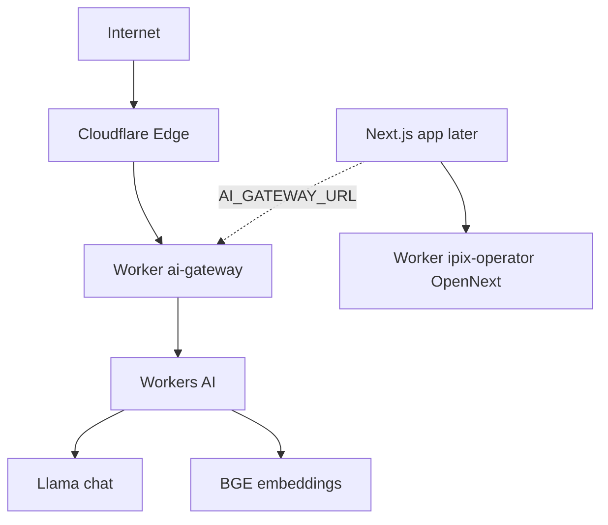

# AI Gateway — Cloudflare dashboard setup (easy steps)

## Current status (read this first)

**Verified:** 2026-07-12 (full audit complete) · Live URL: `https://ai-gateway.sk-498.workers.dev`  
**Legend:** 🟢 done · 🟡 in progress · ⚪ later · 🔴 do not

| Track | Status |
|-------|:------:|
| Worker `ai-gateway` | 🟢 ✅ LIVE |
| Workers AI (Llama chat + BGE embed) | 🟢 ✅ tested /health, chat, embed |
| Workers Builds (gateway) | 🟢 ✅ auto-deploy on merge |
| Secrets + `MODEL_REGISTRY_OVERRIDE` | 🟢 ✅ workers-ai-only (no Gemini) |
| Observability — logs | 🟢 ✅ enabled |
| Observability — traces | 🟡 optional (can enable later) |
| **IPI-472 · INFRA-001** (record live URL) | 🟡 **do next** (URL ready, Linear note missing) |
| Marketing chat routing (public) | 🟢 ✅ can use gateway now (optional) |
| Operator agents with tool calling | 🔴 **BLOCKED** — IPI-525 pending (tool/tool_choice forwarding) |
| OpenNext Worker `ipix-operator` | ⚪ next milestone (code ready, no dashboard project yet) |
| R2 / KV / Queues / Workflows / Browser / Vectorize / AI Search / Flagship | ⚪ later (follow epic tasks) |
| Cloudflare **product** AI Gateway | 🔴 not now (different from Worker named `ai-gateway`) |
| **Bindings** on `ai-gateway` | 🟢 **0 is correct** — do not add D1 |
| D1 as app database | 🔴 never (use Supabase) |

**Gateway dashboard ≈ 95% complete.** Full platform catalog ≈ 25% (rest correctly not started).

**Production readiness:** Gateway is live and healthy. Operator workflows are blocked on IPI-525 (tool calling) + CF-MIG-220 (smoke tests). Vercel stays prod until both gates pass. See [`status.md`](../status.md) and [`status-cloudflare.md`](../tasks/status-cloudflare.md) for current blockers and timeline.

---

## Current blockers (before operator rollout)

**🔴 CRITICAL:**
1. **Linter OOM in CI** — blocks all PRs. Fix: increase Node heap or switch to Biome. (Status: TODAY)
2. **IPI-525 tool calling** — operators can't use brand-intelligence / production-planner / crm-assistant on gateway. Fix: forwarding code + test. (Status: THIS WEEK)

See [`status.md`](../status.md) for full details.

---

## Next 5 steps (dashboard — easy)

Do these in order. Stop after #5 until a Linear task says otherwise.

### 1. Record the gateway URL on Linear 🟡

Paste into **IPI-472 · INFRA-001**:

```text
https://ai-gateway.sk-498.workers.dev
```

**Why:** Closes the loop for infrastructure tracking.

**Proof already verified** (Jul 12 audit):
- `/health` → 200 OK
- Chat → `PONG` from Llama 3.1
- Embed → 768 dimensions from BGE

### 2. Narrow Builds watch path ⚪

Worker `ai-gateway` → **Settings → Builds**

| Field | Set to |
|-------|--------|
| Watch / path filter | `services/cloudflare-worker/**` |

Not `*` — so app-only commits do not redeploy the gateway.

### 3. Confirm token is a Secret ⚪

**Settings → Variables and Secrets**

| Name | Type |
|------|------|
| `CLOUDFLARE_API_TOKEN` | **Secret** (encrypted) |
| `CLOUDFLARE_ACCOUNT_ID` | Plaintext OK |
| `MODEL_REGISTRY_OVERRIDE` | Plaintext OK |

If the token was ever pasted in chat, rotate it in [API Tokens](https://dash.cloudflare.com/profile/api-tokens).

### 4. Optional — turn on Traces ⚪

**Settings → Observability** → enable **Traces** (logs already on). Skip if you do not need them yet.

### 5. Do **not** create more products today 🔴

Leave empty until their tasks start:

```text
❌ D1
❌ AI Gateway (product under AI → AI Gateway)
❌ Queues · Workflows · Durable Objects
❌ Browser Rendering · Vectorize · AI Search · Flagship
❌ R2 / KV (unless a named Linear task asks)
```

**After these five:** gateway dashboard track is done. Next *milestone* is OpenNext (`ipix-operator`) — see below — not more AI products.

---

## Bindings page — leave at **0** for `ai-gateway`

Docs: [Bindings (env)](https://developers.cloudflare.com/workers/runtime-apis/bindings/)  
Dashboard: [ai-gateway → Bindings](https://dash.cloudflare.com/4984b9bad07bc1da9f097dc8c1da24e0/workers/services/view/ai-gateway/production/bindings)

### What a binding is (easy)

A **binding** wires a Cloudflare product into your Worker as `env.SOMETHING` (permission + API in one). Examples: D1, KV, R2, Workers AI, Queues.

Your gateway does **not** need that today. Chat and embeddings already work via:

| Mechanism | What you use |
|-----------|----------------|
| Secret `CLOUDFLARE_API_TOKEN` | Auth to Workers AI REST |
| Var `CLOUDFLARE_ACCOUNT_ID` | Account for the API URL |
| Var `MODEL_REGISTRY_OVERRIDE` | Force Llama + BGE (Workers AI) |

So **Bindings count = 0** is correct. Click **Cancel** on “Add a binding” unless a Linear task says otherwise.

### Do **not** add from that modal (now)

| Binding in the list | Why skip on `ai-gateway` |
|---------------------|---------------------------|
| **D1 database** | App data stays in **Supabase** — never dual-write |
| **KV / R2 / Vectorize / AI Search** | Later tasks (**IPI-454** AC-G, **IPI-474**, OpenNext cache) + need `wrangler.jsonc` |
| **Queues / Workflows / Durable Objects** | **IPI-481** / **IPI-470** — not gateway smoke |
| **Browser Run** | **IPI-467** later |
| **Hyperdrive** | For Postgres acceleration — operator/Mastra path, not this Worker |
| **Workers AI** (native binding) | Optional upgrade later; current code uses **token + REST**. Adding the binding alone without code changes does nothing useful |

### If you ever add a binding later (checklist)

Official model: declare in [Wrangler](https://developers.cloudflare.com/workers/runtime-apis/bindings/) **and** use `env.*` in code — dashboard-only binding can drift from Git.

```text
1. Linear task names the binding
2. Add to services/cloudflare-worker/wrangler.jsonc
3. Use env.BINDING_NAME in src/
4. Redeploy (Workers Builds or wrangler)
5. Do not put empty vars in wrangler.jsonc (see PR #323 — wipes dashboard)
```

### Quick rule

```text
Bindings page → empty → ✅ good for ai-gateway
Add binding → D1 selected → ❌ Cancel
```

---

## Dashboard roadmap (from Jul 12 audit)

```text
✅ DONE (gateway smoke complete)
  🟢 Worker ai-gateway
  🟢 Workers Builds
  🟢 Workers AI (Llama + BGE)
  🟢 Health / chat / embed endpoints verified
  🟡 IPI-472 · INFRA-001 (URL ready, Linear note pending)

🔴 BLOCKERS (before operator rollout)
  🔴 Linter OOM in CI (FIX THIS WEEK)
  🔴 IPI-525 tool calling spec → implementation (FIX THIS WEEK)
  🔴 CF-MIG-220 PostgresStore verification (NEXT WEEK)

Next milestone (separate Worker, ~Week 2–3)
  ⬜ ipix-operator (OpenNext, root = app/)
  ⬜ Link AI_GATEWAY_URL to live gateway (after blockers fixed)

Later (only with Linear task + Wrangler bindings)
  ⬜ R2 (OpenNext ISR cache) — IPI-454 AC-G
  ⬜ KV (model registry hot-reload) — IPI-454 AC-G
  ⬜ Queues / Workflows (async jobs) — IPI-481 / IPI-470
  ⬜ Browser Rendering · Vectorize / AI Search · Flagship
  ⬜ Cloudflare product AI Gateway (separate from Worker `ai-gateway`)
```

See [`status.md`](../status.md), [`status-cloudflare.md`](../tasks/status-cloudflare.md) for full roadmap and timeline.

---

## Architecture (now → next)

```text
Today
  Internet → Cloudflare Edge → Worker ai-gateway → Workers AI
                                              ├─ Llama (chat)
                                              └─ BGE (embed)

Next (after OpenNext dashboard Worker)
  Browser → Worker ipix-operator (Next.js / OpenNext)
                └─ AI_GATEWAY_URL → ai-gateway → Workers AI
```



---

## Next Worker — `ipix-operator` (OpenNext)

Code in `app/` is already wired (`wrangler.jsonc`, `@opennextjs/cloudflare`). When you are ready for the **next dashboard project** (not today unless you choose to start):

| Field | Value |
|-------|--------|
| Name | `ipix-operator` |
| Repo | `amo-tech-ai/lumina-studio` |
| Root directory | `app` |
| Build command | `npx opennextjs-cloudflare build` |
| Deploy command | `npx wrangler deploy` |
| Production branch | `main` |

Also set **Build variables and secrets** (Supabase, `AI_GATEWAY_URL=https://ai-gateway.sk-498.workers.dev`, etc.).

Local closest-to-prod check (CLI, not dashboard):

```bash
cd app && npm run preview
```

Do **not** rename or reuse the `ai-gateway` Worker for this. Do **not** point [ipix.co](https://www.ipix.co/) DNS until preview smoke is green.

---

## Status by service (detail)

**Examined against:** live gateway URL + Worker Settings + this doc.

| Status | Service | % | Proof / missing | Dashboard settable? |
|:------:|---------|--:|-----------------|---------------------|
| 🟢 | **Worker `ai-gateway`** | **100** | Name, Git Builds, secrets, override; `/health` 200 | Yes — **done** |
| 🟢 | **Workers AI** | **100** | Chat Llama `PONG`; embed BGE 768-d | Yes — **done** |
| 🟢 | **Workers Builds** (gateway) | **100** | Root `services/cloudflare-worker`, deploy `npx wrangler deploy` | Yes — **done** |
| 🟢 | **Observability — Logs** | **100** | Enabled | Yes — **done** |
| 🟡 | **Observability — Traces** | **20** | Still off | Yes — optional |
| 🟡 | **IPI-472 · INFRA-001** | **80** | URL live; Linear note may be missing | Linear comment |
| ⚪ | **Bindings** (gateway) | **0** | Intentionally 0 | Skip |
| ⚪ | **AI Gateway** *(product)* | **0** | ≠ Worker name | Skip until task |
| ⚪ | **R2 / KV / Vectorize / AI Search** | **0** | No resources | Later |
| ⚪ | **Queues / Workflows / DO / Browser / Flagship** | **0** | — | Later |
| 🔴 | **D1** as next step | **0** | Supabase is SSOT | **Avoid** |
| ⚪ | **OpenNext `ipix-operator`** | **0** | Code ready; no Builds project yet | Separate Worker |

---

Deploy the **AI Gateway Worker** from the Cloudflare dashboard so you get a live URL like `https://ai-gateway.…workers.dev`.

**Policy for this Worker: Workers AI only — no Gemini API.**  
Chat + embeddings go through Cloudflare. Do **not** add `GEMINI_API_KEY` to this Worker.

This is **not** the marketing site ([ipix.co](https://www.ipix.co/)). That site is separate and still on Vercel until we wire it later.

**Your account:** [Workers & Pages](https://dash.cloudflare.com/4984b9bad07bc1da9f097dc8c1da24e0/workers-and-pages)  
**Repo:** `amo-tech-ai/lumina-studio`  
**Code folder:** `services/cloudflare-worker`

---

## Before you start

You need:

- Access to the Cloudflare account above  
- Access to the GitHub repo  
- These values ready (from Infisical / team vault — **not** from chat):
  - `CLOUDFLARE_API_TOKEN` — token that can call **Workers AI**
  - `CLOUDFLARE_ACCOUNT_ID` → `4984b9bad07bc1da9f097dc8c1da24e0`

You do **not** need a Gemini key for this gateway.

---

## Step 1 — Fix the Worker name (important)

Your first build warned:

> Config says **`ai-gateway`**, dashboard expected **`lumina-studio`**

Those names must match.

**Do this:**

1. Open [Workers & Pages](https://dash.cloudflare.com/4984b9bad07bc1da9f097dc8c1da24e0/workers-and-pages).
2. Prefer a project named exactly **`ai-gateway`**.
3. If the project is still named `lumina-studio`:
   - Either **rename** it to `ai-gateway`, **or**
   - Create a **new** Worker project named `ai-gateway` and connect Git again (settings below).

Do not leave the mismatch. It causes confusing URLs and broken docs.

---

## Step 2 — Connect GitHub (if not already)

Official guide: [GitHub integration](https://developers.cloudflare.com/workers/ci-cd/builds/git-integration/github-integration/).

1. In the Worker project → **Settings** → **Builds**.
2. Connect GitHub → choose **`amo-tech-ai/lumina-studio`**.
3. Set:

| Field | Value |
|-------|--------|
| Root directory | `services/cloudflare-worker` |
| Build command | *(leave empty)* |
| Deploy command | `npx wrangler deploy` |
| Production branch | `main` |

4. Save.

Recommended: set watch / path filter to `services/cloudflare-worker/**` (not `*`) so app-only commits don’t redeploy the gateway.

---

## Step 3 — Add Cloudflare-only secrets + Workers AI registry

Without these, `/health` may work but **chat** and **embeddings** will fail.

### 3a. Secrets (encrypted)

1. Worker → **Settings** → **Variables and Secrets**.
2. Add:

| Name | Type | What it is |
|------|------|------------|
| `CLOUDFLARE_API_TOKEN` | **Secret** (required) | API token with Workers AI permission — never leave as Plaintext in production |
| `CLOUDFLARE_ACCOUNT_ID` | Plaintext OK | `4984b9bad07bc1da9f097dc8c1da24e0` |

3. Do **not** add `GEMINI_API_KEY` here.

### 3b. Plain variable — force Workers AI (no Gemini)

**Why:** Without this, chat still tries Gemini and fails (you have no Gemini key on this Worker).

**Click path (easy):**

1. Open your Worker: [ai-gateway](https://dash.cloudflare.com/4984b9bad07bc1da9f097dc8c1da24e0/workers/services/view/ai-gateway/production/settings).
2. Click the **Settings** tab (top).
3. Scroll to **Variables and Secrets**.
4. Look for a variable named exactly: `MODEL_REGISTRY_OVERRIDE`
   - **If it already exists** → click **Edit** (or the pencil).
   - **If it does not exist** → click **Add** → choose **Variable** (plain text, **not** Secret).
5. Fill in:

| Field | What to put |
|-------|-------------|
| Variable name | `MODEL_REGISTRY_OVERRIDE` |
| Type | **Plain text** / Variable (not encrypted Secret) |
| Value | Paste the **entire** JSON block below — one line, no edits |

6. Click **Save** / **Deploy** on the variables form (whatever the dashboard shows).
7. Then do **Step 4** (redeploy the Worker). **Saving the variable alone is not enough** — chat stays broken until a new deploy finishes.

**Copy this value exactly** (select all → copy → paste into the Value box):

```text
{"tiers":{"default":{"provider":"workers-ai","model":"@cf/meta/llama-3.1-8b-instruct-fp8","capabilities":["text","streaming","structured"],"contextWindow":128000,"costPer1kIn":0,"costPer1kOut":0},"fast":{"provider":"workers-ai","model":"@cf/meta/llama-3.1-8b-instruct-fp8","capabilities":["text","streaming"],"contextWindow":128000,"costPer1kIn":0,"costPer1kOut":0},"structured":{"provider":"workers-ai","model":"@cf/meta/llama-3.1-8b-instruct-fp8","capabilities":["structured","text","streaming"],"contextWindow":128000,"costPer1kIn":0,"costPer1kOut":0},"embedding":{"provider":"workers-ai","model":"@cf/baai/bge-base-en-v1.5","capabilities":["embedding"],"contextWindow":0,"costPer1kIn":0,"costPer1kOut":0}}}
```

**Quick check before you leave the page:**

- Name is `MODEL_REGISTRY_OVERRIDE` (spelling matters).
- Value starts with `{"tiers":` and ends with `}}}`.
- You can see the words `"fast"`, `"default"`, and `"embedding"` inside the value.
- Type is **plain text**, not Secret.
- You did **not** add `GEMINI_API_KEY`.

What this turns on:

| Name in JSON | Uses | Model |
|--------------|------|--------|
| `default` / `fast` / `structured` | Workers AI | Llama 3.1 8B |
| `embedding` | Workers AI | BGE (768 numbers) |

---

## Step 4 — Deploy

1. Worker → **Deployments** (or **Builds**).
2. **Retry deployment** / deploy `main` again.
3. Wait until all stages are green: Initializing → Cloning → Installing → **Deploying**.
4. Copy the **workers.dev** URL from Overview:

```text
https://ai-gateway.<your-subdomain>.workers.dev
```

Save that URL — you need it in Steps 5–6.

---

## Step 5 — Smoke test (Workers AI only)

Replace `$GW` with your real URL.

```bash
GW="https://ai-gateway.<your-subdomain>.workers.dev"

# 1) Alive?
curl -sS "$GW/health"
# Want: {"status":"ok","service":"ai-gateway"}

# 2) Embeddings (Workers AI BGE)
curl -sS -X POST "$GW/v1/embeddings" \
  -H "content-type: application/json" \
  -d '{"model":"embedding","input":"silk blouse"}'
# Want: HTTP 200 and ~768 numbers

# 3) Chat (Workers AI Llama — NOT Gemini)
curl -sS -X POST "$GW/v1/chat/completions" \
  -H "content-type: application/json" \
  -d '{"model":"fast","messages":[{"role":"user","content":"Reply exactly: PONG"}]}'
# Want: HTTP 200 and PONG in the reply

# 4) Bad input should fail cleanly
curl -sS -X POST "$GW/v1/embeddings" \
  -H "content-type: application/json" \
  -d '{"model":"embedding","input":""}'
# Want: HTTP 400 and code invalid_request
```

| Test | Pass means |
|------|------------|
| Health | Worker is up |
| Embed | Workers AI + Cloudflare secrets OK |
| Chat | Workers AI Llama OK (**no Gemini**) |
| Empty embed | Validation works |

If chat fails with a Gemini / Google error → the registry override is missing. Re-check Step 3b and redeploy.

---

## Step 6 — Point a preview app at the gateway (optional)

Only after Step 5 passes.

1. In Infisical / Vercel **preview** (not production yet), set:

```text
AI_GATEWAY_URL=https://ai-gateway.<your-subdomain>.workers.dev
```

2. Check:

```bash
curl -sS "https://<your-preview>.vercel.app/api/ai/health"
```

Want nested `"gateway": { "status": "ok", ... }`.

**Note:** [www.ipix.co](https://www.ipix.co/) marketing chat is still **Gemini on Vercel** until **IPI-454 · CF-AI-001** switches Mastra to this gateway. That is a separate step.

---

## Checklist

```text
[ ] Step 1 — Worker named ai-gateway
[ ] Step 2 — GitHub connected, root = services/cloudflare-worker
[ ] Step 3a — CLOUDFLARE_API_TOKEN + CLOUDFLARE_ACCOUNT_ID secrets
[ ] Step 3b — MODEL_REGISTRY_OVERRIDE (Workers AI only, no Gemini)
[ ] Step 3  — No GEMINI_API_KEY on this Worker
[ ] Step 4 — Green deploy + workers.dev URL saved
[ ] Step 5 — health / embed / chat / invalid all pass
[ ] Step 6 — Preview AI_GATEWAY_URL (optional)
[ ] Update Linear IPI-472 with the live URL
```

---

## Other dashboard pages — skip for this Worker setup

You may open links that look related. For **this** Worker (`ai-gateway`), most of them are **not** required. Leave them empty unless a later Linear task says otherwise.

| Page | Link | What it is | Do you need it now? |
|------|------|------------|---------------------|
| **Worker Overview** | [ai-gateway / production](https://dash.cloudflare.com/4984b9bad07bc1da9f097dc8c1da24e0/workers/services/view/ai-gateway/production) | Your live Worker (code + URL + deploys) | **Yes — home base** |
| **Worker Settings** | […/settings](https://dash.cloudflare.com/4984b9bad07bc1da9f097dc8c1da24e0/workers/services/view/ai-gateway/production/settings) | Vars, secrets, builds, runtime | **Yes — Steps 2–3** |
| **Bindings** | […/bindings](https://dash.cloudflare.com/4984b9bad07bc1da9f097dc8c1da24e0/workers/services/view/ai-gateway/production/bindings) | Wire KV, R2, Queues, AI, etc. into this Worker | **No — expect 0 bindings.** Chat/embed use the API token + REST, not a dashboard binding. Do not click “Add binding” unless a task asks. |
| **Queues** | [Workers Queues](https://dash.cloudflare.com/4984b9bad07bc1da9f097dc8c1da24e0/workers/queues) | Background job queues | **No** for gateway smoke |
| **Workflows** | [Workers Workflows](https://dash.cloudflare.com/4984b9bad07bc1da9f097dc8c1da24e0/workers/workflows) | Multi-step durable jobs | **No** for gateway smoke |
| **Browser Rendering** | [Browser Rendering](https://dash.cloudflare.com/4984b9bad07bc1da9f097dc8c1da24e0/workers/browser-run/overview) | Headless browser in Workers | **No** for gateway smoke |
| **Flagship** | [Flagship](https://dash.cloudflare.com/4984b9bad07bc1da9f097dc8c1da24e0/flagship) | Cloudflare **feature flags** (edge eval + OpenFeature) | **No** for gateway smoke — later product rollout |
| **AI → AI Gateway** | [AI Gateway product](https://dash.cloudflare.com/4984b9bad07bc1da9f097dc8c1da24e0/ai/ai-gateway) | Separate Cloudflare product (proxy/analytics for LLM calls) | **No** — different from the Worker named `ai-gateway` |

**Easy rule:** if the URL does **not** contain `/workers/services/view/ai-gateway/`, it is probably not needed for Steps 1–5.

**Name collision reminder:**

| Name you see | Meaning |
|--------------|---------|
| Worker **`ai-gateway`** | Our app in `services/cloudflare-worker` — **use this** |
| Product **AI Gateway** | Cloudflare’s LLM proxy product — **skip for now** |
| Old Worker **`lumina-studio`** | Renamed away — bookmarks to it show “Failed to find Worker” |

---

## Dashboard feature catalog (what you *can* set up)

Official “create via dashboard” flow: [Workers — Get started (Dashboard)](https://developers.cloudflare.com/workers/get-started/dashboard/).

**Rule:** a high product score ≠ “click Create in the dashboard today.”  
Most platform features also need **code** (`wrangler.jsonc` bindings) + a Linear task. Supabase stays the primary database — do **not** stand up D1 as a second source of truth.

| Feature | Purpose | iPix use case | Dashboard now? | Epic / task | Fit (/100) | Docs |
|---------|---------|---------------|:--------------:|-------------|:----------:|------|
| **Workers AI** | Run LLMs, embeddings, image/speech | Gateway chat + embed (Llama / BGE) | **Done** (via token + override) | Worker `ai-gateway` | **100** | [Workers AI](https://developers.cloudflare.com/workers-ai/) |
| **Workers Builds** | GitHub → build → deploy | Auto-deploy gateway (+ later `ipix-operator`) | **Done** for gateway | **IPI-472 · INFRA-001** | **95** | [Workers Builds](https://developers.cloudflare.com/workers/ci-cd/builds/) |
| **Observability** | Logs, metrics, traces | Debug gateway & OpenNext Worker | **On** for gateway (logs) | Keep; traces optional | **96** | [Observability](https://developers.cloudflare.com/workers/observability/) |
| **Bindings** | Attach CF services to a Worker | Later: R2, KV, AI, Queues on Workers | **Skip** (0 on gateway) | Fold into mig tasks | **95** | [Bindings](https://developers.cloudflare.com/workers/runtime-apis/bindings/) |
| **AI Gateway** *(product)* | Proxy, cache, analytics, retries for LLM APIs | Central observability in front of providers | **Skip** until AC asks | Related to **IPI-454**; ≠ Worker name | **90** | [AI Gateway](https://developers.cloudflare.com/ai-gateway/) |
| **R2** | Object storage | OpenNext ISR/cache; media assets | **Later** | OpenNext cache / media | **96** | [R2](https://developers.cloudflare.com/r2/) |
| **KV** | Edge key-value | Model/prompt registry hot-reload | **Later** | **IPI-454** AC-G | **94** | [KV](https://developers.cloudflare.com/kv/) |
| **Vectorize** | Vector DB you manage | Fashion RAG / recommendations (DIY pipeline) | **Later** | **IPI-474 · SEARCH-001** | **99** | [Vectorize](https://developers.cloudflare.com/vectorize/) |
| **AI Search** | Managed RAG (index site/R2/docs) | Product/docs/brand search without DIY chunking | **Later** | **IPI-474** (evaluate vs Vectorize) | **98** | [AI Search](https://developers.cloudflare.com/ai-search/concepts/how-ai-search-works/) |
| **Workflows** | Durable multi-step jobs | Booking, photo approval, long crawls | **Later** | **IPI-470 · AGENT-004** | **98** | [Workflows](https://developers.cloudflare.com/workflows/) |
| **Queues** | Async background jobs | Emails, notifications, AI fan-out | **Later** | **IPI-481** | **97** | [Queues](https://developers.cloudflare.com/queues/) |
| **Durable Objects** | Stateful coordination | Live collab / session state | **Later** | Post-cutover | **97** | [Durable Objects](https://developers.cloudflare.com/durable-objects/) |
| **Browser Rendering** | Headless Chrome | Screenshots, scrape JS sites, PDF | **Later** | **IPI-467 · AGENT-006** | **95** | [Browser Rendering](https://developers.cloudflare.com/browser-rendering/) |
| **Flagship** | Feature flags at the edge (OpenFeature) | Safe AI feature rollouts | **Later** | After `ipix-operator` preview | **94** | [Flagship](https://developers.cloudflare.com/flagship/) · [blog](https://blog.cloudflare.com/flagship/) |
| **D1** | Serverless SQL | *Not* primary app DB (we use Supabase) | **Avoid** as SSOT | Only if a CF-only side store is justified | **40** | [D1](https://developers.cloudflare.com/d1/) |

### What “set up via dashboard” actually means

| You can create in the dashboard | Still need code / Wrangler |
|--------------------------------|----------------------------|
| Worker project + Git (Builds) | Root dir, build/deploy commands |
| Vars / Secrets | Redeploy so they apply |
| Empty Queue / R2 bucket / KV namespace / Workflow stub | Binding in `wrangler.jsonc` + consumer code |
| Flagship app + flags | `flagship` binding + `env.FLAGS.get…` |
| AI Gateway *(product)* instance | App must send traffic through that gateway URL/headers |
| Observability toggles | Already useful with zero extra code |

### Suggested order (after gateway is green)

```text
1. Record gateway URL on IPI-472 · INFRA-001
2. (Optional) Build watch path services/cloudflare-worker/**
3. OpenNext Worker ipix-operator via Workers Builds — separate project, root = app
4. Wire AI_GATEWAY_URL → live gateway (preview first) — IPI-454
5. Only then: R2 / KV / Queues / Workflows / Vectorize|AI Search / Browser / Flagship
```

Do **not** create every product in the catalog “just in case.” Empty resources without bindings waste time and confuse the account.

---

## Common mistakes

| Mistake | Fix |
|---------|-----|
| Adding `GEMINI_API_KEY` to the Worker | Remove it — this gateway is Workers AI only |
| Skipping `MODEL_REGISTRY_OVERRIDE` | Defaults still point chat at Gemini → set Step 3b |
| Project named `lumina-studio` | Rename to `ai-gateway` (Step 1) |
| Root directory = `app/` | Use `services/cloudflare-worker` |
| Build command = `npm run build` | Leave build command **empty** |
| Expecting ipix.co chat to use Cloudflare | Not yet — site still Gemini/Vercel |
| Adding Bindings / Queues / Workflows / Browser “to finish setup” | Skip — not required for health/chat/embed smoke |
| Creating something under **AI → AI Gateway** | Different product — leave empty until a task asks |
| Opening old `…/view/lumina-studio/…` link | Use `…/view/ai-gateway/…` only |
| Creating **D1** as the app database | Keep **Supabase** as SSOT |
| Treating **Flagship** as “product home” | It is **feature flags** — optional later |
| Creating Vectorize + AI Search + Queues with no code | Wait for Linear tasks; bind in Wrangler when ready |

---

## What “done” looks like

- Live URL responds to `/health`
- Embed returns 768 dimensions via **Workers AI**
- Chat replies via **Llama on Workers AI** (no Gemini key involved)
- Dashboard name = `ai-gateway`
- Bindings / Queues / Workflows / Browser Rendering / Flagship / product AI Gateway left alone (or empty)
- URL recorded on **IPI-472 · INFRA-001**

Then stop. Do not cut over production site traffic until smoke tests are green and the Mastra gateway task is ready.
